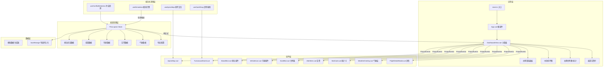

## 1. 技术架构设计



## 2. 技术栈说明

### 2.1 核心框架
| 技术 | 版本 | 用途 |
|------|------|------|
| Vue | 3.4+ | 响应式UI框架，Composition API |
| TypeScript | 5.3+ | 类型安全 |
| Vite | 5.0+ | 构建工具，ESM HMR |
| Pinia | 2.1+ | 状态管理 |
| ECharts | 5.5+ | 数据可视化图表 |
| Element Plus | 2.5+ | UI组件库 |
| Day.js | latest | 日期时间处理 |

### 2.2 初始化方式
使用 `npm init vite-init@latest -y . -- --template vue-ts --force` 初始化项目骨架，然后手动更新依赖版本至指定要求。

## 3. 目录结构

```
/
├── src/
│   ├── main.ts                 # 应用入口
│   ├── App.vue                 # 根组件
│   ├── types/
│   │   └── apron.ts            # 全局类型定义
│   ├── stores/
│   │   └── apron.ts            # Pinia状态管理
│   ├── composables/
│   │   ├── useSimulation.ts    # 模拟数据引擎
│   │   ├── useApronMap.ts      # 机坪图交互逻辑
│   │   ├── useGanttDrag.ts     # 甘特图拖拽逻辑
│   │   └── useConflictDetection.ts  # 冲突检测
│   ├── components/
│   │   ├── ApronMap.vue        # SVG机坪图主组件
│   │   ├── StandSlot.vue       # 机位插槽组件
│   │   ├── VehicleIcon.vue     # 车辆图标组件
│   │   ├── TurnaroundGantt.vue # 甘特图主组件
│   │   ├── GanttBar.vue        # 甘特条组件
│   │   ├── AlertItem.vue       # 告警条目组件
│   │   ├── StatCard.vue        # 统计卡片组件
│   │   ├── WeatherOverlay.vue  # 气象叠加层
│   │   ├── FlightDetailModal.vue  # 航班详情弹窗
│   │   ├── TopHeader.vue       # 顶部导航
│   │   ├── LeftFilter.vue      # 左侧筛选面板
│   │   └── BottomAlertBar.vue  # 底部告警栏
│   ├── views/
│   │   └── DashboardView.vue   # 主看板视图
│   ├── utils/
│   │   ├── constants.ts        # 常量配置
│   │   ├── helpers.ts          # 工具函数
│   │   └── standLayout.ts      # 机位布局坐标
│   └── styles/
│       ├── global.css          # 全局样式
│       └── variables.css       # CSS变量
├── Dockerfile                  # Docker构建配置
├── nginx.conf                  # Nginx配置
├── vite.config.ts              # Vite配置
├── tsconfig.json               # TS配置
└── package.json                # 项目依赖
```

## 4. 核心数据模型

### 4.1 类型定义 (src/types/apron.ts)

```typescript
// 机位状态
type StandStatus = 'available' | 'occupied' | 'in-service' | 'maintenance';

// 机位类型
type StandType = 'contact' | 'remote';

// 航站楼
type Terminal = 'T1' | 'T2' | 'T3';

// 车辆类型
type VehicleType = 'tug' | 'fuel' | 'water' | 'waste' | 'stairs';

// 保障作业类型
type ServiceType = 'towing' | 'fueling' | 'cleaning' | 'catering' | 'boarding';

// 告警级别
type AlertLevel = 'red' | 'orange' | 'blue';

// 用户角色
type UserRole = 'dispatcher' | 'ground-crew' | 'supervisor';

// 机位
interface Stand {
  id: string;
  number: string;
  terminal: Terminal;
  type: StandType;
  status: StandStatus;
  position: { x: number; y: number; width: number; height: number };
  currentFlight?: string;
}

// 航班
interface Flight {
  id: string;
  flightNo: string;
  airline: string;
  aircraftType: string;
  standId: string;
  arrivalTime: number;
  departureTime: number;
  passengerCount: number;
  services: ServiceTask[];
  status: 'scheduled' | 'arrived' | 'boarding' | 'departed';
}

// 保障作业
interface ServiceTask {
  id: string;
  type: ServiceType;
  startTime: number;
  endTime: number;
  duration: number;
  progress: number;
  status: 'pending' | 'in-progress' | 'completed' | 'delayed';
  vehicleId?: string;
  crew?: string;
}

// 车辆
interface Vehicle {
  id: string;
  type: VehicleType;
  plateNo: string;
  position: { x: number; y: number };
  targetPosition?: { x: number; y: number };
  heading: number;
  status: 'idle' | 'moving' | 'working';
  currentTask?: string;
  speed: number;
}

// 告警
interface Alert {
  id: string;
  level: AlertLevel;
  type: string;
  message: string;
  standId?: string;
  flightId?: string;
  timestamp: number;
  acknowledged: boolean;
}

// 气象数据
interface Weather {
  windDirection: number;
  windSpeed: number;
  visibility: number;
  temperature: number;
  timestamp: number;
}

// 布局配置
interface LayoutConfig {
  role: UserRole;
  leftPanelCollapsed: boolean;
  rightPanelCollapsed: boolean;
  ganttCollapsed: boolean;
  weatherOverlayVisible: boolean;
  zoom: number;
  pan: { x: number; y: number };
  filters: {
    terminals: Terminal[];
    statuses: StandStatus[];
    airlines: string[];
  };
}
```

### 4.2 机位布局坐标配置
131个机位分为3个航站楼，T1: 45个近机位，T2: 44个近机位，T3: 42个远机位。坐标采用1920x1080 SVG viewBox。

## 5. 状态管理 (Pinia Store)

### 5.1 Store 核心方法
```typescript
// stores/apron.ts
export const useApronStore = defineStore('apron', {
  state: () => ({
    stands: [] as Stand[],
    flights: [] as Flight[],
    vehicles: [] as Vehicle[],
    alerts: [] as Alert[],
    weather: null as Weather | null,
    currentTime: Date.now(),
    selectedStandId: null as string | null,
    currentRole: 'dispatcher' as UserRole,
    layoutConfig: defaultLayout as LayoutConfig,
  }),
  
  getters: {
    standsByTerminal: (state) => (terminal: Terminal) => 
      state.stands.filter(s => s.terminal === terminal),
    
    activeFlights: (state) => 
      state.flights.filter(f => f.status !== 'departed'),
    
    delayedFlights: (state) => 
      state.flights.filter(f => {
        const now = state.currentTime;
        return f.departureTime < now && f.status !== 'departed';
      }),
    
    contactRate1h: (state) => {
      const oneHourAgo = state.currentTime - 3600000;
      const recent = state.flights.filter(f => 
        f.arrivalTime > oneHourAgo && f.arrivalTime <= state.currentTime
      );
      const contact = recent.filter(f => {
        const stand = state.stands.find(s => s.id === f.standId);
        return stand?.type === 'contact';
      });
      return recent.length > 0 ? contact.length / recent.length : 0;
    },
    
    avgTurnaroundTime: (state) => {
      const completed = state.flights.filter(f => f.status === 'departed');
      if (completed.length === 0) return 0;
      const total = completed.reduce((sum, f) => 
        sum + (f.departureTime - f.arrivalTime), 0
      );
      return total / completed.length / 60000;
    },
  },
  
  actions: {
    updateStand(standId: string, updates: Partial<Stand>) {},
    addFlight(flight: Flight) {},
    updateFlight(flightId: string, updates: Partial<Flight>) {},
    updateVehicle(vehicleId: string, updates: Partial<Vehicle>) {},
    addAlert(alert: Omit<Alert, 'id' | 'timestamp'>) {},
    acknowledgeAlert(alertId: string) {},
    updateWeather(weather: Weather) {},
    setSelectedStand(standId: string | null) {},
    setCurrentRole(role: UserRole) {},
    saveLayout() { localStorage.setItem('apron-layout', JSON.stringify(this.layoutConfig)); },
    loadLayout() { const saved = localStorage.getItem('apron-layout'); if (saved) this.layoutConfig = JSON.parse(saved); },
    detectConflicts() {},
  },
});
```

## 6. 性能优化策略

### 6.1 SVG渲染优化
- 使用 `<use>` 元素复用机位模板
- 机位状态变更仅更新 fill 属性，不重建DOM
- 车辆位置使用 CSS transform 而非属性变更
- 虚拟滚动：可视区域外机位使用 `visibility: hidden`

### 6.2 数据更新优化
- 模拟数据批量更新，使用 `$patch` 减少响应式触发
- 车辆位置插值动画，每帧更新而非每秒跳变
- 甘特图使用 Canvas 绘制时间轴，DOM仅渲染可视区域航班条

### 6.3 性能指标
| 指标 | 阈值 | 实现方式 |
|------|------|----------|
| SVG首帧渲染 | ≤800ms | 组件懒加载 + requestAnimationFrame分批渲染 |
| 1秒数据推送帧率 | ≥55fps | 批量状态更新 + CSS硬件加速 |
| 60辆车追踪 | 无卡顿 | transform动画 + GPU合成层 |
| 甘特图渲染 | ≤1.2s | Canvas轴 + 虚拟列表 |
| localStorage配置 | ≤50KB | 精简字段 + 压缩存储 |

## 7. Docker 部署配置

### 7.1 Dockerfile (多阶段构建)
```dockerfile
# 构建阶段
FROM node:20-alpine AS builder
WORKDIR /app
COPY package*.json ./
RUN npm ci
COPY . .
RUN npm run build

# 运行阶段
FROM nginx:alpine
COPY --from=builder /app/dist /usr/share/nginx/html
COPY nginx.conf /etc/nginx/conf.d/default.conf
EXPOSE 80
CMD ["nginx", "-g", "daemon off;"]
```

### 7.2 Nginx 配置要点
- SPA history 模式回退
- gzip 压缩 (js, css, svg, json)
- 静态资源长缓存
- 安全响应头

## 8. 响应式断点与布局

| 断点 | CSS Grid 配置 | 交互模式 |
|------|--------------|----------|
| ≥1920px | grid-template-columns: 280px 1fr 1fr; | 三栏全展开 |
| 1280-1919px | grid-template-columns: 240px 1fr; | 右栏浮层 |
| 768-1279px | grid-template-columns: 1fr; | 抽屉式侧栏 |
| <768px | grid-template-columns: 1fr; | 触摸优化 |
