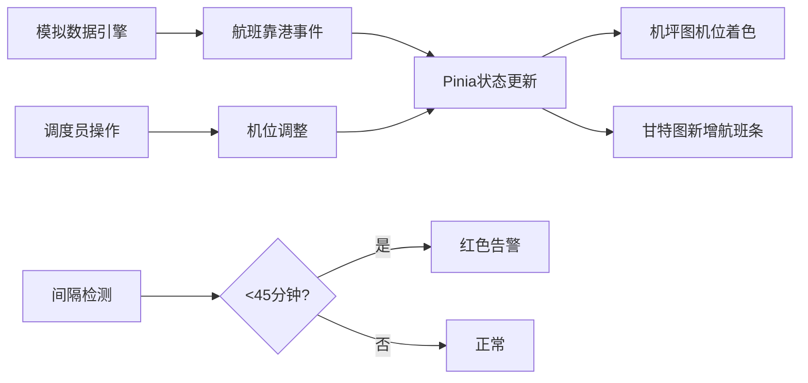
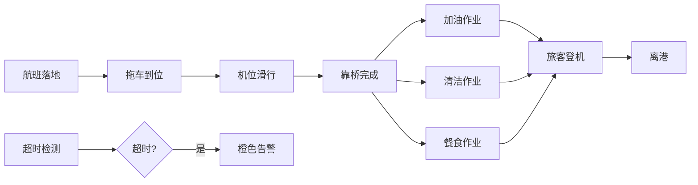

## 1. 产品概述

大型区域枢纽机场机坪运行监控与地面保障调度看板，支撑机坪调度员、地勤队长与航站楼运行主管实时掌握航空器靠离机、保障作业进度及机位占用态势，解决传统纸质进程单与对讲机协调模式下地勤进度不可视、车辆调度冲突频发、航班延误时难以快速识别瓶颈环节的痛点。

### 1.1 产品目标
- 实现机坪131个机位（89个近机位、42个远机位）实时状态可视化
- 地面保障作业全流程可追踪，缩短航班过站时间
- 减少拖车与客梯车调度冲突，提升车辆利用率
- 航班延误时快速识别瓶颈环节与空闲机位资源
- 提升靠桥率与旅客衔接效率

### 1.2 目标用户
| 角色 | 核心职责 | 核心需求 |
|------|----------|----------|
| 机坪调度员 | 监控机位与航空器动态、调配机位分配 | 实时机位占用态势、航空器靠离机进度、机位冲突预警 |
| 地勤队长 | 监控保障作业进度与人员/车辆状态 | 五项保障作业进度追踪、车辆位置追踪、作业超时告警 |
| 运行主管 | 查看靠桥率与旅客衔接指标 | 靠桥率统计、过站时长分析、延误航班分布、多维度筛选 |

---

## 2. 核心功能

### 2.1 用户角色与视图权限
| 角色 | 预设视图布局 | 核心可见模块 |
|------|--------------|--------------|
| 机坪调度员 | 调度员视角 | 机坪态势图占70%、机位冲突预警、车辆追踪、快速机位分配 |
| 地勤队长 | 地勤视角 | 甘特图占60%、保障作业进度、车辆实时位置、人员状态 |
| 运行主管 | 主管视角 | 统计看板占50%、靠桥率趋势、延误分析、多维度筛选 |

### 2.2 功能模块清单
1. **机坪态势总览**：SVG矢量绘制3座航站楼与131个机位平面图，四色状态显示，缩放平移交互
2. **航班过站甘特图**：24小时机位占用时间轴，五项保障作业条叠加，拖拽调整与冲突检测
3. **地面车辆追踪**：60辆地面车辆实时位置与行驶轨迹动画，按类型区分颜色与形状
4. **靠桥率与延误看板**：近1小时/24小时统计指标，航司与机位区域筛选
5. **机位冲突预警**：间隔小于45分钟或作业超时时自动告警，红黄蓝三级着色
6. **气象叠加层**：风场矢量与能见度色带，超标时机位区域闪烁预警
7. **多视角切换**：三种预设布局，支持自定义拖拽保存至localStorage

### 2.3 页面详情
| 页面名称 | 模块名称 | 功能描述 |
|-----------|-------------|---------------------|
| 主看板视图 | 顶部导航栏 | 机场名称、UTC/北京时间、角色切换、布局管理 |
| 主看板视图 | 左侧筛选面板 | 航站楼选择、机位状态筛选、航司筛选、气象开关 |
| 主看板视图 | 中央机坪图 | SVG矢量图、131个机位着色、车辆动画、气象叠加层 |
| 主看板视图 | 右侧甘特图区 | 24小时时间轴、航班条、保障作业条、冲突高亮 |
| 主看板视图 | 统计卡片区 | 靠桥率、平均过站时长、延误航班数、车辆利用率 |
| 主看板视图 | 底部告警栏 | 告警滚动条、滑入动画、三级着色 |
| 机位详情弹窗 | 航班信息 | 航班号、航司、机型、进出港时间、旅客人数 |
| 机位详情弹窗 | 保障进度 | 五项作业进度条、预计完成时间、责任人 |
| 甘特图详情 | 作业时序调整 | 拖拽调整作业时间、自动冲突检测、资源冲突告警 |

---

## 3. 核心业务流程

### 3.1 机位分配与监控流程

### 3.2 地面保障作业流程

---

## 4. 用户界面设计

### 4.1 设计风格
- **主题**：深色主题专业工业看板风格，营造管制中心氛围
- **主色调**：深蓝灰背景 (#0a1628)，深空灰面板 (#131f38)
- **状态色**：绿色空闲 (#10b981)、蓝色占用 (#3b82f6)、橙色保障中 (#f59e0b)、红色故障/告警 (#ef4444)
- **辅助色**：青色 (#06b6d4)、紫色 (#8b5cf6)、黄色 (#eab308)
- **字体**：JetBrains Mono 等宽字体（数据显示）+ Inter（正文）
- **布局**：CSS Grid 三栏布局，固定像素间距，卡片式面板带细边框
- **动效**：告警滑入动画、车辆轨迹淡出、机位闪烁预警、数据刷新过渡

### 4.2 页面设计概览
| 页面区域 | 模块名称 | UI关键元素 |
|-----------|-------------|-------------|
| 顶部导航 | 信息栏 | 机场Logo + 名称、双时钟(UTC/北京)、角色下拉、布局保存按钮 |
| 左侧面板 | 筛选区 | 折叠式面板、航站楼T1/T2/T3复选、机位状态四色筛选、航司多选、气象开关 |
| 中央区域 | 机坪图 | SVG viewBox 1920x1080、机位矩形圆角2px、航站楼描边、车辆SVG图标带方向箭头 |
| 右侧上半 | 甘特图 | 时间轴刻度每小时、航班条渐变填充、作业条5种颜色、冲突红色虚线边框 |
| 右侧下半 | 统计卡 | 4张卡片2x2网格、大字号数值、小字号标签、趋势箭头、环形进度图 |
| 底部区域 | 告警栏 | 固定高度48px、水平滚动、告警条目滑入、点击定位到机位 |

### 4.3 响应式设计
| 断点 | 布局模式 | 适配规则 |
|------|----------|----------|
| ≥1920px | 三栏标准布局 | 左栏280px + 中栏60% + 右栏自适应 |
| 1280-1919px | 两栏布局 | 甘特图折叠为可展开浮层，左栏240px + 中栏自适应 |
| 768-1279px | 单栏紧凑 | 仅保留机坪图与告警栏，侧栏与统计卡折叠为抽屉 |
| <768px | 移动极简 | 机坪图缩放适配，告警栏固定底部，核心指标悬浮 |

### 4.4 视觉细节
- **SVG机坪图**：3座航站楼采用不同灰度渐变，机位编号白色10px等宽字体，占用状态显示航班号水印
- **车辆图标**：拖车(蓝色方形)、加油车(黄色圆形)、清水车(青色三角形)、垃圾车(紫色菱形)，均带3px方向箭头
- **告警条目**：红底白字(紧急)、橙底黑字(警告)、蓝底白字(提示)，左侧12px色条
- **甘特条**：航班条高度32px，作业条高度16px叠加，时间网格线1px虚线
- **动效曲线**：cubic-bezier(0.4, 0, 0.2, 1)，告警滑入translateX(100%)→0 duration 300ms
