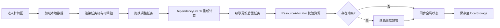

## 1. 产品概述

面向软件研发团队的纯前端甘特图项目管理工具，解决 Excel 无法实时协作、任务依赖难以可视化、资源冲突无法预警的痛点。支持 50+ 并行项目、500+ 任务节点的高效排期与进度追踪，覆盖产品、设计、开发、测试四类共 120 人的资源池管理。

- **核心价值**：通过可视化拖拽、智能依赖计算、资源负载热力图，将项目排期效率提升 50%，资源冲突提前发现率提升至 95%
- **目标用户**：项目经理（PM）、技术负责人（TL）、项目协调员

## 2. 核心功能

### 2.1 用户角色

| 角色 | 核心权限 |
|------|----------|
| 项目经理 | 完整权限：任务编辑、依赖管理、资源分配、基线快照、数据导入导出 |
| 团队成员 | 只读权限：查看排期、查看自己的资源负载、更新任务进度 |

### 2.2 功能模块

1. **任务树面板**：项目-迭代-任务三级层级结构，折叠展开，负责人与进度显示
2. **甘特图时间轴**：任务条渲染、拖拽调整、今日线、缩放导航（日/周/月/季）
3. **依赖关系系统**：FS/SS/FF/SF 四种依赖类型，SVG 贝塞尔曲线连线，关键路径高亮
4. **资源负载面板**：人员维度每日工作量热力图，超载预警，任务明细查看
5. **进度追踪系统**：任务进度条填充、基线快照、基线与实际对比偏差显示
6. **里程碑标记**：菱形关键节点，悬停详情卡片
7. **数据持久化**：localStorage 自动保存、JSON 导入导出

### 2.3 页面详情

| 页面名称 | 模块名称 | 功能描述 |
|----------|----------|----------|
| 主工作区 | 任务树面板 | 300px 固定宽度左侧面板，支持折叠/展开三级任务树，显示负责人头像与进度百分比 |
| 主工作区 | 甘特图时间轴 | 中间可滚动区域，横向时间轴 + 纵向任务行，任务条颜色编码状态，拖拽横向调时间、纵向调顺序、Shift+拖拽复制 |
| 主工作区 | 资源负载面板 | 200px 右侧可折叠面板，人员列表 + 每日负载热力图，红色超载预警 |
| 主工作区 | 顶部工具栏 | 主题切换、缩放粒度选择（日/周/月/季）、今日定位、基线管理、导入导出按钮 |
| 主工作区 | 依赖连线层 | SVG 叠加层，贝塞尔曲线可视化 FS/SS/FF/SF 依赖，关键路径红色高亮 |
| 主工作区 | 里程碑标记 | 菱形图标，悬停显示详情浮层（名称、日期、负责人、关联任务） |

## 3. 核心流程

### 主用户流程（项目经理排期）

项目经理登录 → 查看项目任务树 → 拖拽创建/调整任务时间 → 建立任务依赖关系 → 系统自动校验资源冲突 → 查看关键路径与资源负载 → 保存基线快照 → 导出/分享排期

## 4. 用户界面设计

### 4.1 设计风格

- **主色调**：专业深色系 `#0F172A` 背景 + `#3B82F6` 蓝色主操作 + `#10B981` 绿色完成态 + `#EF4444` 红色警告态
- **辅助色**：`#64748B` 中性灰（未开始）、`#F59E0B` 琥珀色（延期预警）、`#8B5CF6` 紫色（里程碑）
- **字体**：JetBrains Mono（代码/数字）+ Inter（UI 文本），等宽数字对齐时间轴
- **按钮风格**：扁平化圆角 6px，2px 边框高亮激活态，hover 轻微上浮阴影
- **布局**：三栏式桌面布局，卡片式模块分区，细分隔线 + 留白
- **图标**：lucide-react 线性图标，16px/20px 两档尺寸

### 4.2 页面设计概览

| 页面名称 | 模块名称 | UI 元素 |
|----------|----------|---------|
| 主工作区 | 任务树面板 | 缩进层级线、折叠三角图标、负责人圆形头像、进度百分比内联显示、悬停行高亮 |
| 主工作区 | 甘特图时间轴 | 顶部双行时间刻度（月+日/周）、今日红色竖线、任务条圆角矩形带内部进度填充、状态颜色编码、拖拽时半透明预览 |
| 主工作区 | 依赖连线 | SVG 三次贝塞尔曲线、箭头末端、关键路径红色加粗 3px、普通依赖灰色 1.5px、悬停连线高亮 |
| 主工作区 | 资源负载面板 | 人员列表行、7 日热力格、颜色梯度（绿→黄→红）、超载红圈警示标记 |
| 主工作区 | 顶部工具栏 | 玻璃拟态背景、工具按钮组、缩放粒度 Segmented Control、主题切换 Switch |

### 4.3 响应式适配

- **桌面端（≥1280px）**：三栏完整布局（300px 任务树 + 弹性时间轴 + 200px 资源面板）
- **平板端（768-1279px）**：资源面板折叠为右侧抽屉，点击按钮滑出
- **移动端（<768px）**：任务树转为底部抽屉，时间轴全屏显示，支持双指缩放

### 4.4 动效与微交互

- 任务条拖拽：实时位置跟随 + 磁吸对齐时间刻度（50ms 响应）
- 折叠展开：高度 200ms ease-out 过渡
- 悬停任务条：1.5px 外发光阴影（同色系）
- 关键路径发现：红色线条 2s 脉冲动画
- 主题切换：CSS 变量 300ms 平滑过渡
