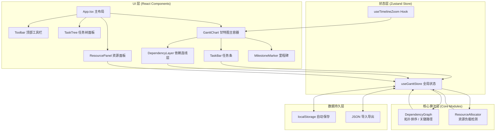
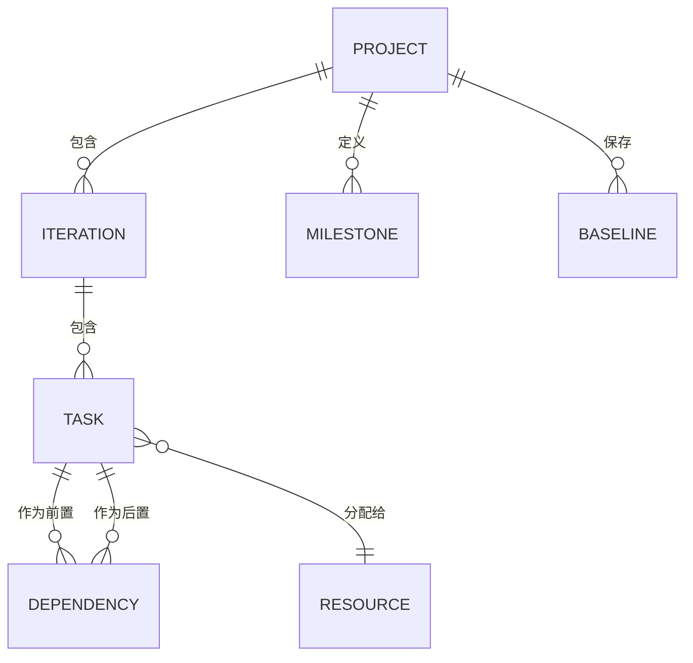

## 1. 架构设计



## 2. 技术栈说明

- **前端框架**：React 18 + TypeScript 5
- **构建工具**：Vite 5
- **样式方案**：TailwindCSS 3.4
- **状态管理**：Zustand（轻量、可预测）
- **图标库**：lucide-react
- **无后端**：纯前端实现，localStorage 持久化 + JSON 导入导出

## 3. 路由定义

纯单页应用，无路由切换：

| 路由 | 用途 |
|------|------|
| `/` | 甘特图主工作区（唯一页面） |

## 4. 数据模型

### 4.1 ER 图



### 4.2 类型定义（TypeScript）

```typescript
// 任务状态枚举
type TaskStatus = 'not-started' | 'in-progress' | 'completed' | 'delayed';

// 依赖类型枚举：FS/SS/FF/SF
type DependencyType = 'FS' | 'SS' | 'FF' | 'SF';

// 时间粒度枚举
type TimelineGranularity = 'day' | 'week' | 'month' | 'quarter';

// 资源池类型
type ResourcePool = 'product' | 'design' | 'development' | 'testing';

// 任务节点（支持三级嵌套）
interface TaskNode {
  id: string;
  parentId: string | null;
  level: 1 | 2 | 3; // 1=项目 2=迭代 3=任务
  name: string;
  startDate: number; // timestamp ms
  endDate: number;   // timestamp ms
  progress: number;  // 0-100
  status: TaskStatus;
  assigneeId: string | null;
  isMilestone: boolean;
  order: number;     // 同级排序
  collapsed: boolean;
}

// 任务依赖
interface Dependency {
  id: string;
  fromTaskId: string;
  toTaskId: string;
  type: DependencyType;
  lagDays: number;
}

// 人员资源
interface Resource {
  id: string;
  name: string;
  avatar?: string;
  pool: ResourcePool;
  capacityPerDay: number; // 人天，默认 8
}

// 基线快照
interface Baseline {
  id: string;
  name: string;
  createdAt: number;
  tasks: Array<{ taskId: string; startDate: number; endDate: number }>;
}

// 资源负载（某人员某天）
interface ResourceLoad {
  resourceId: string;
  date: string;       // YYYY-MM-DD
  workload: number;   // 小时
  overload: boolean;
  taskIds: string[];
}

// 主题
type Theme = 'light' | 'dark';

// 全局 Store 状态
interface GanttState {
  tasks: Record<string, TaskNode>;
  taskOrder: string[];        // 根节点顺序
  dependencies: Dependency[];
  resources: Resource[];
  baselines: Baseline[];
  activeBaselineId: string | null;
  timeline: {
    viewStart: number;
    viewEnd: number;
    granularity: TimelineGranularity;
    scrollX: number;
    scrollY: number;
  };
  ui: {
    theme: Theme;
    showResourcePanel: boolean;
    showTaskTree: boolean;
    selectedTaskId: string | null;
    highlightedDependencyIds: string[];
    criticalPathIds: string[];
  };
  // actions
  addTask: (task: TaskNode) => void;
  updateTask: (id: string, patch: Partial<TaskNode>) => void;
  moveTask: (id: string, newStartDate: number) => void;
  reorderTask: (id: string, newParentId: string | null, newOrder: number) => void;
  addDependency: (dep: Omit<Dependency, 'id'>) => void;
  removeDependency: (id: string) => void;
  saveBaseline: (name: string) => void;
  setActiveBaseline: (id: string | null) => void;
  toggleTheme: () => void;
  setTimelineGranularity: (g: TimelineGranularity) => void;
  scrollToToday: () => void;
  importData: (data: Partial<GanttState>) => void;
  exportData: () => string;
}
```

## 5. 项目目录结构

```
src/
├── components/
│   ├── GanttChart.tsx       # 时间轴渲染与视口管理
│   ├── TaskTree.tsx         # 左侧任务树折叠展开
│   ├── TaskBar.tsx          # 任务条拖拽与依赖连线端点
│   ├── DependencyLayer.tsx  # SVG 贝塞尔曲线依赖连线
│   ├── ResourcePanel.tsx    # 右侧资源负载热力图
│   ├── Toolbar.tsx          # 顶部工具栏
│   ├── MilestoneMarker.tsx  # 里程碑菱形标记
│   ├── TaskTooltip.tsx      # 任务悬停详情卡片
│   └── ResourceHeatmap.tsx  # 资源负载热力格子
├── core/
│   ├── DependencyGraph.ts   # 依赖拓扑、关键路径计算
│   └── ResourceAllocator.ts # 资源负载冲突检测
├── hooks/
│   ├── useTimelineZoom.ts   # 时间轴缩放逻辑
│   ├── useDragTask.ts       # 任务条拖拽 Hook
│   ├── useKeyboardShortcuts.ts # 快捷键
│   └── useLocalStorage.ts   # 持久化 Hook
├── store/
│   └── useGanttStore.ts     # Zustand 全局 Store
├── types/
│   └── index.ts             # 全局类型定义
├── utils/
│   ├── dateUtils.ts         # 日期计算工具
│   ├── colorUtils.ts        # 状态颜色映射
│   └── bezierUtils.ts       # 贝塞尔曲线坐标计算
├── data/
│   └── mockData.ts          # 演示 Mock 数据
├── App.tsx
├── main.tsx
└── index.css
```

## 6. 核心算法说明

### 6.1 DependencyGraph（依赖图）

```
输入：tasks[], dependencies[]
输出：
  - topologicalOrder: string[]    拓扑排序结果
  - criticalPath: string[]        关键路径任务 ID 列表
  - earliestStart: Map<id, date>  最早开始时间
  - latestFinish: Map<id, date>   最晚完成时间
  - slack: Map<id, days>          浮动时间（0=关键路径）
```

算法：
1. **拓扑排序**：Kahn 算法（O(V+E)），检测环依赖
2. **正向推最早开始**：按拓扑序遍历，`ES = max(所有前置任务的 EF + lag)`
3. **反向推最晚完成**：按逆拓扑序遍历，`LF = min(所有后置任务的 LS - lag)`
4. **关键路径识别**：`slack = LF - EF = 0` 的节点组成关键路径

### 6.2 ResourceAllocator（资源分配）

```
输入：tasks[], resources[], dateRange
输出：
  - loads: Map<resourceId, Map<date, {workload, overload, taskIds}>>
  - conflicts: Array<{resourceId, date, tasks[]}>
```

逻辑：
- 按任务时间跨度均分到每一天，累加同一资源同日工作量
- `overload = workload > capacityPerDay` 时标记红色预警

### 6.3 性能优化策略

- **虚拟滚动**：时间轴区域仅渲染可视范围 ±2 屏的任务条（IntersectionObserver 或 scroll 事件计算）
- **时间坐标缓存**：`date → px` 计算结果 memoize，粒度切换时失效
- **依赖重算节流**：拖拽过程中 rAF 节流，仅结束时完整重算关键路径
- **资源负载增量**：仅在任务时间/负责人变动时重算相关资源的负载
- **React.memo**：TaskBar、TaskTreeNode、HeatmapCell 等高频渲染组件 memo 化

## 7. 性能约束指标

| 指标 | 目标值 | 实现手段 |
|------|--------|----------|
| 任务节点渲染 | 500+ | 虚拟滚动 + React.memo |
| 滚动帧率 | ≥60fps | transform/translate3d GPU 加速，避免 layout thrash |
| 拖拽响应延迟 | <50ms | pointer events + rAF 节流 |
| 依赖计算重绘 | ≤16ms | Kahn O(V+E) + 增量更新 |
| 初始加载 | ≤2s | 代码分割 + 懒加载非核心模块 |
| 内存占用 | ≤200MB | 虚拟滚动回收 DOM + 大对象及时释放 |
