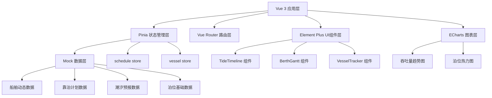

## 1. 架构设计



## 2. 技术描述

- **前端框架**：Vue 3.4+ + Composition API + TypeScript 5.3+
- **构建工具**：Vite 5+
- **状态管理**：Pinia
- **路由**：Vue Router 4
- **UI组件库**：Element Plus
- **图表库**：ECharts 5
- **日期处理**：dayjs
- **数据来源**：前端 Mock 数据（500艘船舶、38个泊位、30天排程）

## 3. 目录结构

```
src/
├── main.ts                    # 应用入口与全局配置
├── router/
│   └── index.ts              # 路由定义与导航守卫
├── stores/
│   ├── schedule.ts           # 靠泊计划状态管理
│   └── vessel.ts             # 船舶动态状态管理
├── components/
│   ├── TideTimeline.vue      # 潮汐曲线与窗口组件
│   ├── BerthGantt.vue        # 靠泊计划甘特图组件
│   └── VesselTracker.vue     # 船舶轨迹Canvas模拟组件
├── views/
│   ├── DashboardView.vue     # 主看板视图
│   ├── ScheduleView.vue      # 计划编排视图
│   └── VesselView.vue        # 船舶动态视图
├── utils/
│   └── tide.ts               # 潮汐调和算法与窗口计算
└── mock/
    └── data.ts               # 模拟数据生成
```

## 4. 路由定义

| 路由 | 页面 | 权限角色 |
|-------|------|----------|
| /dashboard | 主看板视图 | 所有角色 |
| /schedule | 计划编排视图 | 调度主任、调度员 |
| /vessel | 船舶动态视图 | 所有角色 |
| /application | 靠泊申请 | 货代专员、调度员 |
| /analytics | 吞吐量分析 | 调度主任、调度员 |

## 5. 数据模型

### 5.1 核心类型定义

```typescript
// 泊位信息
interface Berth {
  id: string;
  name: string;
  portId: string;
  length: number;        // 泊位长度（米）
  depth: number;         // 泊位水深（米）
  cargoTypes: CargoType[]; // 支持货类
  status: 'available' | 'occupied' | 'maintenance';
}

// 船舶信息
interface Vessel {
  id: string;
  name: string;
  imo: string;
  length: number;        // 船长（米）
  draft: number;         // 吃水（米）
  cargoType: CargoType;
  cargoWeight: number;   // 货物吨数
  status: 'anchorage' | 'entering' | 'berthed' | 'loading' | 'unloading' | 'leaving' | 'departed';
  eta: Date;             // 预计到港时间
  etd?: Date;            // 预计离港时间
  position?: { x: number; y: number };
  route?: Waypoint[];
}

// 靠泊计划
interface BerthSchedule {
  id: string;
  vesselId: string;
  berthId: string;
  arrivalTime: Date;     // 靠泊时间
  departureTime: Date;   // 离泊时间
  operationType: 'load' | 'unload' | 'both';
  status: 'pending' | 'approved' | 'in_progress' | 'completed' | 'conflict';
  progress: number;      // 装卸进度 0-100
  conflicts?: string[];  // 冲突描述
}

// 潮汐数据
interface TideData {
  timestamp: Date;
  height: number;        // 潮高（米）
  stationId: string;
}

// 潮汐窗口
interface TideWindow {
  startTime: Date;
  endTime: Date;
  minHeight: number;
  type: 'high' | 'low';
}

// 航路点
interface Waypoint {
  x: number;
  y: number;
  timestamp: Date;
  type: 'waypoint' | 'berth' | 'anchorage';
}

type CargoType = 'container' | 'bulk' | 'liquid' | 'general' | 'ro-ro';
type UserRole = 'director' | 'dispatcher' | 'pilot' | 'agent';
```

### 5.2 状态管理设计

**schedule store**
- state: berths, schedules, pendingApplications, selectedDateRange
- getters: schedulesByBerth, conflictSchedules, utilizationStats
- actions: createSchedule, updateSchedule, deleteSchedule, approveSchedule, validateConstraints

**vessel store**
- state: vessels, tideData, tideStations, currentUser
- getters: vesselsByStatus, activeVessels, tideForecast48h
- actions: updateVesselStatus, fetchTideData, calculateTideWindows

## 6. 性能优化策略

### 6.1 甘特图性能
- Canvas 虚拟化渲染，仅渲染可视区域作业条
- requestAnimationFrame 驱动拖拽动画
- 作业条数据使用 shallowRef 避免深层响应式
- 碰撞检测使用空间索引（R-Tree简化版）

### 6.2 潮汐曲线
- 48小时预报使用500个采样点
- SVG 路径缓存，数据变化时才重绘
- 窗口高亮使用 CSS clip-path 而非多层 DOM

### 6.3 船舶轨迹动画
- 单 Canvas 绘制所有船舶与轨迹
- requestAnimationFrame 固定30fps
- 船舶位置使用离屏计算，批量绘制
- 轨迹点使用降采样算法减少绘制点

### 6.4 状态更新
- Pinia store action 批量更新减少重渲染
- 组件使用 watchEffect 精确订阅所需状态
- ECharts 使用 setOption({notMerge: false, lazyUpdate: true})
