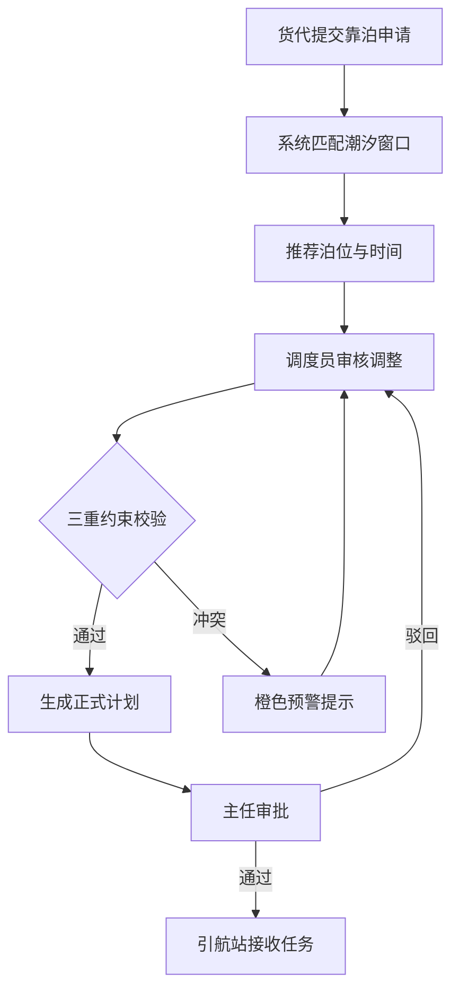

## 1. 产品概述

本产品为省级港口集团泊位调度与船舶靠离泊监控看板系统，解决当前靠泊计划手工编制、排程冲突频繁、等泊时间过长与泊位空置并存的问题。

- 目标用户：调度主任、泊位调度员、引航站、货代专员
- 核心价值：通过潮汐窗口自动计算、靠泊甘特图智能排程、船舶轨迹实时监控，提升泊位利用率30%以上，缩短等泊时间40%

## 2. 核心功能

### 2.1 用户角色

| 角色 | 登录方式 | 核心权限 |
|------|----------|----------|
| 调度主任 | 账号密码 | 审批靠泊计划、紧急调配、全功能访问 |
| 泊位调度员 | 账号密码 | 编制靠离泊计划、调整泊位分配、跟踪装卸进度 |
| 引航站 | 账号密码 | 查询引航任务、反馈任务状态 |
| 货代专员 | 账号密码 | 提交靠泊申请、查询作业进度 |

### 2.2 功能模块

1. **主看板视图**：潮汐时间轴、靠泊甘特图、船舶动态列表、吞吐摘要
2. **计划编排视图**：全宽甘特图、靠泊申请审核面板、约束校验
3. **船舶动态视图**：港口平面图Canvas、船舶详情、轨迹控制
4. **靠泊申请**：船舶信息录入、泊位智能推荐、时间窗口匹配

### 2.3 页面详情

| 页面名称 | 模块名称 | 功能描述 |
|-----------|-------------|---------------------|
| 主看板视图 | 潮汐时间轴 | 48小时潮高曲线、可靠泊窗口标注、潮汐站切换 |
| 主看板视图 | 靠泊甘特图 | 泊位×时间作业条、拖拽调整、冲突预警色块 |
| 主看板视图 | 船舶动态列表 | 在港/在途船舶状态、装卸进度、预计离泊时间 |
| 主看板视图 | 吞吐摘要 | 当日/当月吞吐量、泊位利用率、待泊船舶数 |
| 计划编排视图 | 全宽甘特图 | 30天排程、拖拽重分配、三重约束实时校验 |
| 计划编排视图 | 审核面板 | 靠泊申请列表、推荐泊位与时间、一键采纳 |
| 船舶动态视图 | 港口平面图 | Canvas绘制泊位与航道、船舶位置标注 |
| 船舶动态视图 | 轨迹模拟 | 航路点动画、倍速播放、进度跳转 |
| 吞吐量分析 | 趋势图表 | 货类月度聚合、同比环比对比、联动筛选 |
| 泊位热力图 | 利用率热力图 | 泊位×时段色阶、日周月粒度切换 |

## 3. 核心流程

### 3.1 靠泊申请流程
货代专员提交船舶信息与预计到港时间 → 系统自动匹配潮汐窗口与推荐泊位 → 调度员审核并调整排程 → 主任审批（如需）→ 生成正式靠泊计划 → 引航站接收引航任务

### 3.2 甘特图排程流程
调度员拖拽作业条调整时间/泊位 → 系统实时校验吃水-水深、船长-泊位长度、货类兼容性 → 冲突显示橙色预警 → 无冲突更新计划 → 联动刷新时间轴与统计数据

## 4. 用户界面设计

### 4.1 设计风格
- 主色调：深蓝色背景（#0a1628），辅助蓝色（#1e3a5f）
- 强调色：橙色预警（#ff8c00）、绿色正常作业（#00c853）、信息蓝色（#2979ff）
- 按钮风格：扁平圆角4px，悬停微亮，点击凹陷效果
- 字体：系统默认等宽字体用于数据展示，无衬线字体用于标题
- 布局：左侧固定导航、顶部工具栏、三栏主内容区
- 图标：Element Plus 线性图标，深色模式适配

### 4.2 页面设计概述

| 页面名称 | 模块名称 | UI元素 |
|-----------|-------------|-------------|
| 主看板视图 | 潮汐时间轴 | 曲线SVG、窗口高亮色块、时间刻度网格 |
| 主看板视图 | 靠泊甘特图 | 可拖拽作业条、冲突橙色边框、进度绿色填充 |
| 主看板视图 | 船舶列表 | 状态标签（绿/黄/红）、进度条、hover详情 |
| 主看板视图 | 吞吐摘要 | 数字卡片、趋势小箭头、环形进度 |
| 计划编排视图 | 甘特图 | 时间缩放滑块、泊位筛选、多色作业条 |
| 计划编排视图 | 审核面板 | 浮动底部抽屉、推荐卡片、采纳/驳回按钮 |
| 船舶动态视图 | Canvas地图 | 深色港区平面图、船舶光点、轨迹虚线 |
| 船舶动态视图 | 控制面板 | 播放/暂停、倍速1x/2x/4x、进度拖拽条 |

### 4.3 响应式设计
- **≥1920px**：三栏完整展开（左20% + 中60% + 右20%）
- **1280px-1920px**：右栏折叠为图标面板，hover展开
- **<1280px**：顶部标签页切换视图，单栏垂直布局
- 所有交互支持触屏手势（拖拽、双指缩放）

### 4.4 动效设计
- 页面切换：fade-slide过渡，时长300ms
- 甘特图拖拽：实时跟手，16ms响应
- 船舶动画：Canvas 30fps稳定帧率
- 数据刷新：数字滚动过渡，图表平滑重绘
