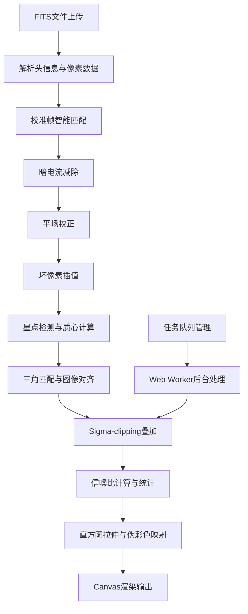

## 1. 产品概述

深空天体图像处理工作站是为省级天文观测站设计的专业图像处理平台，解决传统天文软件操作复杂、校准帧管理混乱、图像对齐精度差等痛点。目标用户为天文学家和天文研究人员，提供从FITS文件解析到高信噪比图像合成的完整处理流水线。

- 核心价值：将复杂的天文图像处理流程可视化、自动化，降低学习成本，提升处理效率和结果质量
- 市场价值：填补国内天文观测数据处理的Web端专业工具空白，支持多望远镜联合观测数据的批量处理

## 2. 核心功能

### 2.1 用户角色

| 角色 | 注册方式 | 核心权限 |
|------|----------|----------|
| 天文学家 | 站内账号登录 | 完整的图像处理、校准帧库管理、任务队列操作权限 |
| 访问用户 | 无需注册 | 仅可浏览已处理完成的图像，无操作权限 |

### 2.2 功能模块

1. **帧浏览面板**：FITS文件上传、缩略图网格展示、元数据查看、筛选过滤
2. **校准配置面板**：暗帧平场帧智能匹配、校准流水线开关、参数配置
3. **叠加预览面板**：处理进度可视化、信噪比曲线、中间结果预览
4. **主画布区域**：图像渲染、缩放平移、像素信息显示、星点标注
5. **任务队列栏**：批量任务管理、进度条、预计剩余时间
6. **校准帧库管理**：暗帧平场帧归档、分组统计、补拍建议

### 2.3 页面详情

| 页面名称 | 模块名称 | 功能描述 |
|----------|----------|----------|
| 主工作台 | 帧浏览器 | 展示所有已加载帧的缩略图网格，支持按滤波器、曝光时间筛选，点击查看元数据 |
| 主工作台 | 校准配置 | 显示自动匹配的暗帧和平场帧，显示匹配度评分，支持手动调整，校准步骤独立开关 |
| 主工作台 | 叠加预览 | 实时显示当前处理帧计数、信噪比变化曲线、中间叠加结果缩略图 |
| 主工作台 | 主画布 | 渲染当前选中帧或叠加结果，支持滚轮缩放、拖拽平移、十字准线显示像素信息 |
| 主工作台 | 任务队列 | 展示后台运行的叠加任务，显示进度条、当前处理步骤、预计剩余时间 |
| 校准库管理 | 暗帧库 | 按CCD温度和曝光时间分组展示暗帧，统计各组数量，标识不足组合 |
| 校准库管理 | 平场库 | 按滤波器和曝光时间分组展示平场帧，统计各组数量，提示补拍建议 |

## 3. 核心流程

用户上传FITS观测文件后，系统自动解析头信息提取元数据，根据曝光时间、增益、CCD温度智能匹配对应的暗帧和平场帧。用户可预览校准前后对比效果，调整校准参数。系统自动检测每帧图像中的星点坐标，通过三角剖分匹配算法计算仿射变换矩阵实现亚像素级对齐。对齐完成后使用sigma-clipping算法进行叠加，剔除大气抖动导致的模糊帧。最终生成的高信噪比图像支持多种直方图拉伸方式和伪彩色映射，用户可导出处理结果。

## 4. 用户界面设计

### 4.1 设计风格

- **主色调**：深空蓝 (#0a0e17) 为背景，星际青 (#1e3a5f) 为面板背景，星点白 (#f0f4f8) 为文字
- **强调色**：信号绿 (#10b981) 用于状态正常和星点标注，警戒橙 (#f59e0b) 用于警告和进度，错误红 (#ef4444) 用于错误提示
- **按钮风格**：扁平化设计，2px圆角，hover状态背景透明度变化，无3D效果
- **字体**：使用 JetBrains Mono 作为等宽字体显示数值数据，Inter 作为界面文字字体
- **布局风格**：三栏式布局，面板使用细边框分割，内容区高密度信息展示
- **图标风格**：Lucide 线性图标，统一16px尺寸，与文字垂直居中对齐

### 4.2 页面设计概述

| 页面名称 | 模块名称 | UI Elements |
|----------|----------|-------------|
| 主工作台 | 帧浏览器 | 深色卡片式缩略图网格，悬停显示元数据tooltip，选中帧高亮边框，筛选栏固定顶部 |
| 主工作台 | 主画布 | 纯黑背景，十字准线随鼠标移动，底部状态栏显示坐标和ADU值，左上角显示当前帧信息 |
| 主工作台 | 右侧参数面板 | Tab切换四个配置区（校准/对齐/叠加/可视化），每个Tab内分组展示参数滑块和开关 |
| 主工作台 | 底部任务队列 | 固定高度容器，横向排列任务卡片，每个卡片包含进度条和状态指示灯 |
| 校准库管理 | 分组统计 | 热力图式网格展示各参数组合的帧数量，不足组合红色边框标注 |

### 4.3 响应式

- **桌面端 (≥1366px)**：三栏完整布局，左侧帧浏览器280px，右侧参数面板320px，中间主画布自适应
- **平板端 (1024px-1366px)**：右侧参数面板折叠为抽屉式，点击按钮滑出，帧浏览器宽度压缩至240px
- **移动端 (768px-1024px)**：仅保留主画布区域和底部工具栏，帧浏览器和参数面板均为抽屉式
- **触摸优化**：所有交互区域最小高度44px，支持双指缩放手势，滑动操作流畅无卡顿

### 4.4 数据可视化

- **信噪比曲线**：Chart.js 折线图，X轴为叠加帧数，Y轴为信噪比数值，曲线使用星际青渐变填充
- **直方图**：Canvas绘制的实时直方图，显示像素值分布，拉伸控制点可拖拽调整
- **进度指示器**：环形进度条显示整体完成度，线性进度条显示当前帧处理进度
- **星点标注**：绿色半透明圆圈叠加在检测到的星点位置，圆圈大小与星点亮度成正比
- **校准对比**：滑块式分屏对比，左侧显示校准前，右侧显示校准后，滑块可拖拽调整分界位置
