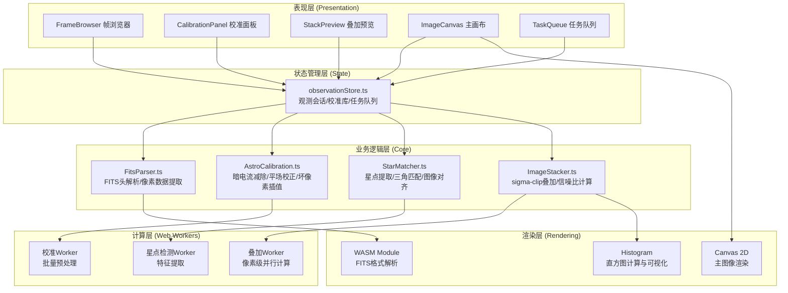
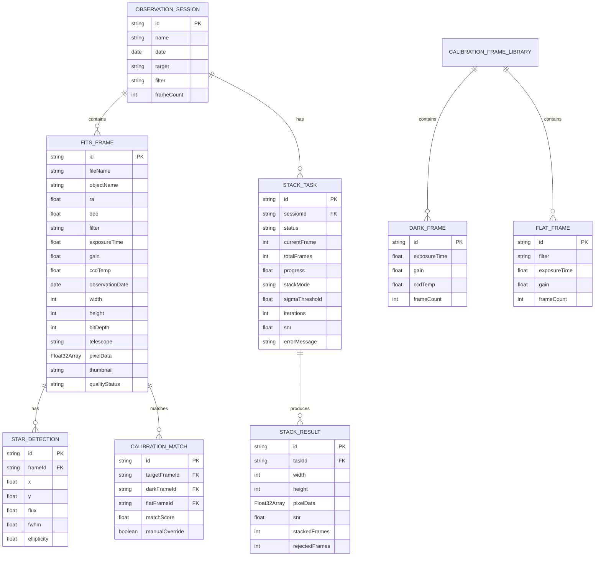

## 1. 架构设计



## 2. 技术描述

- **前端框架**: React 18.2.0 + TypeScript 5.3.0 + Vite 5.0.0
- **状态管理**: Zustand 4.4.0
- **UI组件库**: Tailwind CSS 3.4.0 + Lucide React 0.294.0
- **数据可视化**: Chart.js 4.4.0 + react-chartjs-2 5.2.0
- **文件处理**: 自定义WASM模块解析FITS格式
- **高性能计算**: Web Workers API + SharedArrayBuffer
- **图像渲染**: HTML5 Canvas 2D API
- **路由管理**: React Router DOM 6.20.0
- **开发工具**: ESLint 8.54.0 + Prettier 3.1.0

## 3. 目录结构

```
src/
├── core/                      # 核心算法模块
│   ├── FitsParser.ts          # FITS文件解析器
│   ├── AstroCalibration.ts    # 天文校准算法
│   ├── StarMatcher.ts         # 星点匹配与对齐
│   ├── ImageStacker.ts        # 图像叠加算法
│   └── types.ts               # 核心类型定义
├── stores/                    # 状态管理
│   └── observationStore.ts    # 观测数据状态管理
├── components/                # UI组件
│   ├── FrameBrowser/          # 帧浏览器组件
│   ├── CalibrationPanel/      # 校准面板组件
│   ├── StackPreview/          # 叠加预览组件
│   ├── ImageCanvas/           # 主画布组件
│   ├── TaskQueue/             # 任务队列组件
│   └── common/                # 公共组件
├── workers/                   # Web Workers
│   ├── calibration.worker.ts  # 校准处理Worker
│   ├── starDetection.worker.ts # 星点检测Worker
│   └── stacking.worker.ts     # 叠加处理Worker
├── hooks/                     # 自定义Hooks
│   ├── useCanvasInteraction.ts # 画布交互Hook
│   ├── useHistogram.ts        # 直方图计算Hook
│   └── useWorkerPool.ts       # Worker池管理Hook
├── utils/                     # 工具函数
│   ├── fitsUtils.ts           # FITS相关工具
│   ├── mathUtils.ts           # 数学计算工具
│   └── colorMaps.ts           # 伪彩色映射表
├── pages/                     # 页面组件
│   ├── Workbench.tsx          # 主工作台页面
│   └── CalibrationLibrary.tsx # 校准库管理页面
├── App.tsx                    # 应用入口
├── main.tsx                   # 渲染入口
└── index.css                  # 全局样式
```

## 4. 路由定义

| 路由 | 页面组件 | 用途 |
|------|----------|------|
| / | Workbench.tsx | 主工作台，包含帧浏览器、主画布、参数面板、任务队列 |
| /calibration-library | CalibrationLibrary.tsx | 校准帧库管理页面，暗帧和平场帧的归档与统计 |
| /help | Help.tsx | 使用帮助与操作指南 |

## 5. 数据模型

### 5.1 数据模型定义



### 5.2 TypeScript 类型定义

```typescript
// 核心数据类型
export interface FitsHeader {
  SIMPLE: boolean;
  BITPIX: number;
  NAXIS: number;
  NAXIS1: number;
  NAXIS2: number;
  EXPTIME?: number;
  GAIN?: number;
  CCD-TEMP?: number;
  FILTER?: string;
  RA?: number;
  DEC?: number;
  DATE-OBS?: string;
  OBJECT?: string;
  TELESCOP?: string;
  [key: string]: any;
}

export interface FitsFrame {
  id: string;
  fileName: string;
  header: FitsHeader;
  pixelData: Float32Array;
  width: number;
  height: number;
  thumbnail: string;
  calibrationMatch?: CalibrationMatch;
  starDetection?: StarDetection[];
  transformMatrix?: number[];
  quality: 'pending' | 'good' | 'rejected';
  rejectReason?: string;
}

export interface CalibrationSettings {
  darkSubtraction: boolean;
  flatCorrection: boolean;
  badPixelInterpolation: boolean;
  darkFrameId?: string;
  flatFrameId?: string;
  badPixelThreshold: number;
}

export interface AlignmentSettings {
  detectionThreshold: number;
  minStars: number;
  maxStars: number;
  subpixelAccuracy: boolean;
  maxIterations: number;
}

export interface StackingSettings {
  mode: 'mean' | 'median' | 'sigma-clip';
  sigmaThreshold: number;
  iterations: number;
  percentileLow: number;
  percentileHigh: number;
}

export interface VisualizationSettings {
  stretchFunction: 'linear' | 'log' | 'asinh' | 'auto';
  blackPoint: number;
  whitePoint: number;
  colorMap: 'gray' | 'heat' | 'cool' | 'viridis';
  gamma: number;
}

export interface StackTask {
  id: string;
  name: string;
  frameIds: string[];
  status: 'queued' | 'processing' | 'completed' | 'error';
  progress: number;
  currentStep: string;
  currentFrame: number;
  totalFrames: number;
  snrHistory: number[];
  result?: StackResult;
  error?: string;
  createdAt: number;
  startedAt?: number;
  completedAt?: number;
}

export interface StackResult {
  width: number;
  height: number;
  pixelData: Float32Array;
  snr: number;
  stackedCount: number;
  rejectedCount: number;
  rejectedFrameIds: string[];
}
```

## 6. 核心算法设计

### 6.1 FITS文件解析算法
- 支持标准FITS格式和多扩展FITS
- 支持16位整数、32位浮点像素数据
- 分块加载大图像，内存占用可控
- 自动生成缩略图用于网格展示

### 6.2 天文校准算法
- **暗电流减除**：根据曝光时间和温度匹配暗帧，逐像素相减
- **平场校正**：平场帧归一化后逐像素相除，校正响应不均
- **坏像素插值**：3x3窗口中值插值，阈值可配置

### 6.3 星点检测与对齐算法
- **质心提取**：高斯拟合亚像素精度，FWHM计算
- **三角匹配**：Delaunay三角剖分构造不变特征，RANSAC剔除外点
- **图像变换**：仿射变换矩阵计算，双线性插值重采样

### 6.4 Sigma-clip叠加算法
- 支持均值、中值、sigma-clip三种模式
- 可配置sigma阈值和迭代次数
- 实时计算信噪比，标记剔除帧
- 像素级并行计算优化

## 7. 性能优化策略

1. **Web Worker并行计算**：校准、星点检测、叠加分别在独立Worker中执行
2. **分块处理**：大图像按256x256块处理，降低单次内存占用
3. **内存池**：Float32Array复用，避免频繁GC
4. **Canvas离屏渲染**：主画布使用OffscreenCanvas，提升渲染性能
5. **Lazy加载**：缩略图优先加载，全分辨率数据按需加载
6. **IndexedDB缓存**：处理结果本地缓存，支持断点续处理

## 8. 构建配置

- Vite配置：WASM打包优化、Worker打包、Chunk分割
- TypeScript配置：严格模式、路径别名
- Tailwind配置：自定义颜色主题、深色模式
- ESLint配置：代码规范检查
