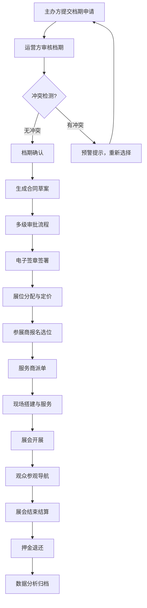

## 1. 产品概述

市级国际会展中心智慧运营管理系统，解决传统Excel排期冲突、纸质合同流转慢、服务商协作低效、观众找路困难、数据孤岛等痛点。

- 服务六类角色：场馆运营方、主办方、参展商、搭建商、服务商、观众
- 覆盖展览全生命周期：档期申请 → 合同签署 → 展位分配 → 现场服务 → 财务结算 → 数据分析
- 核心价值：提升运营效率300%，缩短押金退还周期70%，降低档期冲突率至0

## 2. 核心功能

### 2.1 用户角色

| 角色 | 注册方式 | 核心权限 |
|------|----------|----------|
| 场馆运营方 | 系统创建 | 全功能管理、档期审批、合同签署、财务结算 |
| 主办方 | 实名注册 | 档期申请、展位分配、活动发布、数据查看 |
| 参展商 | 实名注册 | 展位预订、合同签署、展品申报、观众预约 |
| 搭建商 | 资质审核 | 搭建申请、进度上报、完工确认 |
| 服务商 | 资质审核 | 订单接收、现场派单、服务评价 |
| 观众 | 小程序注册 | 展位导航、参展商查询、活动预约、签到 |

### 2.2 功能模块

1. **工作台**：待办事项、档期日历、财务概览、预警提醒
2. **档期管理**：展期申请、展厅分配、联展协调、甘特图可视化、冲突检测
3. **合同中心**：合同起草、多级审批、电子签章、押金管理、模板管理
4. **财务结算**：收款登记、发票管理、押金退还、收支统计、报表导出
5. **展位分布**：平面图编辑、展位定价、参展商分配、状态实时更新、热力图
6. **服务商管理**：资质审核、服务报价、现场派单、完工确认、评价体系
7. **观众服务**：展位导航、参展商查询、活动日程、在线预约、二维码签到
8. **数据分析**：客流统计、参展商画像、档期利用率、收入趋势、多维导出
9. **系统管理**：角色权限、操作日志、系统参数、数据备份

### 2.3 页面详情

| 页面名称 | 模块名称 | 功能描述 |
|----------|----------|----------|
| 工作台 | 待办事项 | 档期审批、合同签署、服务商订单等待办卡片 |
| 工作台 | 档期日历 | 月视图展示近期档期，点击查看详情 |
| 工作台 | 财务概览 | 本月收入、待收款、押金池、收支趋势图 |
| 工作台 | 预警提醒 | 档期冲突、资质到期、合同逾期等预警 |
| 档期管理 | 甘特图主视图 | 全年档期时间轴，拖拽调整，冲突高亮 |
| 档期管理 | 档期申请 | 表单提交展会信息，选择展厅和日期 |
| 档期管理 | 联展协调 | 多展厅联动分配，资源共享配置 |
| 档期管理 | 档期操作 | 锁定、调整、取消、审批流程 |
| 合同中心 | 合同列表 | 左侧树形列表，按状态、类型筛选 |
| 合同中心 | 流程图 | 右侧展示合同审批流转节点，当前状态高亮 |
| 合同中心 | 合同起草 | 模板选择、条款编辑、押金规则配置 |
| 合同中心 | 电子签章 | 数字签名、存证固证、归档查询 |
| 财务结算 | 收支明细 | 表格展示，支持筛选排序，底部实时汇总 |
| 财务结算 | 发票管理 | 发票开具、登记、关联合同 |
| 财务结算 | 押金管理 | 押金收取、退还规则、逾期提醒 |
| 财务结算 | 合并结算 | 多展会合并生成结算单 |
| 展位分布 | 平面图编辑 | 拖拽绘制展位，支持缩放平移 |
| 展位分布 | 展位定价 | 按区域、面积、展期配置价格策略 |
| 展位分布 | 参展商分配 | 批量分配、调整、状态更新 |
| 展位分布 | 热力图 | 客流分布热力图展示 |
| 服务商管理 | 资质审核 | 资料审核、到期提醒、黑名单管理 |
| 服务商管理 | 订单派单 | 自动派单、人工调整、状态追踪 |
| 服务商管理 | 评价体系 | 星级评价、投诉处理 |
| 数据分析 | 多维度报表 | 客流、收入、利用率、画像等图表 |
| 系统管理 | 角色权限 | RBAC权限配置、菜单动态展示 |
| 系统管理 | 操作日志 | 全量操作审计、查询追溯 |

## 3. 核心流程

## 4. 用户界面设计

### 4.1 设计风格

- **主色调**：深海蓝 (#165DFF)，体现专业、可信、科技感
- **辅助色**：成功绿 (#00B42A)、警告橙 (#FF7D00)、危险红 (#F53F3F)
- **中性色**：深灰 (#1D2129)、中灰 (#4E5969)、浅灰 (#C9CDD4)、背景灰 (#F2F3F5)
- **按钮风格**：圆角8px，主按钮实心填充，次按钮描边，悬停微动效
- **字体**：标题使用 "Noto Sans SC" 粗体，正文使用 "PingFang SC" 常规
- **布局风格**：顶部导航+左侧菜单+主内容区三栏布局，卡片式容器，12px圆角，柔和阴影
- **图标风格**：Ant Design 图标库，统一线性风格，16px/20px/24px三种尺寸

### 4.2 页面设计概览

| 页面名称 | 模块名称 | UI元素 |
|----------|----------|--------|
| 工作台 | 待办卡片 | 渐变背景、图标徽章、数量角标、点击展开 |
| 工作台 | 统计卡片 | 数字动画、趋势箭头、迷你图表、颜色分区 |
| 档期管理 | 甘特图 | 时间轴缩放、拖拽手柄、冲突红色边框、hover详情浮层 |
| 合同中心 | 流程图 | 节点连线动画、当前步骤脉冲效果、已完成绿色打勾 |
| 财务结算 | 数据表格 | 斑马纹、可展开行、汇总行固定底部、筛选抽屉 |
| 展位分布 | 平面图 | SVG交互、颜色区分状态、缩放控制、hover高亮 |
| 数据分析 | 图表 | ECharts图表库、图例切换、数据钻取、导出按钮 |

### 4.3 响应式

- **桌面端（>1280px）**：完整三栏布局，左侧菜单240px，主内容区自适应
- **平板端（768px-1280px）**：左侧菜单可折叠为64px图标栏，主内容区单列布局
- **移动端（<768px）**：底部Tab导航，抽屉式菜单，卡片堆叠布局

### 4.4 交互动效

- **页面加载**：骨架屏占位，内容渐入（fadeIn 300ms）
- **卡片悬停**：上移2px + 阴影加深（transform + box-shadow 200ms）
- **按钮点击**：缩放反馈（scale(0.97) 100ms）
- **模态框**：背景模糊 + 缩放进入（backdrop-filter + scale 200ms）
- **甘特图拖拽**：实时位置更新 + 吸附对齐 + 冲突检测反馈
- **表格排序**：箭头旋转动画，行重排过渡
