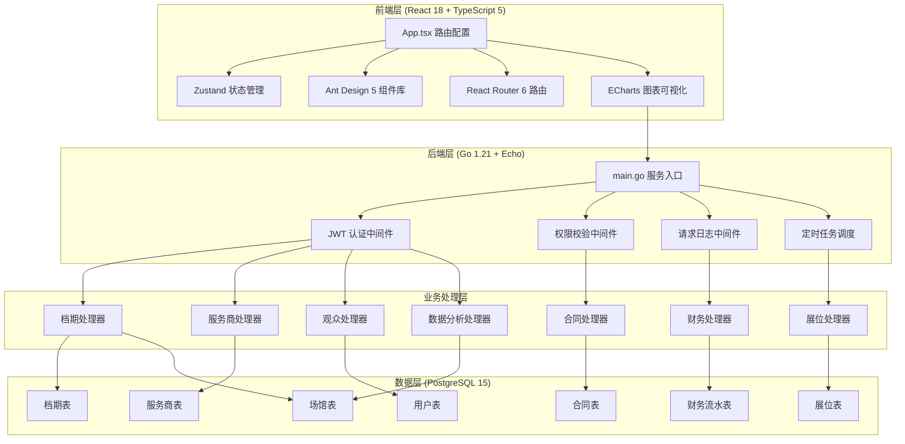
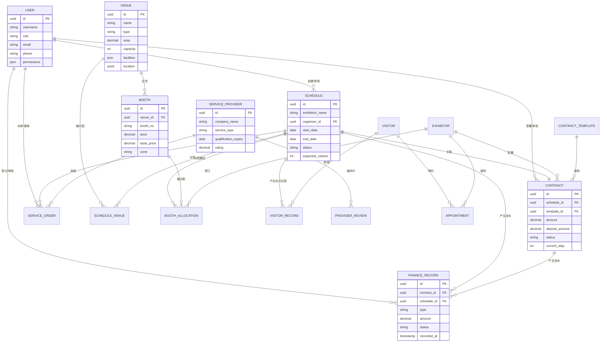

## 1. 架构设计



## 2. 技术描述

### 2.1 前端技术栈
- **框架**: React@18.2.0 + TypeScript@5.4.0
- **构建工具**: Vite@5.2.0
- **状态管理**: Zustand@4.5.0
- **UI组件库**: Ant Design@5.15.0
- **路由**: React Router@6.22.0
- **图表可视化**: ECharts@5.5.0
- **HTTP客户端**: Axios@1.6.0
- **日期处理**: dayjs@1.11.0
- **文件导出**: xlsx@0.18.0, jspdf@2.5.0
- **甘特图**: 自定义SVG实现（支持500+事件流畅渲染）

### 2.2 后端技术栈
- **语言**: Go@1.21.0
- **Web框架**: Echo@4.11.0
- **ORM**: GORM@1.25.0
- **数据库**: PostgreSQL@15
- **认证**: JWT (golang-jwt/v5)
- **API文档**: Swagger/OpenAPI 3.0 (swaggo)
- **定时任务**: robfig/cron/v3
- **配置管理**: viper
- **日志**: zap

### 2.3 数据库设计
- **数据库**: PostgreSQL 15
- **连接池**: 最大连接数 100，空闲连接数 10
- **索引策略**: B-tree索引（常用查询字段），GIN索引（JSON字段）
- **分区策略**: 档期表、流水表按年月分区
- **备份策略**: 每日全量备份 + 实时WAL归档

## 3. 前端路由定义

| 路由路径 | 页面名称 | 权限角色 |
|----------|----------|----------|
| `/login` | 登录页 | 公开 |
| `/` | 工作台 | 运营方、主办方、参展商、服务商 |
| `/schedule` | 档期管理 | 运营方、主办方 |
| `/contract` | 合同中心 | 运营方、主办方、参展商 |
| `/finance` | 财务结算 | 运营方、财务人员 |
| `/booth` | 展位分布 | 运营方、主办方、参展商、观众 |
| `/provider` | 服务商管理 | 运营方、服务商 |
| `/visitor` | 观众服务 | 运营方、观众 |
| `/analytics` | 数据分析 | 运营方、管理层 |
| `/system` | 系统管理 | 超级管理员 |

## 4. 目录结构

### 4.1 前端目录
```
frontend/
├── src/
│   ├── App.tsx                    # 路由配置与全局状态初始化
│   ├── main.tsx                   # 应用入口
│   ├── stores/                    # Zustand状态管理
│   │   ├── scheduleStore.ts       # 档期状态模块
│   │   ├── contractStore.ts       # 合同状态模块
│   │   ├── financeStore.ts        # 财务状态模块
│   │   └── userStore.ts           # 用户状态模块
│   ├── components/                # 公共组件
│   │   ├── ScheduleGantt/         # 档期甘特图组件
│   │   ├── ContractFlow/          # 合同流程图组件
│   │   ├── FinanceTable/          # 财务结算组件
│   │   ├── BoothMap/              # 展位平面图组件
│   │   └── Layout/                # 布局组件
│   ├── views/                     # 页面视图
│   │   ├── Dashboard/             # 工作台
│   │   ├── Schedule/              # 档期管理
│   │   ├── Contract/              # 合同中心
│   │   ├── Finance/               # 财务结算
│   │   ├── Booth/                 # 展位分布
│   │   ├── Provider/              # 服务商管理
│   │   ├── Visitor/               # 观众服务
│   │   ├── Analytics/             # 数据分析
│   │   └── System/                # 系统管理
│   ├── services/                  # API服务封装
│   │   ├── api.ts                 # Axios实例与拦截器
│   │   ├── scheduleApi.ts         # 档期API
│   │   ├── contractApi.ts         # 合同API
│   │   ├── financeApi.ts          # 财务API
│   │   └── ...
│   ├── utils/                     # 工具函数
│   │   ├── dateUtils.ts           # 日期计算
│   │   ├── exportUtils.ts         # 文件导出
│   │   ├── permissionUtils.ts     # 权限校验
│   │   └── validationUtils.ts     # 表单校验
│   ├── types/                     # TypeScript类型定义
│   ├── hooks/                     # 自定义Hooks
│   └── assets/                    # 静态资源
├── package.json
├── tsconfig.json
└── vite.config.ts
```

### 4.2 后端目录
```
backend/
├── main.go                        # 服务入口：Echo初始化、DB连接、中间件注册
├── go.mod
├── config/                        # 配置文件
├── internal/
│   ├── handlers/                  # 处理器层
│   │   ├── schedule_handler.go    # 档期处理器
│   │   ├── contract_handler.go    # 合同处理器
│   │   ├── finance_handler.go     # 财务处理器
│   │   ├── booth_handler.go       # 展位处理器
│   │   ├── provider_handler.go    # 服务商处理器
│   │   ├── visitor_handler.go     # 观众处理器
│   │   ├── analytics_handler.go   # 数据分析处理器
│   │   └── system_handler.go      # 系统管理处理器
│   ├── services/                  # 业务逻辑层
│   │   ├── schedule_service.go    # 档期业务逻辑
│   │   ├── contract_service.go    # 合同业务逻辑
│   │   ├── finance_service.go     # 财务业务逻辑
│   │   ├── schedule_task.go       # 档期定时任务
│   │   └── ...
│   ├── repositories/              # 数据访问层
│   │   ├── schedule_repo.go       # 档期数据访问
│   │   ├── contract_repo.go       # 合同数据访问
│   │   └── ...
│   ├── models/                    # 实体模型
│   │   ├── venue.go               # 场馆实体
│   │   ├── schedule.go            # 档期实体
│   │   ├── contract.go            # 合同实体
│   │   ├── booth.go               # 展位实体
│   │   ├── provider.go            # 服务商实体
│   │   ├── finance.go             # 财务流水实体
│   │   └── user.go                # 用户实体
│   ├── middleware/                # 中间件
│   │   ├── jwt_auth.go            # JWT认证
│   │   ├── permission.go          # 权限校验
│   │   ├── request_log.go         # 请求日志
│   │   └── cors.go                # 跨域处理
│   └── dto/                       # 数据传输对象
├── docs/                          # Swagger文档
└── scripts/                       # 部署脚本
```

## 5. API接口定义

### 5.1 档期模块 API

```typescript
// 档期实体
interface Schedule {
  id: number;
  exhibitionName: string;
  organizerId: number;
  venueIds: number[];
  startDate: string;
  endDate: string;
  setupStartDate: string;
  teardownEndDate: string;
  status: 'pending' | 'approved' | 'rejected' | 'locked' | 'cancelled';
  expectedVisitors: number;
  exhibitionType: string;
  createdAt: string;
  updatedAt: string;
}

// 获取档期列表
GET /api/v1/schedules?page=1&pageSize=20&status=approved
Response: { data: Schedule[], total: number }

// 创建档期申请
POST /api/v1/schedules
Request: Omit<Schedule, 'id' | 'createdAt' | 'updatedAt'>
Response: Schedule

// 检测档期冲突
GET /api/v1/schedules/check-conflict?venueIds=1,2&startDate=2026-01-01&endDate=2026-01-10
Response: { hasConflict: boolean, conflicts: Schedule[] }

// 更新档期
PUT /api/v1/schedules/:id
Request: Partial<Schedule>
Response: Schedule

// 档期审批
POST /api/v1/schedules/:id/approve
Request: { status: 'approved' | 'rejected', comment: string }
Response: Schedule

// 锁定/解锁档期
POST /api/v1/schedules/:id/lock
Request: { locked: boolean }
Response: Schedule
```

### 5.2 合同模块 API

```typescript
interface Contract {
  id: number;
  scheduleId: number;
  partyA: string;
  partyB: string;
  templateId: number;
  amount: number;
  depositAmount: number;
  depositRate: number;
  status: 'draft' | 'reviewing' | 'approved' | 'signed' | 'archived';
  currentStep: number;
  approvalFlow: ApprovalStep[];
  signedUrl: string;
  createdAt: string;
}

interface ApprovalStep {
  id: number;
  name: string;
  approverId: number;
  status: 'pending' | 'approved' | 'rejected';
  approvedAt: string;
  comment: string;
}
```

### 5.3 财务模块 API

```typescript
interface FinanceRecord {
  id: number;
  contractId: number;
  scheduleId: number;
  type: 'income' | 'expense' | 'deposit' | 'refund';
  amount: number;
  paymentMethod: string;
  invoiceNo: string;
  status: 'pending' | 'confirmed' | 'cancelled';
  recordedAt: string;
}

// 合并结算
POST /api/v1/finance/merge-settle
Request: { scheduleIds: number[], includeDeposit: boolean }
Response: { totalAmount: number, records: FinanceRecord[] }

// 押金退还
POST /api/v1/finance/deposit/:id/refund
Request: { refundAmount: number, reason: string }
Response: FinanceRecord
```

## 6. 数据模型

### 6.1 ER图



### 6.2 DDL语句

```sql
-- 创建用户表
CREATE TABLE users (
    id UUID PRIMARY KEY DEFAULT gen_random_uuid(),
    username VARCHAR(50) NOT NULL UNIQUE,
    password_hash VARCHAR(255) NOT NULL,
    role VARCHAR(20) NOT NULL,
    email VARCHAR(100),
    phone VARCHAR(20),
    real_name VARCHAR(50),
    company VARCHAR(100),
    permissions JSONB DEFAULT '{}',
    created_at TIMESTAMP DEFAULT CURRENT_TIMESTAMP,
    updated_at TIMESTAMP DEFAULT CURRENT_TIMESTAMP
);
CREATE INDEX idx_users_role ON users(role);

-- 创建场馆表
CREATE TABLE venues (
    id UUID PRIMARY KEY DEFAULT gen_random_uuid(),
    name VARCHAR(100) NOT NULL,
    type VARCHAR(20) NOT NULL, -- exhibition_hall, meeting_room, multi_function
    area DECIMAL(10,2) NOT NULL,
    capacity INT NOT NULL,
    floor INT,
    facilities JSONB DEFAULT '{}',
    description TEXT,
    created_at TIMESTAMP DEFAULT CURRENT_TIMESTAMP
);

-- 创建档期表（按月分区）
CREATE TABLE schedules (
    id UUID PRIMARY KEY DEFAULT gen_random_uuid(),
    exhibition_name VARCHAR(200) NOT NULL,
    organizer_id UUID REFERENCES users(id),
    start_date DATE NOT NULL,
    end_date DATE NOT NULL,
    setup_start_date DATE,
    teardown_end_date DATE,
    status VARCHAR(20) NOT NULL DEFAULT 'pending',
    exhibition_type VARCHAR(50),
    expected_visitors INT,
    description TEXT,
    created_at TIMESTAMP DEFAULT CURRENT_TIMESTAMP,
    updated_at TIMESTAMP DEFAULT CURRENT_TIMESTAMP
) PARTITION BY RANGE (start_date);
CREATE INDEX idx_schedules_dates ON schedules(start_date, end_date);
CREATE INDEX idx_schedules_status ON schedules(status);

-- 创建档期-场馆关联表
CREATE TABLE schedule_venues (
    id UUID PRIMARY KEY DEFAULT gen_random_uuid(),
    schedule_id UUID REFERENCES schedules(id) ON DELETE CASCADE,
    venue_id UUID REFERENCES venues(id) ON DELETE CASCADE,
    created_at TIMESTAMP DEFAULT CURRENT_TIMESTAMP,
    UNIQUE(schedule_id, venue_id)
);

-- 创建展位表
CREATE TABLE booths (
    id UUID PRIMARY KEY DEFAULT gen_random_uuid(),
    venue_id UUID REFERENCES venues(id) ON DELETE CASCADE,
    booth_no VARCHAR(20) NOT NULL,
    area DECIMAL(10,2) NOT NULL,
    base_price DECIMAL(12,2) NOT NULL,
    zone VARCHAR(50),
    position_x INT,
    position_y INT,
    width INT,
    height INT,
    created_at TIMESTAMP DEFAULT CURRENT_TIMESTAMP
);
CREATE INDEX idx_booths_venue ON booths(venue_id);

-- 其他表结构略...
```

## 7. 性能与安全约束

### 7.1 性能指标
- API平均响应时间 < 200ms
- 甘特图支持 500+ 事件流畅渲染拖拽（使用Canvas + 虚拟滚动）
- 支持 500 并发用户正常访问
- 数据库支持 3年50万条档期记录、100万条流水记录
- 文件上传支持 50MB 以内
- 前端首屏加载时间 < 3秒（代码分割 + 懒加载）
- 后端服务内存占用 < 512MB

### 7.2 安全措施
- JWT Token 认证，有效期2小时，支持刷新
- 基于角色的访问控制（RBAC），细粒度权限校验
- SQL注入防护（GORM预编译）
- XSS防护（前端转义 + CSP策略）
- 敏感数据加密存储（AES-256）
- 操作日志全量记录，支持审计追溯
- 接口限流防刷（Redis滑动窗口）
- 文件上传类型校验、大小限制、病毒扫描
