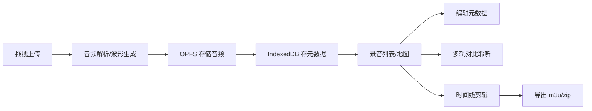

## 1. 产品概述

声影档案 (SoundScape Archive) 是一款专为独立纪录片录音师设计的纯前端音频档案管理工具，解决城市环境音采集后素材分散、检索困难、协作不便的问题。

- 面向独立纪录片录音师、声音设计师、田野录音工作者
- 核心价值：将散落在硬盘中的数百段环境音按多维度标签组织，提供可视化浏览、多轨对比、剪辑导出的一体化工作流
- 纯前端架构：元数据存 IndexedDB、音频文件存 OPFS，浏览器刷新/断网不丢数据

## 2. 核心功能

### 2.1 用户角色
| 角色 | 注册方式 | 核心权限 |
|------|----------|----------|
| 录音师用户 | 无需注册，本地使用 | 上传、管理、剪辑、导出所有音频数据 |

### 2.2 功能模块
1. **录音库首页**：录音列表、高级筛选、批量操作、拖拽上传区
2. **录音详情页**：元数据编辑、波形显示、频谱分析、封面照片
3. **地图视图**：采样点标记、行政区聚合、线路可视化
4. **对比聆听**：同线路不同时段录音叠加对比播放
5. **时间线剪辑器**：多轨拼接、淡入淡出、剪切、循环、作品集导出
6. **导出中心**：m3u 播放列表、zip 压缩包导出
7. **操作日志**：上传、导出、剪辑等行为审计
8. **设置页**：深色/浅色主题、中英文语言切换

### 2.3 页面详情
| 页面名称 | 模块名称 | 功能描述 |
|----------|----------|----------|
| 录音库首页 | 拖拽上传区 | 支持多文件拖入，实时显示上传进度和音频解析状态 |
| 录音库首页 | 录音列表 | 卡片式展示，支持按地点/时段/场景/天气/设备多维度筛选和排序 |
| 录音库首页 | 批量操作 | 多选录音批量修改元数据、批量删除、批量导出 |
| 录音库首页 | 搜索栏 | 全文搜索标题、描述、标签，支持高级筛选面板 |
| 录音详情页 | 元数据表单 | 地点(经纬度/行政区)、时段(早/午/晚/深夜)、场景(早市/地铁/公园等)、天气、设备、标签、描述 |
| 录音详情页 | 音频播放器 | 播放控制、进度条、波形图可视化、实时频谱分析 |
| 录音详情页 | 封面管理 | 上传照片作为录音封面，支持预览和替换 |
| 地图视图 | 地图交互 | 显示所有采样点位置，点击查看录音详情 |
| 地图视图 | 聚合功能 | 按行政区聚合显示数量，缩放时动态聚合/展开 |
| 地图视图 | 线路模式 | 按采集线路连接采样点，显示录音时间轴 |
| 对比聆听页 | 多轨对比 | 同一条线路选择多个时段录音，可单独调节音量、独奏/静音 |
| 对比聆听页 | 同步播放 | 多轨同步播放、暂停、跳转，支持 A/B 循环对比 |
| 时间线剪辑器 | 轨道管理 | 拖拽录音片段到时间线，支持多轨排列 |
| 时间线剪辑器 | 剪辑操作 | 片段剪切、拖拽排序、调整长度、循环播放 |
| 时间线剪辑器 | 淡入淡出 | 可视化调整片段淡入淡出时长，显示音量包络线 |
| 导出中心 | m3u 导出 | 生成 m3u8 播放列表，包含元数据注释 |
| 导出中心 | zip 导出 | 将选中录音及元数据打包为 zip 压缩包 |
| 操作日志页 | 日志列表 | 记录上传、导出、剪辑、批量修改等操作，含时间戳和详情 |
| 设置页 | 主题设置 | 深色/浅色主题切换，自动保存到本地存储 |
| 设置页 | 语言设置 | 中文/英文双语切换，界面实时更新 |
| 设置页 | 数据管理 | 数据导入导出、清空数据、存储使用统计 |

## 3. 核心流程

### 3.1 录音上传管理流程
用户打开应用 → 拖拽音频文件到上传区 → 系统解析音频生成波形数据 → 自动存入 OPFS，元数据存入 IndexedDB → 跳转到详情页补充元数据 → 录音出现在列表和地图中

### 3.2 多轨对比流程
用户选择线路视图 → 选择同一条地铁线路 → 勾选早高峰和深夜两个时段录音 → 进入对比模式 → 分别调节两轨音量 → 同步播放对比声场差异

### 3.3 作品集导出流程
用户进入剪辑器 → 从素材库拖拽多段录音到时间线 → 调整片段顺序和长度 → 设置淡入淡出 → 预览播放 → 导出 m3u 播放列表或 zip 压缩包 → 分享给纪录片导演

## 4. 用户界面设计

### 4.1 设计风格
这是一款面向专业创作者的工具，采用**极简工业风**设计语言：
- **主色调**：深炭黑 (#121212) 作为深色主题基底，冷调钢蓝 (#3B82F6) 作为强调色，琥珀橙 (#F59E0B) 标记录音状态
- **字体**：标题使用 JetBrains Mono 等宽字体体现专业感，正文使用 Inter 保证可读性
- **按钮风格**：直角矩形、2px 边框、hover 时边框发光效果
- **布局风格**：三栏式桌面布局，可折叠侧边栏 + 主内容区 + 详情面板
- **视觉细节**：波形图用渐变填充，频谱用霓虹发光效果，地图点用脉冲动画标识录音位置

### 4.2 页面设计概述
| 页面名称 | 模块名称 | UI 元素 |
|----------|----------|----------|
| 录音库首页 | 拖拽上传区 | 虚线边框容器、拖入时边框发光、文件图标和进度条动画 |
| 录音库首页 | 录音卡片 | 封面图+波形缩略图、多维度标签彩色徽章、hover 上浮效果 |
| 录音详情页 | 波形显示 | Canvas 绘制实时波形，点击跳转播放位置，选区标记循环范围 |
| 录音详情页 | 频谱分析 | 渐变色柱状频谱，随音频实时跳动，峰值保持高亮 |
| 时间线剪辑器 | 时间线轨道 | 深色背景、网格刻度、彩色片段块、音量包络线可拖拽节点 |
| 地图视图 | 采样标记 | 脉冲动画圆点、聚合时显示数字徽章、点击展开录音列表 |

### 4.3 响应式设计
采用桌面优先设计，适配三套断点：
- **桌面端** (≥1280px)：三栏布局，侧边栏 240px + 主内容区自适应 + 详情面板 360px
- **平板端** (768px-1279px)：两栏布局，侧边栏可收起为图标栏，详情面板改为底部抽屉
- **手机端** (<768px)：单栏布局，底部导航切换视图，详情页全屏展示，重点优化触控区域

### 4.4 深色主题
- 背景层次：页面背景 #0A0A0A、卡片背景 #1A1A1A、弹窗背景 #242424
- 文字层次：主文字 #E5E5E5、次要文字 #A3A3A3、禁用文字 #525252
- 强调色：操作按钮 #3B82F6、警告 #EF4444、成功 #10B981
- 边框分割：#2D2D2D，确保 4.5:1 对比度满足可访问性要求
