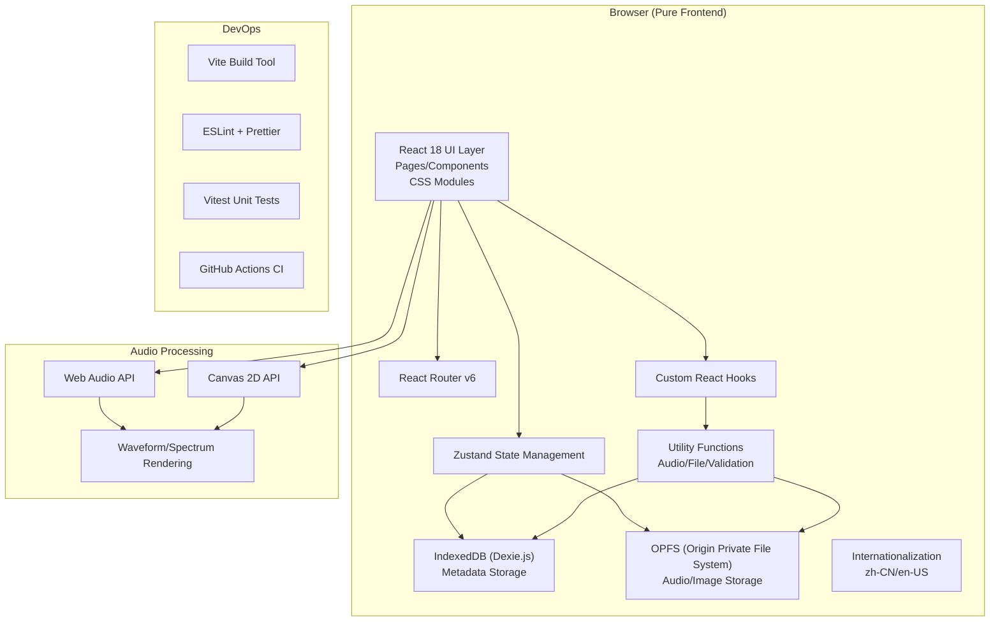
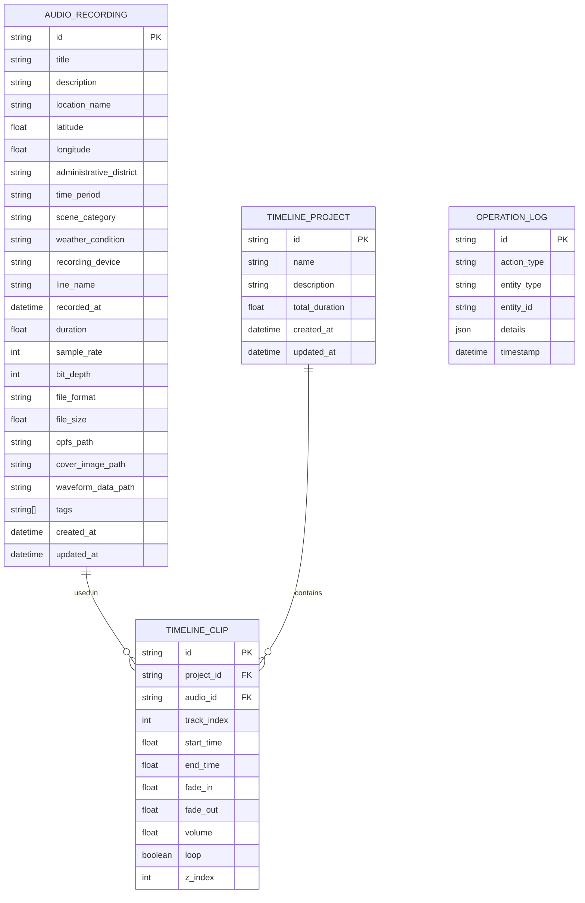

## 1. 架构设计



## 2. 技术描述

### 2.1 核心技术栈
- **前端框架**：React 18 + TypeScript 5.x
- **构建工具**：Vite 5.x（配置拆分为 dev/prod/test 三份）
- **状态管理**：Zustand 4.x
- **路由**：React Router v6
- **样式方案**：CSS Modules（不引入组件库，纯手写）
- **本地数据库**：IndexedDB + Dexie.js 3.x
- **文件存储**：OPFS (Origin Private File System)
- **音频处理**：Web Audio API
- **可视化**：Canvas 2D API（波形、频谱、地图）
- **国际化**：自定义 i18n 方案（轻量无依赖）
- **打包压缩**：JSZip 3.x（zip 导出）
- **代码规范**：ESLint + Prettier
- **单元测试**：Vitest 1.x
- **CI**：GitHub Actions

### 2.2 关键技术决策
1. **不使用 UI 组件库**：使用 CSS Modules 手写所有组件，确保完全可控的深色主题和工业风设计
2. **不使用地图 SDK**：使用 Canvas 手绘简化地图，避免第三方依赖和 API Key 需求
3. **OPFS 存储音频**：支持数十 GB 级文件存储，突破 LocalStorage 5MB 限制
4. **IndexedDB 存元数据**：Dexie.js 封装简化 IndexedDB 操作，支持复杂查询
5. **Web Audio API 处理**：原生 API 实现波形解析、频谱分析、多轨混音

## 3. 目录结构

```
soundscape-archive/
├── .github/workflows/
│   └── ci.yml                    # CI 配置
├── config/
│   ├── vite.config.dev.ts        # 开发环境配置
│   ├── vite.config.prod.ts       # 生产环境配置
│   └── vite.config.test.ts       # 测试环境配置
├── src/
│   ├── assets/                   # 静态资源
│   ├── components/               # 通用组件
│   │   ├── ui/                   # 基础 UI 组件
│   │   │   ├── Button/
│   │   │   ├── Input/
│   │   │   ├── Select/
│   │   │   ├── Form/
│   │   │   ├── Modal/
│   │   │   └── Tabs/
│   │   ├── audio/                # 音频相关组件
│   │   │   ├── Waveform/
│   │   │   ├── Spectrum/
│   │   │   ├── AudioPlayer/
│   │   │   └── DropZone/
│   │   ├── timeline/             # 时间线组件
│   │   │   ├── Timeline/
│   │   │   ├── Track/
│   │   │   └── Clip/
│   │   └── layout/               # 布局组件
│   │       ├── Sidebar/
│   │       ├── Header/
│   │       └── ErrorBoundary/
│   ├── pages/                    # 页面组件
│   │   ├── Library/              # 录音库
│   │   ├── Detail/               # 录音详情
│   │   ├── MapView/              # 地图视图
│   │   ├── Compare/              # 对比聆听
│   │   ├── TimelineEditor/       # 时间线剪辑
│   │   ├── ExportCenter/         # 导出中心
│   │   ├── OperationLogs/        # 操作日志
│   │   └── Settings/             # 设置页
│   ├── store/                    # Zustand 状态
│   │   ├── audioStore.ts
│   │   ├── uiStore.ts
│   │   ├── timelineStore.ts
│   │   └── settingsStore.ts
│   ├── db/                       # 数据库层
│   │   ├── dexie.ts              # Dexie 实例
│   │   ├── schemas.ts            # 数据模型定义
│   │   └── operations/           # CRUD 操作
│   ├── storage/                  # OPFS 文件存储
│   │   ├── opfs.ts               # OPFS 封装
│   │   └── fileOperations.ts
│   ├── hooks/                    # 自定义 Hooks
│   │   ├── useAudioPlayer.ts
│   │   ├── useWaveform.ts
│   │   ├── useDropZone.ts
│   │   ├── useI18n.ts
│   │   └── useTheme.ts
│   ├── utils/                    # 工具函数
│   │   ├── audio/                # 音频处理
│   │   ├── file/                 # 文件操作
│   │   ├── validation/           # 表单校验
│   │   ├── export/               # 导出功能
│   │   └── logger/               # 操作日志
│   ├── i18n/                     # 国际化
│   │   ├── index.ts
│   │   ├── zh-CN.ts
│   │   └── en-US.ts
│   ├── styles/                   # 全局样式
│   │   ├── variables.module.css  # CSS 变量
│   │   ├── reset.css
│   │   └── theme.css
│   ├── types/                    # TypeScript 类型定义
│   ├── router/                   # 路由配置
│   ├── App.tsx
│   └── main.tsx
├── tests/                        # 单元测试
├── .eslintrc.js
├── .prettierrc
├── tsconfig.json
├── vite.config.ts
└── package.json
```

## 4. 路由定义

| 路由 | 页面 | 说明 |
|------|------|------|
| `/` | 录音库首页 | 列表展示、上传入口、筛选搜索 |
| `/audio/:id` | 录音详情页 | 元数据编辑、波形播放、封面管理 |
| `/map` | 地图视图 | 采样点地图、聚合、线路可视化 |
| `/compare` | 对比聆听页 | 多轨同步对比播放 |
| `/timeline` | 时间线剪辑器 | 多轨剪辑、淡入淡出、作品集制作 |
| `/export` | 导出中心 | m3u/zip 导出管理 |
| `/logs` | 操作日志页 | 操作审计记录 |
| `/settings` | 设置页 | 主题、语言、数据管理 |

## 5. 数据模型

### 5.1 ER 图


### 5.2 枚举值定义
- `time_period`: `early_morning` | `morning` | `noon` | `afternoon` | `evening` | `night` | `late_night`
- `scene_category`: `market` | `subway` | `street` | `park` | `construction` | `traffic` | `indoor` | `nature` | `festival` | `other`
- `weather_condition`: `sunny` | `cloudy` | `rainy` | `windy` | `foggy` | `snowy` | `thunderstorm`
- `action_type`: `upload` | `update_metadata` | `batch_update` | `delete` | `export_m3u` | `export_zip` | `create_project` | `update_clip` | `theme_change` | `language_change`

## 6. 核心模块技术设计

### 6.1 音频处理模块
- 使用 `AudioContext.decodeAudioData()` 解析音频文件
- 提取波形数据：按 1000 个采样点降采样，存储为 Float32Array
- 频谱分析：使用 `AnalyserNode` 实时获取频率数据，Canvas 绘制
- 多轨混音：创建多个 `AudioBufferSourceNode`，通过 `GainNode` 控制各自音量

### 6.2 OPFS 存储模块
- 使用 `navigator.storage.getDirectory()` 获取根目录
- 按 `/audio/{id}.{ext}` 和 `/cover/{id}.jpg` 路径组织文件
- 使用 `createWritable()` 流式写入大文件，避免内存溢出
- 提供 `readFile()` / `writeFile()` / `deleteFile()` 统一接口

### 6.3 波形绘制模块
- Canvas 2D 绘制，支持缩放和平移
- 渐变色填充：从 `#3B82F6` 到 `#60A5FA`
- 点击定位播放位置，拖拽选择循环区间
- 性能优化：离屏 Canvas 缓存静态波形

### 6.4 表单校验模块
- 纯函数校验器，支持同步/异步校验
- 必填、长度、格式（经纬度、文件大小）等通用校验
- 实时校验，错误信息多语言显示
- 批量编辑时的字段差异校验

### 6.5 操作日志模块
- 装饰器模式封装关键操作，自动记录日志
- IndexedDB 单独存储日志表，支持分页查询
- 日志内容可导出为 JSON 备份
- 包含操作类型、实体、时间戳、详细参数

### 6.6 错误边界
- 顶层 `ErrorBoundary` 捕获渲染异常
- 展示友好错误页面，提供恢复操作
- 错误自动记录到操作日志
- 组件级错误边界隔离关键模块

## 7. CI/CD 配置

### GitHub Actions 工作流
- 触发条件：push 到 main 分支、PR 到 main 分支
- 任务阶段：
  1. `lint`: 运行 ESLint 检查
  2. `test`: 运行 Vitest 单元测试
  3. `build`: 生产环境构建
  4. `typecheck`: TypeScript 类型检查

### Vite 多环境配置
- **dev**: 启用 HMR、sourcemap、开发插件
- **prod**: 代码压缩、treeshaking、资源哈希
- **test**: 启用 test plugins、无产出模式
