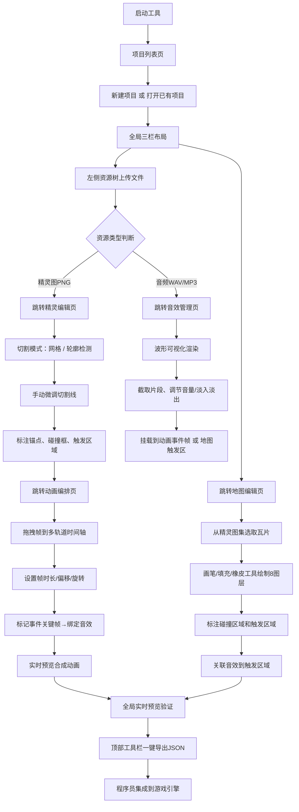

## 1. 产品概述

PixelForge Studio 是一套面向独立游戏开发工作室的纯前端2D游戏资源编排与预览工具，解决美术师、策划与程序员之间的协作断层问题。通过一站式精灵切割、动画编排、瓦片地图编辑和音效挂载，让非程序人员自主完成资源生产与预览，最终导出标准JSON配置供游戏引擎直接集成。

- 目标用户：独立工作室美术师、关卡策划、音效设计师
- 核心价值：消除资源散佚、版本冲突、沟通遗漏，加速迭代闭环

## 2. 核心功能

### 2.1 用户角色

| 角色 | 进入方式 | 核心权限 |
|------|---------|---------|
| 美术师 | 浏览器打开工具 | 精灵图上传切割、动画帧编排、锚点/碰撞框标注 |
| 关卡策划 | 浏览器打开工具 | 瓦片地图绘制、图层管理、触发区域配置、音效挂载 |
| 音效设计师 | 浏览器打开工具 | 音频上传裁剪、音量/淡入淡出调节、事件帧绑定 |
| 程序员 | 浏览器打开工具 | 项目创建、导出JSON配置、版本快照对比回滚 |

### 2.2 功能模块

1. **项目列表页**：项目卡片管理、版本快照入口、新建/复制/删除项目
2. **精灵编辑页**：精灵表上传、自动/手动切割、帧元信息标注
3. **动画编排页**：时间轴拖拽编排、多轨道叠加、事件关键帧标记、实时预览
4. **地图编辑页**：瓦片集选取、多图层绘制、碰撞/触发区域、笔刷工具
5. **音效管理页**：音频波形可视化、片段截取、音量调节、事件绑定

### 2.3 页面详情

| 页面名称 | 模块名称 | 功能描述 |
|---------|---------|----------|
| 项目列表页 | 项目卡片网格 | 展示项目封面、资源统计、最后修改时间，支持搜索筛选 |
| 项目列表页 | 快照操作区 | 手动保存快照、快照列表、差异对比、版本回滚 |
| 精灵编辑页 | 精灵画布区 | 精灵表渲染、切割线叠加、滚轮缩放、拖拽平移、帧选中高亮 |
| 精灵编辑页 | 切割模式切换 | 等分网格模式（行列数设置）、阈值轮廓检测模式（灵敏度调节） |
| 精灵编辑页 | 帧属性面板 | 锚点十字标记、碰撞框编辑、触发区域绘制、批量重命名 |
| 动画编排页 | 轨道时间轴 | 多轨道（身体/武器/特效）、帧缩略图拖拽排序、时长/偏移/旋转设置 |
| 动画编排页 | 事件关键帧 | 标记音效触发点、引擎回调点、可视化波形叠加 |
| 动画编排页 | 预览播放器 | 60fps实时合成渲染、播放控制、缩放适配 |
| 地图编辑页 | 瓦片选取面板 | 从精灵图集选取瓦片、最近使用、搜索过滤 |
| 地图编辑页 | 画布编辑区 | 网格叠加、画笔/填充/橡皮/选区移动工具、8图层切换 |
| 地图编辑页 | 碰撞/触发编辑 | 区域矩形标注、属性配置、与音效关联 |
| 音效管理页 | 波形渲染区 | Web Audio解码、Canvas波形绘制、选区截取片段 |
| 音效管理页 | 参数调节 | 音量滑块、淡入淡出曲线、循环开关 |
| 全局布局 | 左侧资源树 | 240px宽、树形目录、拖拽归类、跨项目复制、引用关系高亮 |
| 全局布局 | 顶部工具栏 | 项目切换下拉、撤销/重做、缩放适配、导出按钮、主题切换 |
| 全局布局 | 右侧属性面板 | 280px宽、当前选中元素属性编辑、响应式抽屉化 |

## 3. 核心流程

主要用户流程：创建项目 → 上传精灵表/音频 → 切割精灵帧 → 编排动画序列 → 绘制瓦片地图 → 挂载音效事件 → 实时预览 → 导出引擎JSON。

## 4. 用户界面设计

### 4.1 设计风格

- **主题色调**：深空工业风深色主题。主色 `#1a1d24` 画布背景，面板 `#23272f`，分割线 `#2e333d`，强调色 `#ff6b35`（像素橙）、`#00d4ff`（电子青），成功 `#52c41a`，警示 `#faad14`，错误 `#ff4d4f`
- **按钮风格**：直角微倒角2px，2px边框高亮悬停，按下内陷阴影，禁用态灰化50%
- **字体选型**：标题使用 "Press Start 2P" 像素风装饰字体（仅大标题），正文使用 "JetBrains Mono" 等宽字体，保证代码/数字对齐可读性；字号层级 12px/13px/14px/16px/20px
- **布局风格**：严格三栏固定+自适应布局，面板之间3px宽拖拽条，所有资源卡片1px实线边框+hover时2px强调色外发光
- **图标风格**：SVG线性图标，1.5px描边，16x16/20x20/24x24三种尺寸，选中态填充强调色

### 4.2 页面设计概览

| 页面名称 | 模块名称 | UI 元素与风格 |
|---------|---------|-------------|
| 项目列表 | 卡片网格 | 4列响应式卡片，封面棋盘格+精灵缩略图拼接，悬停时卡片上浮6px+橙色外发光，角落像素风装饰角标 |
| 精灵编辑 | 画布区域 | 棋盘格透明背景（#1a1d24与#23272f交替8px方块），切割线1px青色虚线，选中帧2px橙色实线边框+十字锚点标记，滚轮缩放光标跟随 |
| 动画编排 | 时间轴 | 深灰底轨道分隔线，帧缩略图80x80px圆角4px，当前播放指针1px红色竖线+渐变拖尾，事件关键帧顶部黄色菱形标记 |
| 地图编辑 | 画布网格 | 1px半透明白色网格线，当前瓦片跟随鼠标半透明预览，图层切换按钮带图层编号徽章，碰撞区红色半透明叠加、触发区青色半透明叠加 |
| 音效管理 | 波形区 | 深紫渐变背景，青色波形曲线填充，选区半透明橙色遮罩，播放头白色竖线，音量/淡入淡出滑块带实时数值气泡 |
| 全局 | 资源树 | 文件夹黄色三角图标+展开动画，精灵图小缩略图预览，音频文件波形小图标，引用关系被用时右侧绿色圆点标记 |
| 全局 | 属性面板 | 分组折叠卡片，表单标签右对齐14px，输入框深色底+1px边框focus强调色，颜色选择器带像素调色板预设 |

### 4.3 响应式设计

- **桌面优先**：基准分辨率1920x1080，三栏全展开布局
- **1440px以下**：资源树缩至200px，属性面板缩至240px
- **1280px以下**：右侧属性面板折叠为抽屉（从右向左滑入，300ms ease-out动画，半透明黑色遮罩遮罩画布），点击遮罩关闭
- **1024px以下**：左侧资源树也改为抽屉式（从左滑入），顶部工具栏高度压缩至44px
- **触控优化**：所有按钮最小触控区44x44px，画布双指缩放，时间轴滑动滚动

### 4.4 画布与性能可视化

- **精灵画布**：Canvas2D离屏缓存精灵表，切割线DOM overlay层避免重绘，帧率计数器右上角小字显示
- **动画预览**：requestAnimationFrame驱动，双缓冲渲染，帧切换时时间戳对齐避免抖动
- **地图瓦片**：视口裁剪+离屏预渲染相邻瓦片，8图层使用globalCompositeOperation控制叠加顺序，碰撞层toggle开关
- **音效波形**：降采样至2000个数据点，Web Audio OfflineAudioContext后台解码不阻塞UI，解码进度条显示
