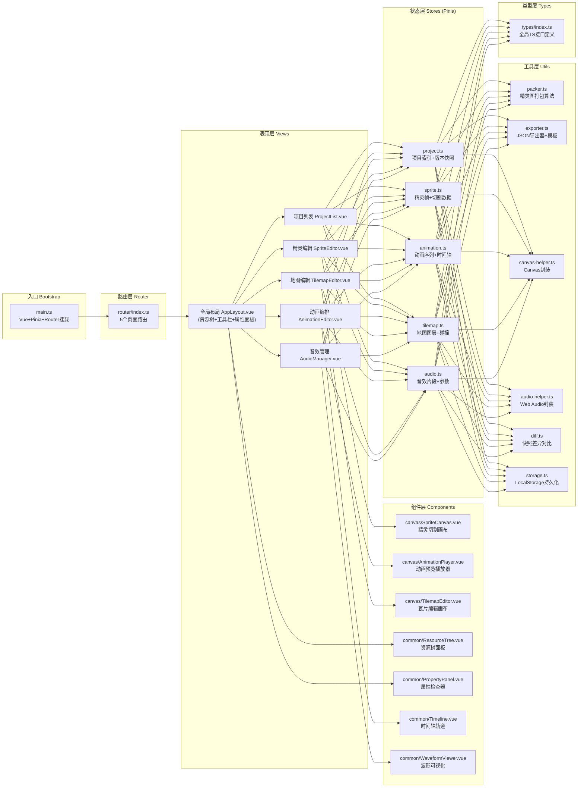
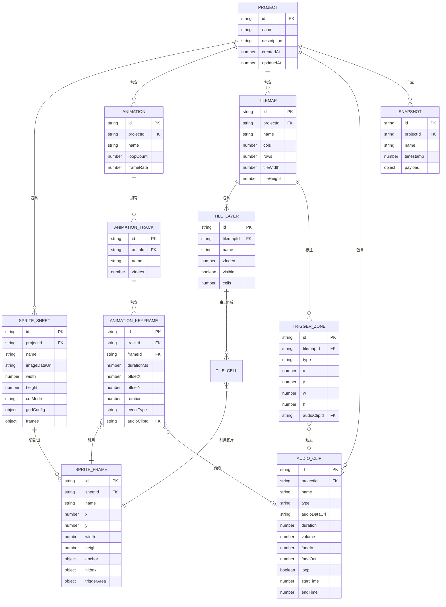

## 1. 架构设计



## 2. 技术栈说明

- **前端框架**：Vue@3.4 + TypeScript@5.3 + Vite@5.0
- **状态管理**：Pinia@2.1 + Pinia Plugin Undo（撤销重做）
- **路由**：Vue Router@4.3
- **渲染引擎**：Canvas 2D API（原生）+ OffscreenCanvas（精灵缓存）
- **音频处理**：Web Audio API（AudioContext + OfflineAudioContext）
- **持久化存储**：localStorage（元数据） + IndexedDB（二进制资源Blob）
- **开发规范**：ESLint + Prettier + Husky + lint-staged
- **CSS方案**：原生CSS变量 + CSS Modules（scoped），不引入Tailwind
- **图标方案**：内联SVG组件（src/components/icons/）

## 3. 路由定义

| 路由路径 | 页面组件 | 布局 | 说明 |
|---------|---------|-----|------|
| `/` | Redirect → `/projects` | - | 根路径重定向 |
| `/projects` | views/ProjectList.vue | 无（全屏） | 项目列表、新建/打开/删除 |
| `/projects/:projectId/sprites` | views/SpriteEditor.vue | AppLayout三栏 | 精灵图切割与帧标注 |
| `/projects/:projectId/animations` | views/AnimationEditor.vue | AppLayout三栏 | 动画编排与预览 |
| `/projects/:projectId/tilemaps` | views/TilemapEditor.vue | AppLayout三栏 | 瓦片地图编辑 |
| `/projects/:projectId/audio` | views/AudioManager.vue | AppLayout三栏 | 音效管理与挂载 |

## 4. 数据模型定义

### 4.1 ER 图



## 5. 核心算法说明

### 5.1 精灵图切割算法（packer.ts）

```typescript
// 等分网格切割
function gridCut(img: HTMLImageElement, cols: number, rows: number): SpriteFrame[];

// 阈值轮廓检测切割（基于alpha通道连通域）
// 1. 遍历像素alpha > 阈值标记为前景
// 2. BFS搜索8邻域连通域得到每个精灵外接矩形
// 3. NMS合并重叠矩形，输出最终帧列表
function contourCut(img: HTMLImageElement, alphaThreshold: number, padding: number): SpriteFrame[];
```

### 5.2 快照差异对比算法（diff.ts）

```typescript
// 基于JSON深度递归对比，输出增删改节点列表
interface DiffNode { type: 'add'|'remove'|'update'; path: string[]; old?: any; new?: any; }
function diffSnapshots(oldSnap: Snapshot, newSnap: Snapshot): DiffNode[];
```

### 5.3 Canvas渲染优化策略

- **精灵画布**：OffscreenCanvas预缓存精灵表原图，切割线DOM overlay，缩放矩阵CSS transform实现，避免每帧重绘
- **动画播放器**：双缓冲（前后Canvas切换），requestAnimationFrame + performance.now()时间戳插值，帧资源预加载到ImageBitmap池
- **瓦片地图**：仅渲染视口可见区域（viewport culling），每层使用离屏Canvas缓存静态内容，改动时局部重绘

### 5.4 音频波形渲染优化

```typescript
// 1. OfflineAudioContext.decodeAudioData后台解码
// 2. 降采样：将原始PCM数据通过取峰值+RMS混合压缩至目标点数(2000点)
// 3. 分时绘制：requestIdleCallback分块绘制Canvas不阻塞UI
```

## 6. 导出 JSON 格式规范

```json
{
  "version": "1.0.0",
  "project": { "id": "...", "name": "..." },
  "spriteSheets": [{
    "id": "...", "name": "...",
    "image": "data:image/png;base64,...",
    "frames": [{
      "id": "...", "name": "idle_001",
      "rect": { "x": 0, "y": 0, "w": 64, "h": 64 },
      "anchor": { "x": 32, "y": 48 },
      "hitbox": { "x": 8, "y": 8, "w": 48, "h": 56 }
    }]
  }],
  "animations": [{
    "id": "...", "name": "player_idle",
    "frameRate": 24, "loop": true,
    "tracks": [{
      "name": "body", "zIndex": 0,
      "keyframes": [{ "frameId": "...", "duration": 83, "offset": [0,0], "rotation": 0 }]
    }],
    "events": [{ "frame": 5, "type": "audio", "clipId": "..." }]
  }],
  "tilemaps": [{
    "id": "...", "name": "level_01",
    "size": { "cols": 128, "rows": 128, "tileW": 32, "tileH": 32 },
    "layers": [{ "name": "ground", "zIndex": 0, "data": "base64-rle-compressed-grid" }],
    "triggers": [{ "type": "audio", "rect": {...}, "clipId": "..." }]
  }],
  "audioClips": [{
    "id": "...", "name": "jump",
    "src": "data:audio/wav;base64,...",
    "volume": 0.8, "fadeIn": 0.01, "fadeOut": 0.05, "loop": false,
    "range": { "start": 0.2, "end": 0.8 }
  }],
  "manifest": { "spriteCount": 320, "animationCount": 45, "tilemapCount": 8, "audioCount": 36 }
}
```

## 7. 性能预算指标

| 指标项 | 目标值 | 测量方式 |
|-------|-------|---------|
| 精灵切割响应（4096²图） | <100ms | Performance.now()计时 |
| 动画预览帧率 | 稳定60fps | rAF回调计数器 |
| 256×256×8图层地图渲染 | ≥30fps | FPS面板实测 |
| 100MB音频波形渲染 | ≤3s | 解码+绘制总耗时 |
| 快照保存 | ≤2s | 序列化+IndexedDB写入 |
| 资源树1000节点展开/折叠 | 无感知卡顿（<16ms） | 虚拟滚动 Vue Virtual Scroller |
| 首屏加载（热启动） | <2s | Lighthouse Performance |
| 构建产物体积 | <500KB gzip | Vite build --report |

## 8. 目录结构

```
src/
├── main.ts
├── App.vue
├── router/
│   └── index.ts
├── stores/
│   ├── project.ts
│   ├── sprite.ts
│   ├── animation.ts
│   ├── tilemap.ts
│   └── audio.ts
├── views/
│   ├── ProjectList.vue
│   ├── SpriteEditor.vue
│   ├── AnimationEditor.vue
│   ├── TilemapEditor.vue
│   └── AudioManager.vue
├── components/
│   ├── layout/
│   │   ├── AppLayout.vue
│   │   ├── TopToolbar.vue
│   │   ├── LeftResizer.vue
│   │   └── RightResizer.vue
│   ├── canvas/
│   │   ├── SpriteCanvas.vue
│   │   ├── AnimationPlayer.vue
│   │   └── TilemapEditor.vue
│   ├── common/
│   │   ├── ResourceTree.vue
│   │   ├── PropertyPanel.vue
│   │   ├── Timeline.vue
│   │   ├── WaveformViewer.vue
│   │   └── SnapshotDiff.vue
│   └── icons/
│       ├── IconProject.vue
│       └── ...
├── utils/
│   ├── packer.ts
│   ├── exporter.ts
│   ├── canvas-helper.ts
│   ├── audio-helper.ts
│   ├── diff.ts
│   ├── storage.ts
│   └── id.ts
├── types/
│   └── index.ts
└── styles/
    ├── variables.css
    ├── reset.css
    ├── layout.css
    └── components.css
```
