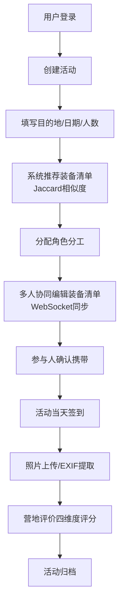

## 1. 产品概述

CampHub 露营活动管理系统是面向都市露营爱好者的一站式协作平台，解决装备管理混乱、活动规划效率低、精彩回忆难沉淀三大痛点。系统支持多人装备共享借还、活动协同筹备、照片时间轴回放、信用评价体系等核心功能，服务于从2人轻量化徒步到十几人家庭聚会的全场景露营活动。

目标市场与价值：为国内快速增长的露营社群提供数字化管理工具，降低组织成本，提升活动体验，构建装备共享的信任机制。

## 2. 核心功能

### 2.1 用户角色

| 角色 | 注册方式 | 核心权限 |
|------|----------|----------|
| 普通用户 | 邮箱注册 | 创建/参与活动、管理自有装备、借还装备、上传照片、营地评价 |
| 活动管理员 | 系统自动授予（活动创建者） | 编辑活动信息、分配角色、确认装备清单、归档活动 |

### 2.2 功能模块

1. **登录注册页**：邮箱密码注册、JWT登录、密码校验提示
2. **首页仪表盘**：进行中活动卡片、即将开始活动、快捷入口、统计概览
3. **装备管理页**：装备瀑布流卡片、状态标签、筛选搜索、借还操作、保养提醒
4. **活动列表页**：活动时间线、状态筛选、创建活动入口
5. **活动详情页**：基本信息Tab、参与人员Tab、装备清单Tab、照片墙Tab、营地评价Tab
6. **照片墙页面**：Masonry瀑布流布局、图片放大预览、时间轴筛选、GPS轨迹回放
7. **统计分析页**：装备使用频率、活动次数统计、信用分排名、季节适宜性矩阵

### 2.3 页面详情

| 页面名称 | 模块名称 | 功能描述 |
|----------|----------|----------|
| 登录注册页 | 表单区域 | 邮箱/密码输入、jQuery Validation校验、注册/登录切换、错误提示 |
| 首页仪表盘 | 活动卡片网格 | 展示进行中/即将开始的活动卡片，显示天数倒计时、参与人数、状态标签 |
| 首页仪表盘 | 快捷操作区 | 创建活动、添加装备、上传照片三个快捷按钮 |
| 首页仪表盘 | 统计概览 | 总活动数、装备总数、待归还数、信用分四项关键指标 |
| 装备管理页 | 瀑布流卡片 | 装备图片、名称、分类、状态标签（在库/借出/维修/报废）、操作按钮 |
| 装备管理页 | 筛选栏 | 按分类、状态、所有者、关键字筛选 |
| 装备管理页 | 借还弹窗 | 选择借用人、预计归还日期、备注、信用分实时展示 |
| 活动详情页 | 基本信息Tab | 目的地地图、起止时间、参与人数、角色分工列表 |
| 活动详情页 | 装备清单Tab | 分类装备清单、携带状态勾选、缺失高亮、协同编辑标记 |
| 活动详情页 | 照片墙Tab | 活动照片瀑布流、按时间排序、GPS位置标签 |
| 活动详情页 | 营地评价Tab | 四维度评分（交通/风景/设施/安全）、季节适宜性标注、文字评价 |
| 照片墙页面 | 瀑布流布局 | 所有活动照片按拍摄时间倒序、点击放大支持左右切换 |
| 照片墙页面 | GPS轨迹回放 | 单日活动移动轨迹热力图、时间轴拖动播放 |
| 统计分析页 | 季节适宜性矩阵 | 12个月 × 营地类型热力图，颜色深浅代表推荐程度 |

## 3. 核心流程

### 3.1 装备借还流程
用户创建装备入库 → 设置分类/图片/描述 → 其他用户发起借出申请 → 所有者确认借出 → 系统自动锁定库存并记录归还日期 → 到期前系统提醒 → 按时归还加5信用分/逾期一天扣2分 → 超期自动生成催还通知

### 3.2 活动筹备流程
创建活动填写目的地/日期/人数 → 系统通过Jaccard相似度推荐历史装备清单和采购清单 → 分配角色（厨师/司机/摄影等）→ 多人协同编辑装备清单（WebSocket实时同步）→ 参与人员确认携带装备 → 活动当天签到 → 结束后营地评价与归档

### 3.3 照片上传与轨迹生成流程
选择照片批量上传 → 超过5MB启用Canvas客户端压缩 → 服务器提取EXIF经纬度与拍摄时间 → 关联到对应活动 → 生成时间轴与GPS轨迹热力图

## 4. 用户界面设计

### 4.1 设计风格
- **主色与辅色**：主色森林绿 `#2D5A27`（自然露营感），辅色暖橙 `#E8833A`（活动活力），中性色采用灰白系 `#F5F3EF` 背景与 `#2C2C2C` 深灰文字
- **按钮风格**：圆角 8px，主按钮森林绿渐变，悬停时轻微上浮+阴影加深；危险按钮砖红 `#B5442C`
- **字体**：标题使用 "Noto Serif SC" 衬线体（户外杂志感），正文使用 "Noto Sans SC" 无衬线体（清晰易读）
- **布局风格**：左侧固定垂直导航栏（240px宽），主内容区采用卡片式布局，大量留白与柔和阴影
- **图标风格**：使用 Bootstrap Icons，线性图标配合彩色徽标标签

### 4.2 页面设计概述

| 页面名称 | 模块名称 | UI元素与设计要点 |
|----------|----------|------------------|
| 登录注册页 | 品牌区域 | 左侧大幅露营背景图+半透明遮罩，品牌标语"去野，更从容"叠加白色描边字 |
| 登录注册页 | 表单区 | 右侧白色卡片+柔和阴影，输入框带左侧图标，底部第三方登录占位 |
| 首页仪表盘 | 英雄区顶部 | 用户头像+问候语+今日天气+露营黄历提示条 |
| 首页仪表盘 | 活动卡片 | 卡片顶部大图（目的地缩略图），左下角叠加日期徽标，右下角状态标签胶囊 |
| 装备管理页 | 卡片设计 | 装备图片上方半透明状态条（绿色在库/橙色借出/红色维修），悬停放大1.02倍 |
| 装备管理页 | 筛选栏 | 胶囊式标签筛选组，选中状态填充主色+白色图标 |
| 活动详情页 | Tab导航 | 下划线式Tab，选中状态下主色粗下划线+加粗字体 |
| 活动详情页 | 照片墙 | Masonry瀑布流，2px圆角，hover时显示拍摄时间与位置标签 |
| 照片墙页面 | 大图预览 | 黑色半透明遮罩弹窗，左右箭头翻页，ESC关闭，底部显示EXIF信息条 |
| 统计分析页 | 热力矩阵 | 单元格hover显示详情tooltip，颜色渐变从浅绿到深绿代表推荐等级 |

### 4.3 响应式设计
- **桌面端（≥1200px）**：左侧导航固定展示，装备卡片3列瀑布流，活动详情Tab横向排列
- **平板端（768px-1199px）**：导航栏收起为可展开侧边栏，装备卡片2列瀑布流，照片墙2列
- **移动端（<768px）**：顶部汉堡菜单，装备卡片单列堆叠，表格自动转为卡片视图（每行数据一个卡片），Tab改为可横向滚动，活动详情按模块垂直堆叠

### 4.4 动画与微动效
- 页面加载：卡片依次淡入上浮（staggered animation 80ms间隔）
- 状态切换：装备状态变更时标签脉冲动画 + 颜色渐变过渡300ms
- 图片加载：模糊占位图 → 清晰图的Lazy Load渐变
- 筛选切换：卡片平滑重排（Masonry transition）
- 按钮交互：按下时轻微下沉2px + 阴影减小
