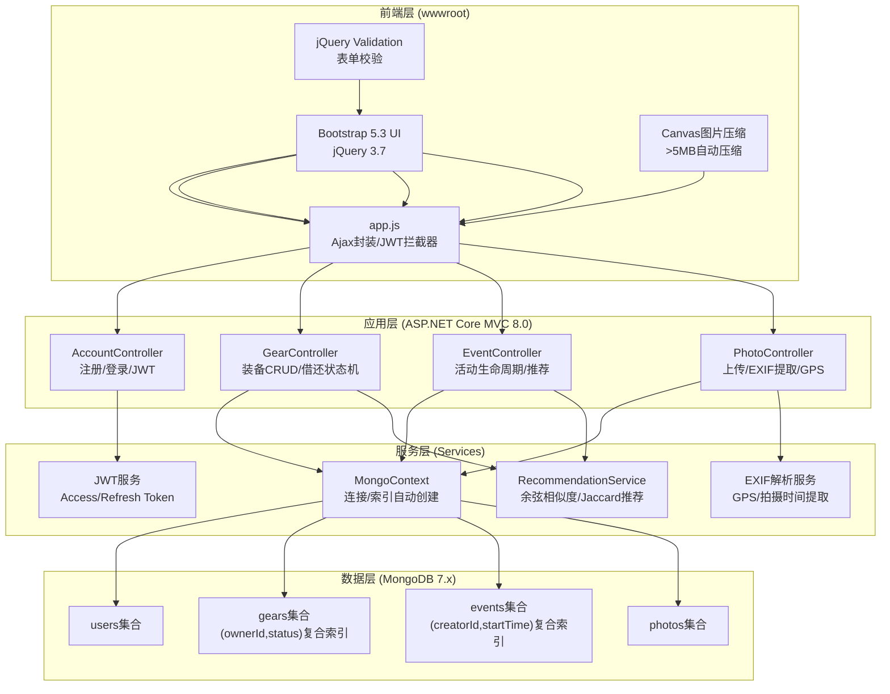
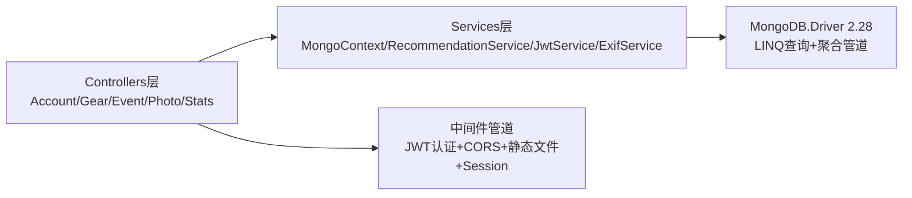

## 1. 架构设计



## 2. 技术说明

| 层级 | 技术栈 | 版本/说明 |
|------|--------|-----------|
| 前端框架 | jQuery + Bootstrap | jQuery 3.7.1 / Bootstrap 5.3.3 |
| 前端校验 | jQuery Validation | 1.20.0 + additional-methods |
| 前端布局 | Masonry.js | 瀑布流布局 (装备/照片墙) |
| 后端框架 | ASP.NET Core MVC | 8.0 (Razor视图引擎) |
| 数据库驱动 | MongoDB.Driver | 2.28.0 |
| 密码哈希 | BCrypt.Net-Next | 4.0.3 |
| JWT认证 | Microsoft.AspNetCore.Authentication.JwtBearer | 8.0.x |
| EXIF解析 | ExifLib.Standard | 3.0.0 (提取GPS/拍摄时间) |
| 图片存储 | 服务器本地文件系统 | wwwroot/uploads/photos |
| 会话管理 | HttpOnly Cookie + localStorage | JWT Access Token 双存储 |
| 并发控制 | Optimistic Concurrency | documents带_version字段 |
| 离线缓存 | Service Worker + IndexedDB | PWA manifest + 增量同步 |

## 3. 路由与视图定义

### 3.1 MVC路由

| 路由 | Controller.Action | 视图文件 | 用途 |
|------|-------------------|----------|------|
| GET / | Home.Index | Views/Home/Index.cshtml | 首页仪表盘 |
| GET /Account/Login | Account.Login | Views/Account/Login.cshtml | 登录页 |
| GET /Account/Register | Account.Register | Views/Account/Register.cshtml | 注册页 |
| GET /Gear | Gear.Index | Views/Gear/Index.cshtml | 装备列表页 |
| GET /Gear/Create | Gear.Create | Views/Gear/Create.cshtml | 添加装备 |
| GET /Gear/Details/{id} | Gear.Details | Views/Gear/Details.cshtml | 装备详情 |
| GET /Event | Event.Index | Views/Event/Index.cshtml | 活动列表 |
| GET /Event/Create | Event.Create | Views/Event/Create.cshtml | 创建活动 |
| GET /Event/Details/{id} | Event.Details | Views/Event/Details.cshtml | 活动详情 |
| GET /Photo | Photo.Index | Views/Photo/Index.cshtml | 照片墙 |
| GET /Stats | Stats.Index | Views/Stats/Index.cshtml | 统计分析 |

### 3.2 Web API路由 (Ajax调用)

| 方法 | 路由 | 用途 | 请求/响应格式 |
|------|------|------|---------------|
| POST | /api/account/login | 登录 | JSON: {email,password} → {token,refreshToken,user} |
| POST | /api/account/register | 注册 | JSON: {email,password,nickname} → {token,refreshToken,user} |
| POST | /api/account/refresh | 刷新JWT | JSON: {refreshToken} → {token,refreshToken} |
| GET | /api/gear | 获取装备列表 | Query: status,category,keyword → JSON array |
| POST | /api/gear | 创建设备 | multipart/form-data → JSON |
| PUT | /api/gear/{id} | 更新装备 | JSON → JSON |
| DELETE | /api/gear/{id} | 删除装备 | - → 204 |
| POST | /api/gear/{id}/lend | 借出装备 | JSON: {borrowerId,dueDate} → JSON |
| POST | /api/gear/{id}/return | 归还装备 | JSON: {condition} → JSON |
| GET | /api/event | 获取活动列表 | Query: status,range → JSON array |
| POST | /api/event | 创建活动 | JSON → JSON |
| PUT | /api/event/{id} | 更新活动 | JSON(带_version) → JSON / 409冲突 |
| GET | /api/event/{id}/recommend | 推荐装备清单 | - → {gearList,purchaseList} |
| POST | /api/event/{id}/rate | 评价营地 | JSON: {交通,风景,设施,安全,月份} → JSON |
| POST | /api/photo/upload | 上传照片 | FormData: files,eventId → JSON array |
| GET | /api/photo/event/{eventId} | 获取活动照片 | - → JSON array(with GPS/time) |
| GET | /api/stats/seasonality | 季节适宜性矩阵 | - → {12×n矩阵} |
| GET | /api/stats/credit | 信用分排名 | - → JSON array |

## 4. 服务端架构



### 4.1 项目目录结构
```
CampHub/
├── Controllers/
│   ├── AccountController.cs      # MVC + API登录注册
│   ├── GearController.cs         # MVC视图 + REST API
│   ├── EventController.cs        # MVC视图 + REST API
│   ├── PhotoController.cs        # MVC视图 + 上传API
│   ├── HomeController.cs         # 首页仪表盘
│   └── StatsController.cs        # 统计分析页
├── Models/
│   ├── Entities.cs               # User/Gear/Event/Photo 实体类
│   ├── DTOs.cs                   # 请求/响应 DTO 定义
│   └── ViewModels.cs             # 强类型Razor视图模型
├── Services/
│   ├── MongoContext.cs           # IMongoDatabase 封装+索引
│   ├── RecommendationService.cs  # 余弦相似度/Jaccard
│   ├── JwtService.cs             # JWT生成+Refresh管理
│   └── ExifService.cs            # EXIF GPS解析
├── Views/
│   ├── Shared/_Layout.cshtml     # 主布局(导航栏+侧边栏)
│   ├── Shared/_PartialNav.cshtml # 左侧导航局部视图
│   ├── Account/Login.cshtml
│   ├── Account/Register.cshtml
│   ├── Home/Index.cshtml
│   ├── Gear/Index.cshtml
│   ├── Gear/Create.cshtml
│   ├── Event/Index.cshtml
│   ├── Event/Create.cshtml
│   ├── Event/Details.cshtml
│   ├── Photo/Index.cshtml
│   └── Stats/Index.cshtml
├── wwwroot/
│   ├── css/site.css              # 自定义样式+主题变量
│   ├── js/app.js                 # Ajax封装/JWT拦截器/压缩
│   ├── js/pages/                 # 各页面独立逻辑
│   ├── lib/                      # jQuery/Bootstrap/Validation CDN fallback
│   ├── uploads/photos/           # 上传图片存储
│   └── manifest.json             # PWA配置
├── Program.cs                    # 启动配置
├── appsettings.json              # 连接字符串/JWT密钥配置
└── CampHub.csproj
```

## 5. 数据模型

### 5.1 ER图

```mermaid
erDiagram
    USER ||--o{ GEAR : owns
    USER ||--o{ BORROW_RECORD : borrows
    USER ||--o{ EVENT : creates
    USER ||--o{ PARTICIPANT : joins
    EVENT ||--o{ PARTICIPANT : has
    EVENT ||--o{ EVENT_GEAR : requires
    EVENT ||--o{ PHOTO : contains
    EVENT ||--o| RATING : has
    GEAR ||--o{ BORROW_RECORD : "lent in"
    GEAR ||--o{ EVENT_GEAR : "used in"
    USER ||--o| CREDIT_LOG : generates

    USER {
        ObjectId _id PK
        string Email
        string PasswordHash
        string Nickname
        string AvatarUrl
        int CreditScore "默认100"
        DateTime CreatedAt
        ObjectId CurrentRefreshTokenId
    }

    GEAR {
        ObjectId _id PK
        ObjectId OwnerId FK
        string Name
        string Category "帐篷/睡袋/炉具等"
        string Description
        string ImageUrl
        string Status "在库/借出/维修/报废"
        decimal PurchasePrice
        int UsageCount
        decimal WearLevel "0-100损耗度"
        DateTime LastMaintenanceDate
        int NextMaintenanceAfterUses
        DateTime CreatedAt
        int _version "乐观并发"
    }

    BORROW_RECORD {
        ObjectId _id PK
        ObjectId GearId FK
        ObjectId LenderId FK
        ObjectId BorrowerId FK
        DateTime BorrowDate
        DateTime DueDate
        DateTime ActualReturnDate
        string ReturnCondition
        int CreditChange
        string Notes
    }

    EVENT {
        ObjectId _id PK
        ObjectId CreatorId FK
        string Title
        string Destination
        decimal[] GeoLocation "lng,lat"
        DateTime StartTime UTC
        DateTime EndTime UTC
        int MaxParticipants
        string Status "筹备/进行/结束/归档"
        int _version "乐观并发"
        DateTime CreatedAt
    }

    PARTICIPANT {
        ObjectId EventId FK
        ObjectId UserId FK
        string Role "厨师/司机/摄影/参与者"
        bool Confirmed
        DateTime JoinedAt
    }

    EVENT_GEAR {
        ObjectId EventId FK
        ObjectId GearId FK "可为空表示公共清单"
        string Name
        string Category
        int Quantity
        ObjectId BroughtByUserId FK
        bool Checked
    }

    PHOTO {
        ObjectId _id PK
        ObjectId EventId FK
        ObjectId UploaderId FK
        string FileUrl
        string ThumbUrl
        decimal GPS_Lat
        decimal GPS_Lng
        DateTime TakenAt UTC
        DateTime UploadedAt
    }

    RATING {
        ObjectId EventId PK
        ObjectId UserId FK
        int TransportationScore "1-5"
        int SceneryScore "1-5"
        int FacilityScore "1-5"
        int SafetyScore "1-5"
        string Season "1-12月"
        string Comments
    }

    CREDIT_LOG {
        ObjectId _id PK
        ObjectId UserId FK
        int Delta
        string Reason
        DateTime CreatedAt
    }
```

### 5.2 索引配置 (MongoContext.cs 自动创建)

```javascript
// gears 集合
db.gears.createIndex({ ownerId: 1, status: 1 });
db.gears.createIndex({ category: 1 });
db.gears.createIndex({ name: "text", description: "text" });

// events 集合
db.events.createIndex({ creatorId: 1, startTime: 1 });
db.events.createIndex({ status: 1, startTime: 1 });
db.events.createIndex({ "participants.userId": 1 });

// photos 集合
db.photos.createIndex({ eventId: 1, takenAt: 1 });
db.photos.createIndex({ uploaderId: 1 });

// borrow_records 集合
db.borrow_records.createIndex({ gearId: 1, actualReturnDate: 1 });
db.borrow_records.createIndex({ borrowerId: 1, dueDate: 1 });
```

### 5.3 信用分规则
| 事件 | 分值变化 | 触发条件 |
|------|----------|----------|
| 按时归还 | +5 | ActualReturnDate ≤ DueDate |
| 逾期归还 | -2/天 | 每超一天额外扣2分 |
| 丢失/报废 | -20 | 状态标记为报废且非自然损耗 |
| 注册初始值 | 100 | 新用户创建时 |
| 低于60分 | 失去借出优先权 | 借出申请排序时降权 |
