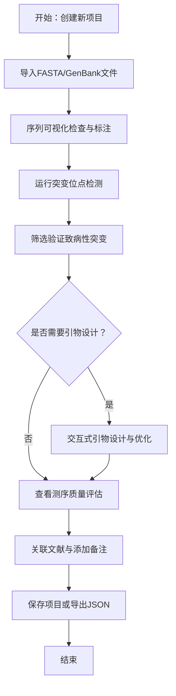
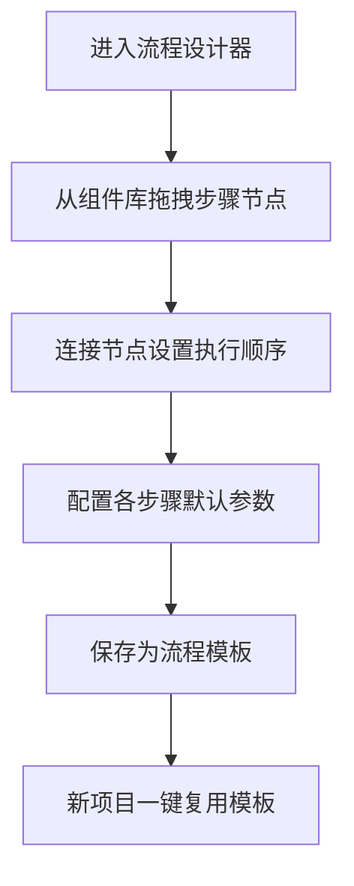

## 1. 产品概述

基因检测分析工作站（GeneWorkstation）是一款面向生物医学研究人员的本地端基因序列分析一体化平台，整合序列可视化、突变检测、引物设计、质量评估四大核心功能，解决研究人员在多个分散工具间切换、数据管理混乱的痛点。

- **目标用户**：生物医学研究院基因检测中心研究人员、临床分子诊断专家
- **核心价值**：统一工作流、本地数据安全、可定制分析流程、零年费成本
- **处理规模**：日均200份临床样本，单份约2MB基因序列数据

## 2. 核心功能

### 2.1 用户角色

| 角色 | 注册方式 | 核心权限 |
|------|----------|----------|
| 研究员 | 本地启动即使用 | 全部分析功能、项目管理、流程模板创建 |
| 访客 | 无 | 仅查看已分享的分析结果导出文件 |

### 2.2 功能模块

1. **项目导航栏**：项目列表、历史搜索、分析流程模板入口
2. **序列可视化视图**：序列渲染、缩放平移、框选区域、注释标注
3. **突变面板视图**：突变位点列表、致病性分级、筛选过滤、文献关联
4. **引物设计视图**：引物参数配置、可视化拖拽、实时特性计算、订购表单
5. **质量图表视图**：Per-base质量图、GC含量分布、序列长度直方图
6. **工具面板**：根据当前视图动态切换参数配置
7. **流程设计器**：拖拽组合分析步骤、保存自定义流程模板
8. **数据导入导出**：FASTA/GenBank文件导入、JSON会话导出恢复

### 2.3 页面详情

| 页面名称 | 模块名称 | 功能描述 |
|----------|----------|----------|
| 主工作台 | 左侧项目导航 | 项目CRUD、搜索、流程模板入口 |
| 主工作台 | 中间Tab区域 | 四个核心分析视图切换、文件上传入口 |
| 主工作台 | 右侧工具面板 | 当前Tab的参数配置、阈值调节 |
| 序列可视化 | SequenceCanvas | 核苷酸/氨基酸双模式渲染、滚轮缩放、拖拽平移 |
| 序列可视化 | AnnotationLayer | 自定义注释标签、荧光色高亮、持久化存储 |
| 序列可视化 | RulerAxis | 碱基坐标刻度、比例尺显示 |
| 突变面板 | MutationList | SNP/Indel表格展示、致病性颜色分级 |
| 突变面板 | MutationFilter | 按类型、致病性、染色体区域筛选 |
| 突变面板 | MutationDetail | 突变详情、验证备注、DOI关联 |
| 引物设计 | PrimerCanvas | 可视化引物位置、拖拽调整 |
| 引物设计 | PrimerConfig | 产物长度、Tm值、GC含量参数配置 |
| 引物设计 | PrimerTable | 引物列表、特性计算、订购导出 |
| 质量图表 | QualityChart | D3.js三类图表渲染、低质量区域标注 |
| 流程设计器 | WorkflowCanvas | React-DnD拖拽组合步骤节点 |

## 3. 核心流程

用户从样本导入到生成分析报告的完整工作流：

自定义分析流程创建流程：

## 4. 用户界面设计

### 4.1 设计风格

- **主题方向**：深色专业生物信息学主题，科技感与可读性并重
- **主色系统**：
  - 背景色：`#0d1117`（深空灰黑）、`#161b22`（面板深灰）
  - 强调色：`#58a6ff`（信息蓝）、`#f0883e`（警示橙）、`#ff7b72`（危险红）
  - 序列专用配色：A=`#3fb950`（绿）、T=`#f85149`（红）、C=`#58a6ff`（蓝）、G=`#d29922`（黄）
  - 突变荧光色系：致病=`#ff00aa`、可能致病=`#ff7b00`、良性=`#00ffcc`
- **按钮样式**：圆角4px、2px描边、hover态微弱发光效果
- **字体**：标题使用 `JetBrains Mono` 等宽字体、正文使用 `Inter` 无衬线、序列渲染强制等宽字体
- **布局风格**：三栏固定布局 + 卡片式模块、ResizablePanel拖拽调整宽度
- **图标风格**：线性描边图标（Lucide/Feather风格），生物信息学专用图标（DNA双螺旋、引物、染色体）

### 4.2 页面设计概述

| 页面名称 | 模块名称 | UI元素 |
|----------|----------|--------|
| 主工作台 | 左侧导航 | 280px固定宽、项目列表树状结构、搜索框、新建按钮、渐变发光分隔线 |
| 主工作台 | 中间Tab区 | Ant Design Tabs、每个Tab内容区可独立滚动、序列画布支持全屏模式 |
| 主工作台 | 右侧面板 | 300px固定宽、Accordion折叠分组、滑块+数值输入联动 |
| 序列可视化 | SequenceCanvas | Canvas高性能渲染、滚轮缩放动画、框选半透明遮罩、坐标跟随tooltip |
| 突变面板 | MutationList | 斑马行表格、致病性色点标签、行hover详情浮层渐显 |
| 引物设计 | PrimerCanvas | 双股DNA可视化、引物箭头形状、拖拽手柄发光反馈 |
| 质量图表 | QualityChart | D3.js SVG图表、坐标轴动画、brush区域选择 |
| 流程设计器 | WorkflowCanvas | 节点卡片、贝塞尔曲线连线、拖拽幽灵效果 |

### 4.3 响应式

- **1440px及以上**：三栏完整显示（左280px + 中间自适应 + 右300px）
- **1024px-1440px**：自动隐藏右侧工具面板，可通过按钮临时展开
- **768px-1024px**：隐藏左侧导航栏，侧滑抽屉呼出
- **768px以下**：单栏堆叠布局，Tab底部导航

### 4.4 动效与微交互

- 序列缩放：`cubic-bezier(0.4, 0, 0.2, 1)` 缓动，150ms平滑过渡
- Tab切换：内容区淡入 + 轻微上移动画
- 突变标注hover：详情卡片从标注点弹出，渐显 + scale(0.95→1)
- Toast通知：从顶部下滑进入，自动消失时淡出
- 引物拖拽：被拖拽元素半透明 + 蓝色发光边框阴影
