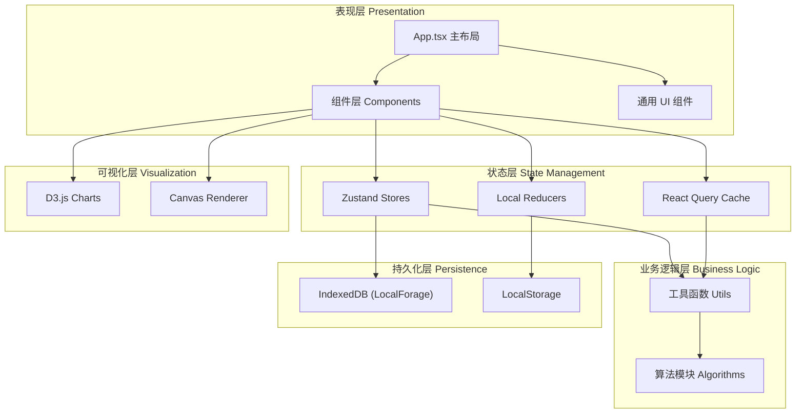
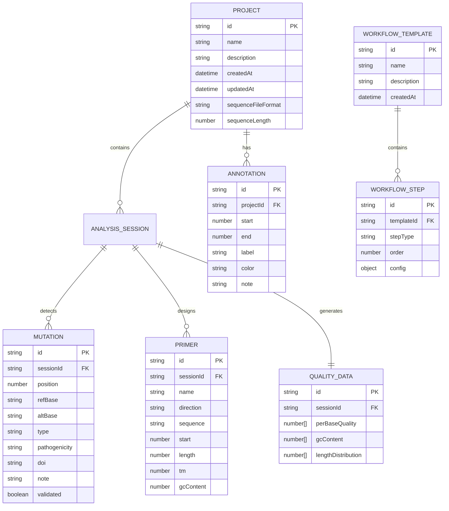

## 1. 架构设计



## 2. 技术描述

- **前端框架**：React 18.2.0 + TypeScript 5.0+
- **构建工具**：Vite 4.3+（配置HMR、代码分割、资源优化）
- **状态管理**：Zustand 4.4（全局store）+ React Query 5.0（异步数据）+ useReducer（局部复杂状态）
- **UI组件库**：Ant Design 5.0（ConfigProvider定制深色主题）
- **数据可视化**：D3.js 7.8（图表）+ HTML5 Canvas（高性能序列渲染）
- **拖拽交互**：React-DnD 16.0（工作流设计器、引物拖拽）
- **代码编辑**：Monaco Editor 0.44（注释编辑、高级搜索）
- **本地存储**：LocalForage 1.10（IndexedDB封装，支持500+项目记录）
- **样式方案**：CSS Modules + CSS Variables（主题切换）

## 3. 目录结构

```
src/
├── components/
│   ├── common/              # 通用组件
│   │   ├── FileUploader.tsx
│   │   ├── TabContainer.tsx
│   │   ├── ResizablePanel.tsx
│   │   └── ToastNotification.tsx
│   ├── sequence-viewer/     # 序列可视化
│   │   ├── SequenceViewer.tsx
│   │   ├── SequenceCanvas.tsx
│   │   ├── SelectionLayer.tsx
│   │   ├── AnnotationLayer.tsx
│   │   └── RulerAxis.tsx
│   ├── mutation-panel/      # 突变面板
│   │   ├── MutationPanel.tsx
│   │   ├── MutationList.tsx
│   │   ├── MutationFilter.tsx
│   │   └── MutationDetail.tsx
│   ├── primer-designer/     # 引物设计
│   │   ├── PrimerDesigner.tsx
│   │   ├── PrimerCanvas.tsx
│   │   ├── PrimerConfig.tsx
│   │   └── PrimerTable.tsx
│   ├── quality-chart/       # 质量图表
│   │   └── QualityChart.tsx
│   ├── project-sidebar/     # 项目导航
│   │   └── ProjectSidebar.tsx
│   ├── tool-panel/          # 工具面板
│   │   └── ToolPanel.tsx
│   └── workflow-designer/   # 流程设计器
│       └── WorkflowDesigner.tsx
├── stores/
│   ├── analysisStore.ts     # 分析会话状态
│   └── projectStore.ts      # 项目与流程模板状态
├── utils/
│   ├── sequenceParser.ts    # FASTA/GenBank解析
│   ├── sequenceAligner.ts   # Smith-Waterman比对
│   ├── mutationDetector.ts  # 突变检测算法
│   ├── primerCalculator.ts  # 引物特性计算
│   ├── qualityAnalyzer.ts   # 质量评估
│   └── storage.ts           # LocalForage封装
├── types/
│   └── index.ts             # TypeScript类型定义
├── hooks/
│   ├── useCanvasRender.ts   # Canvas渲染Hook
│   ├── useDebounce.ts       # 防抖Hook
│   └── useResizeObserver.ts # 尺寸监听Hook
├── styles/
│   ├── variables.css        # CSS变量（主题色）
│   └── global.css           # 全局样式
├── App.tsx
├── main.tsx
└── vite-env.d.ts
```

## 4. 路由定义

| 路由 | 用途 |
|------|------|
| `/` | 主工作台，默认路由 |
| `/project/:projectId` | 指定项目工作台 |
| `/workflow` | 流程模板设计器 |
| `/workflow/:templateId` | 编辑指定流程模板 |

（注：使用HashRouter以支持纯静态文件部署，无需服务端路由配置）

## 5. 数据模型

### 5.1 核心数据模型定义



### 5.2 Zustand Store 接口定义

```typescript
// analysisStore.ts
interface AnalysisState {
  currentSequence: SequenceData | null;
  viewMode: 'nucleotide' | 'aminoacid';
  viewport: { start: number; end: number; zoom: number; offset: number };
  selection: { start: number; end: number } | null;
  mutations: Mutation[];
  primers: Primer[];
  qualityData: QualityData | null;
  annotations: Annotation[];
  activeTab: 'sequence' | 'mutation' | 'primer' | 'quality';
  
  setSequence: (seq: SequenceData) => void;
  setViewport: (vp: Partial<Viewport>) => void;
  setSelection: (sel: Selection | null) => void;
  addMutation: (m: Mutation) => void;
  updateMutation: (id: string, patch: Partial<Mutation>) => void;
  addPrimer: (p: Primer) => void;
  removePrimer: (id: string) => void;
  addAnnotation: (a: Annotation) => void;
  setActiveTab: (tab: ActiveTab) => void;
}

// projectStore.ts
interface ProjectState {
  projects: Project[];
  currentProjectId: string | null;
  templates: WorkflowTemplate[];
  searchQuery: string;
  
  createProject: (name: string) => Project;
  deleteProject: (id: string) => void;
  renameProject: (id: string, name: string) => void;
  setCurrentProject: (id: string) => void;
  saveTemplate: (tpl: WorkflowTemplate) => void;
  exportSession: (projectId: string) => string;
  importSession: (json: string) => Project;
}
```

## 6. 性能优化策略

| 优化目标 | 实现方案 |
|----------|----------|
| 序列渲染60fps | Canvas离屏渲染 + requestAnimationFrame + 虚拟滚动仅渲染可视区域 |
| 10MB序列加载 | WebWorker后台解析 + 分片处理 + 进度条回调 |
| 突变检测<3s | 优化Smith-Waterman使用TypedArray + 可配置分块并行 |
| 引物计算<100ms | 公式向量化计算 + useMemo缓存中间结果 |
| IndexedDB 500+项目 | LocalForage分库存储 + 索引优化 + 懒加载项目元数据 |
| 首屏<3s | Vite代码分割 + 路由级懒加载 + 关键CSS内联 |
| 内存<2GB | 序列数据分片引用 + Canvas显存管理 + 组件卸载时释放资源 |

## 7. 第三方依赖清单

```json
{
  "dependencies": {
    "react": "^18.2.0",
    "react-dom": "^18.2.0",
    "react-router-dom": "^6.20.0",
    "zustand": "^4.4.7",
    "@tanstack/react-query": "^5.8.4",
    "antd": "^5.12.0",
    "@ant-design/icons": "^5.2.6",
    "d3": "^7.8.5",
    "@types/d3": "^7.4.3",
    "react-dnd": "^16.0.1",
    "react-dnd-html5-backend": "^16.0.1",
    "@monaco-editor/react": "^4.6.0",
    "monaco-editor": "^0.44.0",
    "localforage": "^1.10.0",
    "dayjs": "^1.11.10"
  },
  "devDependencies": {
    "@types/react": "^18.2.42",
    "@types/react-dom": "^18.2.17",
    "@vitejs/plugin-react": "^4.2.1",
    "typescript": "^5.3.2",
    "vite": "^4.5.1"
  }
}
```
