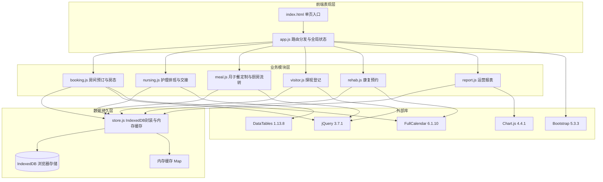
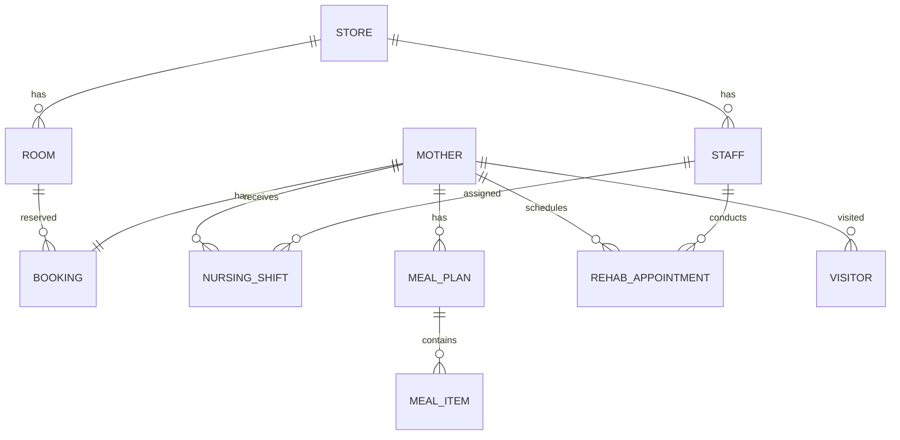

## 1. 架构设计

本系统为纯前端单页应用（SPA），无后端服务，所有数据持久化依赖浏览器端 IndexedDB，支持离线使用7天数据缓存。



### 数据流架构

用户操作触发 jQuery 事件 → 模块处理业务逻辑 → store.js 更新 IndexedDB → 内存缓存失效 → 视图重新渲染。所有模块通过 store.js 统一数据访问层，避免直接操作 IndexedDB。

## 2. 技术说明

- **前端框架**：jQuery 3.7.1（DOM操作与事件驱动）+ Bootstrap 5.3.3（响应式布局与组件库）
- **初始化工具**：纯静态文件，无需构建工具，直接用浏览器打开 index.html
- **数据表格**：DataTables 1.13.8（排班表、报表列表的分页、排序、搜索）
- **图表渲染**：Chart.js 4.4.1（运营报表混合图表：柱状图+折线图+饼图）
- **日历组件**：FullCalendar 6.1.10（房态月历视图、康复预约日历视图、拖拽调整）
- **数据持久化**：IndexedDB（主存储，支持10万条记录）+ localStorage（配置与登录态）+ 内存 Map 缓存（高频读取加速）
- **后端**：无（纯前端离线应用）
- **数据库**：IndexedDB 浏览器端存储，含内存缓存层

### 性能优化策略

- 房态看板：虚拟化渲染可视区域房间，IndexedDB游标分批加载，渲染<500ms
- 护理排班：拖拽操作只更新内存缓存，异步写入IndexedDB，响应<100ms
- 报表统计：Web Worker后台计算聚合数据，计算<3秒
- 内存缓存：Map结构存储热点数据，读取命中缓存避免IndexedDB IO

## 3. 路由定义

| 路由Hash | 模块 | 页面用途 |
|----------|------|----------|
| #/login | - | 登录页，工号密码登录与门店选择 |
| #/dashboard | booking.js | 房态看板，月历热力图与房间预订管理 |
| #/nursing | nursing.js | 护理排班周视图与交接班记录 |
| #/meal | meal.js | 月子餐体质辨证与厨房制作看板 |
| #/visitor | visitor.js | 探视登记与时段预约管理 |
| #/rehab | rehab.js | 康复预约日历与进度追踪 |
| #/report | report.js | 运营数据驾驶盘与报表分析 |

路由通过 `window.location.hash` 变化触发 `app.js` 中的 hashchange 监听器，动态加载对应模块的 HTML 模板并执行初始化逻辑。

## 4. 数据模型

### 4.1 数据模型定义



### 4.2 IndexedDB 对象仓库定义

```
// 门店仓库
store: { id, name, address, phone, suiteLuxuryCount, suiteStandardCount }

// 房间仓库
room: { id, storeId, roomNumber, type(luxury/standard), status(idle/booked/occupied/maintenance) }

// 产妇仓库
mother: { id, name, phone, constitution(qi/blood/yin/yang), checkInDate, checkOutDate, roomId, storeId,禁忌食材[] }

// 预订仓库
booking: { id, roomId, storeId, motherId, startDate, endDate, status, createdAt }

// 员工仓库
staff: { id, storeId, name, role(manager/nurse/nutritionist/rehab), qualifications[], phone }

// 护理排班仓库
nursing_shift: { id, storeId, staffId, motherId, shiftDate, shiftType(day/night), status, handoverNote, signedBy }

// 月子餐食谱仓库
meal_plan: { id, motherId, date, meals[{type,items[],status,completedAt}] }

// 餐品项仓库
meal_item: { id, planId, mealType, name, ingredients[], status(pending/cooking/delivered), scanCode }

// 探视记录仓库
visitor: { id, motherId, roomId, visitorName, relation, visitDate, timeSlot, photo, checkInTime, checkOutTime, status }

// 康复预约仓库
rehab_appointment: { id, motherId, staffId, storeId, projectType(pelvic/abdominal/breast/tcm), startTime, duration, status, progressNote }

// 运营日志仓库（用于报表统计）
operation_log: { id, storeId, date, type, data }
```

### 4.3 索引定义

```
// 高频查询索引
room: storeId, status, type
booking: roomId, storeId, startDate, endDate, status
nursing_shift: staffId, storeId, shiftDate, shiftType
meal_plan: motherId, date
rehab_appointment: staffId, storeId, startTime, motherId
visitor: motherId, visitDate, timeSlot
operation_log: storeId, date, type
```

### 4.4 初始种子数据

系统初始化时写入以下种子数据：
- 8家门店信息
- 8×15=120间豪华套房 + 8×35=280间标准套房
- 每门店：1店长 + 1护理主管 + 20护士 + 3营养师 + 4康复师 + 15月嫂
- 模拟30天预订与入住数据用于看板展示
- 模拟1周护理排班数据
- 模拟当日月子餐制作看板数据
- 模拟当日探视预约数据
- 模拟1周康复预约数据
- 模拟近3个月运营日志数据用于报表
