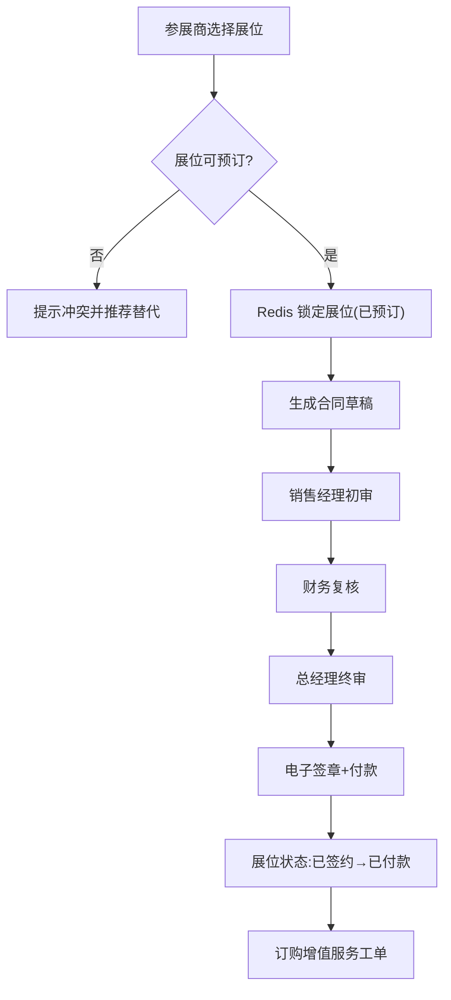

# 会展中心运营管理系统 PRD

> 版本 v1.0 · 区域会展中心数字化运营平台

## 1. 产品概述

面向运营 2 个大型展馆（共 8 万㎡）、年均 40 场展会的区域会展中心，构建覆盖"筹备 → 招商 → 进行 → 结束"全生命周期的在线化、数据化、智能化运营平台。系统打通主办方、参展商、服务商、观众四方角色，解决展位分配靠 Excel 手工标注易冲突、合同纸质流转效率低、现场服务靠对讲机缺乏统筹、观众手写登记数据难利用、展会效果评估凭经验估算五大痛点。

- **目标用户**：主办方（运营 / 销售经理 / 财务 / 总经理）、参展商、服务商、现场观众
- **核心价值**：展位出租率与签约额可视化提升；观众数据资产化沉淀；服务工单在线统筹调度；展后生成量化满意度分析报告

## 2. 核心功能

### 2.1 用户角色

| 角色 | 注册/登录方式 | 核心权限 |
|------|---------------|----------|
| 主办方-运营 | 账号分配 | 创建展会、划分展位、发布状态、查看数据看板 |
| 主办方-销售经理 | 账号分配 | 招商签约、合同初审、调用智能分配推荐 |
| 主办方-财务 / 总经理 | 账号分配 | 合同多级审批、收款确认 |
| 参展商 | 在线注册 | 选位预订、订购增值服务、查看/签署合同、现场签到 |
| 服务商 | 账号分配 | 接单、反馈工单完成进度 |
| 观众 | 线上购票 / 现场登记 | 购票、二维码电子票入场 |

### 2.2 功能模块

1. **展会管理**：创建展会定义名称、类型、展期、场馆分区；设置展位规格与价格梯度；发布展会状态（筹备中、招商中、进行中、已结束）。
2. **展位管理**：在场馆 SVG 平面图上可视化划分展位区域，标注展位类型（标准展位、光地）、面积、朝向、价格，实时展示状态（可预订、已预订、已签约、已付款）。
3. **智能分配**：根据参展商行业属性、参展面积需求、预算范围推荐最优展位组合，处理相邻展位优先锁定、同行业区域聚集等分配规则。
4. **合同管理**：在线生成展位租赁合同，支持电子签章，设置多级审批流程（销售经理、财务、总经理），追踪合同状态变更历史。
5. **服务工单**：参展商在线订购电箱、水电气、网络、吊装、保洁等增值服务，服务商接单并反馈完成状态，展期内实时监控工单进度。
6. **观众登记**：线上预售门票支持二维码电子票，现场扫码登记采集观众身份信息，统计实时入场人数和观众画像数据。
7. **数据看板**：展会期间实时展示展位出租率、合同签约额、观众流量热力图、服务工单完成率，展后生成参展商满意度分析报告。

### 2.3 页面详情

| 页面名称 | 模块名称 | 功能描述 |
|----------|----------|----------|
| 工作台首页 | 顶部展会切换条 + 角色快捷入口 | 显示当前展会名称与状态标签，按角色展示待办与核心指标卡片 |
| 展会管理 | 展会列表 / 创建展会表单 / 状态看板 | 列表分页、按状态筛选；表单分组折叠；一键发布状态 |
| 展位管理 | SVG 平面图 / 展位详情侧栏 / 批量操作工具栏 | 颜色填充状态、点击查看详情、拖拽框选批量预订/释放 |
| 智能分配 | 需求录入表单 / 推荐结果列表 | 录入行业/面积/预算，返回排序后的展位组合与匹配度 |
| 合同管理 | 合同列表 / 合同编辑模态框 / 审批轨迹 | 模态框浮层、字段分组折叠、手写签章区、审批时间轴 |
| 服务工单 | 工单看板 / 工单详情 | 看板分列（待接单/进行中/已完成），服务商接单与进度反馈 |
| 观众登记 | 购票表单 / 电子票 / 现场扫码登记 | 移动端触屏适配、表单自动聚焦、二维码展示与核销 |
| 数据看板 | KPI 卡片 / Chart.js 图表 / 热力图 | 出租率、签约额趋势、观众流量热力图、工单完成率 |

## 3. 核心流程

### 3.1 展会全生命周期

### 3.2 展位预订 → 合同签约链路

## 4. 用户界面设计

### 4.1 设计风格

- **主色系**：会展品牌深蓝 `#0B2A4A` 为主基调，活力橙 `#FF6A13` 为高对比强调色（用于重要操作按钮与关键数据）。
- **状态色**：可预订 `#16A34A`（绿）、已预订 `#F59E0B`（黄）、已签约 `#2563EB`（蓝）、已付款 `#7C3AED`（紫）、锁定 `#9CA3AF`（灰）。
- **按钮**：Bootstrap 圆角按钮，重要操作橙色实心高对比，次要操作描边。
- **字体**：标题用思源黑体 / Inter Display，正文用系统无衬线；KPI 数字用等宽强调。
- **布局**：左侧垂直角色导航栏 + 顶部展会名称与状态标签条 + 右侧卡片式工作区。
- **图标**：Bootstrap Icons，扁平线性风格。

### 4.2 页面设计概览

| 页面名称 | 模块名称 | UI 元素（样式 / 布局 / 配色 / 字体 / 动效） |
|----------|----------|----------------------------------------------|
| 工作台首页 | 顶部状态条 | 深蓝渐变背景、橙色状态标签、展会切换下拉、KPI 卡片淡入上浮 |
| 展位管理 | SVG 平面图 | 展位色块 + hover 高亮描边 + 拖拽框选虚线选区、侧栏滑入 |
| 合同编辑 | 模态框浮层 | 半透明遮罩、字段分组折叠手风琴、签章区手写笔迹动画 |
| 数据看板 | Chart.js 图表 | 卡片栅格、趋势折线渐变填充、热力图色阶、数字滚动计数动效 |

### 4.3 响应式

桌面优先设计；**观众登记页**适配移动端触屏操作，表单字段自动聚焦减少点击次数，二维码大尺寸居中便于扫码；展位管理平面图支持鼠标拖拽与滚轮缩放。
