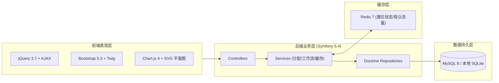
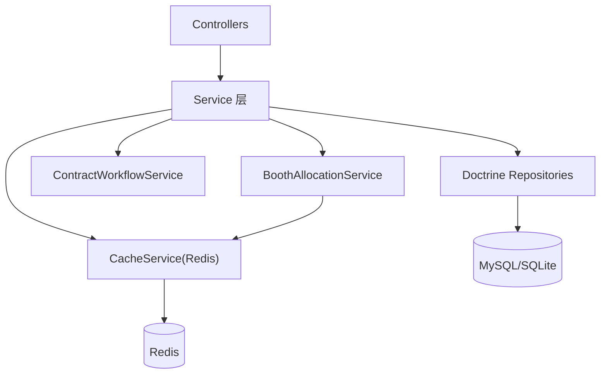
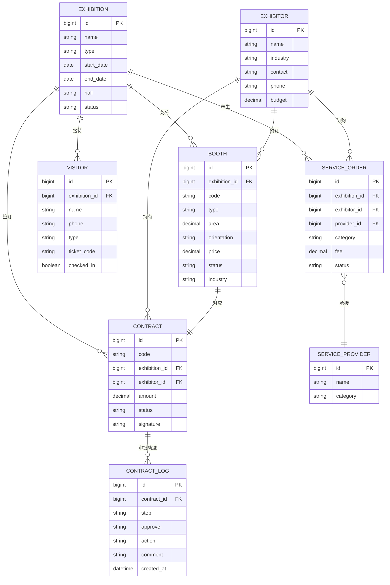

# 会展中心运营管理系统 技术架构文档

> 版本 v1.0 · 技术栈：jQuery 3.7 + Bootstrap 5.3 + PHP 8.2/Symfony 6.4 + Redis 7 + MySQL

## 1. 架构设计



数据流向：用户通过前端表单提交请求，经 jQuery AJAX 发送至 Symfony 路由；控制器调用业务服务层处理逻辑；Redis 缓存热点展位状态与观众流量统计；MySQL（本地演示用 SQLite）持久化业务数据；Twig 模板渲染响应页面。

## 2. 技术说明

- **前端**：jQuery 3.7.x（AJAX + 交互）、Bootstrap 5.3.x（布局与组件）、Chart.js 4.x（看板图表）、SVG（场馆平面图）、Twig（服务端模板）。
- **后端**：PHP 8.2+ / Symfony 6.4，使用 Doctrine ORM、Form 组件、Validator、TwigBundle。
- **缓存**：Redis 7.x，缓存展位实时状态与观众统计数据（`booth:status:{id}`、`visitor:flow:{exId}`）。
- **数据库**：MySQL 8 生产环境；本地演示用 SQLite（Doctrine 抽象驱动切换），Schema 兼容两者。
- **运行**：`php -S 127.0.0.1:8000 -t public`（Symfony CLI 未安装时使用内置服务器）。
- **构建**：Composer。

## 3. 路由定义

| 路由 | 方法 | 用途 |
|------|------|------|
| `/` | GET | 工作台首页 |
| `/exhibition` | GET | 展会列表 |
| `/exhibition/new` | GET/POST | 创建展会 |
| `/exhibition/{id}` | GET | 展会详情 |
| `/exhibition/{id}/status` | POST | 切换展会状态 |
| `/booth/{exhibitionId}` | GET | 展位平面图管理 |
| `/booth/{exhibitionId}/allocate` | POST | 智能分配推荐 |
| `/booth/{id}/reserve` | POST | 预订/释放展位（Redis 锁定） |
| `/contract` | GET | 合同列表 |
| `/contract/new` | GET/POST | 生成合同 |
| `/contract/{id}/approve` | POST | 审批流转 |
| `/contract/{id}/sign` | POST | 电子签章 |
| `/service` | GET | 服务工单看板 |
| `/service/{id}/accept` | POST | 服务商接单 |
| `/service/{id}/progress` | POST | 反馈进度 |
| `/visitor/register` | GET/POST | 观众登记（移动端） |
| `/visitor/ticket/{code}` | GET | 电子票核销 |
| `/visitor/checkin` | POST | 现场扫码入场 |
| `/dashboard/{exhibitionId}` | GET | 实时数据看板 |

## 4. API 定义

关键 AJAX 接口（jQuery 调用，返回 JSON）：

```php
// 展位预订：POST /booth/{id}/reserve
Request:  { "exhibitor_id": int, "lock": bool }
Response: { "ok": bool, "status": "reserved|paid", "message": string }

// 智能分配：POST /booth/{exhibitionId}/allocate
Request:  { "industry": string, "area_min": int, "area_max": int, "budget": int }
Response: { "suggestions": [ { "booth_ids": [int], "total_area": int, "total_price": int, "score": float } ] }

// 合同审批：POST /contract/{id}/approve
Request:  { "action": "approve|reject", "approver": string, "comment": string }
Response: { "ok": bool, "current_step": string, "status": string }

// 观众入场：POST /visitor/checkin
Request:  { "code": string }
Response: { "ok": bool, "visitor": { "name": string, "type": string }, "flow": int }

// 看板数据：GET /dashboard/{exhibitionId}/stats
Response: { "occupancy": float, "contract_amount": int, "visitor_flow": int, "wo_completion": float, "flow_series": [int], "heatmap": [[int,int,int]] }
```

## 5. 服务架构图



- **ExhibitionController** → 展会全生命周期管理
- **BoothController** → 展位划分与预订（实时状态走 Redis）
- **ContractController** → 合同签订与审批流程
- **ServiceController** → 现场服务工单调度
- **VisitorController** → 观众登记与票务
- **BoothAllocationService** → 展位智能分配算法
- **ContractWorkflowService** → 合同审批状态机

## 6. 数据模型

### 6.1 ER 图



### 6.2 数据定义语言（DDL，MySQL 兼容）

```sql
CREATE TABLE exhibition (
  id          BIGINT AUTO_INCREMENT PRIMARY KEY,
  name        VARCHAR(120) NOT NULL,
  type        VARCHAR(40)  NOT NULL,
  start_date  DATE NOT NULL,
  end_date    DATE NOT NULL,
  hall        VARCHAR(60) NOT NULL,
  status      VARCHAR(20) NOT NULL DEFAULT 'preparing',
  created_at  DATETIME NOT NULL
);

CREATE TABLE booth (
  id            BIGINT AUTO_INCREMENT PRIMARY KEY,
  exhibition_id BIGINT NOT NULL,
  code          VARCHAR(30) NOT NULL,
  type          VARCHAR(20) NOT NULL,
  area          DECIMAL(8,2) NOT NULL,
  orientation   VARCHAR(20),
  price         DECIMAL(10,2) NOT NULL,
  status        VARCHAR(20) NOT NULL DEFAULT 'available',
  industry      VARCHAR(40),
  x             INT NOT NULL,
  y             INT NOT NULL,
  w             INT NOT NULL,
  h             INT NOT NULL,
  FOREIGN KEY (exhibition_id) REFERENCES exhibition(id),
  UNIQUE KEY uk_exh_code (exhibition_id, code),
  KEY idx_status (exhibition_id, status)
);

CREATE TABLE exhibitor (
  id       BIGINT AUTO_INCREMENT PRIMARY KEY,
  name     VARCHAR(120) NOT NULL,
  industry VARCHAR(40)  NOT NULL,
  contact  VARCHAR(60),
  phone    VARCHAR(30),
  budget   DECIMAL(12,2)
);

CREATE TABLE contract (
  id            BIGINT AUTO_INCREMENT PRIMARY KEY,
  code          VARCHAR(40) NOT NULL,
  exhibition_id BIGINT NOT NULL,
  exhibitor_id  BIGINT NOT NULL,
  booth_id      BIGINT NOT NULL,
  amount        DECIMAL(12,2) NOT NULL,
  status        VARCHAR(20) NOT NULL DEFAULT 'draft',
  signature     LONGTEXT,
  created_at    DATETIME NOT NULL,
  FOREIGN KEY (exhibition_id) REFERENCES exhibition(id),
  FOREIGN KEY (exhibitor_id)  REFERENCES exhibitor(id),
  FOREIGN KEY (booth_id)      REFERENCES booth(id)
);

CREATE TABLE contract_log (
  id          BIGINT AUTO_INCREMENT PRIMARY KEY,
  contract_id BIGINT NOT NULL,
  step        VARCHAR(30) NOT NULL,
  approver    VARCHAR(60),
  action      VARCHAR(20) NOT NULL,
  comment     TEXT,
  created_at  DATETIME NOT NULL,
  FOREIGN KEY (contract_id) REFERENCES contract(id)
);

CREATE TABLE service_provider (
  id       BIGINT AUTO_INCREMENT PRIMARY KEY,
  name     VARCHAR(120) NOT NULL,
  category VARCHAR(40)  NOT NULL
);

CREATE TABLE service_order (
  id            BIGINT AUTO_INCREMENT PRIMARY KEY,
  exhibition_id BIGINT NOT NULL,
  exhibitor_id  BIGINT NOT NULL,
  provider_id   BIGINT,
  category      VARCHAR(40) NOT NULL,
  fee           DECIMAL(10,2) NOT NULL,
  status        VARCHAR(20) NOT NULL DEFAULT 'pending',
  created_at    DATETIME NOT NULL,
  FOREIGN KEY (exhibition_id) REFERENCES exhibition(id),
  FOREIGN KEY (exhibitor_id)  REFERENCES exhibitor(id),
  FOREIGN KEY (provider_id)   REFERENCES service_provider(id)
);

CREATE TABLE visitor (
  id            BIGINT AUTO_INCREMENT PRIMARY KEY,
  exhibition_id BIGINT NOT NULL,
  name          VARCHAR(60),
  phone         VARCHAR(30),
  type          VARCHAR(20),
  ticket_code   VARCHAR(64) NOT NULL,
  checked_in    TINYINT(1) NOT NULL DEFAULT 0,
  created_at    DATETIME NOT NULL,
  FOREIGN KEY (exhibition_id) REFERENCES exhibition(id),
  KEY idx_code (ticket_code)
);
```

### 性能约束实现要点

- 展位状态查询 ≤200ms：`BoothController` 优先读 Redis 缓存 `booth:status:{exhibitionId}`，未命中回源 MySQL 并回写。
- 观众登记 ≥300 人次/分钟：现场扫码登记写 Redis 计数器 `visitor:flow:{exhibitionId}`，异步落库；`checkin` 走 Redis 原子 `INCR`。
- 单场数据规模：500 展位 / 400 参展商 / 5000 工单 / 3 万观众，关键查询字段加索引（见 DDL `KEY`）。
