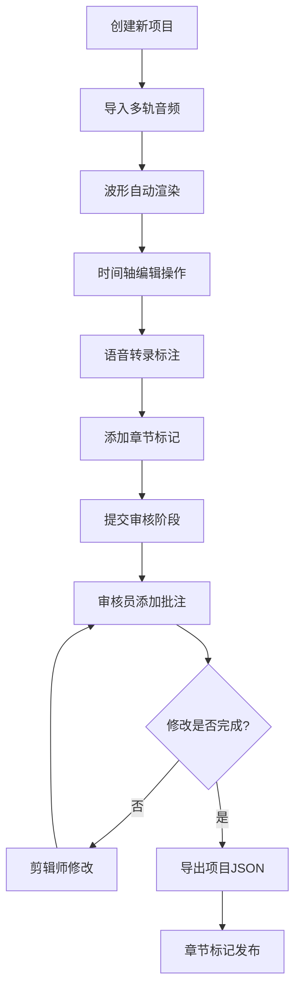

## 1. 产品概述

面向区域广播电台新媒体部门的纯前端播客剪辑协作平台，解决多轨音频编辑、语音转录、审核批注、章节标记发布等全流程痛点，降低专业剪辑软件的学习成本，实现多角色在线协作。
- 目标用户：主持人、录音师、剪辑师、审核员
- 核心价值：一站式解决播客制作全流程，支持纯浏览器运行，无需服务器部署

## 2. 核心功能

### 2.1 用户角色

| 角色 | 登录方式 | 核心权限 |
|------|---------|---------|
| 主持人 | 本地项目访问 | 查看项目、录制素材上传 |
| 录音师 | 本地项目访问 | 上传多轨录音、调整音轨参数 |
| 剪辑师 | 本地项目访问 | 完整编辑权限（剪切/粘贴/标记/转录） |
| 审核员 | 本地项目访问 | 添加批注、标记已处理状态 |

### 2.2 功能模块

1. **编辑器主界面**：三栏布局（轨道面板/时间轴/标记面板）+ 顶部导航 + 底部播放控制
2. **多轨音频管理**：16轨并行、拖拽排序、音量/静音控制、波形渲染
3. **音频编辑操作**：选区选择、剪切/复制/粘贴/删除、撤销重做栈（50步）
4. **时间轴系统**：缩放导航、播放指针、小地图、刻度标记
5. **章节标记系统**：时间点标记、章节名称、导出JSON
6. **语音转录标注**：Web Speech API实时识别、文本时间同步
7. **审核批注系统**：时间点批注、待处理/已处理状态管理
8. **项目导入导出**：音频文件导入(MP3/WAV/OGG)、项目JSON快照

### 2.3 页面详情

| 页面名称 | 模块名称 | 功能描述 |
|---------|---------|---------|
| 编辑器主界面 | 顶部导航栏 | 项目名称、导入/导出、撤销/重做按钮、主题切换 |
| 编辑器主界面 | 左侧轨道面板 | 音轨列表、音量滑块、静音切换、波形缩略图、增删轨道 |
| 编辑器主界面 | 中央时间轴 | 多轨波形对齐、选区高亮、播放指针、滚轮缩放、拖拽定位 |
| 编辑器主界面 | 右侧标记面板 | 章节标记Tab（添加/编辑/删除/导出）、批注Tab（批注列表/状态标记） |
| 编辑器主界面 | 底部播放控制 | 播放/暂停按钮、当前时间/总时长显示、进度条、缩放滑块、小地图 |

## 3. 核心流程

### 3.1 节目制作主流程
剪辑师创建项目 → 导入多轨录音素材 → 自动渲染波形 → 选区编辑（剪切/删除/调整顺序）→ 语音转录生成文本 → 添加章节时间标记 → 提交审核 → 审核员添加批注 → 剪辑师按批注修改 → 导出项目与章节信息

### 3.2 批注审核流程

## 4. 用户界面设计

### 4.1 设计风格
- **主色调**：深色主题 #1a1a2e，强调色 #e94560
- **辅助色**：波形蓝 #4facfe，批注黄 #ffd166，成功绿 #06d6a0
- **按钮风格**：圆角8px，hover状态提升1px阴影，active状态下沉
- **字体**：JetBrains Mono（代码/时间显示）、Noto Sans SC（中文UI）
- **布局风格**：三栏固定比例（20% / 60% / 20%），底部固定控制栏
- **图标**：Lucide React 线性图标

### 4.2 页面设计概要

| 页面区域 | 模块名称 | UI 要素 |
|---------|---------|---------|
| 顶部导航 | 项目标题区 | 粗体16px、强调色下划线、编辑态输入框 |
| 顶部导航 | 导入导出按钮组 | 玻璃态按钮、导入蓝 #3b82f6、导出绿 #10b981 |
| 顶部导航 | 撤销重做按钮 | 圆形图标按钮、禁用态opacity-40 |
| 左侧轨道 | 音轨卡片 | 16:9缩略波形、轨道名称、音量滑块(0-100%)、静音开关、拖拽手柄 |
| 中央时间轴 | 波形渲染 | Canvas 2D绘制、半透明选区覆盖(#e94560 opacity-30%)、白色竖线播放指针 |
| 中央时间轴 | 小地图 | 右下角固定、全量波形概览、可拖曳视窗矩形 |
| 右侧面板 | 章节标记列表 | 时间码 + 章节名、编辑删除按钮、按时间升序排列 |
| 右侧面板 | 批注列表 | 时间码 + 状态标签(待修改红/已处理绿) + 内容 |
| 底部控制 | 播放控制 | 超大圆形播放按钮(48px)、前后10s跳转按钮 |
| 底部控制 | 进度显示 | 等宽字体时间显示 00:00:00 / 01:30:00 |
| 底部控制 | 缩放滑块 | 1x - 10x 范围、刻度可视化反馈 |

### 4.3 响应式适配
- **桌面端 (≥1280px)**：三栏布局完整展示
- **平板端 (768px-1279px)**：左侧轨道面板可折叠为抽屉（宽度60%抽屉），右侧标记面板折叠为抽屉
- **手机端 (<768px)**：单轨模式切换、底部抽屉打开标记面板、手势滑动缩放时间轴

### 4.4 动效设计
- **页面加载**：波形从左到右渐显动画(stagger)、控制栏滑入
- **播放状态**：播放指针平滑移动(60fps)、选中轨道呼吸灯效果
- **添加标记**：标记点脉冲动画、列表项滑入
- **状态切换**：按钮active态缩放(0.96)、状态标签色值过渡

