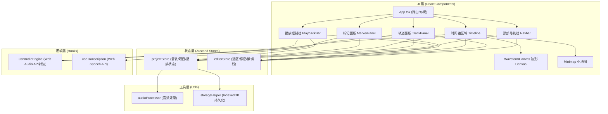
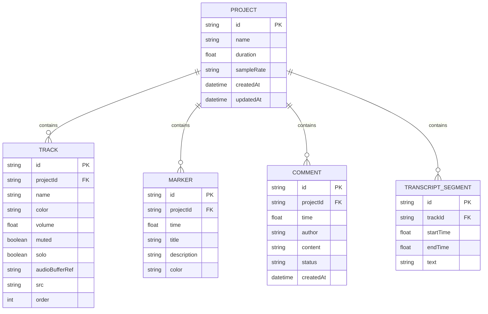

## 1. 架构设计



## 2. 技术说明

- **前端框架**：React 18.3 + TypeScript 5.4
- **构建工具**：Vite 5.2
- **路由管理**：React Router 6.22
- **状态管理**：Zustand 4.5 (分片Store、persist中间件)
- **样式方案**：TailwindCSS 3.4 + CSS Variables 主题
- **音频处理**：WaveSurfer.js 7.7 + 原生 Web Audio API + Canvas 2D 自定义波形
- **语音识别**：Web Speech API (SpeechRecognition)
- **本地持久化**：IndexedDB (idb 轻量封装)
- **图标库**：Lucide React
- **初始化模板**：react-ts (Vite)

## 3. 路由定义

| 路由 | 用途 |
|------|------|
| `/` | 项目列表页（展示本地保存项目、新建项目入口） |
| `/editor/:projectId` | 编辑器主界面（核心功能页） |

## 4. 数据模型

### 4.1 实体关系图



### 4.2 核心TypeScript类型定义

```typescript
interface AudioTrack {
  id: string;
  name: string;
  color: string;
  volume: number;
  muted: boolean;
  solo: boolean;
  order: number;
  src?: string;
  waveformData?: number[];
  audioBuffer?: AudioBuffer;
  segments: TrackSegment[];
}

interface TrackSegment {
  id: string;
  start: number;
  duration: number;
  offset: number;
}

interface Marker {
  id: string;
  time: number;
  title: string;
  description?: string;
  color?: string;
}

interface Comment {
  id: string;
  time: number;
  author: string;
  content: string;
  status: 'pending' | 'resolved';
  createdAt: number;
}

interface Selection {
  start: number;
  end: number;
  activeTrackId?: string;
}

interface ProjectState {
  id: string;
  name: string;
  tracks: AudioTrack[];
  markers: Marker[];
  comments: Comment[];
  isPlaying: boolean;
  currentTime: number;
  duration: number;
  zoom: number;
}

interface EditorState {
  selection: Selection | null;
  activeTrackId: string | null;
  undoStack: HistoryAction[];
  redoStack: HistoryAction[];
}
```

## 5. 性能优化策略

| 约束指标 | 优化方案 |
|---------|---------|
| 波形首帧 ≤500ms | Web Worker 离屏计算波形峰值、分级采样(L0-L5)、Canvas 增量绘制 |
| 缩放响应 ≤100ms | requestAnimationFrame节流、缓存不同缩放级别的离屏Canvas、CSS transform优先 |
| 播放指针 60fps | Web Audio currentTime驱动 + requestAnimationFrame渲染，避免setInterval漂移 |
| 内存 ≤30% | 200MB/轨限制、TypedArray复用、LRU缓存音频Buffer、弱引用暂存缩略波形 |
| 自动保存30s | IndexedDB事务批处理、差异快照(JSON patch)、防抖合并频繁变更 |
| 撤销栈50步 | 状态深拷贝优化(Immer produce patch)、大变更采用反向操作指令而非完整快照 |

## 6. 目录结构

```
src/
├── App.tsx                    # 应用入口+路由
├── main.tsx                   # React渲染入口
├── index.css                  # 全局样式+Tailwind
├── types/
│   └── audio.ts               # 全局类型定义
├── stores/
│   ├── projectStore.ts        # 项目/音轨/播放状态
│   └── editorStore.ts         # 选区/标记/撤销重做
├── components/
│   ├── Navbar.tsx             # 顶部导航
│   ├── TrackPanel.tsx         # 左栏轨道面板
│   ├── Timeline.tsx           # 中央时间轴容器
│   ├── WaveformCanvas.tsx     # 单轨波形Canvas
│   ├── Minimap.tsx            # 小地图导航
│   ├── MarkerPanel.tsx        # 右栏标记/批注面板
│   ├── TranscriptView.tsx     # 转录文本视图
│   └── PlaybackBar.tsx        # 底部播放控制
├── hooks/
│   ├── useAudioEngine.ts      # Web Audio播放引擎
│   ├── useTranscription.ts    # 语音转录
│   ├── useWaveform.ts         # 波形计算
│   └── useHistory.ts          # 撤销重做Hook
├── utils/
│   ├── audioProcessor.ts      # 音频切片/合并/峰值计算
│   ├── timeFormat.ts          # 时间格式化
│   └── idbStorage.ts          # IndexedDB封装
└── pages/
    ├── Home.tsx               # 项目列表
    └── Editor.tsx             # 编辑器页面
```
