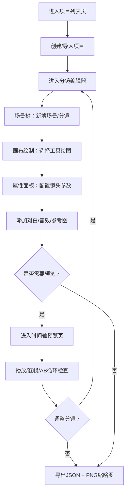

## 1. 产品概述

分镜创作平台是一套纯前端的在线分镜绘制与管理工具，专为中型动画工作室设计，解决传统手绘分镜版本混乱、沟通效率低、返工率高的问题。导演可在线绘制分镜草图、编排镜头序列、预览动画节奏，所有数据存储在浏览器本地，无需服务器部署。

- **目标用户**：动画导演、分镜师、原画师
- **核心价值**：将分镜创作流程数字化，实现可视化协作、版本管理、动画预览，降低返工率30%以上
- **市场定位**：面向中小型动画工作室的轻量级分镜解决方案，纯前端部署，开箱即用

---

## 2. 核心功能

### 2.1 用户角色

| 角色 | 使用方式 | 核心权限 |
|------|----------|----------|
| 导演/分镜师 | 浏览器直接访问 | 创建项目、绘制分镜、编排序列、配置属性、导出数据 |
| 原画师 | 浏览器直接访问 | 查看项目、浏览分镜、参考草图、搜索定位 |

### 2.2 功能模块

1. **项目列表页**：项目创建/删除/搜索，项目卡片展示，导入JSON恢复
2. **分镜编辑器**：左中右三栏布局，场景树 + Konva画布 + 属性面板，工具栏悬浮
3. **时间轴预览页**：分镜时序播放，逐帧步进，AB段循环，速度控制
4. **画布绘制系统**：自由画笔/直线/矩形/椭圆/箭头五种工具，橡皮擦，图层管理，缩放平移
5. **分镜序列编排**：场景树两级结构，拖拽排序，跨场景移动
6. **对白音效标注**：对白文本（角色+台词，最多5条），音效标签（20种预设）
7. **撤销重做系统**：100步历史栈，Ctrl+Z/Ctrl+Shift+Z快捷键
8. **数据导入导出**：JSON序列化导出/导入，PNG缩略图打包下载
9. **搜索筛选系统**：全局搜索对白关键词，按镜头运动/转场类型筛选
10. **参考图系统**：上传角色/场景设定图，半透明底层叠加，透明度可调

### 2.3 页面详情

| 页面名称 | 模块名称 | 功能描述 |
|----------|----------|----------|
| 项目列表页 | 顶部导航栏 | Logo展示，新建项目按钮，全局搜索框，导入按钮 |
| 项目列表页 | 项目卡片网格 | 项目封面缩略图，项目名称，分镜数量，更新时间，删除操作 |
| 项目列表页 | 新建项目弹窗 | 项目名称输入，项目描述输入，确认/取消按钮 |
| 项目列表页 | 导入项目模块 | JSON文件上传拖拽区，解析预览，确认导入 |
| 分镜编辑器 | 左侧场景树 | 场景/分镜两级树形结构，拖拽排序，右键菜单，新增删除按钮 |
| 分镜编辑器 | 顶部工具栏 | 五种绘制工具切换，笔刷大小滑块，16色预设+取色器，橡皮擦，撤销重做按钮，缩放控制，回到编辑器，进入预览 |
| 分镜编辑器 | 中央画布区 | Konva绑定画布，多图层支持，参考图底层叠加，鼠标滚轮缩放，空格拖拽平移，点击分镜切换 |
| 分镜编辑器 | 右侧属性面板 | 分镜编号，时长滑块（0.5-30s），镜头运动下拉（推/拉/摇/移/跟），转场类型下拉（切/淡入淡出/划变），对白列表，音效标签，参考图上传 |
| 分镜编辑器 | 图层管理面板 | 图层列表，显示/隐藏切换，上移下移，新增删除图层，最多20层限制提示 |
| 时间轴预览页 | 顶部播放控制栏 | 播放/暂停按钮，上一帧/下一帧，帧率选择（12/24/30fps），速度控制（0.25x-2x），AB循环开关，当前时间显示 |
| 时间轴预览页 | 中央预览窗口 | 当前分镜画布渲染，对白文本叠加显示，当前分镜高亮边框 |
| 时间轴预览页 | 底部时间轴轨道 | 分镜缩略图按时长排列，拖拽调节时长，点击跳转，骨架屏加载，0.2s缩放过渡 |
| 时间轴预览页 | 筛选面板 | 镜头运动筛选，转场类型筛选，对白关键词搜索输入框 |

---

## 3. 核心流程

### 3.1 主要用户流程

**分镜创作流程**：
1. 导演在项目列表页创建新项目
2. 进入分镜编辑器，在场景树中新增场景和分镜
3. 使用工具栏选择绘制工具，在画布上绘制草图（支持多图层）
4. 在右侧属性面板配置镜头时长、运动类型、转场效果
5. 添加对白文本和音效标签
6. 上传参考图作为底层参考，调节透明度
7. 切换到时间轴预览页，按设定帧率播放，检查动画节奏
8. 使用AB循环反复查看关键段落，调整分镜时长
9. 导出项目JSON文件和PNG缩略图，或分享给原画师

**修改迭代流程**：
1. 导演在场景树中选中需要修改的分镜
2. 直接在画布上修改，或调整属性面板参数
3. 系统自动保存到IndexedDB，修改操作进入撤销栈
4. 预览确认后，重新导出最新版本

### 3.2 流程图

---

## 4. 用户界面设计

### 4.1 设计风格

- **主色调**：深色主题，侧边栏背景 `#1e1e2e`，画布纯白 `#ffffff`，强调色 `#7c3aed`（紫色）
- **辅助色**：成功 `#10b981`，警告 `#f59e0b`，错误 `#ef4444`，层级灰阶 `#313244 / #45475a / #585b70 / #6c7086`
- **按钮风格**：圆角8px，悬浮时强调色描边+微缩放，按下0.97倍缩放过渡
- **字体**：标题使用 "JetBrains Mono" 等宽字体彰显专业工具感，正文使用 "Noto Sans SC" 中文优化字体
- **字体大小**：标题18-24px，正文13-14px，小字辅助11-12px
- **布局风格**：三栏固定宽度布局（左240px + 中间自适应 + 右280px），工具栏绝对定位悬浮画布上方
- **图标风格**：线性图标（Lucide风格），16px / 20px两种规格，悬浮时填充强调色
- **动效风格**：CSS transition 0.2s ease-out，拖拽排序scale(1.05)，画布缩放transform平滑过渡，骨架屏闪烁动画

### 4.2 页面设计概览

| 页面名称 | 模块名称 | UI元素 |
|----------|----------|--------|
| 项目列表页 | 导航栏 | 深色渐变背景 `#1e1e2e → #181825`，左侧Logo分镜图标+名称，右侧新建按钮（强调色实心）、导入按钮（描边），搜索框圆角8px |
| 项目列表页 | 项目网格 | 卡片间距20px，卡片hover时box-shadow 0 8px 30px rgba(124,58,237,0.15)，封面占70%高度，底部信息栏 |
| 分镜编辑器 | 场景树 | 深色背景 `#1e1e2e`，场景节点加粗，分镜节点缩进20px，选中节点左侧3px强调色竖条，拖拽占位符虚线框 |
| 分镜编辑器 | 工具栏 | 半透明深色背景 `rgba(30,30,46,0.95)`，毛玻璃backdrop-filter，工具组之间1px分隔线，当前工具按钮强调色高亮 |
| 分镜编辑器 | 画布区 | 白色背景，画布周围棋盘格纹理表示透明区域，外框1px `#313244`，当前分镜编号徽章悬浮左上角 |
| 分镜编辑器 | 属性面板 | 深色背景，分组折叠标题栏，输入框圆角6px深色填充，滑块轨道深灰、滑块强调色 |
| 时间轴预览页 | 预览窗口 | 白色画布居中显示，周围深色背景，对白字幕半透明黑色背景条底部悬浮 |
| 时间轴预览页 | 轨道区 | 深色背景，时间刻度顶部显示，分镜缩略图卡片排列，当前播放头强调色竖线，时长调节手柄左右边缘 |

### 4.3 响应式设计

- **1280px及以上**：标准三栏布局，左240px + 中间自适应 + 右280px全展开
- **1024px - 1279px**：左侧场景树保持展开，右侧属性面板折叠为右侧抽屉（点击图标滑出，宽度280px，transform translateX过渡）
- **768px - 1023px**：左侧场景树和右侧属性面板均为底部抽屉（高度50vh，从下往上滑出），画布区域全屏，工具栏改为顶部固定紧凑布局
- **768px以下**：同768-1023px逻辑，进一步压缩工具栏按钮间距，字体整体缩小1px，触控区域扩大至44x44px

### 4.4 性能与交互细节

- **画布绘制**：使用requestAnimationFrame确保60fps，绘制延迟≤16ms，离屏canvas预渲染复杂图形
- **时间轴渲染**：100个分镜项目初始化≤200ms，缩略图懒加载，视口外虚拟滚动
- **数据持久化**：IndexedDB单次读写≤50ms，批量操作使用事务，大对象分片存储
- **内存控制**：Konva图层主动销毁，离屏图片及时释放，撤销历史100步上限自动裁剪
- **快捷键系统**：Ctrl+Z撤销 / Ctrl+Shift+Z重做 / Ctrl+S触发导出提示 / 空格临时切换平移工具 / 数字键1-5快速切换绘制工具
