## 1. 架构设计

```mermaid
graph TD
    subgraph "UI层 (React Components)"
        A1["ProjectList 项目列表页"]
        A2["StoryboardEditor 分镜编辑器"]
        A3["TimelinePreview 时间轴预览"]
        A4["StoryCanvas Konva画布"]
        A5["SceneTree 场景树"]
        A6["PropertyPanel 属性面板"]
        A7["Toolbar 工具栏"]
        A8["Track 时间轴轨道"]
        A9["JsonExporter 导出模块"]
    end

    subgraph "状态层 (Zustand Stores)"
        B1["projectStore 项目/分镜数据"]
        B2["toolStore 工具状态"]
        B3["historySlice 撤销重做栈"]
    end

    subgraph "数据层 (IndexedDB via Dexie)"
        C1["projects 表: 项目元数据"]
        C2["scenes 表: 场景列表"]
        C3["shots 表: 分镜与画布图层数据"]
        C4["layers 表: 图层明细(可选分片)"]
        C5["references 表: 参考图Blob存储"]
    end

    subgraph "核心库集成"
        D1["react-konva: Canvas绘制"]
        D2["dnd-kit: 拖拽排序"]
        D3["react-router v6: 路由"]
        D4["Dexie.js: IndexedDB封装"]
    end

    A1 & A2 & A3 --> B1 & B2
    B1 --> B3
    B1 & B2 --"debounce 500ms 持久化"--> C1 & C2 & C3 & C4 & C5
    A4 --> D1
    A5 & A8 --> D2
    A1 & A2 & A3 --> D3
    B1 --> D4
```



---

## 2. 技术栈说明

- **前端框架**：React@18.3 + TypeScript@5.4 + Vite@5.3
  - React 18 并发渲染，严格模式开启
  - TypeScript 严格模式 `strict: true`，禁止 any 类型
  - Vite 5 使用 SWC 编译，HMR 毫秒级热更新
- **状态管理**：Zustand@4.5 + immer middleware
  - 扁平化 store 设计，避免深层嵌套
  - selector 精确订阅，防止不必要重渲染
  - devtools 中间件支持 Redux DevTools
- **路由**：react-router-dom@6.23 + createBrowserRouter
  - 路由懒加载 + React.lazy + Suspense
  - 路由守卫检查项目ID有效性
- **画布绘制**：react-konva@18.2 + konva@9.3
  - Layer 分层管理，Line/Shape/Transformer 组件化
  - 事件委托到 Stage 层，减少监听器数量
  - 离屏 Canvas 缓存静态图层
- **拖拽系统**：@dnd-kit/core@6.1 + @dnd-kit/sortable@8.0 + @dnd-kit/utilities@3.2
  - 场景树可拖拽排序 + 跨场景移动
  - 时间轴轨道拖拽调节分镜时长
  - 拖拽状态 CSS transform，无重排
- **本地数据库**：Dexie@4.0 + dexie-react-hooks@1.1
  - 版本化 Schema，自动迁移
  - 事务化批量写入，数据一致性保证
  - Blob 直存参考图，Base64 只用于临时交换
- **图标库**：lucide-react@0.395，按需 tree-shaking
- **构建优化**：
  - 代码分割：按路由 + 按组件（Canvas/Exporter 懒加载）
  - 第三方库单独 chunk：konva / dexie / dnd-kit 分别打包
  - brotli 压缩输出，生产构建 source-map 隐藏

---

## 3. 路由定义

| 路由路径 | 页面组件 | 用途 | 路由参数 |
|----------|----------|------|----------|
| `/` | 重定向 | 跳转到项目列表 | - |
| `/projects` | `ProjectList` | 项目列表页，创建/删除/搜索/导入 | - |
| `/projects/:projectId/editor` | `StoryboardEditor` | 分镜编辑器主页，三栏布局 | `projectId`: 项目UUID |
| `/projects/:projectId/preview` | `TimelinePreview` | 时间轴预览页，播放控制 | `projectId`: 项目UUID |
| `*` | `NotFound` | 404页面，返回列表按钮 | - |

---

## 4. 数据模型

### 4.1 数据模型关系图（ER）

```mermaid
erDiagram
    PROJECT ||--o{ SCENE : contains
    SCENE ||--o{ SHOT : contains
    SHOT ||--o{ LAYER : contains
    SHOT ||--o{ DIALOGUE : contains
    SHOT ||--o{ SFX_TAG : has
    SHOT ||--o| REFERENCE_IMAGE : optional

    PROJECT {
        string id PK "UUID"
        string name "项目名称"
        string description "项目描述"
        string thumbnail "封面缩略图DataURL"
        number createdAt "创建时间戳"
        number updatedAt "更新时间戳"
        number fps "默认帧率 12/24/30"
    }

    SCENE {
        string id PK "UUID"
        string projectId FK "所属项目ID"
        string name "场景名称 如:第1幕"
        number order "排序序号"
        number createdAt "创建时间戳"
    }

    SHOT {
        string id PK "UUID"
        string sceneId FK "所属场景ID"
        string projectId FK "冗余字段加速查询"
        number order "场景内排序"
        number duration "镜头时长(秒) 0.5-30"
        string cameraMove "镜头运动: push/pull/pan/track/follow"
        string transition "转场: cut/fade/wipe"
        string layersData "图层JSON序列化(Konva nodes)"
        string thumbnail "分镜缩略图DataURL"
        string referenceImageId FK "参考图ID(可空)"
        number referenceOpacity "参考图透明度 0.1-0.9"
        number createdAt "创建时间戳"
        number updatedAt "更新时间戳"
    }

    LAYER {
        string id PK "UUID"
        string shotId FK "所属分镜ID"
        string name "图层名称"
        number order "图层顺序(底层在前)"
        boolean visible "是否可见"
        boolean locked "是否锁定"
        string konvaData "Konva节点JSON"
    }

    DIALOGUE {
        string id PK "UUID"
        string shotId FK "所属分镜ID"
        string character "角色名"
        string text "台词文本"
        number startTime "相对分镜开始时间(秒)"
        number order "排序 1-5"
    }

    SFX_TAG {
        string id PK "UUID"
        string shotId FK "所属分镜ID"
        string type "音效类型预设"
        string note "备注说明(可空)"
    }

    REFERENCE_IMAGE {
        string id PK "UUID"
        string projectId FK "所属项目ID"
        string name "文件名"
        Blob data "图片二进制"
        string mimeType "image/png/jpeg"
        number size "文件大小(byte)"
    }
```



### 4.2 Dexie Schema 定义（数据库版本1）

```typescript
import Dexie, { Table } from 'dexie';

export interface Project {
  id: string;
  name: string;
  description: string;
  thumbnail: string;
  createdAt: number;
  updatedAt: number;
  fps: 12 | 24 | 30;
}

export interface Scene {
  id: string;
  projectId: string;
  name: string;
  order: number;
  createdAt: number;
}

export interface Shot {
  id: string;
  sceneId: string;
  projectId: string;
  order: number;
  duration: number;
  cameraMove: 'push' | 'pull' | 'pan' | 'track' | 'follow' | 'none';
  transition: 'cut' | 'fade' | 'wipe';
  layersData: string; // JSON string of Layer[]
  thumbnail: string;
  referenceImageId?: string;
  referenceOpacity: number;
  createdAt: number;
  updatedAt: number;
}

export interface Dialogue {
  id: string;
  shotId: string;
  character: string;
  text: string;
  startTime: number;
  order: number;
}

export interface SfxTag {
  id: string;
  shotId: string;
  type: string;
  note?: string;
}

export interface ReferenceImage {
  id: string;
  projectId: string;
  name: string;
  data: Blob;
  mimeType: string;
  size: number;
}

export class StoryboardDB extends Dexie {
  projects!: Table<Project, string>;
  scenes!: Table<Scene, string>;
  shots!: Table<Shot, string>;
  dialogues!: Table<Dialogue, string>;
  sfxTags!: Table<SfxTag, string>;
  referenceImages!: Table<ReferenceImage, string>;

  constructor() {
    super('storyboard-db');
    this.version(1).stores({
      projects: '&id, name, createdAt, updatedAt',
      scenes: '&id, projectId, order',
      shots: '&id, sceneId, projectId, order, updatedAt',
      dialogues: '&id, shotId, order',
      sfxTags: '&id, shotId, type',
      referenceImages: '&id, projectId',
    });
  }
}

export const db = new StoryboardDB();
```

### 4.3 音效预设列表（20种）

```typescript
export const SFX_PRESETS = [
  '脚步声', '开门声', '关门声', '电话铃声', '敲门声',
  '风声', '雨声', '雷声', '鸟鸣声', '汽车声',
  '爆炸声', '枪声', '打斗声', '碎裂声', '警报声',
  '背景音乐淡入', '背景音乐淡出', '环境音', '心跳声', '呼吸声',
] as const;
export type SfxPreset = typeof SFX_PRESETS[number];
```

### 4.4 Konva 图层序列化结构

```typescript
export interface KonvaLayerData {
  id: string;
  name: string;
  order: number;
  visible: boolean;
  nodes: KonvaNodeData[]; // Line/Rect/Ellipse/Arrow/Group
}

export type KonvaNodeData =
  | { type: 'line'; id: string; points: number[]; stroke: string; strokeWidth: number; tension: number; closed?: boolean }
  | { type: 'rect'; id: string; x: number; y: number; width: number; height: number; stroke?: string; strokeWidth?: number; fill?: string }
  | { type: 'ellipse'; id: string; x: number; y: number; radiusX: number; radiusY: number; stroke?: string; strokeWidth?: number; fill?: string }
  | { type: 'arrow'; id: string; points: number[]; stroke: string; strokeWidth: number; pointerLength: number; pointerWidth: number };
```

---

## 5. Zustand Store 架构

### 5.1 projectStore（核心状态）

```typescript
// 切片设计
interface ProjectState {
  // 当前上下文
  currentProjectId: string | null;
  currentSceneId: string | null;
  currentShotId: string | null;

  // 内存数据（从IndexedDB加载）
  projects: Project[];
  scenes: Record<string, Scene[]>; // key: projectId
  shots: Record<string, Shot[]>;   // key: sceneId
  dialogues: Record<string, Dialogue[]>; // key: shotId
  sfxTags: Record<string, SfxTag[]>;     // key: shotId
  referenceBlobs: Record<string, string>; // key: imageId -> objectURL

  // 搜索筛选
  searchKeyword: string;
  filterCameraMove: string | null;
  filterTransition: string | null;
}

interface ProjectActions {
  // 项目CRUD
  loadProjects: () => Promise<void>;
  createProject: (name: string, desc?: string) => Promise<string>;
  deleteProject: (id: string) => Promise<void>;
  importProject: (json: ImportProjectJSON) => Promise<string>;

  // 场景/分镜CRUD
  loadProjectData: (projectId: string) => Promise<void>;
  createScene: (projectId: string, name: string) => Promise<string>;
  createShot: (sceneId: string) => Promise<string>;
  deleteScene: (sceneId: string) => Promise<void>;
  deleteShot: (shotId: string) => Promise<void>;
  selectShot: (shotId: string) => void;

  // 排序（dnd-kit触发）
  reorderScenes: (projectId: string, fromIdx: number, toIdx: number) => Promise<void>;
  reorderShots: (sceneId: string, fromIdx: number, toIdx: number) => Promise<void>;
  moveShotToScene: (shotId: string, targetSceneId: string, targetIdx: number) => Promise<void>;

  // 分镜属性修改
  updateShotDuration: (shotId: string, duration: number) => void;
  updateShotCameraMove: (shotId: string, cameraMove: Shot['cameraMove']) => void;
  updateShotTransition: (shotId: string, transition: Shot['transition']) => void;

  // 图层数据修改（画布修改后写入）
  updateShotLayersData: (shotId: string, layersData: string, thumbnail?: string) => void;

  // 对白/音效
  addDialogue: (shotId: string, dialogue: Omit<Dialogue, 'id' | 'shotId'>) => void;
  updateDialogue: (dialogue: Dialogue) => void;
  removeDialogue: (dialogueId: string) => void;
  toggleSfxTag: (shotId: string, type: string) => void;

  // 参考图
  uploadReferenceImage: (projectId: string, file: File) => Promise<string>;
  setShotReference: (shotId: string, imageId: string | undefined) => void;
  setReferenceOpacity: (shotId: string, opacity: number) => void;

  // 搜索筛选
  setSearchKeyword: (kw: string) => void;
  setFilterCameraMove: (v: string | null) => void;
  setFilterTransition: (v: string | null) => void;

  // 撤销重做（委托给historySlice）
  undo: () => void;
  redo: () => void;
  canUndo: () => boolean;
  canRedo: () => boolean;
}
```

### 5.2 toolStore（工具状态）

```typescript
type ToolType = 'pen' | 'line' | 'rect' | 'ellipse' | 'arrow' | 'eraser' | 'pan';

interface ToolState {
  currentTool: ToolType;
  brushSize: number;       // 1-50 px
  brushColor: string;      // hex color
  presetColors: string[];  // 16色预设
  canvasScale: number;     // 0.25 - 4
  canvasOffsetX: number;   // 平移X
  canvasOffsetY: number;   // 平移Y
  currentLayerId: string | null;
}

interface ToolActions {
  setTool: (tool: ToolType) => void;
  setBrushSize: (size: number) => void;
  setBrushColor: (color: string) => void;
  addPresetColor: (color: string) => void;
  setCanvasScale: (scale: number, center?: { x: number; y: number }) => void;
  setCanvasOffset: (x: number, y: number) => void;
  resetCanvasView: () => void;
  setCurrentLayerId: (id: string | null) => void;
}
```

### 5.3 撤销重做中间件设计

```typescript
// historySlice 插入 projectStore
interface HistoryEntry {
  type: string;           // 操作类型标识
  timestamp: number;
  forwardPatch: Patch[];  // immer patch: 执行操作
  reversePatch: Patch[];  // immer patch: 回滚操作
}

// 对会修改 state 的 action 包装 enablePatches
// 每次 action 结束后收集 patches，push 到 historyStack
// MAX_HISTORY = 100，超出时 shift 丢弃最早
// undo: 取 reversePatch 反向 apply；redo: 取 forwardPatch 正向 apply
```

---

## 6. 核心性能优化策略

| 瓶颈点 | 优化方案 | 预期指标 |
|--------|----------|----------|
| 画布绘制延迟 | 鼠标move事件节流到rAF，使用konva batchDraw，临时绘制在额外Layer绘制完合并 | ≤16ms，60fps |
| 100分镜时间轴 | 缩略图懒生成（离屏canvas，WebWorker序列化），虚拟滚动仅渲染视口+缓冲10 | ≤200ms初始化 |
| IndexedDB读写 | 写入使用bulkPut合并事务，读取useLiveQuery自动订阅增量，图层JSON大于2MB分片 | 单次读写≤50ms |
| JSON导出50MB | Konva节点去重，图片转webp压缩，可选缩略图排除，流式Blob下载避免OOM | 单项目≤50MB |
| 内存占用512MB | 参考图objectURL用完revoke，Konva layer切换时destroyChildren，撤销栈100步上限 | 稳态≤400MB |
| 撤销重做响应 | immer patches直接复用，不深拷贝，UI只刷新受影响selector | ≤50ms |

---

## 7. 快捷键系统

在 `App.tsx` 全局挂载 keydown 监听器，使用 useEventCallback 避免闭包问题：

| 快捷键 | 功能 | 作用域 |
|--------|------|--------|
| `Ctrl/Cmd + Z` | 撤销 | 全局（输入框内除外） |
| `Ctrl/Cmd + Shift + Z` | 重做 | 全局 |
| `Ctrl/Cmd + S` | 打开导出对话框 | 编辑器/预览页 |
| `Space`（按下） | 临时切换为平移工具 | 画布获得焦点 |
| `Space`（松开） | 恢复之前的工具 | 画布获得焦点 |
| `1` | 切换自由画笔 | 编辑器 |
| `2` | 切换直线工具 | 编辑器 |
| `3` | 切换矩形工具 | 编辑器 |
| `4` | 切换椭圆工具 | 编辑器 |
| `5` | 切换箭头工具 | 编辑器 |
| `E` | 切换橡皮擦 | 编辑器 |
| `[` / `]` | 减小/增大笔刷大小（步长2） | 编辑器 |
| `Ctrl/Cmd + +` | 画布放大（+25%） | 编辑器 |
| `Ctrl/Cmd + -` | 画布缩小（-25%） | 编辑器 |
| `Ctrl/Cmd + 0` | 画布重置（100%居中） | 编辑器 |
| `←` / `→` | 上一/下一帧（预览页），上一/下一分镜（编辑器） | 全局 |
| `Space` | 播放/暂停切换 | 预览页 |

---

## 8. 目录结构

```
src/
├── App.tsx                          # 路由挂载 + 全局布局 + 快捷键
├── main.tsx                         # 入口
├── index.css                        # 全局样式 + 主题变量
├── vite-env.d.ts
│
├── router/
│   └── index.tsx                    # 路由定义 + createBrowserRouter
│
├── db/
│   └── index.ts                     # Dexie 实例 + Schema 定义
│
├── stores/
│   ├── projectStore.ts              # 项目/分镜/撤销重做
│   ├── toolStore.ts                 # 工具/笔刷/画布变换
│   └── historySlice.ts              # 撤销重做中间件
│
├── pages/
│   ├── ProjectList.tsx              # 项目列表
│   ├── StoryboardEditor.tsx         # 分镜编辑器（三栏布局）
│   ├── TimelinePreview.tsx          # 时间轴预览
│   └── NotFound.tsx                 # 404
│
├── components/
│   ├── Layout/
│   │   ├── AppHeader.tsx            # 编辑器顶部导航
│   │   ├── Sidebar.tsx              # 可折叠侧边栏容器
│   │   ├── Drawer.tsx               # 抽屉组件（响应式用）
│   │   └── useResponsive.ts         # 响应式断点 hook
│   │
│   ├── Canvas/
│   │   ├── StoryCanvas.tsx          # Konva画布主组件
│   │   ├── Toolbar.tsx              # 画布上方悬浮工具栏
│   │   ├── LayerPanel.tsx           # 图层面板
│   │   └── ReferenceImageOverlay.tsx # 参考图叠加层
│   │
│   ├── SceneTree/
│   │   ├── SceneTree.tsx            # 场景树（dnd-kit）
│   │   ├── SceneNode.tsx
│   │   └── ShotNode.tsx
│   │
│   ├── PropertyPanel/
│   │   ├── PropertyPanel.tsx        # 属性面板容器
│   │   ├── ShotBasicSection.tsx     # 时长/镜头运动/转场
│   │   ├── DialogueSection.tsx      # 对白列表（最多5条）
│   │   ├── SfxSection.tsx           # 音效标签（20种）
│   │   └── ReferenceSection.tsx     # 参考图上传+透明度
│   │
│   ├── Timeline/
│   │   ├── Track.tsx                # 轨道容器
│   │   ├── ShotThumb.tsx            # 分镜缩略图卡片
│   │   ├── Playhead.tsx             # 播放头
│   │   └── TimeRuler.tsx            # 时间刻度
│   │
│   ├── Export/
│   │   ├── JsonExporter.tsx         # JSON导出按钮+弹窗
│   │   └── JsonImporter.tsx         # JSON导入
│   │
│   ├── SearchFilter/
│   │   └── SearchBar.tsx            # 搜索筛选组件
│   │
│   └── Common/
│       ├── Button.tsx               # 通用按钮
│       ├── Input.tsx
│       ├── Slider.tsx
│       ├── Select.tsx
│       ├── Modal.tsx
│       ├── Skeleton.tsx             # 骨架屏
│       └── EmptyState.tsx
│
├── hooks/
│   ├── useKeyboardShortcuts.ts      # 快捷键 hook
│   ├── useDebouncedPersist.ts       # 防抖持久化 hook
│   ├── useKonvaExport.ts            # 画布导出 hook
│   └── useProjectDataLoader.ts      # 项目数据加载 hook
│
├── utils/
│   ├── konvaSerializer.ts           # Konva 序列化/反序列化
│   ├── thumbnailGenerator.ts        # 缩略图生成
│   ├── idGenerator.ts               # UUID 生成
│   ├── colorPresets.ts              # 16色预设
│   └── fpsCalculator.ts             # 帧率/时长/帧数换算
│
└── types/
    └── index.ts                     # 全局类型定义
```
