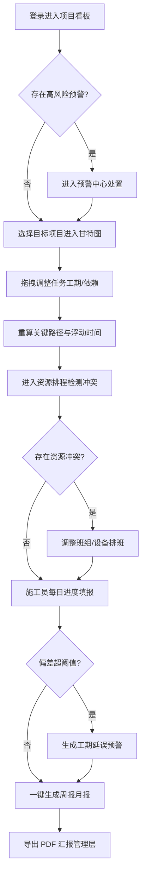

# 施工进度管理系统 PRD

## 1. 产品概述

本系统面向某区域建筑工程施工总承包企业，为其同时承建的 15 个在建项目（住宅、商业、市政三类工程，每项目 200~500 个施工任务节点）提供统一的施工进度统筹与资源协同平台。系统以"进度可视化、资源可感知、风险可预警、汇报自动化"为核心目标，替代当前 Excel 分散管理与微信群沟通模式，解决工序衔接靠口头、资源冲突发现滞后、工期延误预警不及时、进度汇报人工汇总耗时等痛点，提升项目群整体管控效率与交付准时率。

目标用户：施工总承包企业的项目经理、施工员、调度员、企业管理层；核心市场价值在于将项目群工期延误率与窝工成本显著降低，并实现一键生成标准化周报月报。

## 2. 核心功能

### 2.1 用户角色

| 角色 | 注册/登录方式 | 核心权限 |
|------|---------------|----------|
| 项目经理 | 本地账号（离线可用） | 全项目查看、任务编排、资源排程、审批预警、生成汇报 |
| 施工员 | 本地账号 | 进度填报、上传现场照片、查看本人负责任务 |
| 调度员 | 本地账号 | 资源排程、冲突检测、班组设备调度 |
| 管理层 | 本地账号 | 项目群看板、统计分析、预警监控、报表导出 |

### 2.2 功能模块

1. **项目看板**：项目状态卡片网格、按类型/阶段/风险等级筛选、关键指标与预警标记、卡片拖拽排序
2. **任务甘特图**：任务时间轴可视化、拖拽调整工期、前后置依赖、关键路径与浮动时间自动计算
3. **资源排程**：劳务班组与机械设备排班、时间重叠冲突检测、超载日期段高亮
4. **进度填报**：每日填报完成百分比/实际工时/现场照片、计划完成率偏差自动计算
5. **预警中心**：工期延误、资源冲突、关键节点滞后三类风险分级展示与处置
6. **进度汇报**：一键生成周报月报、S 曲线对比、里程碑达成率、资源利用率、导出 PDF
7. **变更管理**：设计变更与签证记录、自动更新受影响任务工期与依赖、变更历史追溯
8. **统计分析**：多维度汇总、同环比对比、趋势图表

### 2.3 页面详情

| 页面名称 | 模块名称 | 功能描述 |
|----------|----------|----------|
| 项目看板 | 筛选条 | 按工程类型、阶段、风险等级多条件筛选，支持搜索 |
| 项目看板 | 项目卡片 | 显示项目名/类型/进度环/工期/风险标记/预警数量，拖拽排序持久化 |
| 任务甘特图 | 时间轴 | 日/周/月视图切换、横向滚动与缩放、今日标线 |
| 任务甘特图 | 任务条 | 拖拽移动/缩放调整工期、依赖连线、关键路径高亮、浮动时间标识 |
| 资源排程 | 资源泳道 | 班组/设备按行排列，任务块占据日期格，冲突段红色高亮 |
| 资源排程 | 冲突检测面板 | 列出冲突资源、超载时段、影响任务、一键调整建议 |
| 进度填报 | 填报表单 | 任务选择、完成百分比滑块、实际工时、照片上传、偏差实时显示 |
| 预警中心 | 预警列表 | 三类风险分级（高/中/低）、处置状态、模态框确认/忽略 |
| 进度汇报 | 汇报表单 | 选择项目与周期、生成报告、S 曲线/里程碑/资源利用率图表 |
| 进度汇报 | PDF 导出 | 调用浏览器打印生成 PDF |
| 变更管理 | 变更登记 | 记录变更内容、影响任务、签证金额、自动联动任务工期 |
| 变更管理 | 变更历史 | 时间线追溯每次变更与受影响任务 |
| 统计分析 | 多维汇总 | 按项目/类型/时间维度汇总，同环比对比折线 |
| 统计分析 | 趋势图表 | Chart.js 渲染进度趋势、资源利用率、预警分布 |

## 3. 核心流程

**主流程**：项目经理登录 → 进入项目看板查看项目群整体状态 → 点击高风险项目进入甘特图 → 拖拽调整任务工期并建立依赖 → 系统重算关键路径与浮动时间 → 进入资源排程检测冲突 → 施工员每日填报进度触发偏差计算 → 超阈值生成预警 → 预警中心处置 → 一键生成周报月报导出 PDF。

**变更联动流程**：登记设计变更 → 选择受影响任务 → 系统自动延长/缩短工期并维护依赖 → 重新计算关键路径 → 触发工期延误预警 → 变更历史留痕。

## 4. 用户界面设计

### 4.1 设计风格

- **美学方向**：工业精密仪表盘（Industrial Control Room）。以工程蓝图网格、安全警示色与钢灰中性色为基调，营造"施工现场指挥中心"的专业、数据密集、可信赖气质，规避通用 AI 配色。
- **主色/辅色**：钢蓝灰 `#1B2330`（深底）/ 钢灰 `#2A3441`；安全警示琥珀 `#F59E0B` 为行动强调色；信号绿 `#10B981`（正常/完成）、危险红 `#EF4444`（高风险）、信息蓝 `#3B82F6`（信息）作为状态语义色。
- **按钮样式**：直角微圆角（2px），扁平+细微投影，主按钮琥珀色实底，次按钮钢灰描边；危险操作红色描边。
- **字体**：显示字体 `Oswald`（工程标题，紧凑工业感）/ 正文 `Noto Sans SC`（中文可读性）/ 数字与数据 `JetBrains Mono`（等宽对齐）。字号层级 4-5 级。
- **布局风格**：左侧固定深色导航栏 + 右侧主内容区卡片/表格网格；顶部状态条显示当前项目与全局预警计数。
- **图标**：Bootstrap Icons 线性风格，工业/建筑语义优先。
- **背景细节**：蓝图网格纹理叠加（低透明度）、卡片顶部 2px 信号色描边按风险等级变化、数据区等宽数字对齐。

### 4.2 页面设计概览

| 页面名称 | 模块名称 | UI 元素 |
|----------|----------|----------|
| 项目看板 | 筛选条 | 钢灰底条，分段按钮组，搜索框带图标 |
| 项目看板 | 项目卡片 | 深色卡片、顶部风险色描边、环形进度、预警徽标、悬浮投影 |
| 任务甘特图 | 时间轴表头 | 等宽日期刻度、今日红线、视图切换分段控件 |
| 任务甘特图 | 任务条 | 彩色横条、依赖箭头、关键路径加粗高亮、拖拽手柄 |
| 资源排程 | 资源泳道 | 行式布局、任务色块、冲突段红色斜纹叠加 |
| 进度填报 | 填报表单 | Bootstrap 浮动标签、百分比滑块、照片缩略图网格、偏差徽标 |
| 预警中心 | 预警卡片 | 严重度色条、风险图标、确认/忽略模态框 |
| 进度汇报 | 报告图表 | S 曲线双线图、里程碑时间轴、利用率柱状图、导出按钮 |
| 变更管理 | 变更时间线 | 垂直时间线、变更卡片、受影响任务标签 |
| 统计分析 | 趋势图表 | Chart.js 折线/柱状/环形组合、同环比标签 |

### 4.3 响应式

- 桌面优先（≥1200px）：侧边栏展开、卡片 3~4 列网格、甘特图全功能横向滚动。
- 平板（768~1199px）：侧边栏图标态、卡片 2 列、甘特图缩放默认周视图。
- 移动端（<768px）：导航折叠为汉堡菜单、卡片单列、甘特图降级为任务列表视图、表单全宽堆叠。

### 4.4 3D 场景指引

不适用（本系统为 2D 数据管理界面，无 3D 场景需求）。
