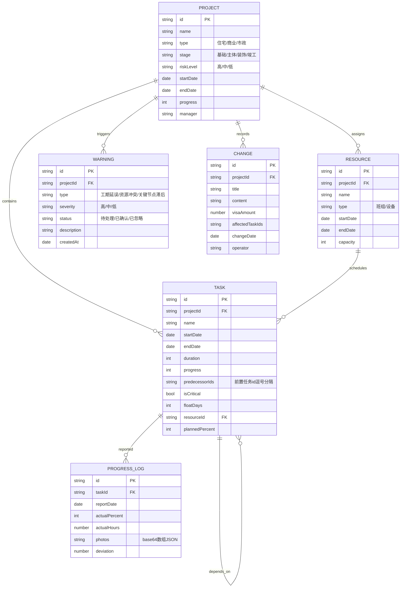

# 施工进度管理系统技术架构

## 1. 架构设计

系统采用纯前端多模块架构，基于 jQuery + Bootstrap 构建，数据持久化依赖浏览器 LocalStorage，支持离线操作与数据恢复。分层为：表现层（HTML/Bootstrap 界面）→ 模块层（各业务模块 JS）→ 工具层（路由/验证）→ 服务层（LocalStorage 数据服务）。

```mermaid
flowchart TD
    subgraph FE["表现层 Presentation"]
        UI["index.html 全局框架与导航"]
    end
    subgraph MOD["模块层 Modules"]
        M1["project/list 项目看板"]
        M2["task/gantt 甘特图"]
        M3["resource/schedule 资源排程"]
        M4["progress/report 进度汇报"]
        M5["progress填报/预警/变更/统计"]
    end
    subgraph UTIL["工具层 Utils"]
        U1["router 路由"]
        U2["validator 验证"]
    end
    subgraph SVC["服务层 Services"]
        S1["data.service LocalStorage"]
    end
    subgraph DATA["数据层 Data"]
        D1["LocalStorage ≤10MB"]
    end
    UI --> U1
    U1 --> MOD
    MOD --> U2
    MOD --> SVC
    SVC --> D1
    M2 -.Chart.js.-> CH["Chart.js / DataTables"]
```

## 2. 技术描述

- **前端框架**：jQuery 3.7.x（DOM 操作与事件）+ Bootstrap 5.3.x（布局与组件）
- **路由**：jQuery Router（基于 hash 的页面切换与历史记录）
- **表单验证**：jQuery Validation 1.19.x（浮动标签表单校验）
- **图表**：Chart.js 4.x（S 曲线、趋势、利用率统计）
- **表格**：DataTables 1.13.x（任务清单、预警列表、变更历史分页排序搜索）
- **日期处理**：Moment.js 2.29.x（日期计算与格式化）
- **图标**：Bootstrap Icons 1.11.x
- **数据持久化**：浏览器 LocalStorage（封装于 data.service.js，≤10MB，支持离线与恢复）
- **PDF 导出**：调用浏览器原生打印（`window.print()` + 打印样式）生成 PDF
- **构建/运行**：无需构建工具，原生静态资源；开发期用轻量静态服务器（npx serve 或 python http.server）预览

> 说明：用户明确指定 jQuery + Bootstrap 技术栈，故不采用 React/Vue/Vite/Tailwind 方案，完全遵循用户架构约束。

## 3. 路由定义

| 路由 (hash) | 用途 |
|--------------|------|
| `#/dashboard` | 项目看板（默认首页） |
| `#/gantt` | 任务甘特图 |
| `#/resource` | 资源排程 |
| `#/progress` | 进度填报 |
| `#/warning` | 预警中心 |
| `#/report` | 进度汇报 |
| `#/change` | 变更管理 |
| `#/analytics` | 统计分析 |

## 4. API 定义

无后端服务。数据访问通过 `app/services/data.service.js` 暴露的同步方法封装 LocalStorage：

| 方法 | 用途 |
|------|------|
| `DataService.getProjects()` | 读取全部项目 |
| `DataService.getProject(id)` | 读取单个项目 |
| `DataService.saveProject(project)` | 新增/更新项目 |
| `DataService.deleteProject(id)` | 删除项目 |
| `DataService.getTasks(projectId)` | 读取项目任务节点 |
| `DataService.saveTask(task)` | 新增/更新任务（含依赖） |
| `DataService.getResources(projectId)` | 读取班组/设备排班 |
| `DataService.saveResource(resource)` | 新增/更新资源排班 |
| `DataService.getProgressLogs(projectId)` | 读取进度填报记录 |
| `DataService.saveProgressLog(log)` | 新增进度填报 |
| `DataService.getWarnings(projectId?)` | 读取预警（按项目过滤） |
| `DataService.updateWarning(id, status)` | 更新预警状态 |
| `DataService.getChanges(projectId)` | 读取变更记录 |
| `DataService.saveChange(change)` | 新增变更并联动任务 |
| `DataService.export()` / `import()` | 数据导出/导入（备份恢复） |
| `DataService.getStorageUsage()` | 查询 LocalStorage 占用 |

## 5. 服务端架构图

不适用（纯前端，无后端）。

## 6. 数据模型

### 6.1 数据模型定义



### 6.2 数据定义语言

系统采用 LocalStorage JSON 存储，以下为初始种子数据结构（首次启动时由 `data.service.js` 注入示例项目与任务）：

```json
{
  "version": "1.0.0",
  "seeded": true,
  "projects": [
    {
      "id": "P001",
      "name": "滨江壹号住宅小区",
      "type": "住宅",
      "stage": "主体",
      "riskLevel": "中",
      "startDate": "2026-03-01",
      "endDate": "2027-02-28",
      "progress": 42,
      "manager": "张建国"
    }
  ],
  "tasks": [
    {
      "id": "T0001",
      "projectId": "P001",
      "name": "基础钢筋绑扎",
      "startDate": "2026-03-01",
      "endDate": "2026-03-15",
      "duration": 15,
      "progress": 100,
      "predecessorIds": "",
      "isCritical": true,
      "floatDays": 0,
      "resourceId": "R001",
      "plannedPercent": 100
    }
  ],
  "resources": [
    {
      "id": "R001",
      "projectId": "P001",
      "name": "钢筋一班",
      "type": "班组",
      "startDate": "2026-03-01",
      "endDate": "2027-02-28",
      "capacity": 20
    }
  ],
  "progressLogs": [],
  "warnings": [],
  "changes": []
}
```

## 7. 性能与兼容性约束

- 单项目任务节点上限 500 个；甘特图采用虚拟化/分批渲染，渲染响应 < 1s。
- 拖拽交互使用原生事件 + requestAnimationFrame，延迟 < 100ms。
- LocalStorage 数据上限 10MB，超阈值提示导出清理。
- 离线操作：所有读写基于 LocalStorage，断网可用；提供导出/导入 JSON 实现数据恢复。
- 浏览器兼容：Chrome、Firefox、Safari 最新三个版本。
