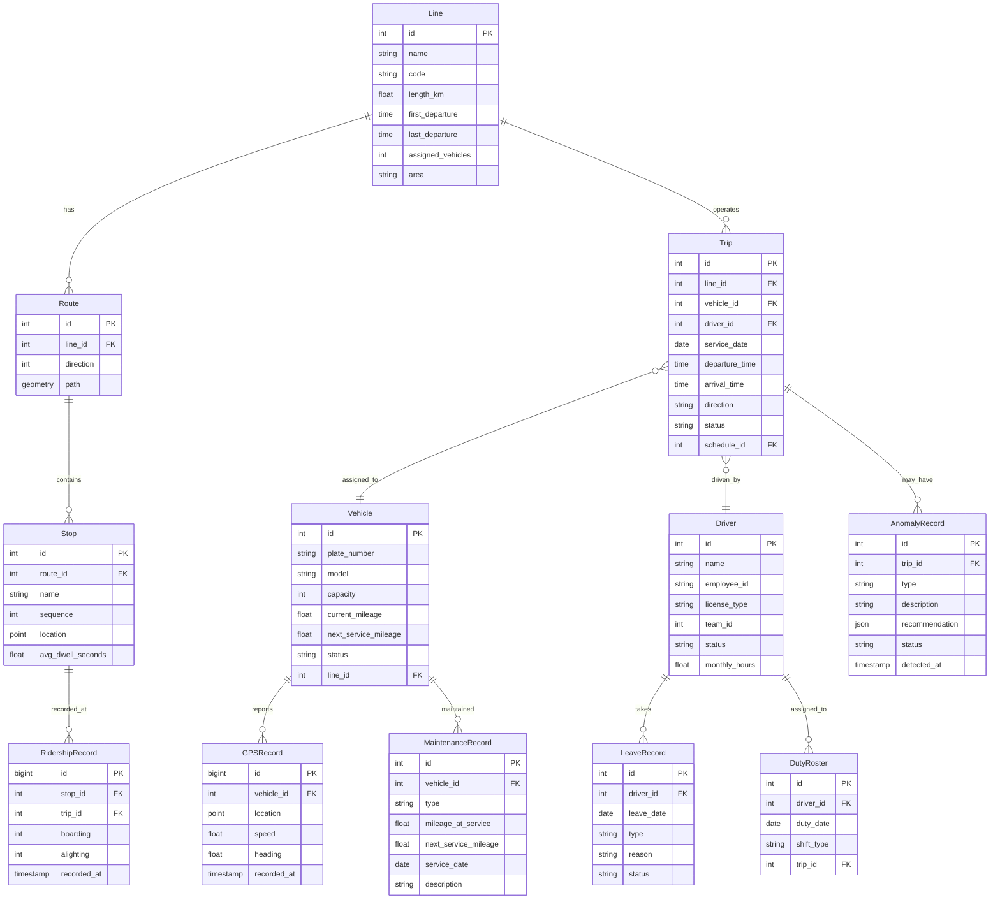

## 1. 架构设计

```mermaid
flowchart TB
    subgraph "前端层"
        "Vue3.4 + TypeScript5.3"
        "Pinia 状态管理"
        "Element Plus UI"
        "高德地图 JS API"
        "Socket.IO Client"
    end

    subgraph "网关层"
        "Nginx 反向代理"
        "静态资源服务"
        "WebSocket 升级"
    end

    subgraph "服务层"
        "Express4.18 REST API"
        "Apollo Server4 GraphQL"
        "Socket.IO4.7 实时推送"
        "排班引擎服务"
    end

    subgraph "数据层"
        "PostgreSQL16"
        "PostGIS3.4 空间扩展"
        "时序分区表"
    end

    subgraph "外部设备"
        "GPS 车载设备"
        "客流计数器"
        "车载终端"
    end

    "Vue3.4 + TypeScript5.3" --> "Nginx 反向代理"
    "GPS 车载设备" --> "Express4.18 REST API"
    "客流计数器" --> "Express4.18 REST API"
    "Nginx 反向代理" --> "Express4.18 REST API"
    "Nginx 反向代理" --> "Apollo Server4 GraphQL"
    "Nginx 反向代理" --> "Socket.IO4.7 实时推送"
    "Express4.18 REST API" --> "PostgreSQL16"
    "Apollo Server4 GraphQL" --> "PostgreSQL16"
    "排班引擎服务" --> "PostgreSQL16"
    "PostgreSQL16" --> "PostGIS3.4 空间扩展"
    "Socket.IO4.7 实时推送" --> "Vue3.4 + TypeScript5.3"
```

## 2. 技术说明

- **前端**：Vue3.4 + TypeScript5.3 + Vite5 + Pinia + Element Plus + 高德地图 JS API
- **初始化工具**：vite-init (vue-express-ts 模板)
- **后端**：Node.js 20 LTS + Express4.18 + Apollo Server4 + TypeORM0.3
- **实时通信**：Socket.IO4.7
- **数据库**：PostgreSQL16 + PostGIS3.4，GPS轨迹按时序分区

## 3. 路由定义

| 路由 | 用途 |
|------|------|
| `/` | 调度看板主页面，线路地图与实时监控 |
| `/dispatch` | 调度看板，车辆实时位置与到站预测 |
| `/schedule` | 排班编辑器，甘特图式编排 |
| `/driver-schedule` | 司机排班管理，月度轮班表 |
| `/ridership` | 客流分析看板，OD热力图 |
| `/maintenance` | 维保管理，里程监控与故障处理 |
| `/daily-report` | 运营日报，指标汇总与导出 |

## 4. API 定义

### 4.1 RESTful 接口

```typescript
interface ScheduleAPI {
  GET    "/api/schedules": { lineId?: number; date: string; status?: string }
  POST   "/api/schedules": { lineId: number; date: string; trips: TripInput[] }
  PUT    "/api/schedules/:id": { trips: TripInput[] }
  PATCH  "/api/schedules/:id/status": { status: "draft" | "pending" | "approved" | "rejected" }
  DELETE "/api/schedules/:id": void
  POST   "/api/schedules/generate": { lineId: number; date: string; constraints: ScheduleConstraints }
}

interface VehicleAPI {
  GET    "/api/vehicles": { status?: string; lineId?: number; page?: number; pageSize?: number }
  GET    "/api/vehicles/:id": Vehicle
  PATCH  "/api/vehicles/:id/status": { status: string; reason?: string }
  POST   "/api/vehicles/:id/maintenance": { type: string; mileage: number; nextServiceMileage: number }
}

interface GPSAPI {
  POST   "/api/gps/report": { vehicleId: string; lat: number; lng: number; speed: number; timestamp: string }
  GET    "/api/gps/vehicles/:id/trajectory": { startTime: string; endTime: string }
}

interface RidershipAPI {
  POST   "/api/ridership/upload": { stopId: number; timestamp: string; boarding: number; alighting: number }
  GET    "/api/ridership/line/:lineId": { date: string; direction?: number }
  GET    "/api/ridership/heatmap": { lineId: number; date: string }
}

interface DriverAPI {
  GET    "/api/drivers": { teamId?: number; status?: string }
  POST   "/api/drivers/:id/leave": { date: string; type: string; reason: string }
  POST   "/api/drivers/:id/substitute": { originalDriverId: number; date: string }
}

interface ReportAPI {
  GET    "/api/reports/daily": { date: string; lineId?: number }
  GET    "/api/reports/daily/export": { date: string; format: "pdf" | "excel"; lineId?: number }
}
```

### 4.2 GraphQL Schema

```graphql
type Query {
  line(id: ID!): Line
  lines(area: String): [Line!]!
  trip(id: ID!): Trip
  driver(id: ID!): Driver
  vehicle(id: ID!): Vehicle
  ridership(lineId: ID!, date: String!, direction: Int): [RidershipRecord!]!
  arrivalPrediction(vehicleId: ID!, stopId: ID!): ArrivalPrediction!
  scheduleAnomalies(lineId: ID, date: String): [Anomaly!]!
}

type Mutation {
  generateSchedule(lineId: ID!, date: String!, constraints: ScheduleConstraintsInput!): Schedule!
  approveSchedule(id: ID!): Schedule!
  rejectSchedule(id: ID!, reason: String!): Schedule!
  confirmDispatchAdjustment(anomalyId: ID!, adjustment: AdjustmentInput!): DispatchResult!
  reportVehicleFault(vehicleId: ID!, description: String!, location: PointInput!): EmergencyPlan!
  requestSubstitute(driverId: ID!, date: String!): SubstituteSuggestion!
}

type Subscription {
  vehicleLocationUpdated(lineId: ID): VehicleLocation!
  anomalyDetected(lineId: ID): Anomaly!
  scheduleStatusChanged(scheduleId: ID): Schedule!
}
```

## 5. 服务端架构图

```mermaid
flowchart LR
    subgraph "Controller层"
        "scheduleRouter"
        "vehicleRouter"
        "gpsRouter"
        "ridershipRouter"
        "driverRouter"
        "reportRouter"
    end

    subgraph "GraphQL Resolver层"
        "opsResolver"
        "scheduleResolver"
        "ridershipResolver"
    end

    subgraph "Service层"
        "dispatchEngine"
        "arrivalPredictor"
        "anomalyDetector"
        "substituteMatcher"
        "reportGenerator"
    end

    subgraph "Repository层"
        "scheduleRepo"
        "vehicleRepo"
        "driverRepo"
        "ridershipRepo"
        "gpsRepo"
    end

    subgraph "Database"
        "PostgreSQL + PostGIS"
    end

    "scheduleRouter" --> "dispatchEngine"
    "vehicleRouter" --> "vehicleRepo"
    "gpsRouter" --> "gpsRepo"
    "ridershipRouter" --> "ridershipRepo"
    "driverRouter" --> "substituteMatcher"
    "reportRouter" --> "reportGenerator"
    "opsResolver" --> "arrivalPredictor"
    "opsResolver" --> "anomalyDetector"
    "scheduleResolver" --> "dispatchEngine"
    "ridershipResolver" --> "ridershipRepo"
    "dispatchEngine" --> "scheduleRepo"
    "dispatchEngine" --> "vehicleRepo"
    "dispatchEngine" --> "driverRepo"
    "arrivalPredictor" --> "gpsRepo"
    "anomalyDetector" --> "ridershipRepo"
    "anomalyDetector" --> "scheduleRepo"
    "substituteMatcher" --> "driverRepo"
    "reportGenerator" --> "scheduleRepo"
    "reportGenerator" --> "ridershipRepo"
    "scheduleRepo" --> "PostgreSQL + PostGIS"
    "vehicleRepo" --> "PostgreSQL + PostGIS"
    "driverRepo" --> "PostgreSQL + PostGIS"
    "ridershipRepo" --> "PostgreSQL + PostGIS"
    "gpsRepo" --> "PostgreSQL + PostGIS"
```

## 6. 数据模型

### 6.1 数据模型定义



### 6.2 数据定义语言

```sql
-- 线路表
CREATE TABLE line (
    id SERIAL PRIMARY KEY,
    name VARCHAR(100) NOT NULL,
    code VARCHAR(20) NOT NULL UNIQUE,
    length_km DECIMAL(8,2) NOT NULL,
    first_departure TIME NOT NULL,
    last_departure TIME NOT NULL,
    assigned_vehicles INT NOT NULL DEFAULT 0,
    area VARCHAR(50),
    created_at TIMESTAMP DEFAULT NOW(),
    updated_at TIMESTAMP DEFAULT NOW()
);

-- 路线表（上/下行）
CREATE TABLE route (
    id SERIAL PRIMARY KEY,
    line_id INT NOT NULL REFERENCES line(id),
    direction SMALLINT NOT NULL CHECK (direction IN (0, 1)),
    path GEOMETRY(LINESTRING, 4326),
    created_at TIMESTAMP DEFAULT NOW()
);

-- 站点表
CREATE TABLE stop (
    id SERIAL PRIMARY KEY,
    route_id INT NOT NULL REFERENCES route(id),
    name VARCHAR(100) NOT NULL,
    sequence INT NOT NULL,
    location GEOMETRY(POINT, 4326) NOT NULL,
    avg_dwell_seconds DECIMAL(6,1) DEFAULT 30.0,
    created_at TIMESTAMP DEFAULT NOW()
);
CREATE INDEX idx_stop_route ON stop(route_id);
CREATE INDEX idx_stop_location ON stop USING GIST(location);

-- 车辆表
CREATE TABLE vehicle (
    id SERIAL PRIMARY KEY,
    plate_number VARCHAR(20) NOT NULL UNIQUE,
    model VARCHAR(50) NOT NULL,
    capacity INT NOT NULL,
    current_mileage DECIMAL(10,1) DEFAULT 0,
    next_service_mileage DECIMAL(10,1) NOT NULL,
    status VARCHAR(20) NOT NULL DEFAULT 'available',
    line_id INT REFERENCES line(id),
    created_at TIMESTAMP DEFAULT NOW(),
    updated_at TIMESTAMP DEFAULT NOW()
);

-- 司机表
CREATE TABLE driver (
    id SERIAL PRIMARY KEY,
    name VARCHAR(50) NOT NULL,
    employee_id VARCHAR(20) NOT NULL UNIQUE,
    license_type VARCHAR(10) NOT NULL,
    team_id INT NOT NULL,
    status VARCHAR(20) NOT NULL DEFAULT 'on_duty',
    monthly_hours DECIMAL(6,1) DEFAULT 0,
    created_at TIMESTAMP DEFAULT NOW(),
    updated_at TIMESTAMP DEFAULT NOW()
);

-- 班次表
CREATE TABLE trip (
    id SERIAL PRIMARY KEY,
    line_id INT NOT NULL REFERENCES line(id),
    vehicle_id INT REFERENCES vehicle(id),
    driver_id INT REFERENCES driver(id),
    schedule_id INT NOT NULL,
    service_date DATE NOT NULL,
    departure_time TIME NOT NULL,
    arrival_time TIME,
    direction SMALLINT NOT NULL CHECK (direction IN (0, 1)),
    status VARCHAR(20) NOT NULL DEFAULT 'planned',
    created_at TIMESTAMP DEFAULT NOW(),
    updated_at TIMESTAMP DEFAULT NOW()
);
CREATE INDEX idx_trip_line_date ON trip(line_id, service_date);
CREATE INDEX idx_trip_vehicle_date ON trip(vehicle_id, service_date);
CREATE INDEX idx_trip_driver_date ON trip(driver_id, service_date);

-- GPS轨迹表（按月分区）
CREATE TABLE gps_record (
    id BIGSERIAL,
    vehicle_id INT NOT NULL REFERENCES vehicle(id),
    location GEOMETRY(POINT, 4326) NOT NULL,
    speed DECIMAL(5,1) DEFAULT 0,
    heading DECIMAL(5,1) DEFAULT 0,
    recorded_at TIMESTAMP NOT NULL,
    PRIMARY KEY (id, recorded_at)
) PARTITION BY RANGE (recorded_at);

-- 创建月度分区（示例）
CREATE TABLE gps_record_2026_01 PARTITION OF gps_record
    FOR VALUES FROM ('2026-01-01') TO ('2026-02-01');
CREATE TABLE gps_record_2026_02 PARTITION OF gps_record
    FOR VALUES FROM ('2026-02-01') TO ('2026-03-01');

CREATE INDEX idx_gps_vehicle_time ON gps_record(vehicle_id, recorded_at);
CREATE INDEX idx_gps_location ON gps_record USING GIST(location);

-- 客流记录表
CREATE TABLE ridership_record (
    id BIGSERIAL PRIMARY KEY,
    stop_id INT NOT NULL REFERENCES stop(id),
    trip_id INT REFERENCES trip(id),
    boarding INT NOT NULL DEFAULT 0,
    alighting INT NOT NULL DEFAULT 0,
    recorded_at TIMESTAMP NOT NULL DEFAULT NOW()
);
CREATE INDEX idx_ridership_stop_time ON ridership_record(stop_id, recorded_at);
CREATE INDEX idx_ridership_trip ON ridership_record(trip_id);

-- 维保记录表
CREATE TABLE maintenance_record (
    id SERIAL PRIMARY KEY,
    vehicle_id INT NOT NULL REFERENCES vehicle(id),
    type VARCHAR(30) NOT NULL,
    mileage_at_service DECIMAL(10,1) NOT NULL,
    next_service_mileage DECIMAL(10,1) NOT NULL,
    service_date DATE NOT NULL,
    description TEXT,
    created_at TIMESTAMP DEFAULT NOW()
);

-- 请假记录表
CREATE TABLE leave_record (
    id SERIAL PRIMARY KEY,
    driver_id INT NOT NULL REFERENCES driver(id),
    leave_date DATE NOT NULL,
    type VARCHAR(20) NOT NULL,
    reason TEXT,
    status VARCHAR(20) NOT NULL DEFAULT 'pending',
    created_at TIMESTAMP DEFAULT NOW()
);

-- 值班表
CREATE TABLE duty_roster (
    id SERIAL PRIMARY KEY,
    driver_id INT NOT NULL REFERENCES driver(id),
    duty_date DATE NOT NULL,
    shift_type VARCHAR(20) NOT NULL,
    trip_id INT REFERENCES trip(id),
    created_at TIMESTAMP DEFAULT NOW()
);
CREATE INDEX idx_duty_driver_date ON duty_roster(driver_id, duty_date);

-- 异常记录表
CREATE TABLE anomaly_record (
    id SERIAL PRIMARY KEY,
    trip_id INT NOT NULL REFERENCES trip(id),
    type VARCHAR(30) NOT NULL,
    description TEXT,
    recommendation JSONB,
    status VARCHAR(20) NOT NULL DEFAULT 'pending',
    detected_at TIMESTAMP NOT NULL DEFAULT NOW(),
    resolved_at TIMESTAMP
);
CREATE INDEX idx_anomaly_status ON anomaly_record(status, detected_at);

-- 排班计划表
CREATE TABLE schedule (
    id SERIAL PRIMARY KEY,
    line_id INT NOT NULL REFERENCES line(id),
    service_date DATE NOT NULL,
    status VARCHAR(20) NOT NULL DEFAULT 'draft',
    created_by INT NOT NULL,
    approved_by INT,
    approved_at TIMESTAMP,
    created_at TIMESTAMP DEFAULT NOW(),
    updated_at TIMESTAMP DEFAULT NOW(),
    UNIQUE(line_id, service_date)
);
```
