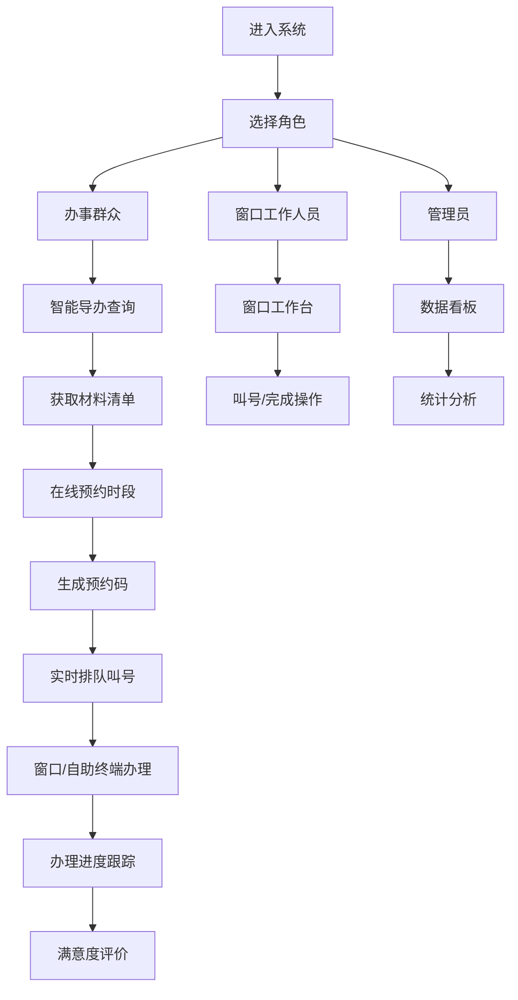

## 1. 产品概述

区级政务服务中心智能导办系统，解决群众办事过程中材料准备不明确、排队时间长、进度不透明等痛点问题，日均服务3000人次。系统为办事群众、窗口工作人员、管理员三类角色提供差异化功能，实现智能导办、在线预约、实时排队、进度查询、自助终端、满意度评价、窗口管理、数据看板八大核心功能。

## 2. 核心功能

### 2.1 用户角色

| 角色 | 登录方式 | 核心权限 |
|------|----------|----------|
| 办事群众 | 身份选择进入 | 智能导办查询、在线预约、实时排队查看、办理进度查询、自助终端操作、满意度评价 |
| 窗口工作人员 | 工号登录 | 叫号操作、办理完成、查看今日办理量、查看当前等待人数 |
| 管理员 | 管理员账号登录 | 数据看板查看、各窗口负载监控、满意度趋势分析、事项办理时效统计 |

### 2.2 功能模块

1. **智能导办**：意图识别推荐、材料清单展示、模板预览、材料准备进度跟踪
2. **在线预约**：事项选择、时段预约、预约码生成、提醒推送、预约队列管理
3. **实时排队**：窗口排队热力图、预计等待时间、叫号提醒、过号重排、放弃排队
4. **办理进度**：状态跟踪（受理中/审核中/已办结）、环节时间戳追溯
5. **自助终端交互**：身份认证、材料上传、电子签名、凭证打印预览
6. **满意度评价**：星级评分、文字评价、历史评价查询
7. **窗口管理**：今日办理量统计、等待人数显示、叫号/完成操作
8. **数据看板**：人流量统计、窗口负载分析、满意度趋势、办理时效统计

### 2.3 页面详情

| 页面名称 | 模块名称 | 功能描述 |
|---------|---------|---------|
| 群众首页 | 步骤式引导 | 大字号按钮，智能导办/在线预约/实时排队/进度查询四大入口 |
| 智能导办页 | 意图输入区 | 办事意图文本输入，智能推荐事项分类 |
| 智能导办页 | 材料清单区 | 所需材料列表、材料模板预览、准备进度勾选 |
| 在线预约页 | 事项选择器 | 事项分类搜索、事项详情展示 |
| 在线预约页 | 时段选择器 | 日期选择、时段选择、预约确认 |
| 实时排队页 | 窗口热力图 | 12个综合窗口+8个专业窗口色块展示，热度颜色区分 |
| 实时排队页 | 排队详情 | 当前号码、前方等待人数、预计等待时间进度条 |
| 办理进度页 | 进度时间线 | 各环节状态节点、时间戳展示 |
| 自助终端页 | 触屏交互 | 身份认证、材料上传、电子签名画布、凭证预览 |
| 满意度评价页 | 星级评分 | 星级滑块组件、文字评价输入、提交按钮 |
| 窗口工作台 | 工作人员面板 | 叫号按钮、完成按钮、当前办理事项、今日统计 |
| 管理员看板 | 数据仪表盘 | 人流量折线图、窗口负载柱状图、满意度趋势图 |

## 3. 核心流程

群众进入系统 → 选择角色 → 智能导办查询事项及材料 → 在线预约时段 → 到厅后实时排队 → 窗口或自助终端办理 → 查看办理进度 → 办结后满意度评价

## 4. 用户界面设计

### 4.1 设计风格

- **主色调**：政务蓝 #1E88E5，辅助色 #64B5F6、#BBDEFB
- **强调色**：橙色 #FF9800（叫号提醒）、绿色 #4CAF50（已完成）、红色 #F44336（过号）
- **卡片风格**：白色圆角卡片，边框 #E3F2FD，阴影 0 2px 8px rgba(30, 136, 229, 0.1)
- **按钮风格**：圆角 8px，主按钮渐变背景，悬停上浮效果
- **字体**：系统默认中文字体，大字号按钮 18px，正文 14px
- **布局**：顶部固定导航栏，卡片式内容区块，步骤式引导流程

### 4.2 页面设计概述

| 页面名称 | 模块名称 | UI元素 |
|---------|---------|--------|
| 群众首页 | 步骤引导区 | 渐变色大卡片、图标按钮、步骤指示器 |
| 智能导办页 | 意图输入 | 大输入框、搜索按钮、推荐标签 |
| 智能导办页 | 材料清单 | 可折叠列表、附件图标、进度勾选框 |
| 实时排队页 | 窗口热力图 | 网格布局色块、数字徽章、颜色渐变 |
| 实时排队页 | 排队进度 | 进度条动画、倒计时、叫号提醒弹窗 |
| 自助终端页 | 操作流程 | 竖屏布局、大触控按钮、步骤动画 |
| 管理员看板 | 数据图表 | 响应式图表、数据卡片、刷新动画 |

### 4.3 响应式设计

- 桌面端 1920px：多列网格布局，完整功能展示
- 平板端 1024px：自适应列数，侧边栏收起
- 移动端 375px：单列卡片布局，表格转卡片列表，底部导航栏
- 触屏优化：按钮最小高度 48px，触摸反馈效果

## 5. 性能约束

- 页面初次加载 ≤ 3秒
- 单页操作响应 ≤ 200ms
- 支持 50 人并发操作
- 本地存储 ≤ 5MB
- 自助终端交互延迟 ≤ 100ms
