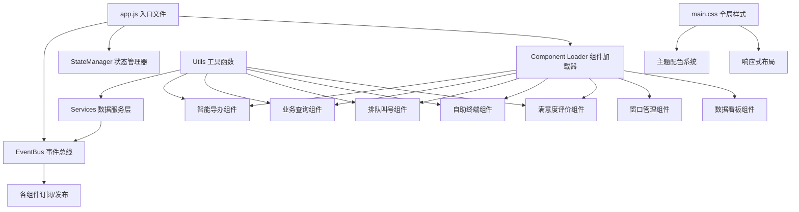
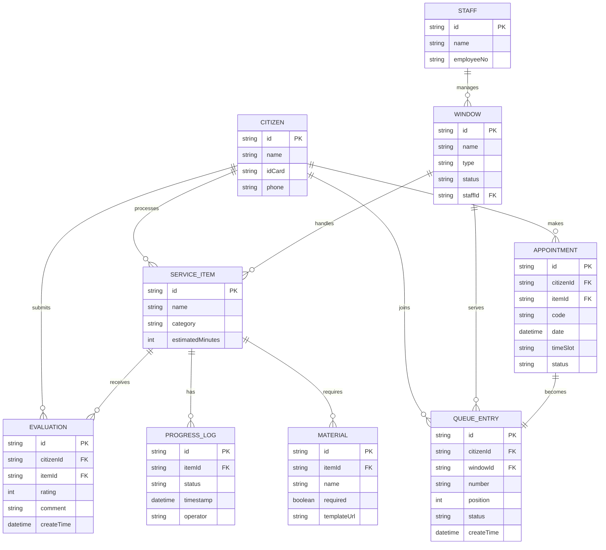

## 1. 架构设计



## 2. 技术描述

- **前端框架**：jQuery 3.6.0 + Bootstrap 4.6.0
- **组件化标准**：Web Components (Custom Elements v1)
- **状态管理**：自定义 EventBus 事件总线模式
- **数据层**：LocalStorage + 模拟 API 服务
- **构建工具**：无，原生 HTML/CSS/JS 直接运行
- **图标系统**：Font Awesome 5.15.4
- **图表库**：Chart.js 3.7.0

## 3. 目录结构

```
/
├── index.html              # 主入口页面
├── app.js                  # 应用入口，初始化全局对象
├── main.css                # 全局样式与主题
├── components/             # Web Components 组件
│   ├── SmartGuide.js       # 智能导办组件
│   ├── BusinessQuery.js    # 业务查询组件
│   ├── QueueSystem.js      # 排队叫号组件
│   ├── SelfService.js      # 自助终端交互组件
│   ├── Satisfaction.js     # 满意度评价组件
│   ├── WindowManage.js     # 窗口管理组件
│   └── DataDashboard.js    # 数据看板组件
├── services/               # 数据服务层
│   ├── MockData.js         # 模拟数据
│   ├── ApiService.js       # API 服务封装
│   └── QueueService.js     # 排队业务服务
├── utils/                  # 工具函数
│   ├── EventBus.js         # 事件总线
│   ├── StateManager.js     # 状态管理器
│   ├── DateUtils.js        # 日期格式化
│   ├── FormValidator.js    # 表单验证
│   └── Storage.js          # 本地存储封装
└── assets/                 # 静态资源
    ├── icons/              # 图标资源
    └── templates/          # 材料模板
```

## 4. 组件生命周期

每个 Web Component 实现以下生命周期方法：

| 方法 | 调用时机 | 职责 |
|------|----------|------|
| `init()` | 组件创建时 | 初始化状态、订阅事件、绑定数据 |
| `render()` | 数据变更时 | 根据状态渲染 UI、更新 DOM |
| `destroy()` | 组件移除时 | 取消订阅、清理定时器、释放资源 |

## 5. 事件总线设计

### 5.1 核心事件定义

| 事件名称 | 触发时机 | 数据负载 |
|----------|----------|----------|
| `queue:update` | 排队状态变更 | `{ windowId, queueLength, waitTime }` |
| `queue:call` | 叫号时 | `{ queueNumber, windowId }` |
| `appointment:created` | 预约成功 | `{ appointmentId, code, time }` |
| `status:changed` | 办理状态变更 | `{ itemId, status, timestamp }` |
| `material:checked` | 材料勾选 | `{ materialId, checked }` |
| `satisfaction:submitted` | 评价提交 | `{ rating, comment }` |
| `window:call` | 窗口叫号 | `{ windowId, nextNumber }` |
| `window:complete` | 办理完成 | `{ windowId, itemId }` |
| `role:changed` | 角色切换 | `{ role }` |
| `page:navigate` | 页面导航 | `{ page }` |

### 5.2 状态管理模型

```javascript
// 全局状态结构
{
  currentRole: 'citizen' | 'staff' | 'admin',
  currentPage: 'home' | 'guide' | 'queue' | 'appointment' | 'progress' | 'selfservice' | 'evaluation' | 'window' | 'dashboard',
  currentUser: { id, name, role },
  queueState: {
    windows: [{ id, name, type, status, currentNumber, queueLength, waitTime }],
    myQueue: { number, position, windowId, status }
  },
  appointments: [{ id, itemName, time, code, status }],
  progressItems: [{ id, name, status, timeline: [{ status, time }] }],
  materials: {
    itemId: { name, list: [{ id, name, required, checked, hasTemplate }] }
  }
}
```

## 6. API 服务定义

### 6.1 事项查询 API

```javascript
// GET /api/items?keyword=xxx
Response: {
  code: 200,
  data: [{
    id: string,
    name: string,
    category: string,
    description: string,
    estimatedTime: number,
    requiredMaterials: string[]
  }]
}
```

### 6.2 材料清单 API

```javascript
// GET /api/items/:id/materials
Response: {
  code: 200,
  data: {
    itemId: string,
    itemName: string,
    materials: [{
      id: string,
      name: string,
      required: boolean,
      hasTemplate: boolean,
      templateUrl: string
    }]
  }
}
```

### 6.3 预约提交 API

```javascript
// POST /api/appointments
Request: { itemId: string, date: string, timeSlot: string }
Response: {
  code: 200,
  data: {
    id: string,
    code: string,
    itemName: string,
    date: string,
    timeSlot: string,
    queuePosition: number
  }
}
```

### 6.4 排队状态 API

```javascript
// GET /api/queue/status
Response: {
  code: 200,
  data: {
    windows: [{
      id: string,
      name: string,
      type: 'comprehensive' | 'specialized',
      status: 'idle' | 'busy' | 'paused',
      currentNumber: string,
      queueLength: number,
      averageWaitTime: number
    }]
  }
}
```

## 7. 数据模型

### 7.1 ER 图



## 8. 性能优化策略

1. **首屏加载优化**
   - 关键 CSS 内联，非关键 CSS 异步加载
   - jQuery、Bootstrap 使用 CDN 预加载
   - 组件按需加载，首屏仅渲染首页组件

2. **响应式优化**
   - 使用 CSS Grid + Flexbox 自适应布局
   - 移动端 375px 断点，表格转卡片布局
   - 触摸事件优先，减少点击延迟

3. **状态更新优化**
   - 事件防抖/节流处理高频操作
   - 局部 DOM 更新，避免全量重渲染
   - 虚拟列表处理长数据展示

4. **本地存储策略**
   - 预约记录、排队状态本地缓存
   - 材料勾选进度本地持久化
   - 定期清理过期数据，控制 5MB 上限

5. **并发处理**
   - 排队状态轮询间隔 2s
   - WebSocket 模拟实时推送
   - 乐观更新 + 状态回滚机制
