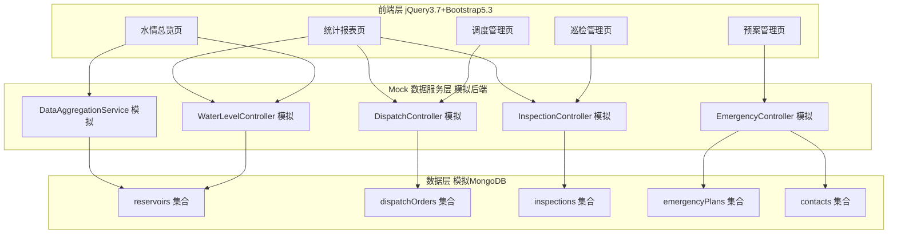
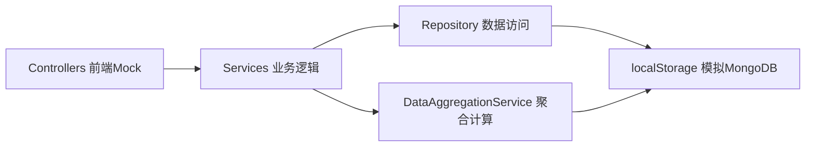
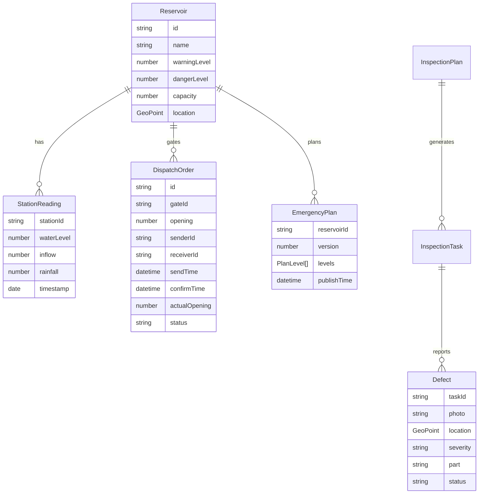

## 1. 架构设计

本系统采用前后端分离架构。生产目标架构为 ASP.NET Core 8.0 Web API + MongoDB 7.0 后端，前端为 jQuery 3.7 + Bootstrap 5.3。在本交付物中，后端逻辑（Controllers/Services/Models）以浏览器端 Mock 数据服务层实现，完整模拟水位聚合计算、调度指令流转、巡检闭环、预案版本匹配等核心业务逻辑，数据持久化至 localStorage 模拟 MongoDB 集合，确保全部功能可在浏览器中真实运行与演示。



## 2. 技术说明

- **前端**：jQuery 3.7 + Bootstrap 5.3 + Bootstrap Icons + Chart.js 4.x（图表）+ jsPDF（PDF 导出），遵循用户指定技术栈
- **初始化工具**：原生 HTML 多页 + 静态资源，Vite 不适用（jQuery 多页应用），直接以 index.html 入口
- **后端**：浏览器端 Mock 数据服务层（js/services/*.js）模拟 ASP.NET Core 8.0 Controllers/Services，生产环境可平滑替换为真实 Web API 调用
- **数据库**：localStorage 持久化模拟 MongoDB 集合，预置种子数据（8 座水库、12 雨量站、15 水闸、巡检任务、调度指令、预案版本、通讯录）
- **接口文档**：Swagger/OpenAPI 3.0 风格的 API 定义见第 4 节，全部端点在前端 Mock 层实现并校验参数返回结构化错误

## 3. 路由定义

| 路由 | 用途 |
|-------|---------|
| index.html#/overview | 水情总览：地图+实时数据+水位柱状图+洪水演进 |
| index.html#/dispatch | 调度管理：指令列表+下发+确认回填+追溯 |
| index.html#/inspection | 巡检管理：任务卡片+缺陷上报+筛选统计 |
| index.html#/emergency | 预案管理：预案树+版本比对+应急匹配+通讯录 |
| index.html#/report | 统计报表：水位过程线+降雨等值线+操作次数+缺陷占比+PDF导出 |

## 4. API 定义

### 4.1 水位雨量 WaterLevelController

```typescript
// 获取全部站点最新水情
GET /api/waterlevel/latest -> StationReading[]
// 按站点+时间范围查询历史
GET /api/waterlevel/history?stationId=&start=&end= -> ReadingRecord[]
// 聚合预警阈值计算（DataAggregationService）
GET /api/waterlevel/aggregate/warnings -> Warning[]
// 洪水演进模拟
POST /api/waterlevel/flood-sim { reservoirId, inflow, discharge, downstream[] } -> FloodSimResult
```

### 4.2 调度指令 DispatchController

```typescript
// 指令列表（支持状态/时间筛选）
GET /api/dispatch?status=&from= -> DispatchOrder[]
// 下发指令
POST /api/dispatch { gateId, opening, receiverId, remark } -> DispatchOrder
// 确认回填
PUT /api/dispatch/{id}/confirm { actualOpening } -> DispatchOrder
// 全流程追溯
GET /api/dispatch/{id}/trace -> TraceNode[]
// 操作统计
GET /api/dispatch/stats -> DispatchStat
```

### 4.3 巡检 InspectionController

```typescript
// 任务列表（待办/已完成）
GET /api/inspection?status= -> InspectionTask[]
// 生成月度计划
POST /api/inspection/plan { month } -> InspectionTask[]
// 提交缺陷
POST /api/inspection/{id}/defect { photo, location, severity, part } -> Defect
// 缺陷筛选统计
GET /api/inspection/defects?severity=&status= -> DefectStat
```

### 4.4 预案/应急 EmergencyController

```typescript
// 预案树
GET /api/emergency/plans -> PlanTree
// 版本列表与比对
GET /api/emergency/plans/{reservoirId}/versions -> PlanVersion[]
GET /api/emergency/plans/{reservoirId}/diff?v1=&v2= -> DiffResult
// 水位匹配预案条款
GET /api/emergency/match?reservoirId=&level= -> PlanClause
// 通讯录
GET /api/contacts?role= -> Contact[]
POST /api/contacts/notify { ids[], message } -> NotifyResult
```

### 4.5 结构化错误响应

```typescript
{ "success": false, "code": "VALIDATION_ERROR", "message": "...", "field": "opening" }
```

## 5. 服务架构图



## 6. 数据模型

### 6.1 数据模型定义



### 6.2 数据定义语言

MongoDB 文档结构（前端以 localStorage JSON 集合模拟）：

```javascript
// reservoirs 集合 - 水库文档
{ _id, name, type:"reservoir", warningLevel, dangerLevel, capacity, location:{lat,lng}, gates:[{id,name}] }
// stations 集合 - 雨量站
{ _id, name, type:"rainStation", location:{lat,lng} }
// readings 集合 - 时序水位数据（5年3000万条，前端按需生成采样）
{ stationId, waterLevel, inflow, rainfall, timestamp }
// dispatchOrders 集合 - 调度指令
{ _id, gateId, opening, senderId, receiverId, sendTime, deadline, confirmTime, actualOpening, status, remark }
// inspections 集合 - 巡检任务
{ _id, month, route, inspectorId, status, dueDate, defects:[{photo,location,severity,part,status,createdAt}] }
// emergencyPlans 集合 - 预案版本
{ _id, reservoirId, version, levels:[{name,threshold,measures:[]}], publishTime, author }
// contacts 集合 - 通讯录
{ _id, name, role, phone, group }
```

索引建议（生产 MongoDB）：`readings` 上 `{stationId:1, timestamp:-1}`、`dispatchOrders` 上 `{status:1, sendTime:-1}`，支撑 2 秒查询与 50 并发。
