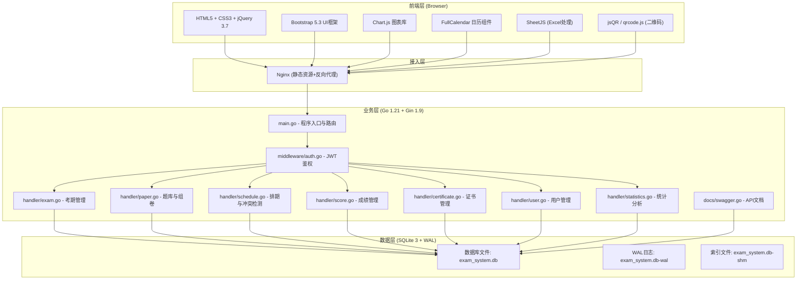
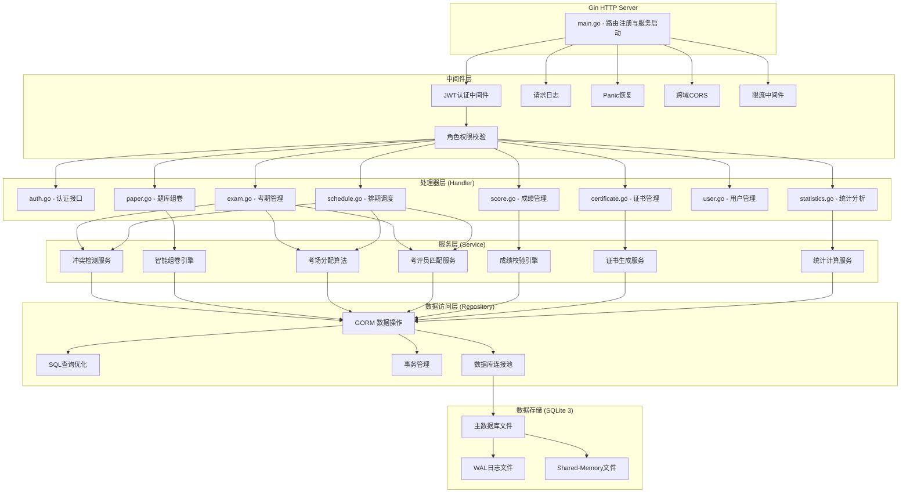
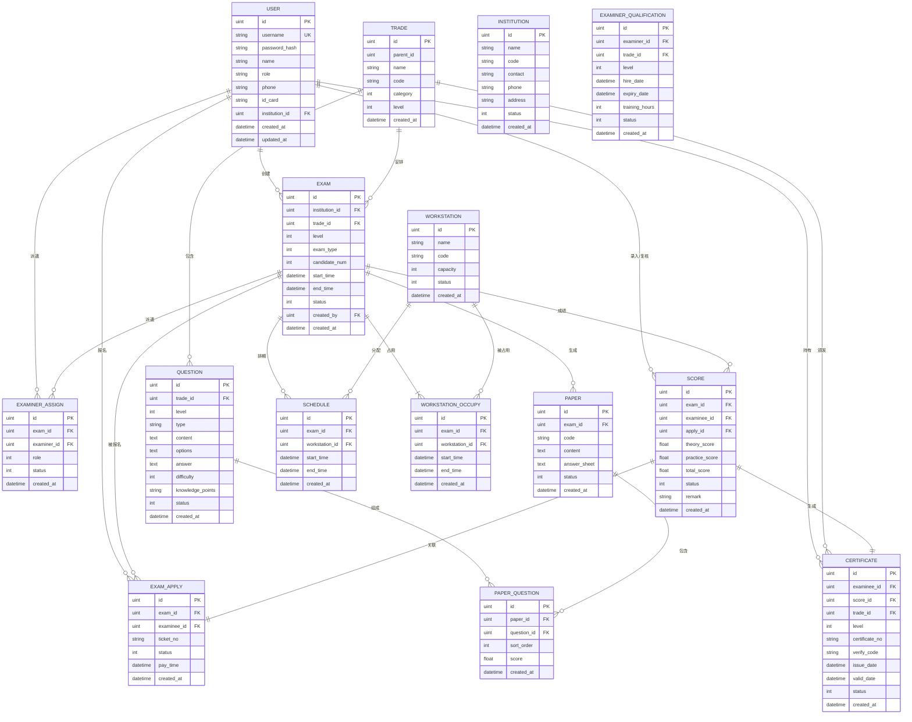

## 1. 架构设计



## 2. 技术描述

### 2.1 技术栈选型

| 层级 | 技术选型 | 版本 | 说明 |
|------|----------|------|------|
| 前端框架 | jQuery | 3.7.1 | 轻量级DOM操作与AJAX |
| UI框架 | Bootstrap | 5.3.0 | 响应式布局与组件库 |
| 图表库 | Chart.js | 4.4.0 | 数据可视化图表 |
| 日历组件 | FullCalendar | 6.1.10 | 考期日历视图与拖拽 |
| Excel处理 | SheetJS (xlsx) | 0.18.5 | 成绩批量导入导出 |
| 二维码 | qrcode.js | 1.5.3 | 电子证书二维码生成 |
| 后端语言 | Go | 1.21 | 高性能编译型语言 |
| Web框架 | Gin | 1.9.0 | 轻量级高性能Web框架 |
| 数据库 | SQLite | 3.40.0+ | 嵌入式数据库，启用WAL模式 |
| ORM | GORM | 1.26.1 | Go语言ORM框架 |
| 认证 | JWT | golang-jwt/v5 | 无状态Token认证 |
| API文档 | Swagger | 2.0/OpenAPI 3.0 | 自动生成接口文档 |
| Excel导出 | Excelize | 2.8.0 | Go语言Excel处理库 |

### 2.2 关键技术决策

1. **SQLite + WAL模式**：满足并发200 QPS需求，WAL模式支持读并发，写入性能满足业务峰值
2. **JWT无状态认证**：减少服务端Session存储，支持横向扩展
3. **Gin框架**：中间件机制完善，性能优异，适合高并发场景
4. **前端技术栈**：jQuery + Bootstrap满足政务系统兼容性要求，无需复杂构建流程

### 2.3 性能约束保障

| 指标 | 约束要求 | 技术保障 |
|------|----------|----------|
| 冲突检测响应 | ≤2秒 | 数据库索引优化，内存缓存考场占用表 |
| 单份试卷生成 | ≤3秒 | 预缓存题库，随机算法优化，难度分层预分组 |
| 5000条成绩校验 | ≤10秒 | 流式处理Excel，批量校验，并发goroutine处理 |
| 并发报名峰值 | 200 QPS | SQLite WAL模式，连接池优化，读写分离 |
| 后端内存占用 | ≤256MB | 限制goroutine池大小，流式处理大数据集 |

## 3. 路由定义

| 方法 | 路由路径 | 模块 | 权限要求 | 说明 |
|------|----------|------|----------|------|
| POST | /api/auth/login | auth | 公开 | 用户登录获取Token |
| POST | /api/auth/register | auth | 公开 | 考生自助注册 |
| GET | /api/users/profile | user | 所有登录用户 | 获取当前用户信息 |
| PUT | /api/users/password | user | 所有登录用户 | 修改密码 |
| GET | /api/exams | exam | admin, institution, examiner | 获取考期列表 |
| POST | /api/exams | exam | institution | 提交考期申请 |
| GET | /api/exams/:id | exam | all | 获取考期详情 |
| PUT | /api/exams/:id | exam | admin | 审批/更新考期 |
| GET | /api/exams/:id/conflicts | exam | institution, admin | 检测考期冲突 |
| POST | /api/exams/:id/apply | exam | examinee | 考生报名考期 |
| GET | /api/exams/calendar | exam | admin, institution | 日历视图数据 |
| GET | /api/questions | paper | admin, institution | 获取题目列表 |
| POST | /api/questions | paper | admin | 新增题目 |
| PUT | /api/questions/:id | paper | admin | 更新题目 |
| POST | /api/questions/batch | paper | admin | 批量导入题目 |
| POST | /api/papers/generate | paper | admin, institution | 智能组卷 |
| GET | /api/papers/:id | paper | admin, institution | 获取试卷详情 |
| GET | /api/schedule/workstations | schedule | admin | 获取考场工位列表 |
| GET | /api/schedule/examiners/available | schedule | admin | 查询可用考评员 |
| GET | /api/schedule/conflicts | schedule | admin | 批量冲突检测 |
| POST | /api/schedule/assign | schedule | admin | 分配考场与考评员 |
| GET | /api/examiners | user | admin | 获取考评员列表 |
| GET | /api/examiners/:id/warnings | user | admin | 获取考评员资质预警 |
| GET | /api/scores | score | admin, institution, examiner | 获取成绩列表 |
| POST | /api/scores/batch | score | institution, examiner | 批量导入成绩 |
| POST | /api/scores/validate | score | institution, examiner | 成绩校验 |
| PUT | /api/scores/:id | score | admin | 复核成绩 |
| POST | /api/scores/:id/publish | score | admin | 发布成绩 |
| GET | /api/scores/public | score | examinee | 查询本人成绩 |
| GET | /api/certificates | certificate | admin, examinee | 获取证书列表 |
| POST | /api/certificates/generate | certificate | admin | 生成电子证书 |
| GET | /api/certificates/:id/download | certificate | examinee | 下载电子证书 |
| GET | /api/certificates/verify/:code | certificate | 公开 | 证书在线验真 |
| GET | /api/statistics/overview | statistics | admin | 首页统计概览 |
| GET | /api/statistics/monthly | statistics | admin | 月度统计 |
| GET | /api/statistics/trade | statistics | admin | 工种统计 |
| GET | /api/statistics/institution | statistics | admin | 机构统计 |
| GET | /api/statistics/export | statistics | admin | 导出统计报表 |

## 4. API定义

### 4.1 通用响应结构

```go
// 通用响应
type Response struct {
    Code    int         `json:"code" example:"200"`
    Message string      `json:"message" example:"success"`
    Data    interface{} `json:"data,omitempty"`
}

// 分页响应
type PageResponse struct {
    Code     int         `json:"code" example:"200"`
    Message  string      `json:"message" example:"success"`
    Data     interface{} `json:"data"`
    Total    int64       `json:"total" example:"100"`
    Page     int         `json:"page" example:"1"`
    PageSize int         `json:"pageSize" example:"20"`
}
```

### 4.2 用户相关

```go
// 登录请求
type LoginRequest struct {
    Username string `json:"username" binding:"required" example:"admin"`
    Password string `json:"password" binding:"required" example:"123456"`
}

// 登录响应
type LoginResponse struct {
    Token string `json:"token" example:"eyJhbGciOiJIUzI1NiIs..."`
    User  UserInfo `json:"user"`
}

// 用户信息
type UserInfo struct {
    ID       uint   `json:"id" example:"1"`
    Username string `json:"username" example:"admin"`
    Name     string `json:"name" example:"系统管理员"`
    Role     string `json:"role" example:"admin"`
    RoleName string `json:"roleName" example:"中心管理员"`
}

// 角色定义
const (
    RoleAdmin      = "admin"      // 中心管理员
    RoleInstitution = "institution" // 认定机构联络员
    RoleExaminer   = "examiner"   // 考评员
    RoleExaminee   = "examinee"   // 考生
)
```

### 4.3 考期相关

```go
// 考期创建请求
type ExamCreateRequest struct {
    InstitutionID uint      `json:"institutionId" binding:"required"`
    TradeID       uint      `json:"tradeId" binding:"required"`
    Level         int       `json:"level" binding:"required,oneof=1 2 3"` // 1初级2中级3高级
    ExamType      int       `json:"examType" binding:"required"` // 1理论2实操3综合
    CandidateNum  int       `json:"candidateNum" binding:"required,min=1"`
    ExpectedStart time.Time `json:"expectedStart" binding:"required"`
    ExpectedEnd   time.Time `json:"expectedEnd" binding:"required,gtfield=ExpectedStart"`
    WorkstationIDs []uint   `json:"workstationIds"`
    ExaminerIDs   []uint    `json:"examinerIds"`
    Remark        string    `json:"remark"`
}

// 冲突检测响应
type ConflictResponse struct {
    HasConflict bool         `json:"hasConflict"`
    Conflicts   []ConflictDetail `json:"conflicts,omitempty"`
    Suggestions []TimeSuggestion `json:"suggestions,omitempty"`
}

type ConflictDetail struct {
    Type    string `json:"type"` // workstation, examiner, qualification
    Message string `json:"message"`
}

type TimeSuggestion struct {
    Start time.Time `json:"start"`
    End   time.Time `json:"end"`
    Score float64   `json:"score"` // 匹配度评分
}
```

### 4.4 组卷相关

```go
// 组卷请求
type PaperGenerateRequest struct {
    TradeID    uint   `json:"tradeId" binding:"required"`
    Level      int    `json:"level" binding:"required,oneof=1 2 3"`
    QuestionNum int   `json:"questionNum" binding:"required,min=10"`
    EasyRatio   float64 `json:"easyRatio" binding:"required" example:"0.3"`
    MediumRatio float64 `json:"mediumRatio" binding:"required" example:"0.5"`
    HardRatio   float64 `json:"hardRatio" binding:"required" example:"0.2"`
    NeedABPaper bool   `json:"needABPaper"` // 是否生成A/B卷
}

// 题目结构
type Question struct {
    ID              uint     `json:"id"`
    Type            string   `json:"type"` // single, multiple, judge, essay
    Content         string   `json:"content"`
    Options         []string `json:"options,omitempty"`
    Answer          string   `json:"answer,omitempty"`
    Difficulty      int      `json:"difficulty"` // 1易2中3难
    KnowledgePoints []string `json:"knowledgePoints,omitempty"`
    Score           float64  `json:"score"`
}
```

### 4.5 成绩相关

```go
// 成绩导入结果
type ScoreImportResult struct {
    Total     int             `json:"total"`
    Success   int             `json:"success"`
    Failed    int             `json:"failed"`
    ErrorRows []ScoreErrorRow `json:"errorRows,omitempty"`
}

type ScoreErrorRow struct {
    RowNum  int      `json:"rowNum"`
    Errors  []string `json:"errors"`
    RawData map[string]interface{} `json:"rawData"`
}
```

### 4.6 证书相关

```go
// 证书信息
type Certificate struct {
    ID           uint      `json:"id"`
    CertificateNo string   `json:"certificateNo"`
    HolderName   string    `json:"holderName"`
    IDCard       string    `json:"idCard"`
    TradeName    string    `json:"tradeName"`
    Level        int       `json:"level"`
    LevelName    string    `json:"levelName"`
    Score        float64   `json:"score"`
    IssueDate    time.Time `json:"issueDate"`
    ValidDate    time.Time `json:"validDate"`
    VerifyCode   string    `json:"verifyCode"`
    QRCodeURL    string    `json:"qrcodeUrl"`
    Status       int       `json:"status"` // 1有效2作废
}
```

## 5. 服务器架构图



## 6. 数据模型

### 6.1 ER图



### 6.2 DDL语句

```sql
-- 启用WAL模式
PRAGMA journal_mode = WAL;
PRAGMA synchronous = NORMAL;
PRAGMA cache_size = -20000;
PRAGMA temp_store = MEMORY;

-- 用户表
CREATE TABLE IF NOT EXISTS users (
    id INTEGER PRIMARY KEY AUTOINCREMENT,
    username VARCHAR(50) NOT NULL UNIQUE,
    password_hash VARCHAR(255) NOT NULL,
    name VARCHAR(100) NOT NULL,
    role VARCHAR(20) NOT NULL,
    phone VARCHAR(20),
    id_card VARCHAR(18),
    institution_id INTEGER,
    status INTEGER DEFAULT 1,
    created_at DATETIME DEFAULT CURRENT_TIMESTAMP,
    updated_at DATETIME DEFAULT CURRENT_TIMESTAMP,
    FOREIGN KEY (institution_id) REFERENCES institutions(id)
);
CREATE INDEX idx_users_role ON users(role);
CREATE INDEX idx_users_institution ON users(institution_id);

-- 工种表
CREATE TABLE IF NOT EXISTS trades (
    id INTEGER PRIMARY KEY AUTOINCREMENT,
    parent_id INTEGER DEFAULT 0,
    name VARCHAR(100) NOT NULL,
    code VARCHAR(50) NOT NULL,
    category INTEGER NOT NULL,
    level INTEGER NOT NULL,
    description TEXT,
    status INTEGER DEFAULT 1,
    created_at DATETIME DEFAULT CURRENT_TIMESTAMP
);
CREATE INDEX idx_trades_parent ON trades(parent_id);
CREATE INDEX idx_trades_category ON trades(category);
CREATE INDEX idx_trades_level ON trades(level);

-- 认定机构表
CREATE TABLE IF NOT EXISTS institutions (
    id INTEGER PRIMARY KEY AUTOINCREMENT,
    name VARCHAR(200) NOT NULL,
    code VARCHAR(50) NOT NULL UNIQUE,
    contact VARCHAR(50),
    phone VARCHAR(20),
    address VARCHAR(500),
    status INTEGER DEFAULT 1,
    created_at DATETIME DEFAULT CURRENT_TIMESTAMP
);

-- 考期表
CREATE TABLE IF NOT EXISTS exams (
    id INTEGER PRIMARY KEY AUTOINCREMENT,
    institution_id INTEGER NOT NULL,
    trade_id INTEGER NOT NULL,
    level INTEGER NOT NULL,
    exam_type INTEGER NOT NULL,
    candidate_num INTEGER NOT NULL,
    start_time DATETIME NOT NULL,
    end_time DATETIME NOT NULL,
    status INTEGER DEFAULT 0,
    created_by INTEGER NOT NULL,
    approved_by INTEGER,
    approved_at DATETIME,
    remark TEXT,
    created_at DATETIME DEFAULT CURRENT_TIMESTAMP,
    FOREIGN KEY (institution_id) REFERENCES institutions(id),
    FOREIGN KEY (trade_id) REFERENCES trades(id)
);
CREATE INDEX idx_exams_institution ON exams(institution_id);
CREATE INDEX idx_exams_trade ON exams(trade_id);
CREATE INDEX idx_exams_status ON exams(status);
CREATE INDEX idx_exams_time ON exams(start_time, end_time);

-- 考生报名表
CREATE TABLE IF NOT EXISTS exam_applies (
    id INTEGER PRIMARY KEY AUTOINCREMENT,
    exam_id INTEGER NOT NULL,
    examinee_id INTEGER NOT NULL,
    ticket_no VARCHAR(50) UNIQUE,
    status INTEGER DEFAULT 0,
    pay_amount DECIMAL(10,2),
    pay_time DATETIME,
    created_at DATETIME DEFAULT CURRENT_TIMESTAMP,
    FOREIGN KEY (exam_id) REFERENCES exams(id),
    FOREIGN KEY (examinee_id) REFERENCES users(id)
);
CREATE INDEX idx_applies_exam ON exam_applies(exam_id);
CREATE INDEX idx_applies_examinee ON exam_applies(examinee_id);

-- 考场工位表
CREATE TABLE IF NOT EXISTS workstations (
    id INTEGER PRIMARY KEY AUTOINCREMENT,
    name VARCHAR(100) NOT NULL,
    code VARCHAR(50) NOT NULL UNIQUE,
    capacity INTEGER NOT NULL DEFAULT 1,
    equipment TEXT,
    status INTEGER DEFAULT 1,
    created_at DATETIME DEFAULT CURRENT_TIMESTAMP
);

-- 排期表
CREATE TABLE IF NOT EXISTS schedules (
    id INTEGER PRIMARY KEY AUTOINCREMENT,
    exam_id INTEGER NOT NULL,
    workstation_id INTEGER NOT NULL,
    start_time DATETIME NOT NULL,
    end_time DATETIME NOT NULL,
    created_at DATETIME DEFAULT CURRENT_TIMESTAMP,
    FOREIGN KEY (exam_id) REFERENCES exams(id),
    FOREIGN KEY (workstation_id) REFERENCES workstations(id)
);
CREATE INDEX idx_schedules_workstation ON schedules(workstation_id);
CREATE INDEX idx_schedules_time ON schedules(start_time, end_time);

-- 考评员派遣表
CREATE TABLE IF NOT EXISTS examiner_assigns (
    id INTEGER PRIMARY KEY AUTOINCREMENT,
    exam_id INTEGER NOT NULL,
    examiner_id INTEGER NOT NULL,
    role INTEGER NOT NULL,
    status INTEGER DEFAULT 0,
    created_at DATETIME DEFAULT CURRENT_TIMESTAMP,
    FOREIGN KEY (exam_id) REFERENCES exams(id),
    FOREIGN KEY (examiner_id) REFERENCES users(id)
);
CREATE INDEX idx_assigns_exam ON examiner_assigns(exam_id);
CREATE INDEX idx_assigns_examiner ON examiner_assigns(examiner_id);

-- 考评员资质表
CREATE TABLE IF NOT EXISTS examiner_qualifications (
    id INTEGER PRIMARY KEY AUTOINCREMENT,
    examiner_id INTEGER NOT NULL,
    trade_id INTEGER NOT NULL,
    level INTEGER NOT NULL,
    hire_date DATETIME NOT NULL,
    expiry_date DATETIME NOT NULL,
    training_hours INTEGER DEFAULT 0,
    avoidance_units TEXT,
    status INTEGER DEFAULT 1,
    created_at DATETIME DEFAULT CURRENT_TIMESTAMP,
    FOREIGN KEY (examiner_id) REFERENCES users(id),
    FOREIGN KEY (trade_id) REFERENCES trades(id)
);
CREATE INDEX idx_qual_examiner ON examiner_qualifications(examiner_id);
CREATE INDEX idx_qual_trade ON examiner_qualifications(trade_id);
CREATE INDEX idx_qual_expiry ON examiner_qualifications(expiry_date);

-- 题库表
CREATE TABLE IF NOT EXISTS questions (
    id INTEGER PRIMARY KEY AUTOINCREMENT,
    trade_id INTEGER NOT NULL,
    level INTEGER NOT NULL,
    type VARCHAR(20) NOT NULL,
    content TEXT NOT NULL,
    options TEXT,
    answer TEXT NOT NULL,
    difficulty INTEGER NOT NULL,
    knowledge_points VARCHAR(500),
    status INTEGER DEFAULT 1,
    created_by INTEGER,
    created_at DATETIME DEFAULT CURRENT_TIMESTAMP,
    FOREIGN KEY (trade_id) REFERENCES trades(id)
);
CREATE INDEX idx_questions_trade ON questions(trade_id);
CREATE INDEX idx_questions_level ON questions(level);
CREATE INDEX idx_questions_difficulty ON questions(difficulty);
CREATE INDEX idx_questions_type ON questions(type);

-- 试卷表
CREATE TABLE IF NOT EXISTS papers (
    id INTEGER PRIMARY KEY AUTOINCREMENT,
    exam_id INTEGER NOT NULL,
    code VARCHAR(50) NOT NULL,
    paper_type VARCHAR(10) DEFAULT 'A',
    total_score DECIMAL(5,1) DEFAULT 100,
    pass_score DECIMAL(5,1) DEFAULT 60,
    answer_sheet TEXT,
    status INTEGER DEFAULT 1,
    created_at DATETIME DEFAULT CURRENT_TIMESTAMP,
    FOREIGN KEY (exam_id) REFERENCES exams(id)
);
CREATE INDEX idx_papers_exam ON papers(exam_id);

-- 试卷题目关联表
CREATE TABLE IF NOT EXISTS paper_questions (
    id INTEGER PRIMARY KEY AUTOINCREMENT,
    paper_id INTEGER NOT NULL,
    question_id INTEGER NOT NULL,
    sort_order INTEGER NOT NULL,
    score DECIMAL(5,1) NOT NULL,
    created_at DATETIME DEFAULT CURRENT_TIMESTAMP,
    FOREIGN KEY (paper_id) REFERENCES papers(id),
    FOREIGN KEY (question_id) REFERENCES questions(id)
);
CREATE INDEX idx_pq_paper ON paper_questions(paper_id);

-- 成绩表
CREATE TABLE IF NOT EXISTS scores (
    id INTEGER PRIMARY KEY AUTOINCREMENT,
    exam_id INTEGER NOT NULL,
    examinee_id INTEGER NOT NULL,
    apply_id INTEGER NOT NULL,
    theory_score DECIMAL(5,1),
    practice_score DECIMAL(5,1),
    total_score DECIMAL(5,1) NOT NULL,
    is_pass INTEGER DEFAULT 0,
    status INTEGER DEFAULT 0,
    reviewer_id INTEGER,
    review_remark TEXT,
    reviewed_at DATETIME,
    created_at DATETIME DEFAULT CURRENT_TIMESTAMP,
    FOREIGN KEY (exam_id) REFERENCES exams(id),
    FOREIGN KEY (examinee_id) REFERENCES users(id),
    FOREIGN KEY (apply_id) REFERENCES exam_applies(id)
);
CREATE INDEX idx_scores_exam ON scores(exam_id);
CREATE INDEX idx_scores_examinee ON scores(examinee_id);
CREATE INDEX idx_scores_status ON scores(status);
CREATE INDEX idx_scores_pass ON scores(is_pass);

-- 证书表
CREATE TABLE IF NOT EXISTS certificates (
    id INTEGER PRIMARY KEY AUTOINCREMENT,
    examinee_id INTEGER NOT NULL,
    score_id INTEGER NOT NULL,
    trade_id INTEGER NOT NULL,
    level INTEGER NOT NULL,
    certificate_no VARCHAR(50) NOT NULL UNIQUE,
    verify_code VARCHAR(32) NOT NULL UNIQUE,
    issue_date DATETIME NOT NULL,
    valid_date DATETIME NOT NULL,
    status INTEGER DEFAULT 1,
    created_at DATETIME DEFAULT CURRENT_TIMESTAMP,
    FOREIGN KEY (examinee_id) REFERENCES users(id),
    FOREIGN KEY (score_id) REFERENCES scores(id),
    FOREIGN KEY (trade_id) REFERENCES trades(id)
);
CREATE INDEX idx_certs_examinee ON certificates(examinee_id);
CREATE INDEX idx_certs_verify ON certificates(verify_code);

-- 考场占用记录表
CREATE TABLE IF NOT EXISTS workstation_occupies (
    id INTEGER PRIMARY KEY AUTOINCREMENT,
    exam_id INTEGER NOT NULL,
    workstation_id INTEGER NOT NULL,
    start_time DATETIME NOT NULL,
    end_time DATETIME NOT NULL,
    created_at DATETIME DEFAULT CURRENT_TIMESTAMP,
    FOREIGN KEY (exam_id) REFERENCES exams(id),
    FOREIGN KEY (workstation_id) REFERENCES workstations(id)
);
CREATE INDEX idx_occupy_workstation ON workstation_occupies(workstation_id);
CREATE INDEX idx_occupy_time ON workstation_occupies(start_time, end_time);

-- 操作日志表
CREATE TABLE IF NOT EXISTS operation_logs (
    id INTEGER PRIMARY KEY AUTOINCREMENT,
    user_id INTEGER NOT NULL,
    module VARCHAR(50) NOT NULL,
    action VARCHAR(50) NOT NULL,
    detail TEXT,
    ip_address VARCHAR(50),
    created_at DATETIME DEFAULT CURRENT_TIMESTAMP
);
CREATE INDEX idx_logs_user ON operation_logs(user_id);
CREATE INDEX idx_logs_module ON operation_logs(module);
CREATE INDEX idx_logs_time ON operation_logs(created_at);
```

### 6.3 初始化数据

```sql
-- 初始化管理员账号 (密码: 123456, bcrypt哈希)
INSERT INTO users (username, password_hash, name, role, status) VALUES
('admin', '$2a$10$N9qo8uLOickgx2ZMRZoMyeIjZAgcfl7p92ldGxad68LJZdL17lhWy', '系统管理员', 'admin', 1);

-- 初始化6大类工种分类
INSERT INTO trades (parent_id, name, code, category, level) VALUES
(0, '电工类', 'DG', 1, 0),
(0, '焊工类', 'HG', 2, 0),
(0, '起重工类', 'QZ', 3, 0),
(0, '制冷工类', 'ZL', 4, 0),
(0, '锅炉工类', 'GL', 5, 0),
(0, '电梯修理工类', 'DT', 6, 0);

-- 初始化示例工种（每个大类示例2个）
INSERT INTO trades (parent_id, name, code, category, level) VALUES
(1, '低压电工', 'DYDG', 1, 1),
(1, '高压电工', 'GYDG', 1, 1),
(2, '手工电弧焊', 'SGGDH', 2, 1),
(2, '气体保护焊', 'QTBBH', 2, 1),
(3, '桥式起重机司机', 'QSQZ', 3, 1),
(3, '门式起重机司机', 'MSQZ', 3, 1),
(4, '制冷设备维修工', 'ZLWX', 4, 1),
(4, '中央空调操作工', 'ZYKT', 4, 1),
(5, '工业锅炉司炉', 'GYGL', 5, 1),
(5, '电站锅炉司炉', 'DZGL', 5, 1),
(6, '电梯安装维修工', 'DTAZ', 6, 1),
(6, '自动扶梯维修工', 'FDTWX', 6, 1);

-- 初、中、高三个等级
INSERT INTO trades (parent_id, name, code, category, level) VALUES
-- 低压电工等级
(7, '低压电工（初级）', 'DYDG-C', 1, 1),
(7, '低压电工（中级）', 'DYDG-Z', 1, 2),
(7, '低压电工（高级）', 'DYDG-G', 1, 3),
-- 高压电工等级
(8, '高压电工（初级）', 'GYDG-C', 1, 1),
(8, '高压电工（中级）', 'GYDG-Z', 1, 2),
(8, '高压电工（高级）', 'GYDG-G', 1, 3);

-- 初始化6个考场工位
INSERT INTO workstations (name, code, capacity, equipment) VALUES
('实操考场1号工位', 'GC-001', 10, '电工实训台、万用表、钳形表'),
('实操考场2号工位', 'GC-002', 10, '焊接工位、焊机、防护设备'),
('实操考场3号工位', 'GC-003', 8, '起重机模拟操作台'),
('实操考场4号工位', 'GC-004', 6, '制冷设备、压力表、真空泵'),
('实操考场5号工位', 'GC-005', 6, '锅炉模拟系统、安全阀校验台'),
('实操考场6号工位', 'GC-006', 8, '电梯模拟轿厢、安全钳、限速器');

-- 初始化示例认定机构
INSERT INTO institutions (name, code, contact, phone, address) VALUES
('XX市职业技术学院', 'ZYJS-001', '张老师', '13800138001', 'XX市教育路100号'),
('XX市技师学院', 'JSXY-002', '李老师', '13800138002', 'XX市科技路200号'),
('XX市电力职业学校', 'DLZY-003', '王老师', '13800138003', 'XX市电力大道50号');
```
