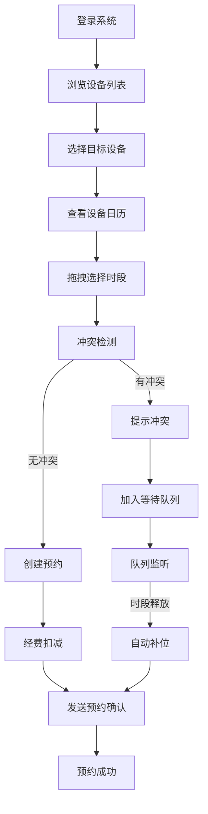

## 1. 产品概述

高校科研仪器共享预约管理系统，旨在解决科研设备预约管理混乱、利用率低下、跨中心共享困难等问题。系统覆盖设备全生命周期管理、智能预约调度、自动计费、维护保养、数据统计分析等核心功能，服务于超管、中心管理员、操作员、科研教师、研究生五类角色。

目标：将设备闲置率从40%降低至15%以下，消除预约冲突，实现跨中心设备共享，提升科研经费使用效率。

## 2. 核心功能

### 2.1 用户角色

| 角色 | 注册方式 | 核心权限 |
|------|----------|----------|
| 超管 | 后台创建 | 系统全局管理、用户权限分配、跨中心设备调配、查看所有数据 |
| 中心管理员 | 后台创建 | 本中心设备管理、维护计划制定、本中心预约审核、账单管理 |
| 操作员 | 后台创建 | 设备操作登记、使用记录确认、设备状态上报、辅助预约 |
| 科研教师 | 自主注册 | 设备预约、课题经费管理、账单查询、数据导出 |
| 研究生 | 导师关联注册 | 设备预约、使用记录、账单查询（经费从导师课题扣除） |

### 2.2 功能模块

1. **设备管理**：设备录入、规格参数、状态流转、变更日志、所属中心
2. **预约管理**：时段预约、冲突检测、系列预约、等待队列、自动补位
3. **计费管理**：费率配置、自动计费、账单生成、经费扣减、报表导出
4. **维护管理**：维护计划、时段锁禁、维护记录、恢复通知
5. **统计分析**：利用率统计、峰谷分析、趋势图表、多维度聚合
6. **权限管理**：RBAC角色权限、菜单控制、API鉴权
7. **日志审计**：操作记录、数据快照、变更追踪
8. **消息通知**：站内信推送、预约确认、维护提醒、补位通知

### 2.3 页面详情

| 页面名称 | 模块名称 | 功能描述 |
|-----------|-------------|---------------------|
| 登录页 | 身份认证 | 账号密码登录、JWT Token获取、角色路由跳转 |
| 首页仪表盘 | 数据概览 | 设备总览、今日预约、利用率趋势、待办提醒 |
| 设备列表页 | 设备管理 | 卡片网格展示、筛选搜索、状态徽章、空闲时段预览 |
| 设备详情页 | 设备管理 | 规格参数、历史预约、维护记录、使用率统计 |
| 预约日历页 | 预约管理 | 周视图时间轴、拖拽预约、冲突标记、等待队列展示 |
| 预约列表页 | 预约管理 | 我的预约、全部预约、预约审核、状态流转 |
| 账单管理页 | 计费管理 | 账单列表、经费扣减、月度报表导出、充值记录 |
| 维护计划页 | 维护管理 | 维护日历、计划创建、时段锁禁、维护记录 |
| 统计分析页 | 统计分析 | 利用率仪表盘、峰谷折线图、类别饼图、多维度筛选 |
| 日志审计页 | 系统管理 | 操作日志查询、前后值快照对比、导出 |
| 用户管理页 | 系统管理 | 用户列表、角色分配、权限配置、课题经费管理 |
| 个人中心页 | 用户信息 | 基本资料、密码修改、消息通知设置 |

## 3. 核心流程

### 3.1 设备预约流程

用户登录后浏览设备列表，选择目标设备查看空闲时段，在日历中拖拽选择预约时段，系统实时检测冲突。若无冲突则创建预约并扣费；若有冲突则提示并可选择加入等待队列。预约成功后发送确认通知。

### 3.2 维护管理流程

中心管理员创建维护计划，系统自动锁禁对应时段预约，通知已预约用户调整。维护完成后更新设备状态，通知等待队列首位用户。

### 3.3 计费流程

预约确认时根据设备费率和时长计算费用，从用户课题经费账户扣除。预约取消时按规则退费。每月生成月度账单，支持导出Excel。

## 4. 用户界面设计

### 4.1 设计风格

- **设计理念**：专业科研风格，简洁高效，数据可视化突出
- **主色调**：科技蓝 `#165DFF`，代表专业与可信
- **辅助色**：成功绿 `#00B42A`、警告橙 `#FF7D00`、危险红 `#F53F3F`
- **中性色**：深灰 `#1D2129`、中灰 `#4E5969`、浅灰 `#C9CDD4`、背景 `#F2F3F5`
- **字体**：主字体 PingFang SC / Hiragino Sans GB，数字字体 Roboto Mono
- **按钮风格**：圆角4px，悬停微动效，阴影层次分明
- **布局风格**：顶部导航+左侧菜单栏+内容区三栏布局，卡片式内容容器
- **图标风格**：线性图标，统一24px网格，颜色与状态对应

### 4.2 页面设计概览

| 页面名称 | 模块名称 | UI元素 |
|-----------|-------------|-------------|
| 登录页 | 身份认证 | 渐变背景、居中卡片、Logo动效、表单校验提示 |
| 首页仪表盘 | 数据概览 | 统计卡片网格、趋势折线图、设备状态环形图、待办列表 |
| 设备列表页 | 设备管理 | 卡片网格布局、筛选条件栏、状态徽章、悬浮操作按钮 |
| 预约日历页 | 预约管理 | 时间轴周视图、彩色事件块、拖拽选择、冲突红色高亮、等待队列灰色斜线 |
| 统计分析页 | 统计分析 | ECharts折线图、饼图、数据钻取、时间范围筛选器 |
| 账单管理页 | 计费管理 | 表格列表、状态标签、导出按钮、经费余额卡片 |

### 4.3 响应式设计

- **桌面端**（≥1200px）：三栏布局，侧边栏展开，设备卡片4列网格
- **平板端**（768px-1199px）：侧边栏可折叠，设备卡片2-3列网格
- **移动端**（<768px）：顶部汉堡菜单，设备卡片单列流式布局，日历简化为日视图

### 4.4 动效设计

- 页面加载：内容区渐入+上移，卡片错落延迟显示
- 悬停效果：卡片微上浮+阴影加深，按钮背景色过渡
- 预约拖拽：半透明跟随效果，落点时弹性动画
- 状态变更：状态徽章颜色渐变过渡
- 通知提示：右上角滑入动效

### 4.5 性能指标

- 设备列表加载 ≤ 300ms（200台设备）
- 预约冲突检测 ≤ 100ms
- 50并发预约原子性保证
- 10万条预约记录查询P99 ≤ 500ms
- 前端首屏渲染 ≤ 1.5s
