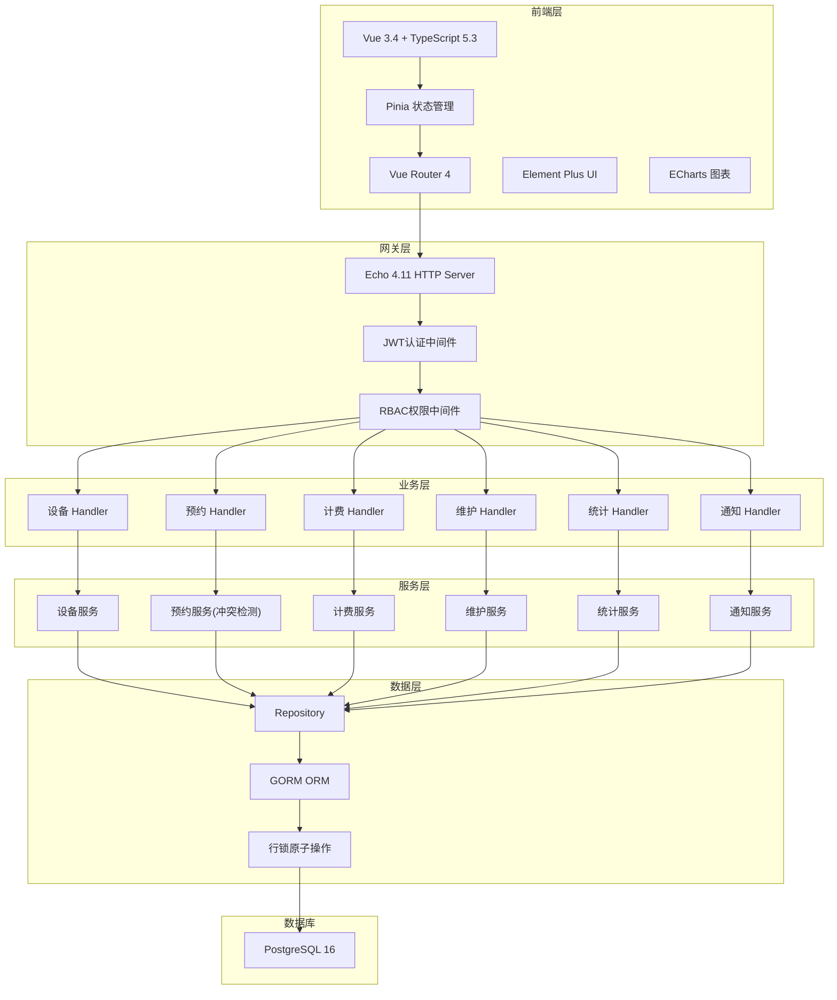
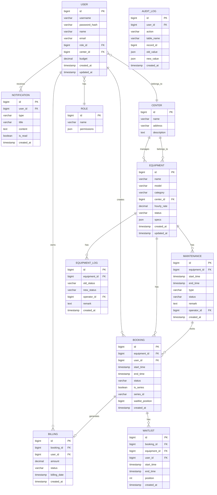

## 1. 架构设计



## 2. 技术栈说明

### 2.1 前端技术栈
- **框架**：Vue 3.4 + TypeScript 5.3 + Vite 5
- **状态管理**：Pinia 2.x
- **路由**：Vue Router 4.x
- **UI组件库**：Element Plus 2.x
- **图表库**：ECharts 5.x
- **HTTP客户端**：Axios 1.x
- **日期处理**：Day.js
- **代码规范**：ESLint + Prettier

### 2.2 后端技术栈
- **语言**：Go 1.22
- **Web框架**：Echo 4.11
- **ORM**：GORM 1.26
- **API文档**：swaggo/swag
- **认证**：golang-jwt/jwt/v5
- **密码加密**：golang.org/x/crypto/bcrypt

### 2.3 数据库
- **数据库**：PostgreSQL 16
- **连接池**：pgx / GORM内置连接池
- **索引策略**：B-tree索引 + 部分索引 + 覆盖索引

## 3. 项目目录结构

```
.
├── cmd/
│   └── server/
│       └── main.go              # 应用入口，路由注册
├── internal/
│   ├── model/
│   │   └── model.go             # 数据模型定义
│   ├── repository/
│   │   └── repo.go              # 数据访问层
│   ├── service/
│   │   ├── booking.go           # 预约与冲突检测
│   │   ├── equipment.go         # 设备管理
│   │   ├── billing.go           # 计费管理
│   │   ├── maintenance.go       # 维护管理
│   │   ├── stats.go             # 统计分析
│   │   └── notification.go      # 通知服务
│   ├── handler/
│   │   ├── equipment.go         # 设备接口
│   │   ├── booking.go           # 预约接口
│   │   ├── billing.go           # 计费接口
│   │   ├── maintenance.go       # 维护接口
│   │   ├── stats.go             # 统计接口
│   │   ├── notification.go      # 通知接口
│   │   ├── auth.go              # 认证接口
│   │   └── user.go              # 用户接口
│   └── middleware/
│       └── auth.go              # JWT认证与RBAC
├── frontend/
│   ├── src/
│   │   ├── api/                 # API请求封装
│   │   ├── assets/              # 静态资源
│   │   ├── components/          # 公共组件
│   │   ├── layouts/             # 布局组件
│   │   ├── router/              # 路由配置
│   │   ├── stores/              # Pinia状态管理
│   │   │   ├── user.ts
│   │   │   ├── equipment.ts
│   │   │   ├── booking.ts
│   │   │   └── notification.ts
│   │   ├── views/               # 页面组件
│   │   │   ├── auth/
│   │   │   ├── dashboard/
│   │   │   ├── equipment/
│   │   │   ├── booking/
│   │   │   ├── billing/
│   │   │   ├── maintenance/
│   │   │   ├── stats/
│   │   │   ├── audit/
│   │   │   └── user/
│   │   ├── utils/               # 工具函数
│   │   ├── types/               # TypeScript类型定义
│   │   ├── App.vue
│   │   └── main.ts
│   ├── index.html
│   ├── package.json
│   ├── vite.config.ts
│   └── tsconfig.json
├── deployments/
│   └── docker-compose.yml       # 本地开发环境
├── scripts/
│   └── init.sql                 # 数据库初始化脚本
├── go.mod
├── go.sum
├── .env.example
├── .gitignore
└── README.md
```

## 4. 路由定义

### 4.1 前端路由

| 路由路径 | 页面名称 | 权限要求 |
|----------|----------|----------|
| `/login` | 登录页 | 公开 |
| `/` | 首页仪表盘 | 已登录 |
| `/equipment` | 设备列表 | 已登录 |
| `/equipment/:id` | 设备详情 | 已登录 |
| `/booking` | 预约日历 | 已登录 |
| `/booking/list` | 预约列表 | 已登录 |
| `/billing` | 账单管理 | 教师/管理员 |
| `/maintenance` | 维护计划 | 管理员/操作员 |
| `/stats` | 统计分析 | 管理员/超管 |
| `/audit` | 日志审计 | 超管 |
| `/users` | 用户管理 | 超管 |
| `/profile` | 个人中心 | 已登录 |

### 4.2 后端API路由

| 方法 | 路径 | 说明 | 权限 |
|------|------|------|------|
| POST | `/api/auth/login` | 登录 | 公开 |
| GET | `/api/equipment` | 获取设备列表 | 已登录 |
| POST | `/api/equipment` | 创建设备 | 管理员 |
| GET | `/api/equipment/:id` | 获取设备详情 | 已登录 |
| PUT | `/api/equipment/:id` | 更新设备 | 管理员 |
| GET | `/api/booking` | 获取预约列表 | 已登录 |
| POST | `/api/booking` | 创建预约 | 已登录 |
| POST | `/api/booking/series` | 创建系列预约 | 已登录 |
| POST | `/api/booking/:id/cancel` | 取消预约 | 本人/管理员 |
| GET | `/api/booking/conflict` | 冲突检测 | 已登录 |
| POST | `/api/booking/waitlist` | 加入等待队列 | 已登录 |
| GET | `/api/billing` | 获取账单列表 | 教师/管理员 |
| POST | `/api/billing/export` | 导出月度报表 | 管理员 |
| GET | `/api/maintenance` | 获取维护计划 | 管理员/操作员 |
| POST | `/api/maintenance` | 创建维护计划 | 管理员 |
| POST | `/api/maintenance/:id/complete` | 完成维护 | 操作员 |
| GET | `/api/stats/utilization` | 利用率统计 | 管理员/超管 |
| GET | `/api/audit/logs` | 操作日志 | 超管 |
| GET | `/api/notification` | 获取通知列表 | 已登录 |

## 5. 数据模型

### 5.1 ER图



### 5.2 DDL语句

```sql
-- 角色表
CREATE TABLE roles (
    id BIGSERIAL PRIMARY KEY,
    name VARCHAR(50) NOT NULL UNIQUE,
    permissions JSONB NOT NULL DEFAULT '{}',
    created_at TIMESTAMPTZ NOT NULL DEFAULT NOW(),
    updated_at TIMESTAMPTZ NOT NULL DEFAULT NOW()
);

-- 实验中心表
CREATE TABLE centers (
    id BIGSERIAL PRIMARY KEY,
    name VARCHAR(100) NOT NULL,
    address VARCHAR(255),
    description TEXT,
    created_at TIMESTAMPTZ NOT NULL DEFAULT NOW(),
    updated_at TIMESTAMPTZ NOT NULL DEFAULT NOW()
);

-- 用户表
CREATE TABLE users (
    id BIGSERIAL PRIMARY KEY,
    username VARCHAR(50) NOT NULL UNIQUE,
    password_hash VARCHAR(255) NOT NULL,
    name VARCHAR(100) NOT NULL,
    email VARCHAR(100) UNIQUE,
    role_id BIGINT REFERENCES roles(id),
    center_id BIGINT REFERENCES centers(id),
    budget DECIMAL(12,2) NOT NULL DEFAULT 0,
    advisor_id BIGINT REFERENCES users(id),
    created_at TIMESTAMPTZ NOT NULL DEFAULT NOW(),
    updated_at TIMESTAMPTZ NOT NULL DEFAULT NOW()
);

-- 设备表
CREATE TABLE equipment (
    id BIGSERIAL PRIMARY KEY,
    name VARCHAR(100) NOT NULL,
    model VARCHAR(100),
    category VARCHAR(50) NOT NULL,
    center_id BIGINT REFERENCES centers(id),
    hourly_rate DECIMAL(10,2) NOT NULL,
    status VARCHAR(20) NOT NULL DEFAULT 'available',
    specs JSONB NOT NULL DEFAULT '{}',
    created_at TIMESTAMPTZ NOT NULL DEFAULT NOW(),
    updated_at TIMESTAMPTZ NOT NULL DEFAULT NOW()
);

-- 设备状态日志表
CREATE TABLE equipment_logs (
    id BIGSERIAL PRIMARY KEY,
    equipment_id BIGINT REFERENCES equipment(id),
    old_status VARCHAR(20),
    new_status VARCHAR(20) NOT NULL,
    operator_id BIGINT REFERENCES users(id),
    remark TEXT,
    created_at TIMESTAMPTZ NOT NULL DEFAULT NOW()
);

-- 预约表
CREATE TABLE bookings (
    id BIGSERIAL PRIMARY KEY,
    equipment_id BIGINT REFERENCES equipment(id) NOT NULL,
    user_id BIGINT REFERENCES users(id) NOT NULL,
    start_time TIMESTAMPTZ NOT NULL,
    end_time TIMESTAMPTZ NOT NULL,
    status VARCHAR(20) NOT NULL DEFAULT 'confirmed',
    is_series BOOLEAN NOT NULL DEFAULT FALSE,
    series_id VARCHAR(50),
    created_at TIMESTAMPTZ NOT NULL DEFAULT NOW(),
    updated_at TIMESTAMPTZ NOT NULL DEFAULT NOW()
);

-- 等待队列表
CREATE TABLE waitlists (
    id BIGSERIAL PRIMARY KEY,
    equipment_id BIGINT REFERENCES equipment(id) NOT NULL,
    user_id BIGINT REFERENCES users(id) NOT NULL,
    start_time TIMESTAMPTZ NOT NULL,
    end_time TIMESTAMPTZ NOT NULL,
    position INT NOT NULL,
    created_at TIMESTAMPTZ NOT NULL DEFAULT NOW()
);

-- 账单表
CREATE TABLE billings (
    id BIGSERIAL PRIMARY KEY,
    booking_id BIGINT REFERENCES bookings(id),
    user_id BIGINT REFERENCES users(id) NOT NULL,
    amount DECIMAL(12,2) NOT NULL,
    status VARCHAR(20) NOT NULL DEFAULT 'paid',
    billing_date DATE NOT NULL,
    created_at TIMESTAMPTZ NOT NULL DEFAULT NOW()
);

-- 维护计划表
CREATE TABLE maintenances (
    id BIGSERIAL PRIMARY KEY,
    equipment_id BIGINT REFERENCES equipment(id) NOT NULL,
    start_time TIMESTAMPTZ NOT NULL,
    end_time TIMESTAMPTZ NOT NULL,
    type VARCHAR(50) NOT NULL,
    status VARCHAR(20) NOT NULL DEFAULT 'scheduled',
    remark TEXT,
    operator_id BIGINT REFERENCES users(id),
    created_at TIMESTAMPTZ NOT NULL DEFAULT NOW(),
    updated_at TIMESTAMPTZ NOT NULL DEFAULT NOW()
);

-- 通知表
CREATE TABLE notifications (
    id BIGSERIAL PRIMARY KEY,
    user_id BIGINT REFERENCES users(id) NOT NULL,
    type VARCHAR(50) NOT NULL,
    title VARCHAR(200) NOT NULL,
    content TEXT NOT NULL,
    is_read BOOLEAN NOT NULL DEFAULT FALSE,
    created_at TIMESTAMPTZ NOT NULL DEFAULT NOW()
);

-- 审计日志表
CREATE TABLE audit_logs (
    id BIGSERIAL PRIMARY KEY,
    user_id BIGINT REFERENCES users(id),
    action VARCHAR(50) NOT NULL,
    table_name VARCHAR(50),
    record_id BIGINT,
    old_value JSONB,
    new_value JSONB,
    ip_address VARCHAR(45),
    created_at TIMESTAMPTZ NOT NULL DEFAULT NOW()
);

-- 索引
CREATE INDEX idx_bookings_equipment_time ON bookings(equipment_id, start_time, end_time);
CREATE INDEX idx_bookings_user ON bookings(user_id);
CREATE INDEX idx_bookings_status ON bookings(status);
CREATE INDEX idx_equipment_center ON equipment(center_id);
CREATE INDEX idx_equipment_category ON equipment(category);
CREATE INDEX idx_equipment_status ON equipment(status);
CREATE INDEX idx_waitlists_equipment ON waitlists(equipment_id, position);
CREATE INDEX idx_billings_user_date ON billings(user_id, billing_date);
CREATE INDEX idx_maintenances_equipment_time ON maintenances(equipment_id, start_time);
CREATE INDEX idx_notifications_user_read ON notifications(user_id, is_read);
CREATE INDEX idx_audit_logs_created ON audit_logs(created_at DESC);
```

## 6. 服务器架构


### 6.1 关键技术点

1. **原子冲突检测**：使用 `SELECT ... FOR UPDATE` 行锁确保并发预约的原子性
2. **冲突检测SQL**：
   ```sql
   SELECT COUNT(*) FROM bookings 
   WHERE equipment_id = ? 
   AND status = 'confirmed'
   AND start_time < ? 
   AND end_time > ?
   FOR UPDATE
   ```

3. **JWT认证**：HS256算法，Token有效期2小时，支持Refresh Token
4. **RBAC权限矩阵**：基于角色的API访问控制，中间件统一校验
5. **数据库连接池**：最大空闲连接10，最大打开连接100，连接最大生命周期1小时
6. **查询优化**：使用覆盖索引减少回表，预编译语句提升性能

## 7. API TypeScript 类型定义

```typescript
// 用户相关
interface User {
  id: number;
  username: string;
  name: string;
  email: string;
  roleId: number;
  roleName: string;
  centerId: number;
  centerName: string;
  budget: number;
  createdAt: string;
}

interface LoginRequest {
  username: string;
  password: string;
}

interface LoginResponse {
  token: string;
  user: User;
  permissions: string[];
}

// 设备相关
interface Equipment {
  id: number;
  name: string;
  model: string;
  category: string;
  centerId: number;
  centerName: string;
  hourlyRate: number;
  status: 'available' | 'maintenance' | 'scrapped';
  specs: Record<string, any>;
  currentUser?: string;
  nextFreeTime?: string;
  createdAt: string;
}

// 预约相关
interface Booking {
  id: number;
  equipmentId: number;
  equipmentName: string;
  userId: number;
  userName: string;
  startTime: string;
  endTime: string;
  status: 'confirmed' | 'cancelled' | 'completed' | 'waitlist';
  isSeries: boolean;
  seriesId?: string;
  createdAt: string;
}

interface BookingCreateRequest {
  equipmentId: number;
  startTime: string;
  endTime: string;
  isSeries?: boolean;
  seriesWeeks?: number;
}

interface ConflictCheckRequest {
  equipmentId: number;
  startTime: string;
  endTime: string;
}

interface ConflictCheckResponse {
  hasConflict: boolean;
  conflictingBookings: Booking[];
}

// 账单相关
interface Billing {
  id: number;
  bookingId: number;
  userId: number;
  userName: string;
  amount: number;
  status: 'paid' | 'refunded' | 'pending';
  billingDate: string;
  equipmentName: string;
  createdAt: string;
}

// 维护相关
interface Maintenance {
  id: number;
  equipmentId: number;
  equipmentName: string;
  startTime: string;
  endTime: string;
  type: 'routine' | 'repair' | 'calibration';
  status: 'scheduled' | 'in_progress' | 'completed';
  remark: string;
  operatorId: number;
  operatorName: string;
  createdAt: string;
}

// 统计相关
interface UtilizationStats {
  equipmentId: number;
  equipmentName: string;
  utilizationRate: number;
  totalHours: number;
  bookedHours: number;
  period: string;
}

interface CategoryStats {
  category: string;
  count: number;
  utilizationRate: number;
}

interface CenterStats {
  centerId: number;
  centerName: string;
  equipmentCount: number;
  utilizationRate: number;
}

// 通知相关
interface Notification {
  id: number;
  userId: number;
  type: 'booking_confirm' | 'maintenance_complete' | 'waitlist_advance' | 'billing_generated';
  title: string;
  content: string;
  isRead: boolean;
  createdAt: string;
}

// 审计日志
interface AuditLog {
  id: number;
  userId: number;
  userName: string;
  action: string;
  tableName: string;
  recordId: number;
  oldValue: Record<string, any>;
  newValue: Record<string, any>;
  ipAddress: string;
  createdAt: string;
}
```
