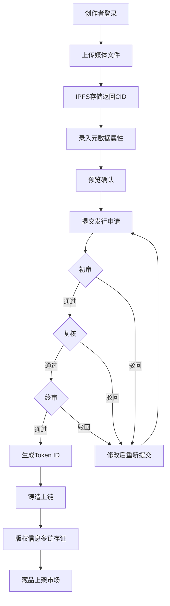
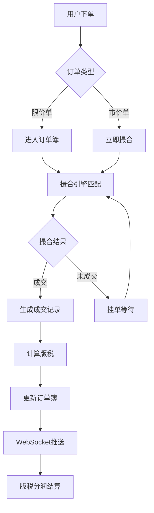
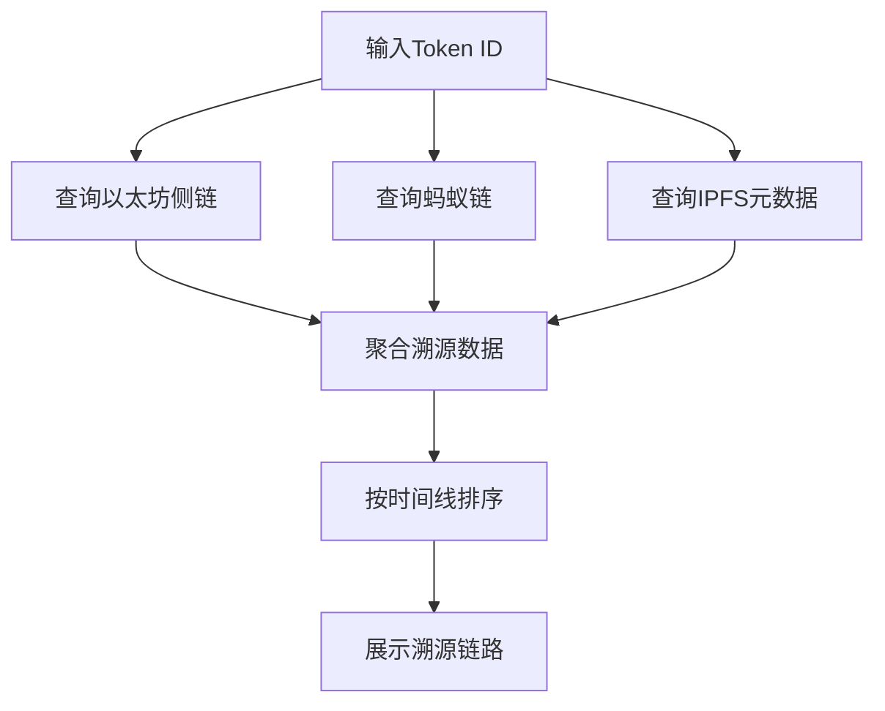

## 1. 产品概述

某省级数字藏品交易平台综合运营系统，覆盖藏品全生命周期管理、实时交易撮合、版权溯源存证、版税自动分润、风控预警和开放API对接。服务于150家创作机构、2000名个人创作者和8万名藏家用户，管理3200款已发行数字藏品及45万笔累计交易量。

- 解决藏品发行审核靠邮件、元数据录入手动易错的运营痛点
- 实现高性能实时交易撮合（5000 TPS）、版权跨链存证溯源、版税自动分润结算

## 2. 核心功能

### 2.1 用户角色

| 角色 | 注册方式 | 核心权限 |
|------|----------|----------|
| 藏家用户 | 手机号/邮箱注册 | 浏览市场、购买藏品、管理资产、转赠 |
| 个人创作者 | 实名认证注册 | 提交发行申请、查看版税收益、管理作品 |
| 机构创作者 | 企业资质认证注册 | 批量发行、多级审核提交、版税结算管理 |
| 运营人员 | 内部账号分配 | 审核发行申请、风控复核、数据统计查看 |
| 系统管理员 | 内部账号分配 | 全部权限、API管理、系统配置 |

### 2.2 功能模块

1. **藏品市场页**：瀑布流藏品展示、搜索筛选排序、实时价格推送、3D卡片悬浮效果
2. **交易页面**：订单簿深度图、K线图、限价/市价下单、实时撮合推送
3. **我的资产页**：持有藏品列表、藏品详情与溯源、转赠与跨平台导出
4. **创作者中心**：多步骤发行向导（上传-属性-预览-提交）、发行管理、版税收益
5. **数据统计页**：发行量/交易额/活跃用户统计、热度排行、收益排行、报表导出
6. **风控管理页**：异常交易预警列表、账户冻结/解冻、规则配置
7. **开放API管理**：API密钥管理、调用频率限制、接口文档

### 2.3 页面详情

| 页面名称 | 模块名称 | 功能描述 |
|----------|----------|----------|
| 藏品市场 | 瀑布流展示区 | 瀑布流卡片布局展示藏品，支持按稀有度/价格/时间排序筛选 |
| 藏品市场 | 搜索筛选栏 | 关键词搜索、分类筛选、稀有度筛选、价格区间 |
| 藏品市场 | 藏品卡片 | 缩略图、名称、稀有度标签、当前价格、3D悬浮效果 |
| 交易页面 | 订单簿深度图 | 左侧实时买卖盘口深度可视化 |
| 交易页面 | K线图 | 右侧价格走势K线图，支持1分/5分/1时/1日切换 |
| 交易页面 | 下单区 | 底部限价单/市价单切换输入、数量滑块、预估金额 |
| 我的资产 | 藏品列表 | 持有藏品网格展示，筛选排序，估值统计 |
| 我的资产 | 藏品详情 | 元数据展示、溯源时间线、转赠/导出操作 |
| 创作者中心 | 发行向导 | 四步骤：上传媒体→属性录入→预览确认→提交审核 |
| 创作者中心 | 发行管理 | 已提交发行列表、审核状态跟踪、编辑/撤回 |
| 创作者中心 | 版税收益 | 收益概览、分润明细、对账报表导出、提现 |
| 数据统计 | 概览仪表盘 | 日/周/月发行量、交易额、活跃用户数卡片 |
| 数据统计 | 排行榜 | 藏品热度排行、创作者收益排行 |
| 数据统计 | 报表导出 | CSV导出、图表展示 |
| 风控管理 | 预警列表 | 异常交易实时预警、风险等级标签 |
| 风控管理 | 账户管理 | 冻结/解冻操作、手动复核 |
| 风控管理 | 规则配置 | 风控规则参数设置 |

## 3. 核心流程

### 3.1 藏品发行流程

创作机构/个人创作者提交发行申请，上传媒体文件至IPFS，录入属性元数据。系统自动分配Token ID，进入多级审核流程（初审→复核→终审）。审核通过后自动铸造上链，版权信息存证至多链（以太坊侧链+蚂蚁链），藏品进入市场可交易。

### 3.2 交易撮合流程

买家提交买单/卖家提交卖单进入撮合引擎，按价格优先、时间优先原则匹配。撮合成功后生成成交记录，自动计算版税，更新订单簿并推送WebSocket消息，触发版税分润结算。

### 3.3 版权溯源流程

按Token ID查询，系统从多链（以太坊侧链+蚂蚁链）和IPFS聚合溯源数据，按时间线展示完整链路：创作→发行→流转（交易/转赠）→销毁，每条记录包含时间戳、操作者签名和哈希值。

## 4. 用户界面设计

### 4.1 设计风格

- **主色调**：深蓝渐变背景（#0a0e27 → #1a1f4e）搭配金色强调色（#d4a853）
- **辅助色**：深灰卡片背景（#12162e）、翠绿涨色（#00d4aa）、赤红跌色（#ff4757）
- **按钮风格**：圆角8px，金色渐变主按钮，幽灵按钮次级操作
- **字体**：标题使用 Playfair Display（衬线），正文使用 DM Sans（无衬线），数据使用 JetBrains Mono（等宽）
- **布局风格**：左侧固定导航栏 + 右侧内容区，卡片式内容组织
- **图标风格**：线性图标，2px描边，金色悬停效果
- **动效**：卡片悬浮3D旋转、页面切换淡入、数据更新脉冲、骨架屏加载

### 4.2 页面设计概览

| 页面名称 | 模块名称 | UI元素 |
|----------|----------|--------|
| 藏品市场 | 搜索筛选栏 | 半透明毛玻璃背景，金色搜索图标，胶囊筛选标签 |
| 藏品市场 | 瀑布流卡片 | 深色卡片，圆角12px，悬浮3D旋转+金色光晕，稀有度渐变标签 |
| 交易页面 | 订单簿 | 红绿深度条，实时闪烁更新，JetBrains Mono数字 |
| 交易页面 | K线图 | 深色背景图表，金色十字线，成交量柱状图 |
| 交易页面 | 下单区 | 毛玻璃面板，限价/市价切换标签，金色滑块 |
| 我的资产 | 藏品网格 | 均匀网格布局，卡片缩略图+名称+估值 |
| 我的资产 | 溯源时间线 | 竖向时间线，金色节点，连接线动画 |
| 创作者中心 | 发行向导 | 顶部进度条（金色已完成/灰色未完成），步骤内容卡片 |
| 创作者中心 | 版税收益 | 金色收益卡片，折线趋势图，提现按钮 |
| 数据统计 | 仪表盘 | 深色毛玻璃统计卡片，金色数字，ECharts图表 |
| 风控管理 | 预警列表 | 红色高风险/橙色中风险/绿色低风险标签 |

### 4.3 响应式适配

- 桌面端（≥1200px）：4列藏品卡片网格，交易页左右分栏，完整导航栏
- 平板端（768px-1199px）：2列藏品卡片网格，交易页简化视图，折叠导航栏
- 手机端（<768px）：1列藏品卡片列表，交易页仅K线+下单，底部Tab导航

### 4.4 设计参考

- 深色主题灵感：OpenSea / Magic Eden 的暗色交易界面
- 金色强调灵感：高端奢侈品电商的VIP色调
- 数据可视化灵感：Binance / OKX 的交易图表风格
- 瀑布流灵感：Pinterest 的卡片布局 + NFT市场的3D悬浮效果
