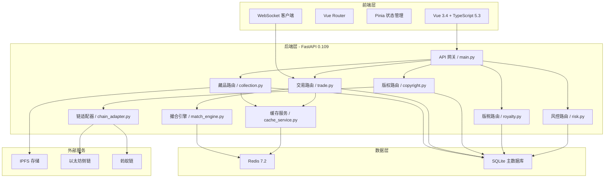
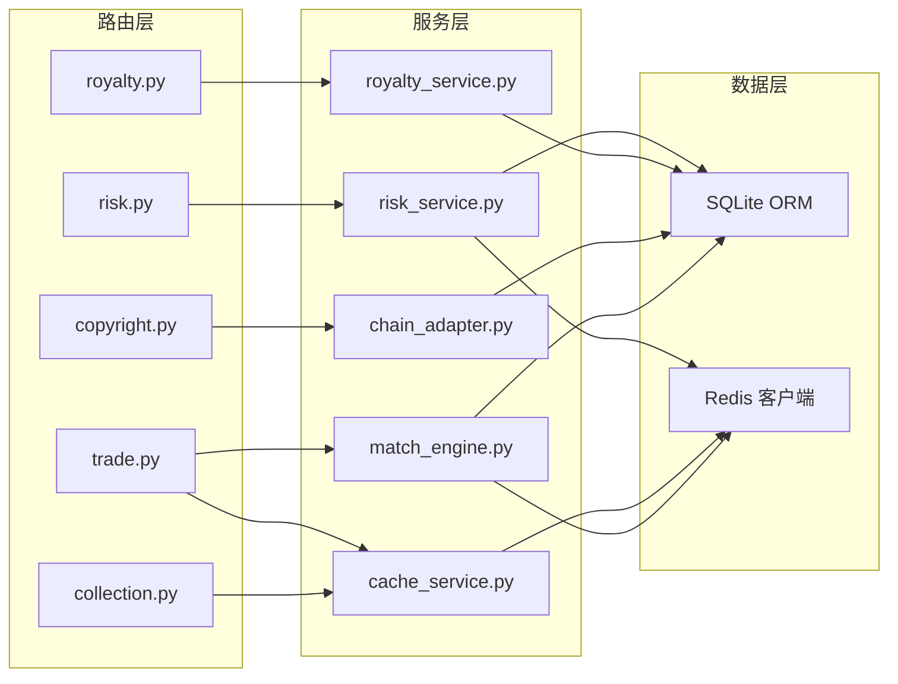
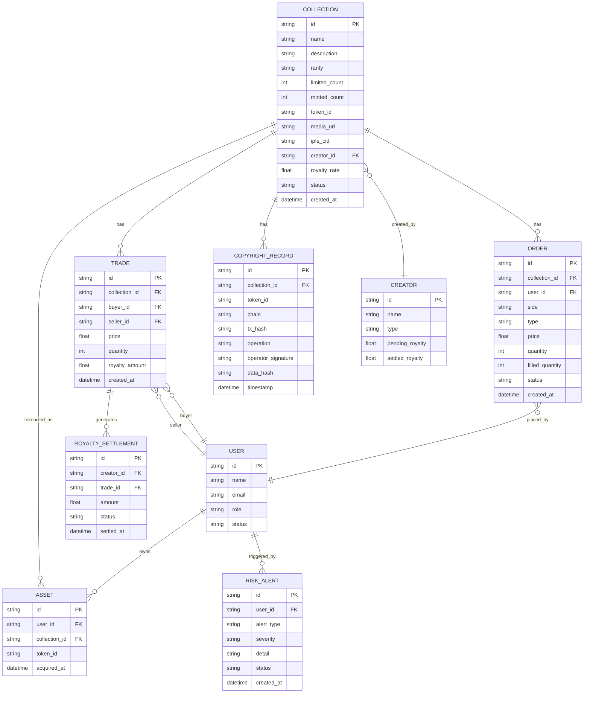

## 1. 架构设计



## 2. 技术说明

- **前端**：Vue 3.4 + TypeScript 5.3 + Vite 5 + Pinia + Vue Router + TailwindCSS 3
- **初始化工具**：vite-init (vue-ts 模板)
- **后端**：Python 3.11 + FastAPI 0.109 + Uvicorn
- **数据库**：SQLite（主存储）+ Redis 7.2（缓存/消息队列/订单簿）
- **外部服务**：IPFS（媒体存储）、以太坊侧链 + 蚂蚁链（版权存证）

## 3. 路由定义

| 路由路径 | 用途 |
|----------|------|
| `/` | 藏品市场首页，瀑布流展示 |
| `/trade/:id` | 交易页面，订单簿+K线+下单 |
| `/assets` | 我的资产，持有藏品列表 |
| `/assets/:id` | 藏品详情与溯源 |
| `/creator` | 创作者中心首页 |
| `/creator/publish` | 发行向导（多步骤） |
| `/creator/management` | 发行管理 |
| `/creator/royalty` | 版税收益 |
| `/statistics` | 数据统计仪表盘 |
| `/risk` | 风控管理 |

## 4. API 定义

### 4.1 藏品管理 API

```typescript
interface Collection {
  id: string
  name: string
  description: string
  rarity: "common" | "rare" | "epic" | "legendary"
  limited_count: number
  minted_count: number
  token_id: string | null
  media_url: string
  ipfs_cid: string
  creator_id: string
  creator_name: string
  royalty_rate: number
  status: "draft" | "pending" | "reviewing" | "approved" | "rejected" | "minted"
  created_at: string
  updated_at: string
}

interface CollectionListResponse {
  items: Collection[]
  total: number
  page: number
  page_size: number
}

interface CollectionPublishRequest {
  name: string
  description: string
  rarity: string
  limited_count: number
  royalty_rate: number
  media_file: File
}
```

### 4.2 交易 API

```typescript
interface Order {
  id: string
  collection_id: string
  user_id: string
  side: "buy" | "sell"
  type: "limit" | "market"
  price: number
  quantity: number
  filled_quantity: number
  status: "open" | "partial" | "filled" | "cancelled"
  created_at: string
}

interface Trade {
  id: string
  collection_id: string
  buyer_id: string
  seller_id: string
  price: number
  quantity: number
  royalty_amount: number
  created_at: string
}

interface OrderBookSnapshot {
  collection_id: string
  bids: Array<{ price: number; quantity: number; order_count: number }>
  asks: Array<{ price: number; quantity: number; order_count: number }>
  last_price: number
  timestamp: string
}
```

### 4.3 版权存证 API

```typescript
interface CopyrightRecord {
  id: string
  collection_id: string
  token_id: string
  chain: "ethereum" | "antchain"
  tx_hash: string
  operation: "create" | "mint" | "transfer" | "burn"
  operator_signature: string
  data_hash: string
  timestamp: string
}

interface ProvenanceResponse {
  token_id: string
  records: CopyrightRecord[]
}
```

### 4.4 版税 API

```typescript
interface RoyaltyAccount {
  creator_id: string
  pending_amount: number
  settled_amount: number
  threshold: number
}

interface RoyaltySettlement {
  id: string
  creator_id: string
  trade_id: string
  amount: number
  status: "pending" | "settled"
  settled_at: string | null
}
```

### 4.5 风控 API

```typescript
interface RiskAlert {
  id: string
  user_id: string
  alert_type: "wash_trade" | "price_manipulation" | "volume_anomaly" | "correlated_accounts"
  severity: "low" | "medium" | "high"
  detail: string
  status: "active" | "frozen" | "resolved"
  created_at: string
}

interface RiskRule {
  id: string
  name: string
  description: string
  params: Record<string, number>
  enabled: boolean
}
```

## 5. 服务端架构图



## 6. 数据模型

### 6.1 数据模型定义



### 6.2 数据定义语言

```sql
CREATE TABLE users (
    id TEXT PRIMARY KEY,
    name TEXT NOT NULL,
    email TEXT UNIQUE NOT NULL,
    role TEXT NOT NULL DEFAULT 'collector',
    status TEXT NOT NULL DEFAULT 'active',
    created_at DATETIME NOT NULL DEFAULT CURRENT_TIMESTAMP,
    updated_at DATETIME NOT NULL DEFAULT CURRENT_TIMESTAMP
);

CREATE TABLE creators (
    id TEXT PRIMARY KEY,
    name TEXT NOT NULL,
    type TEXT NOT NULL DEFAULT 'individual',
    pending_royalty REAL NOT NULL DEFAULT 0,
    settled_royalty REAL NOT NULL DEFAULT 0,
    user_id TEXT REFERENCES users(id)
);

CREATE TABLE collections (
    id TEXT PRIMARY KEY,
    name TEXT NOT NULL,
    description TEXT,
    rarity TEXT NOT NULL,
    limited_count INTEGER NOT NULL,
    minted_count INTEGER NOT NULL DEFAULT 0,
    token_id TEXT,
    media_url TEXT,
    ipfs_cid TEXT,
    creator_id TEXT NOT NULL REFERENCES creators(id),
    royalty_rate REAL NOT NULL,
    status TEXT NOT NULL DEFAULT 'draft',
    current_price REAL,
    created_at DATETIME NOT NULL DEFAULT CURRENT_TIMESTAMP,
    updated_at DATETIME NOT NULL DEFAULT CURRENT_TIMESTAMP
);

CREATE TABLE orders (
    id TEXT PRIMARY KEY,
    collection_id TEXT NOT NULL REFERENCES collections(id),
    user_id TEXT NOT NULL REFERENCES users(id),
    side TEXT NOT NULL,
    type TEXT NOT NULL,
    price REAL NOT NULL,
    quantity INTEGER NOT NULL,
    filled_quantity INTEGER NOT NULL DEFAULT 0,
    status TEXT NOT NULL DEFAULT 'open',
    created_at DATETIME NOT NULL DEFAULT CURRENT_TIMESTAMP
);

CREATE TABLE trades (
    id TEXT PRIMARY KEY,
    collection_id TEXT NOT NULL REFERENCES collections(id),
    buyer_id TEXT NOT NULL REFERENCES users(id),
    seller_id TEXT NOT NULL REFERENCES users(id),
    price REAL NOT NULL,
    quantity INTEGER NOT NULL,
    royalty_amount REAL NOT NULL DEFAULT 0,
    created_at DATETIME NOT NULL DEFAULT CURRENT_TIMESTAMP
);

CREATE TABLE copyright_records (
    id TEXT PRIMARY KEY,
    collection_id TEXT NOT NULL REFERENCES collections(id),
    token_id TEXT,
    chain TEXT NOT NULL,
    tx_hash TEXT,
    operation TEXT NOT NULL,
    operator_signature TEXT,
    data_hash TEXT,
    timestamp DATETIME NOT NULL DEFAULT CURRENT_TIMESTAMP
);

CREATE TABLE assets (
    id TEXT PRIMARY KEY,
    user_id TEXT NOT NULL REFERENCES users(id),
    collection_id TEXT NOT NULL REFERENCES collections(id),
    token_id TEXT,
    acquired_at DATETIME NOT NULL DEFAULT CURRENT_TIMESTAMP
);

CREATE TABLE royalty_settlements (
    id TEXT PRIMARY KEY,
    creator_id TEXT NOT NULL REFERENCES creators(id),
    trade_id TEXT NOT NULL REFERENCES trades(id),
    amount REAL NOT NULL,
    status TEXT NOT NULL DEFAULT 'pending',
    settled_at DATETIME
);

CREATE TABLE risk_alerts (
    id TEXT PRIMARY KEY,
    user_id TEXT NOT NULL REFERENCES users(id),
    alert_type TEXT NOT NULL,
    severity TEXT NOT NULL,
    detail TEXT,
    status TEXT NOT NULL DEFAULT 'active',
    created_at DATETIME NOT NULL DEFAULT CURRENT_TIMESTAMP
);

CREATE INDEX idx_collections_status ON collections(status);
CREATE INDEX idx_orders_collection_status ON orders(collection_id, status);
CREATE INDEX idx_trades_collection ON trades(collection_id, created_at);
CREATE INDEX idx_assets_user ON assets(user_id);
CREATE INDEX idx_risk_alerts_status ON risk_alerts(status, severity);
CREATE INDEX idx_copyright_collection ON copyright_records(collection_id, chain);
```

## 7. 性能架构说明

| 指标 | 目标 | 实现方案 |
|------|------|----------|
| API响应时间 | P99 < 200ms | Redis缓存热点数据，SQLite索引优化 |
| 撮合引擎吞吐量 | ≥5000 TPS | Redis Sorted Set实现订单簿，内存撮合 |
| 元数据缓存命中率 | ≥95% | Redis缓存藏品元数据，TTL 30分钟 |
| WebSocket并发 | ≥10000 | FastAPI WebSocket + Redis Pub/Sub |
| 版税批量结算 | 1000笔 < 30秒 | 批量SQL + Redis队列异步处理 |
| 日数据增量 | ≤50GB | 数据分区归档，日志轮转 |
| Redis内存 | ≤8GB | LRU淘汰策略，合理设置TTL |
