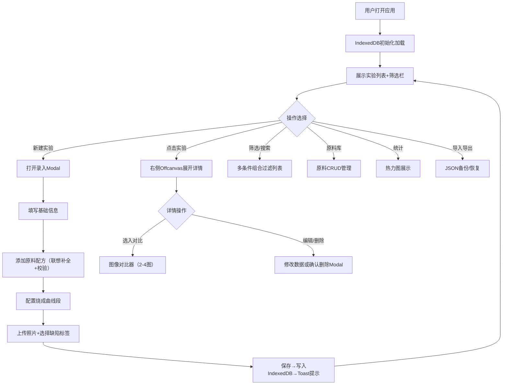

## 1. 产品概述
陶艺釉料实验管理系统，面向业余陶艺爱好者及工作室主理人，解决釉料实验数据分散、配方难以复现、缺乏横向对比的核心痛点。
- 核心目标：数字化管理每月20+种原料、数十种配方实验，实现配方可追溯、效果可对比、规律可发现
- 目标用户：陶艺工作室主理人、资深釉料实验爱好者

## 2. 核心功能

### 2.1 用户角色
| 角色 | 注册方式 | 核心权限 |
|------|----------|----------|
| 工作室主理人 | 本地单机使用，无需注册 | 所有功能：实验录入、检索、对比、原料管理、数据备份 |

### 2.2 功能模块
1. **实验录入**：原料清单联想补全、百分比合计校验、烧成曲线多段配置、多图上传、缺陷标签
2. **实验列表与筛选**：多维组合筛选（原料/锥号/气氛/釉色）、全文检索
3. **实验详情与图像对比**：单条实验完整展示、2-4图并排同步缩放对比
4. **烧成曲线可视化**：Chart.js折线图、多曲线叠加对比
5. **原料库管理**：原料CRUD、典型含量范围
6. **统计面板**：原料与效果关联频次热力图
7. **数据备份**：JSON导入导出（含Base64图片）

### 2.3 页面详情
| 页面名称 | 模块名称 | 功能描述 |
|----------|----------|----------|
| 主页面 | 顶部导航栏 | Logo、新建实验、原料库、统计面板、导入导出按钮 |
| 主页面 | 左侧筛选栏 | 原料包含筛选、烧成锥号、气氛（氧化/还原）、釉色分类（青瓷/灰釉/结晶/无光） |
| 主页面 | 中间列表区 | 实验卡片列表，显示缩略图、配方摘要、烧成信息、创建时间 |
| 主页面 | 详情Offcanvas | 从右侧滑入，展示完整配方、烧成曲线、照片、缺陷描述 |
| 实验录入Modal | 基础信息 | 实验名称、日期、釉色分类、窑炉类型、气氛 |
| 实验录入Modal | 原料配方 | 动态增减行、原料名自动补全、质量百分比、实时合计校验 |
| 实验录入Modal | 烧成曲线 | 多段升温/保温/降温配置、温度-时间折线预览 |
| 实验录入Modal | 图像与缺陷 | 多图上传（压缩至1MB内）、缺陷标签多选、备注 |
| 图像对比器 | 对比面板 | 2-4图CSS Grid布局、jQuery拖拽分隔条、同步缩放、标签叠加 |
| 原料库管理 | 原料列表 | 原料名称、化学式、典型含量范围、常用程度 |
| 统计面板 | 热力图 | 原料×釉色/缺陷关联频次热力图 |

## 3. 核心流程

## 4. 用户界面设计

### 4.1 设计风格
- **主色调**：陶土赭石 #A0522D 作为主色，青瓷蓝 #5F9EA0 为辅助色，搭配米白背景 #FAF6F0
- **字体**：标题使用 "Noto Serif SC" 衬线体（陶艺人文感），正文使用 "Noto Sans SC"
- **按钮风格**：圆角 6px，轻微阴影，悬停上浮效果
- **布局风格**：卡片式 + 轻微陶土纹理背景，左侧筛选栏 + 中间列表 + 右侧详情（桌面三栏）
- **图标风格**：线性简洁图标，配色与主色调统一

### 4.2 页面设计概览
| 页面名称 | 模块名称 | UI元素 |
|----------|----------|--------|
| 主页面 | 顶部导航 | 赭石色背景条、衬线体Logo、圆角功能按钮、分隔线 |
| 主页面 | 筛选栏 | 浅米色卡片、分组折叠面板、标签式多选、搜索框 |
| 主页面 | 实验列表 | 网格布局卡片、缩略图圆角、配方标签、烧成信息小图标 |
| 详情Offcanvas | 详情内容 | 图片轮播、配方表格、曲线Chart、缺陷标签云 |
| 录入Modal | 表单区域 | 分组折叠卡片、动态行按钮、实时校验提示、进度条 |
| 图像对比器 | 对比面板 | CSS Grid 2x2布局、拖拽分隔条、缩放滑杆、叠加开关 |

### 4.3 响应式
- **桌面端（≥1200px）**：三栏布局 — 筛选250px + 列表自适应 + 详情Offcanvas
- **平板端（768-1199px）**：双栏切换 — 筛选/列表可切换Tab，详情Offcanvas
- **手机端（<768px）**：单栏堆叠 — 顶部筛选折叠，列表全屏，详情全屏Modal
- 所有触控目标 ≥ 44px，优化滑动手势
