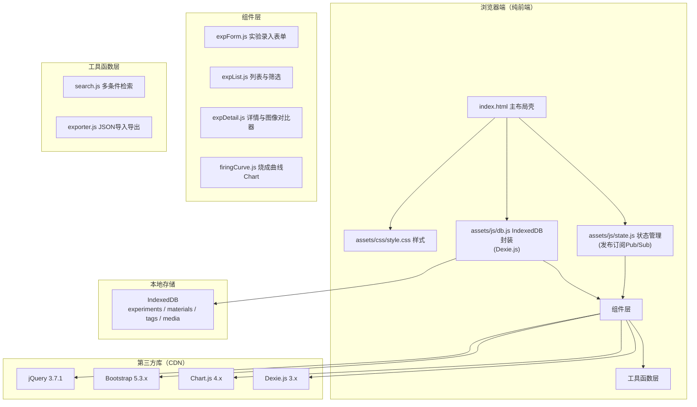
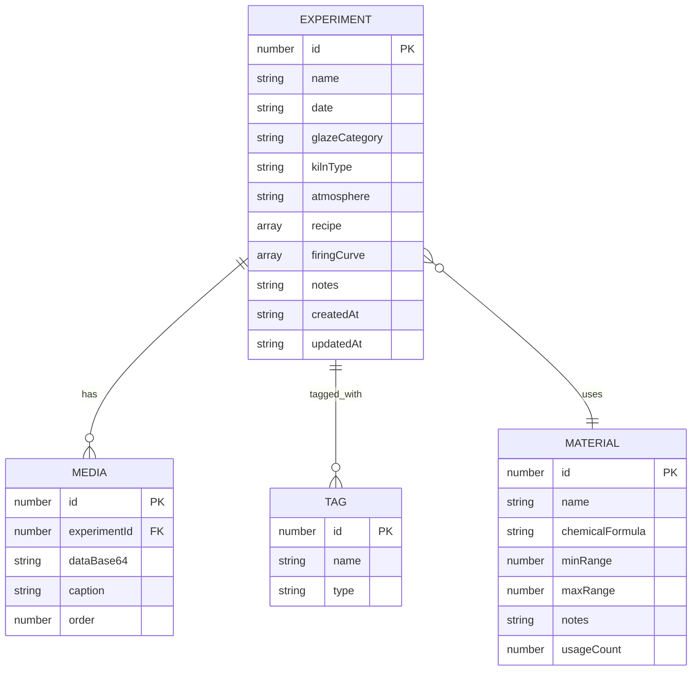

## 1. 架构设计



## 2. 技术描述
- **前端框架**：jQuery 3.7.1（DOM操作+事件）+ Bootstrap 5.3（UI组件+栅格）
- **图表库**：Chart.js 4.4.x（烧成曲线、热力图）
- **本地数据库**：IndexedDB + Dexie.js 3.x 封装
- **状态管理**：自研发布订阅模式（state.js），不依赖外部框架
- **构建方式**：纯静态文件，无需打包构建工具，直接CDN引入依赖
- **图片处理**：Canvas API 压缩（单图≤1MB，质量自适应）

## 3. 目录结构
```
/
├── index.html                          # 主页面与布局壳
├── assets/
│   ├── css/
│   │   └── style.css                   # 自定义样式（主题色、陶瓷纹理、响应式）
│   └── js/
│       ├── state.js                    # 全局状态管理（Pub/Sub）
│       ├── db.js                       # Dexie.js封装：CRUD与索引
│       ├── components/
│       │   ├── expForm.js              # 实验录入表单组件
│       │   ├── expList.js              # 列表与筛选组件
│       │   ├── expDetail.js            # 详情与图像对比器
│       │   └── firingCurve.js          # 烧成曲线Chart组件
│       └── utils/
│           ├── search.js               # 多条件检索+全文检索
│           └── exporter.js             # JSON导入导出（含Base64图片）
└── .trae/documents/                    # 项目文档
```

## 4. 数据模型

### 4.1 ER图


### 4.2 IndexedDB Schema (Dexie)
```javascript
db.version(1).stores({
  experiments: '++id, name, date, glazeCategory, kilnType, atmosphere, *recipeIds, createdAt',
  materials:   '++id, name, &name, usageCount',
  tags:        '++id, name, type',
  media:       '++id, experimentId, order'
});
```

### 4.3 数据实体
**Experiment 实验记录**
- `id`: 自增主键
- `name`: 实验名称
- `date`: 实验日期 YYYY-MM-DD
- `glazeCategory`: 釉色分类 (青瓷/灰釉/结晶/无光/其他)
- `kilnType`: 窑炉类型 (电窑/气窑/柴窑/其他)
- `atmosphere`: 烧成气氛 (氧化/还原)
- `cone`: 烧成锥号 (06~10)
- `recipe`: 原料配方数组 `[{materialId, materialName, percentage}]`
- `firingCurve`: 烧成曲线段 `[{type: '升温'|'保温'|'降温', tempFrom, tempTo, durationMin}]`
- `mediaIds`: 关联图片ID数组
- `defectTags`: 缺陷标签ID数组
- `notes`: 备注
- `createdAt`, `updatedAt`: 时间戳

**Material 原料**
- `id`, `name`, `chemicalFormula`, `minRange`, `maxRange`, `notes`, `usageCount`

**Tag 标签**
- `id`, `name`, `type` (defect缺陷/glaze釉色/other)

**Media 媒体**
- `id`, `experimentId`, `dataBase64` (压缩后图片), `caption`, `order`

## 5. 性能约束实现方案
| 约束指标 | 实现方案 |
|----------|----------|
| 500+条记录 | Dexie.js 索引查询 + 虚拟滚动/分页 |
| 筛选响应 <200ms | 内存缓存 + 多条件组合索引查询 |
| 首屏加载 <2s | CDN加载 + 延迟加载组件 + 骨架屏 |
| 4图渲染不卡顿 | Canvas预压缩 + CSS will-change + 懒加载 |
| 单图 ≤1MB | Canvas toDataURL('image/jpeg', quality自适应)，最大1280px |

## 6. 事件总线（Pub/Sub）定义
| 事件名 | 触发时机 | 载荷 |
|--------|----------|------|
| `exp:created` | 新建实验保存成功 | experiment对象 |
| `exp:updated` | 实验编辑保存成功 | experiment对象 |
| `exp:deleted` | 实验删除成功 | experimentId |
| `exp:selected` | 列表选中实验 | experimentId |
| `exp:compare:add` | 加入对比 | experimentId |
| `exp:compare:remove` | 移出对比 | experimentId |
| `filter:changed` | 筛选条件变更 | filter对象 |
| `search:keyword` | 全文搜索关键词 | keyword字符串 |
| `material:changed` | 原料库变更 | 无 |
| `db:ready` | IndexedDB初始化完成 | 无 |
| `toast:show` | 显示提示 | {type, message} |
