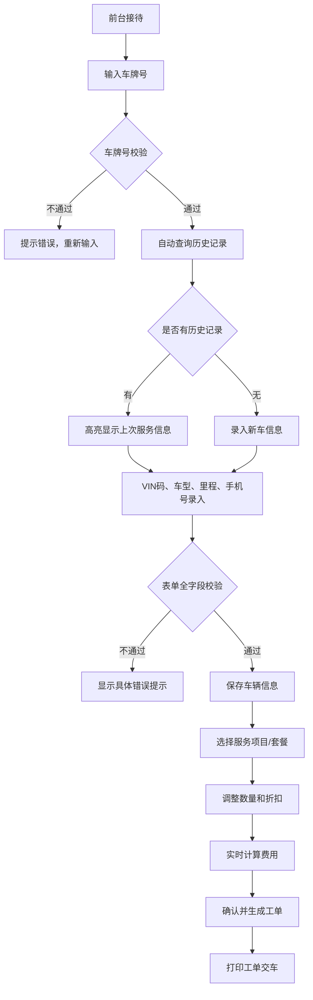

## 1. 产品概述

本产品为区域连锁汽车快修门店管理系统，服务3家分店、日均180台次的维修业务。解决手工登记易出错、历史记录查询难、套餐计算费时、工单流转遗漏、统计汇总耗时等痛点，实现前台5分钟内完成从车辆登记到工单生成的全流程。

### 1.1 核心价值
- 消除手工登记错误，提升数据准确性
- 历史记录秒级查询，自动关联客户信息
- 服务套餐自动计算，避免人工算错费用
- 工单状态全程跟踪，消除口头传达遗漏
- 多门店数据自动汇总，统计报表实时生成

### 1.2 目标用户
| 用户角色 | 核心场景 | 主要需求 |
|----------|----------|----------|
| 前台接待 | 车辆登记、工单创建、费用结算 | 快速录入、准确校验、智能推荐 |
| 维修技师 | 工单接收、状态更新 | 清晰的工单信息、便捷的状态流转 |
| 门店店长 | 数据统计、经营分析 | 多维度报表、实时营收数据 |
| 车主 | 进度查询、历史记录 | 透明的服务流程、清晰的费用构成 |

---

## 2. 核心功能模块

### 2.1 功能模块总览
1. **仪表盘**：今日营收概览、工单状态统计、快捷操作入口
2. **车辆登记**：车辆信息录入、VIN码校验、车型三级联动、历史记录自动关联
3. **工单管理**：服务项目选择、费用实时计算、工单状态流转、工单打印
4. **服务套餐**：套餐预置、组合折扣、套餐拆分调整
5. **会员中心**：会员卡管理、储值/次卡/年卡、积分兑换、消费记录
6. **统计报表**：日营收汇总、门店对比、服务占比、车型分布、技师绩效

### 2.2 页面详细功能

| 页面名称 | 模块名称 | 功能描述 |
|----------|----------|----------|
| 仪表盘 | 营收概览 | 显示今日/本周/本月营收数据，快速对比同期数据 |
| 仪表盘 | 工单统计 | 各状态工单数量统计卡片，点击跳转对应列表 |
| 仪表盘 | 快捷操作 | 车辆登记、工单创建、会员查询快捷按钮 |
| 车辆登记 | 信息录入 | 车牌号、VIN码、车型三级联动、里程数、车主手机号 |
| 车辆登记 | 历史关联 | 自动匹配历史维修记录，高亮上次服务时间与项目 |
| 车辆登记 | 表单验证 | 车牌号格式、VIN码17位、手机号正则、里程数范围 |
| 工单管理 | 项目选择 | 保养类12项、维修类25项、美容类8项，支持多选和数量调整 |
| 工单管理 | 费用计算 | 工时费+材料费分项显示，支持单项折扣，实时计算合计 |
| 工单管理 | 状态流转 | 待接车→维修中→待结算→已完成，记录操作时间与操作人 |
| 工单管理 | 工单打印 | 生成简化版HTML格式工单，支持打印预览 |
| 服务套餐 | 套餐列表 | 标准保养、季节性、会员专享三类套餐展示 |
| 服务套餐 | 套餐详情 | 套餐项目明细、组合折扣说明、工时材料分项显示 |
| 服务套餐 | 套餐调整 | 支持拆分套餐、增减项目、重新计算折扣 |
| 会员中心 | 会员列表 | 会员信息、会员卡类型、余额/次数/有效期状态 |
| 会员中心 | 储值管理 | 储值充值、消费扣减、余额不足预警 |
| 会员中心 | 次卡管理 | 次卡购买、次数扣减、剩余次数跟踪 |
| 会员中心 | 年卡管理 | 年卡有效期校验、过期提醒、续费管理 |
| 会员中心 | 积分管理 | 消费积分累计、积分兑换规则、兑换记录 |
| 会员中心 | 消费记录 | 按时间倒序展示，支持日期筛选和导出 |
| 统计报表 | 日营收汇总 | 工时收入、材料收入、总营收趋势图 |
| 统计报表 | 门店对比 | 三家门店营收柱状图对比 |
| 统计报表 | 服务占比 | 保养/维修/美容服务类型饼图 |
| 统计报表 | 车型分布 | 入厂车型品牌统计柱状图 |
| 统计报表 | 高峰时段 | 每日各时段工单热力图 |
| 统计报表 | 技师绩效 | 技师完成工单数量和营收排名 |
| 统计报表 | 数据导出 | 支持日期范围筛选，导出CSV格式 |

---

## 3. 核心业务流程

### 3.1 车辆登记到工单生成流程

### 3.2 工单状态流转流程

---

## 4. 用户界面设计

### 4.1 设计风格

**视觉定位：专业高效、现代简洁的企业级管理系统**

- **主色调**：深蓝色 `#1e40af`（专业、信赖），作为导航栏和主要按钮
- **辅助色**：
  - 成功绿 `#16a34a`（已完成状态）
  - 警告橙 `#f97316`（维修中状态）
  - 信息蓝 `#2563eb`（待结算状态）
  - 中性灰 `#6b7280`（待接车状态）
- **背景色**：浅灰 `#f8fafc`（页面背景）、白色 `#ffffff`（卡片背景）
- **字体**：
  - 标题：`'Noto Sans SC', sans-serif`，字重 600-700
  - 正文：`'Noto Sans SC', sans-serif`，字重 400-500
  - 数据：等宽字体 `'JetBrains Mono', monospace`，用于金额、车牌等数据展示
- **按钮风格**：圆角 6px，悬停渐变色动画（主色→主色+10%亮度），点击轻微缩放效果
- **布局风格**：顶部导航栏 + 左侧固定侧边栏 + 主内容区卡片式布局
- **图标风格**：Bootstrap Icons，统一线性风格

### 4.2 页面设计概览

| 页面名称 | 模块名称 | UI 设计要点 |
|----------|----------|-------------|
| 全局布局 | 顶部导航栏 | 固定高度 56px，深蓝色背景，左侧Logo，中间门店切换下拉，右侧今日营收和会员查询入口 |
| 全局布局 | 左侧侧边栏 | 固定宽度 240px，浅灰背景，6个主菜单，当前项深蓝高亮+白色图标文字，悬停浅灰背景 |
| 全局布局 | 主内容区 | 左右内边距 24px，上下内边距 20px，卡片间距 16px，圆角 8px，阴影 0 1px 3px rgba(0,0,0,0.1) |
| 表单页面 | 输入控件 | Bootstrap 标准样式，必填项红色星号，获焦时蓝色边框 `#3b82f6` + 柔和阴影 |
| 表单页面 | 校验提示 | 错误时红色文字 + 红色边框 + 右侧错误图标，文字显示在输入框下方 |
| 表单页面 | 提交按钮 | 渐变色背景 `#1e40af → #2563eb`，悬停亮度提升 10%，过渡动画 200ms |
| 工单列表 | 表格布局 | Bootstrap Table 样式，斑马纹，表头固定，状态列彩色徽章 |
| 工单列表 | 操作列 | 按钮根据状态条件显示：待接车显示"接单"，维修中显示"完成"，待结算显示"结算" |
| 统计报表 | 图表区域 | 占 70% 宽度，Chart.js 渲染，网格线浅灰色，坐标轴标签清晰 |
| 统计报表 | 筛选区域 | 占 30% 宽度，左侧对齐，日期选择器、下拉筛选框、导出按钮 |
| 移动端 | 响应式适配 | 侧边栏折叠为汉堡菜单，表格横向滚动，表单控件全宽显示，按钮加大触控区域 |

### 4.3 响应式设计

**桌面端优先，逐级向下适配**

| 断点 | 布局调整 |
|------|----------|
| ≥ 1200px（大屏） | 侧边栏展开，图表区 70% + 筛选区 30% |
| 992px - 1199px（中屏） | 侧边栏展开，图表区 65% + 筛选区 35% |
| 768px - 991px（平板） | 侧边栏折叠为图标模式，图表区堆叠显示 |
| < 768px（手机） | 侧边栏折叠为汉堡菜单，表格横向滚动，表单全宽 |

**移动端特殊优化**：
- 按钮最小高度 44px，确保触控友好
- 输入框左右内边距 16px，避免键盘遮挡
- 表格支持横向滑动，冻结第一列
- 下拉菜单点击展开，避免悬停操作

### 4.4 动效设计

- **页面加载**：内容区渐入动画（opacity 0→1，duration 300ms）
- **卡片悬停**：阴影加深 + 轻微上移（translateY -2px），duration 200ms
- **按钮交互**：悬停渐变，点击缩放 0.98，duration 150ms
- **状态切换**：徽章颜色过渡动画，duration 300ms
- **表单验证**：错误提示滑入效果，duration 200ms
- **侧边栏展开/折叠**：宽度过渡动画，duration 300ms

---

## 5. 性能约束指标

| 指标 | 约束值 |
|------|--------|
| LocalStorage 存储容量 | ≤ 5MB |
| 车辆记录上限 | 2000 条 |
| 工单记录上限 | 10000 条 |
| 车牌模糊搜索响应 | < 200ms |
| 工单保存响应 | < 500ms |
| 统计图表渲染 | < 1s |
| 页面首次加载 | < 2s |
| 多标签页数据同步 | 实时 |
| 移动端 3G 加载 | < 5s |
