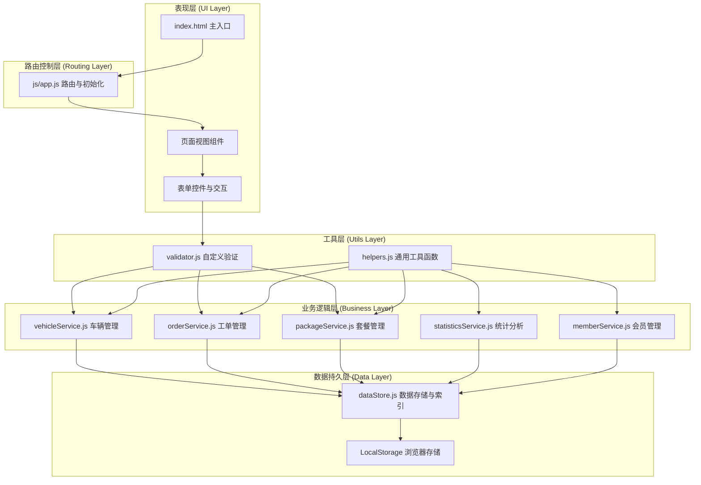
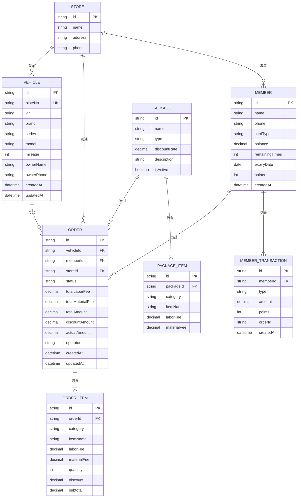

## 1. 架构设计

本系统为纯前端单页应用（SPA），采用分层架构设计，所有数据通过 LocalStorage 持久化存储。



---

## 2. 技术栈说明

| 技术 | 版本 | 用途 |
|------|------|------|
| jQuery | 3.7.1 | DOM 操作、事件处理、AJAX 封装 |
| Bootstrap | 5.3.3 | UI 组件库、响应式布局、样式系统 |
| Chart.js | 4.4.1 | 数据可视化图表渲染 |
| jQuery Validation | 1.19.5 | 表单验证框架 |
| Bootstrap Datepicker | 最新 | 日期选择组件 |
| LocalStorage | HTML5 | 客户端数据持久化 |

### 2.1 前端库引入方式
- 通过 CDN 引入所有第三方库，减少打包体积
- 按依赖顺序加载：jQuery → Bootstrap → 其他插件
- 失败降级：关键库提供本地 fallback

---

## 3. 目录结构

```
/
├── index.html              # 主入口文件，包含导航、侧边栏、内容区骨架
├── css/
│   └── custom.css          # 自定义样式覆盖、响应式适配、动画效果
├── js/
│   ├── app.js              # 应用初始化、路由控制、全局事件绑定
│   ├── models/
│   │   └── dataStore.js    # 本地数据存储、索引构建、CRUD 封装
│   ├── services/
│   │   ├── vehicleService.js     # 车辆信息增删改查、车牌校验
│   │   ├── orderService.js       # 工单生命周期管理
│   │   ├── packageService.js     # 套餐组合计算、折扣逻辑
│   │   ├── statisticsService.js  # 多维度统计分析
│   │   └── memberService.js      # 会员管理、储值/次卡/年卡
│   ├── utils/
│   │   └── validator.js    # 自定义验证规则、表单校验扩展
│   └── pages/              # 各页面渲染与交互逻辑
│       ├── dashboard.js
│       ├── vehicle.js
│       ├── order.js
│       ├── package.js
│       ├── member.js
│       └── statistics.js
└── data/
    └── mock/               # 初始化模拟数据
        ├── vehicles.json
        ├── orders.json
        ├── packages.json
        └── members.json
```

---

## 4. 路由定义

采用 Hash 路由实现单页应用导航，通过监听 `hashchange` 事件切换页面内容。

| 路由 Hash | 页面 | 对应 JS 文件 |
|-----------|------|-------------|
| `#/dashboard` | 仪表盘 | pages/dashboard.js |
| `#/vehicle` | 车辆登记 | pages/vehicle.js |
| `#/order` | 工单管理 | pages/order.js |
| `#/package` | 服务套餐 | pages/package.js |
| `#/member` | 会员中心 | pages/member.js |
| `#/statistics` | 统计报表 | pages/statistics.js |
| 默认 | 仪表盘 | pages/dashboard.js |

### 路由实现要点
```javascript
// js/app.js 路由核心逻辑
const Router = {
    routes: {
        '#/dashboard': DashboardPage,
        '#/vehicle': VehiclePage,
        '#/order': OrderPage,
        '#/package': PackagePage,
        '#/member': MemberPage,
        '#/statistics': StatisticsPage
    },
    init() {
        $(window).on('hashchange', () => this.navigate());
        this.navigate();
    },
    navigate() {
        const hash = window.location.hash || '#/dashboard';
        const Page = this.routes[hash] || this.routes['#/dashboard'];
        Page.render(); // 渲染页面内容
        Page.init();   // 绑定页面事件
    }
};
```

---

## 5. 数据模型设计

### 5.1 实体关系图



### 5.2 LocalStorage 存储键设计

| 键名 | 数据结构 | 索引字段 | 容量估算 |
|------|----------|----------|----------|
| `auto_repair_stores` | Array&lt;Store&gt; | id | 极小 |
| `auto_repair_vehicles` | Array&lt;Vehicle&gt; | plateNo, ownerPhone | ~2000 条 × 300B = 600KB |
| `auto_repair_orders` | Array&lt;Order&gt; | id, vehicleId, memberId, storeId, status, createdAt | ~10000 条 × 500B = 5MB |
| `auto_repair_order_items` | Array&lt;OrderItem&gt; | orderId | 约工单数量的 5 倍 |
| `auto_repair_packages` | Array&lt;Package&gt; | id, type | 极小 |
| `auto_repair_members` | Array&lt;Member&gt; | id, phone | ~1000 条 × 200B = 200KB |
| `auto_repair_member_transactions` | Array&lt;MemberTransaction&gt; | memberId | ~5000 条 × 150B = 750KB |
| `auto_repair_current_store` | string | - | 极小 |
| `auto_repair_last_sync` | number | - | 极小 |

> **容量控制**：工单记录超过 10000 条时，自动归档最早的 1000 条到 `auto_repair_orders_archive` 键。

---

## 6. 数据索引与性能优化

### 6.1 索引构建策略
在 `dataStore.js` 中为高频查询字段构建内存索引：

```javascript
// js/models/dataStore.js
class DataStore {
    constructor() {
        this.indexes = {
            vehicles: {
                byPlateNo: new Map(),      // 车牌 → 车辆记录
                byPhone: new Map()          // 手机号 → 车辆记录数组
            },
            orders: {
                byVehicleId: new Map(),     // 车辆ID → 工单数组
                byMemberId: new Map(),      // 会员ID → 工单数组
                byStoreAndDate: new Map(),  // 门店+日期 → 工单数组
                byStatus: new Map()         // 状态 → 工单数组
            },
            members: {
                byPhone: new Map()          // 手机号 → 会员记录
            }
        };
    }

    // 构建索引
    buildIndexes() {
        // 车辆索引
        this.getData('vehicles').forEach(v => {
            this.indexes.vehicles.byPlateNo.set(v.plateNo, v);
            const existing = this.indexes.vehicles.byPhone.get(v.ownerPhone) || [];
            existing.push(v);
            this.indexes.vehicles.byPhone.set(v.ownerPhone, existing);
        });
        // 工单索引...
    }
}
```

### 6.2 性能优化措施
1. **车牌搜索**：使用 `Map` 索引实现 O(1) 精确查找，模糊搜索使用预先生成的车牌前缀树
2. **工单保存**：批量写入优化，先更新内存索引再异步持久化到 LocalStorage
3. **统计计算**：使用增量统计，每次工单状态变更时更新统计缓存
4. **多标签页同步**：监听 `storage` 事件，实时同步数据变更
5. **懒加载**：统计数据按需计算，避免页面加载时全量遍历

---

## 7. 核心模块设计

### 7.1 vehicleService.js - 车辆管理服务
```javascript
// 车牌号校验：省份简称+字母+5位数字/字母
const PLATE_PATTERN = /^[京津沪渝冀豫云辽黑湘皖鲁新苏浙赣鄂桂甘晋蒙陕吉闽贵粤青藏川宁琼使领][A-Z][A-HJ-NP-Z0-9]{5}$/;
// VIN码校验：17位，排除I、O、Q
const VIN_PATTERN = /^[A-HJ-NPR-Z0-9]{17}$/;

class VehicleService {
    // 车牌格式校验
    validatePlateNo(plateNo) { ... }
    // VIN码校验（含校验位算法）
    validateVin(vin) { ... }
    // 手机号校验
    validatePhone(phone) { ... }
    // 里程数范围校验（0-999999）
    validateMileage(mileage) { ... }
    // 根据车牌查询历史记录
    findByPlateNo(plateNo) { ... }
    // 获取上次服务记录
    getLastService(vehicleId) { ... }
}
```

### 7.2 orderService.js - 工单管理服务
```javascript
const ORDER_STATUS = {
    PENDING: 'pending',      // 待接车
    REPAIRING: 'repairing',  // 维修中
    SETTLEMENT: 'settlement', // 待结算
    COMPLETED: 'completed'   // 已完成
};

class OrderService {
    // 创建工单
    create(orderData) { ... }
    // 更新工单状态（记录操作人、时间）
    updateStatus(orderId, status, operator) { ... }
    // 计算工单费用（工时+材料+折扣）
    calculateAmount(items) { ... }
    // 获取工单状态流转历史
    getStatusHistory(orderId) { ... }
    // 生成打印HTML
    generatePrintHtml(orderId) { ... }
}
```

### 7.3 packageService.js - 套餐管理服务
```javascript
const PACKAGE_TYPES = {
    STANDARD: 'standard',    // 标准保养
    SEASONAL: 'seasonal',    // 季节性
    MEMBER: 'member'         // 会员专享
};

const DISCOUNT_RATES = {
    standard: 0.9,   // 标准套餐9折
    member: 0.8      // 会员套餐8折
};

class PackageService {
    // 计算套餐价格（含组合折扣）
    calculatePackagePrice(packageId) { ... }
    // 拆分套餐，支持单项调整
    splitPackage(packageId, customItems) { ... }
    // 获取套餐内工时/材料费明细
    getPackageDetail(packageId) { ... }
    // 应用套餐到工单
    applyPackageToOrder(orderId, packageId) { ... }
}
```

### 7.4 statisticsService.js - 统计分析服务
```javascript
class StatisticsService {
    // 日营收汇总（工时、材料、总营收）
    getDailyRevenue(date, storeId) { ... }
    // 门店对比数据
    getStoreComparison(startDate, endDate) { ... }
    // 服务类型占比
    getServiceTypeRatio(startDate, endDate, storeId) { ... }
    // 车型分布统计
    getModelDistribution(startDate, endDate, storeId) { ... }
    // 高峰时段热力图数据
    getPeakHourHeatmap(startDate, endDate, storeId) { ... }
    // 技师绩效排名
    getTechnicianRanking(startDate, endDate, storeId) { ... }
    // 导出CSV
    exportToCSV(data, filename) { ... }
}
```

---

## 8. 表单验证规则

在 `js/utils/validator.js` 中扩展 jQuery Validation 自定义规则：

| 规则名称 | 用途 | 实现逻辑 |
|----------|------|----------|
| `plateNo` | 车牌号校验 | 匹配省份简称+字母+5位字符，排除I/O |
| `vinCode` | VIN码校验 | 17位字符校验+第9位校验位算法验证 |
| `mileage` | 里程数校验 | 0-999999 范围限制 |
| `cnMobile` | 手机号校验 | 中国大陆手机号正则 |
| `notFutureDate` | 不晚于今天 | 日期选择器限制 |

---

## 9. 初始化数据

首次加载时检查 LocalStorage，如无数据则从 `/data/mock/` 加载初始化数据：

```javascript
// js/app.js 初始化逻辑
async function initApp() {
    if (!DataStore.hasData()) {
        await DataStore.loadInitialData();
    }
    DataStore.buildIndexes();
    Router.init();
}
```

### 预置数据清单
- 3 家门店信息
- 50+ 服务项目（保养12、维修25、美容8）
- 8 个服务套餐（标准、季节、会员）
- 200 条示例车辆记录
- 1000 条示例工单记录（最近3个月）
- 100 条示例会员记录
- 5 名技师信息

---

## 10. 安全与数据完整性

### 10.1 数据校验
- 所有用户输入在客户端进行双重验证（表单验证 + 服务层验证）
- 写入 LocalStorage 前进行数据类型和完整性检查
- 关键操作（如结算、删除）需要二次确认

### 10.2 数据备份
- 每次写入前自动备份上一版本到 `auto_repair_backup_YYYYMMDD`
- 提供手动导出 JSON 备份功能
- 提供从备份恢复功能

### 10.3 容量监控
- 实时监控 LocalStorage 使用量
- 超过 4.5MB 时发出警告
- 自动归档旧数据，确保不超过 5MB 限制
