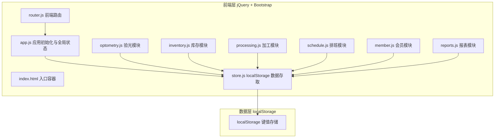
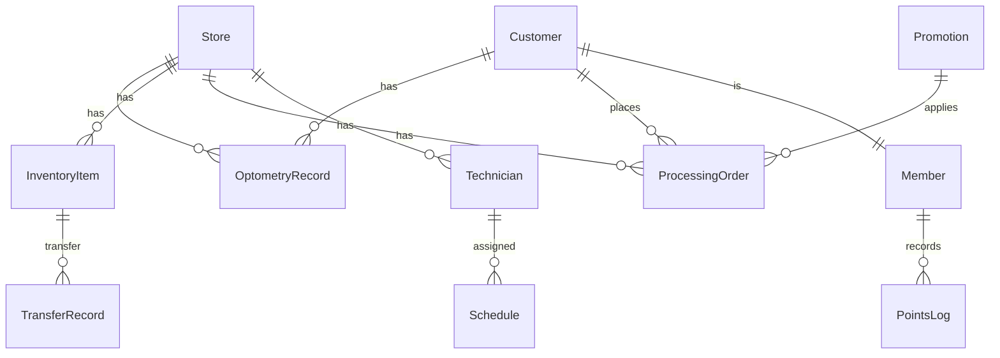

# 明视眼镜连锁门店运营管理系统 — 技术架构文档

## 1. 架构设计



**数据流向**：用户操作 → jQuery 事件 → store.js 更新 localStorage → 触发全局状态变更 → 各模块监听状态更新界面 → 路由管理页面切换时自动保存当前状态。

## 2. 技术说明

- **前端**：jQuery 3.7.1 + Bootstrap 5.3.3 + Bootstrap Icons 1.11（均 CDN 引入）
- **路由**：基于 hash（`#/path`）的自实现前端路由（router.js），支持路由参数与页面切换动画
- **状态管理**：Pub/Sub 事件总线 + localStorage 持久化（store.js），提供防抖写入（300ms）
- **图表**：Chart.js 4.4（CDN）用于报表可视化
- **存储**：浏览器 localStorage，按模块分键，JSON 序列化；支持 12 门店 × 5000 验光 / 2000 SKU / 10000 订单
- **初始化**：原生 HTML + CDN，无构建工具，首屏直出

## 3. 路由定义

| 路由 | 页面 | 说明 |
|------|------|------|
| `#/dashboard` | 工作台 | 默认首页，指标 + 待办 + 预警 |
| `#/optometry` | 验光管理 | 记录列表 |
| `#/optometry/new` | 新增验光 | 录入表单 |
| `#/optometry/:id` | 验光详情 | 处方对比 + 历史 |
| `#/inventory` | 库存管理 | 镜架/镜片 Tab |
| `#/inventory/transfer` | 调拨中心 | 调拨申请与确认 |
| `#/processing` | 加工追踪 | 订单列表 |
| `#/processing/:id` | 订单详情 | 五节点进度 |
| `#/schedule` | 排班管理 | 周排班表 |
| `#/member` | 会员营销 | 会员 + 促销 Tab |
| `#/reports` | 数据报表 | 图表统计 |

## 4. API 定义（store.js 数据接口）

```javascript
Store.get(key)                        // 读取模块数据（返回数组/对象）
Store.set(key, value)                 // 写入（自动防抖 300ms）
Store.insert(collection, item)       // 插入记录，返回带 id 的新对象
Store.update(collection, id, patch)   // 按 id 局部更新
Store.remove(collection, id)         // 按 id 删除
Store.query(collection, predicate)   // 条件查询
Store.subscribe(key, callback)       // 订阅数据变更
Store.currentStore()                 // 获取当前选中门店
Store.switchStore(storeId)           // 切换门店上下文
```

## 5. 数据模型

### 5.1 数据模型定义



### 5.2 数据定义（localStorage 键结构）

| 键名 | 说明 | 关键字段 |
|------|------|----------|
| `ess_stores` | 门店 | id, name, address, phone, manager |
| `ess_customers` | 顾客/会员 | id, name, phone, gender, birthday, points, level |
| `ess_optometry` | 验光记录 | id, customerId, storeId, optometristId, date, nakedL/R, correctedL/R, sphereL/R, cylinderL/R, axisL/R, pd, ph, diagnosis, suggestion |
| `ess_inventory_frames` | 镜架库存 | id, storeId, brand, model, color, degreeRange, stock, minStock, price |
| `ess_inventory_lenses` | 镜片库存 | id, storeId, refractiveIndex, coating, functionType, stock, minStock, price |
| `ess_transfers` | 调拨记录 | id, fromStoreId, toStoreId, itemId, itemType, qty, status, date |
| `ess_orders` | 加工订单 | id, customerId, storeId, frameId, lensId, status, timeline[], technicianId, promoId, amount |
| `ess_technicians` | 技师 | id, name, storeId, role(optometrist/processor), phone |
| `ess_schedules` | 排班 | id, technicianId, storeId, date, shift(morning/afternoon/evening), hours |
| `ess_promotions` | 促销活动 | id, type(discount/gift/fullReduction), rules, start, end, status |
| `ess_points_log` | 积分流水 | id, customerId, type(earn/redeem), points, orderId, date |
| `ess_settings` | 系统设置 | currentStoreId, theme, currentUser |

### 5.3 加工状态机


每个节点记录 `操作技师 + 时间戳`，超时（默认 24h/节点）自动高亮提醒。
