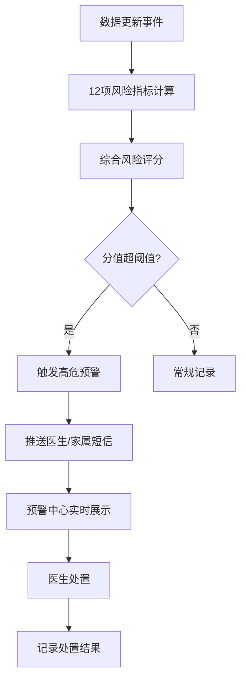

## 1. 产品概述

某区域精神卫生中心数字化管理系统，服务12家社区心理健康服务站、180名精神科医生、250名心理咨询师及8万名已建档患者，解决电话预约占线、人工排班匹配、档案分散、高危漏报等核心痛点。

- 目标用户：精神科医生、心理咨询师、行政管理员、患者家属
- 核心价值：预约智能匹配、档案集中管理、高危预警自动触发、跨站转诊高效流转

## 2. 核心功能

### 2.1 用户角色

| 角色 | 注册方式 | 核心权限 |
|------|----------|----------|
| 系统管理员 | 后台创建 | 用户管理、角色分配、系统配置、审计日志 |
| 精神科医生 | 管理员导入 | 排班管理、患者档案查阅/修改、预约确认、量表评估、预警处置 |
| 心理咨询师 | 管理员导入 | 预约管理、量表录入、随访记录、个人排班 |
| 行政人员 | 管理员导入 | 预约调度、转诊审批、统计报表导出 |
| 患者/家属 | 实名注册 | 预约挂号、查看档案、接收预警通知 |

### 2.2 功能模块

1. **工作台**：今日预约概览、待处理预警、患者就诊提醒、快速入口
2. **预约管理**：周日历视图、时段选择器、智能匹配推荐、改签/取消、排班管理
3. **患者档案**：基本信息Tab、诊断记录Tab、用药方案Tab、心理测评量表Tab、随访记录Tab、PDF导出与电子签名
4. **预警中心**：高危预警列表、实时推送、风险评分展示、处置记录、批量处理
5. **统计报表**：预约量统计、就诊率分析、高危预警趋势、科室/医生维度、自定义时间范围、报表导出
6. **系统设置**：机构管理、用户角色、阈值配置、量表模板、审计日志

### 2.3 页面详情

| 页面名称 | 模块名称 | 功能描述 |
|----------|----------|----------|
| 工作台 | 数据概览卡片 | 今日预约数、待处理预警数、在诊患者数、高危患者数实时统计 |
| 工作台 | 快捷操作区 | 快速预约、新增患者、预警处置、量表评估快捷入口 |
| 工作台 | 今日日程 | 医生当日预约时间线展示 |
| 预约管理 | 周日历视图 | 按周展示可预约时段，支持日期切换、科室筛选 |
| 预约管理 | 智能匹配推荐 | 根据医生排班、历史就诊、地理位置计算匹配度，推荐TOP3时段 |
| 预约管理 | 预约详情弹窗 | 展示患者信息、预约时段、医生信息、支持改签/取消 |
| 预约管理 | 医生排班管理 | 周期排班设置、临时调班、请假代班配置 |
| 患者档案 | 基本信息Tab | 患者个人信息、联系方式、紧急联系人、既往史 |
| 患者档案 | 诊断记录Tab | 诊断时间、诊断结果、主治医师、病程记录时间线 |
| 患者档案 | 用药方案Tab | 当前用药、历史用药、用药依从性记录 |
| 患者档案 | 心理测评Tab | PHQ-9/GAD-7/SCL-90等20种量表录入、评分趋势图 |
| 患者档案 | 随访记录Tab | 随访计划、随访记录、下次随访提醒 |
| 患者档案 | 操作工具栏 | PDF导出、电子签名、转诊申请、打印 |
| 预警中心 | 预警列表 | 高危/中危/低危分级展示，红色徽标显示未处理数量 |
| 预警中心 | 预警详情弹窗 | 风险分值、触发因素、处置建议、处置按钮 |
| 预警中心 | 预警处置 | 标记已处理、添加处置备注、升级/降级风险 |
| 统计报表 | 数据看板 | 预约量趋势图、科室/医生预约排行、高危预警分布图 |
| 统计报表 | 筛选导出 | 自定义时间范围、维度筛选、Excel/PDF导出 |
| 系统设置 | 机构管理 | 12家服务站信息维护 |
| 系统设置 | 审计日志 | 敏感操作记录（操作人、时间、IP、操作内容），保留180天 |

## 3. 核心流程

### 3.1 智能预约流程
患者选择科室、期望时段、医生偏好 → 系统加载医生排班表 → 计算匹配度（排班可用性+历史就诊+地理位置+医生偏好）→ 推荐TOP3时段 → 患者确认预约 → 生成预约记录 → 同步医生日程 → 发送预约确认短信

### 3.2 高危预警触发流程
量表评分提交/就诊记录更新 → 12项风险指标计算 → 综合风险分值 → 超阈值触发预警 → 推送责任医生/家属短信 → 预警中心显示 → 医生处置 → 记录处置结果

### 3.3 跨站转诊流程
发起站提交转诊申请 → 上传交接材料 → 目标站审核 → 确认接收 → 档案自动同步 → 全程留痕追溯

## 4. 用户界面设计

### 4.1 设计风格
- **主色调**：医疗蓝 #1E6FD9（专业信任）、辅助色 #36CFC9（健康）、警示红 #F5222D（高危预警）
- **中性色**：#FFFFFF 背景、#F5F7FA 次级背景、#8C8C8C 辅助文字、#262626 主文字
- **按钮样式**：圆角4px、主按钮蓝底白字、悬停阴影加深、禁用态灰底、点击反馈动效
- **字体**：系统字体栈 -apple-system, BlinkMacSystemFont, "PingFang SC", "Microsoft YaHei"，正文14px、标题16-20px、辅助文字12px
- **布局风格**：左侧固定导航栏（240px宽）+ 顶部面包屑栏 + 主内容区卡片式布局
- **图标风格**：使用 lucide-react 线性图标，16px/20px 两种尺寸

### 4.2 页面设计概览

| 页面名称 | 模块名称 | UI元素 |
|----------|----------|--------|
| 工作台 | 数据概览卡片 | 4张数据卡片（2×2网格），渐变背景，数字动效，底部趋势小箭头 |
| 工作台 | 今日日程 | 时间线布局，左侧时间轴，右侧预约卡片，当前时段高亮 |
| 预约管理 | 周日历视图 | 表头星期栏+日期行，时段格子可点击，已约/可约/已满三色状态 |
| 预约管理 | 时段选择器 | 横向时段卡片，选中态蓝底白字，匹配度分数显示 |
| 患者档案 | Tab导航栏 | 5个Tab切换，选中下划线动画，Tab内容区域固定高度滚动 |
| 患者档案 | 量表录入 | 问题列表逐项选择，进度条显示，实时评分预览 |
| 预警中心 | 预警列表 | 三色条带（红/橙/黄）区分风险等级，左侧风险值大数字展示 |
| 预警中心 | 预警徽标 | 红色圆形徽标实时显示未处理数量，脉冲动画 |
| 统计报表 | 图表区 | 折线图+柱状图组合，图表卡片悬浮阴影加深 |

### 4.3 响应式设计
- 优先适配 1366px、1440px、1920px 三种桌面分辨率
- 最小支持宽度 1280px，低于此宽度出现横向滚动条
- 左侧导航栏在 < 1366px 时可折叠为图标模式（48px宽）
- 卡片布局使用 flex-wrap，在不同分辨率下自动调整每行卡片数
- 表格支持横向滚动，固定列头

### 4.4 动效与交互细节
- 页面首屏加载：内容区块渐入+轻微上移（stagger 100ms延迟）
- 表格行：hover时背景色过渡（#F5F7FA），左侧出现3px蓝色竖条
- 按钮：点击时 scale(0.98) 缩放反馈，禁用态降低透明度
- 徽标：高危预警未处理数量新增时 pulse 动画2次
- 表单：字段失焦校验错误提示shake动画，绿色对勾通过提示
- 模态框：缩放+淡入进入，背景遮罩透明度渐变
