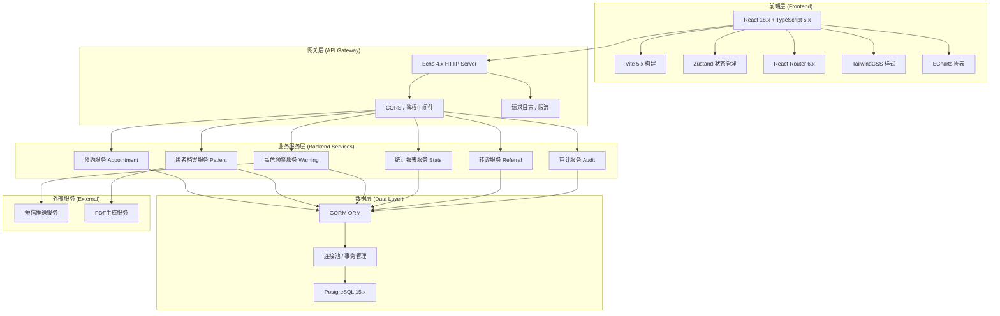
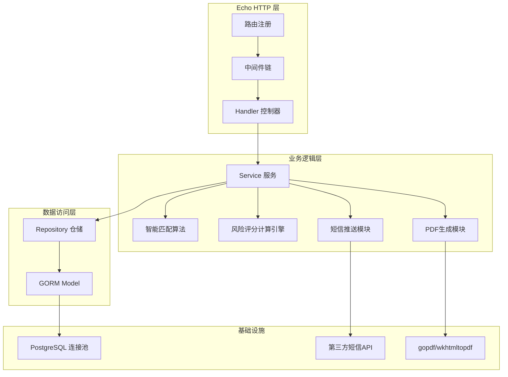
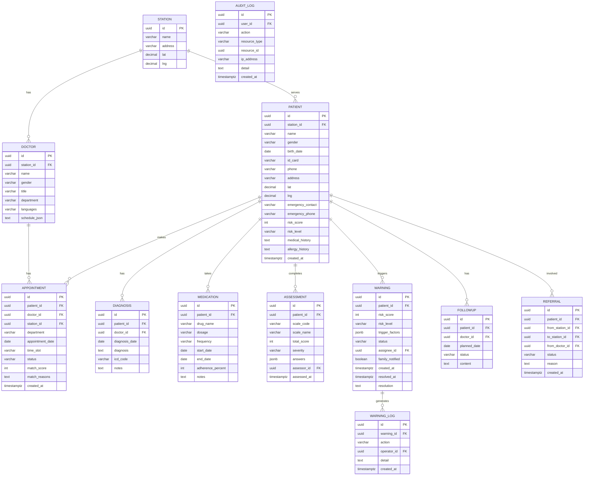

## 1. 架构设计



## 2. 技术描述

- **前端**：React@18.2.0 + TypeScript@5.4.0 + Vite@5.2.0 + Zustand@4.5.0 + React Router@6.22.0 + TailwindCSS@3.4.0 + lucide-react@0.344.0 + echarts@5.5.0
- **初始化工具**：vite-init react-ts 模板
- **后端**：Go@1.21 + Echo@4.11.0 + GORM@1.25.0
- **数据库**：PostgreSQL@15.x，连接池最大100连接
- **接口协议**：RESTful API + JSON
- **鉴权方式**：JWT Token，有效期2小时

## 3. 路由定义

| 路由路径 | 页面组件 | 用途 |
|----------|----------|------|
| / | DashboardPage | 工作台首页 |
| /appointments | AppointmentPage | 预约管理 |
| /appointments/:id | AppointmentDetailPage | 预约详情 |
| /patients | PatientListPage | 患者档案列表 |
| /patients/:id | PatientRecordPage | 患者档案详情 |
| /warnings | WarningCenterPage | 高危预警中心 |
| /statistics | StatisticsPage | 统计报表 |
| /settings | SettingsPage | 系统设置 |
| /login | LoginPage | 登录页 |

## 4. API 定义

### 4.1 预约模块

```typescript
// 预约实体
interface Appointment {
  id: string;
  patientId: string;
  patientName: string;
  doctorId: string;
  doctorName: string;
  department: string;
  stationId: string;
  stationName: string;
  date: string;
  timeSlot: string;
  status: 'pending' | 'confirmed' | 'completed' | 'cancelled' | 'rescheduled';
  matchScore: number;
  createdAt: string;
  updatedAt: string;
}

// 智能匹配请求
interface MatchRequest {
  patientId: string;
  department: string;
  preferredDate: string;
  preferredTimeRange: 'morning' | 'afternoon' | 'evening';
  doctorGender?: 'male' | 'female' | 'any';
  doctorTitle?: string;
  language?: string;
}

// 匹配推荐结果
interface MatchResult {
  doctorId: string;
  doctorName: string;
  doctorTitle: string;
  department: string;
  stationName: string;
  date: string;
  timeSlot: string;
  matchScore: number;
  matchReasons: string[];
  distanceKm?: number;
  historicalVisits: number;
}

// GET  /api/appointments              获取预约列表（分页+筛选）
// GET  /api/appointments/:id          获取预约详情
// POST /api/appointments/match        智能匹配推荐时段
// POST /api/appointments              创建预约
// PUT  /api/appointments/:id          修改预约（改签）
// PUT  /api/appointments/:id/status   更新预约状态
// DELETE /api/appointments/:id        取消预约
```

### 4.2 患者档案模块

```typescript
// 患者基本信息
interface Patient {
  id: string;
  name: string;
  gender: 'male' | 'female';
  birthDate: string;
  idCard: string;
  phone: string;
  address: string;
  emergencyContact: string;
  emergencyPhone: string;
  stationId: string;
  stationName: string;
  riskLevel: 'low' | 'medium' | 'high';
  riskScore: number;
  medicalHistory: string;
  allergyHistory: string;
  createdAt: string;
}

// 诊断记录
interface DiagnosisRecord {
  id: string;
  patientId: string;
  diagnosisDate: string;
  diagnosis: string;
  icdCode: string;
  doctorId: string;
  doctorName: string;
  notes: string;
}

// 用药方案
interface Medication {
  id: string;
  patientId: string;
  drugName: string;
  dosage: string;
  frequency: string;
  startDate: string;
  endDate?: string;
  adherence: number;
  notes: string;
}

// 心理测评量表
interface Assessment {
  id: string;
  patientId: string;
  scaleCode: string;
  scaleName: string;
  totalScore: number;
  severity: 'normal' | 'mild' | 'moderate' | 'severe';
  answers: Record<string, number>;
  assessorId: string;
  assessedAt: string;
}

// GET    /api/patients                  患者列表（分页+搜索）
// GET    /api/patients/:id              患者详情
// POST   /api/patients                  新增患者
// PUT    /api/patients/:id              修改患者
// GET    /api/patients/:id/diagnoses    诊断记录
// POST   /api/patients/:id/diagnoses    新增诊断
// GET    /api/patients/:id/medications  用药记录
// POST   /api/patients/:id/medications  新增用药
// GET    /api/patients/:id/assessments  量表记录
// POST   /api/patients/:id/assessments  提交量表
// GET    /api/patients/:id/followups    随访记录
// POST   /api/patients/:id/export       导出PDF
```

### 4.3 高危预警模块

```typescript
// 高危预警
interface Warning {
  id: string;
  patientId: string;
  patientName: string;
  riskScore: number;
  riskLevel: 'high' | 'medium' | 'low';
  triggerFactors: string[];
  status: 'pending' | 'processing' | 'resolved';
  assigneeId?: string;
  assigneeName?: string;
  notifiedDoctors: string[];
  notifiedFamily: boolean;
  createdAt: string;
  resolvedAt?: string;
  resolution?: string;
}

// 风险指标权重配置
interface RiskFactorWeights {
  phq9Score: number;
  gad7Score: number;
  scl90Score: number;
  medicationAdherence: number;
  visitInterval: number;
  suicideHistory: number;
  selfHarmHistory: number;
  hospitalizations: number;
  substanceAbuse: number;
  socialIsolation: number;
  sleepDisturbance: number;
  appetiteChange: number;
}

// GET    /api/warnings                  预警列表（分页+状态筛选）
// GET    /api/warnings/stats            预警统计
// GET    /api/warnings/:id              预警详情
// PUT    /api/warnings/:id/assign       分配预警
// PUT    /api/warnings/:id/resolve      处理预警
// POST   /api/warnings/:id/notify       手动触发通知
```

### 4.4 统计与转诊模块

```typescript
// GET  /api/stats/overview              首页概览统计
// GET  /api/stats/appointments          预约统计（按时间/科室/医生）
// GET  /api/stats/warnings              预警趋势统计
// GET  /api/stats/export                导出报表

// GET    /api/referrals                 转诊列表
// POST   /api/referrals                 发起转诊
// PUT    /api/referrals/:id/accept      接收转诊
// PUT    /api/referrals/:id/reject      拒绝转诊
// GET    /api/referrals/:id/documents   转诊材料
// POST   /api/referrals/:id/documents   上传转诊材料

// GET  /api/audit/logs                  审计日志（分页+筛选）
```

## 5. 服务端架构图



## 6. 数据模型

### 6.1 ER 图



### 6.2 关键索引与DDL

```sql
-- 患者表索引
CREATE INDEX idx_patient_station ON patients(station_id);
CREATE INDEX idx_patient_risk ON patients(risk_level);
CREATE INDEX idx_patient_name ON patients(name);
CREATE INDEX idx_patient_phone ON patients(phone);

-- 预约表索引
CREATE INDEX idx_appointment_doctor_date ON appointments(doctor_id, appointment_date);
CREATE INDEX idx_appointment_patient ON appointments(patient_id);
CREATE INDEX idx_appointment_status ON appointments(status);
CREATE INDEX idx_appointment_date ON appointments(appointment_date);

-- 预警表索引
CREATE INDEX idx_warning_status ON warnings(status);
CREATE INDEX idx_warning_patient ON warnings(patient_id);
CREATE INDEX idx_warning_created ON warnings(created_at DESC);
CREATE INDEX idx_warning_level ON warnings(risk_level);

-- 量表表索引
CREATE INDEX idx_assessment_patient_scale ON assessments(patient_id, scale_code);
CREATE INDEX idx_assessment_date ON assessments(assessed_at DESC);

-- 审计日志表（按月分区，保留180天）
CREATE INDEX idx_audit_user ON audit_logs(user_id);
CREATE INDEX idx_audit_created ON audit_logs(created_at DESC);
CREATE INDEX idx_audit_action ON audit_logs(action);

-- 初始化机构数据
INSERT INTO stations (id, name, address) VALUES
(gen_random_uuid(), '中心院区', 'XX区XX路1号'),
(gen_random_uuid(), '东区服务站', 'XX区XX路2号'),
(gen_random_uuid(), '西区服务站', 'XX区XX路3号');
```
