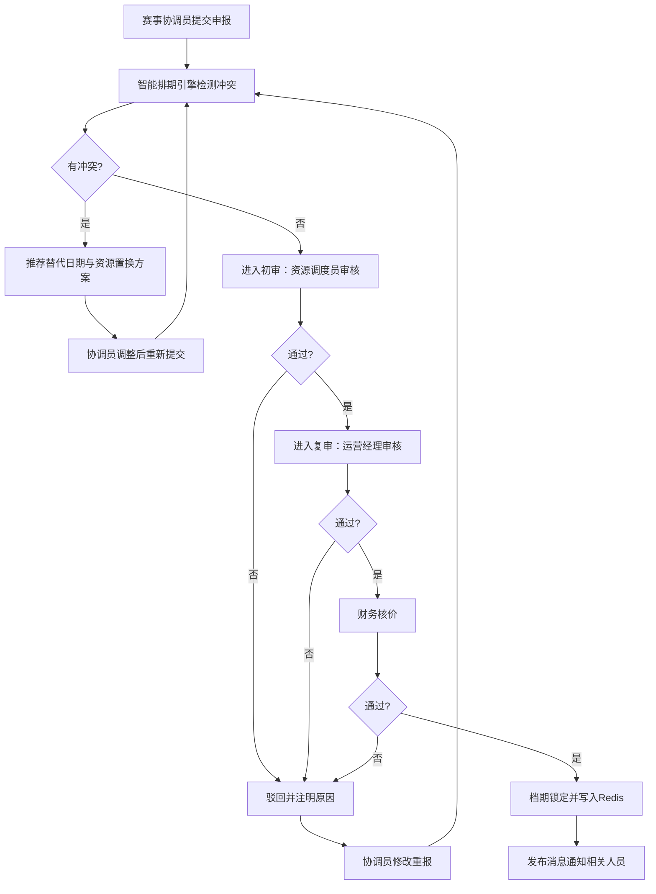
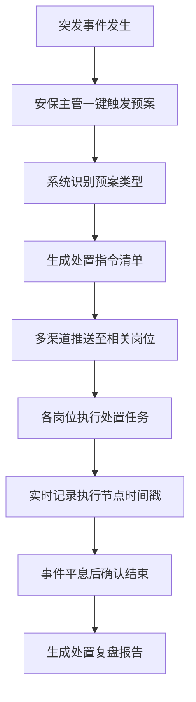

# 省级体育场馆运营管理系统 - 产品需求文档 (PRD)

## 1. 产品概述

省级大型体育场馆运营管理中心智能调度系统，负责辖区内3个综合性体育场馆的运营调度与赛事管理。系统旨在解决档期冲突频发、资源调度低效、设备切换混乱、数据孤岛、应急响应迟缓等核心痛点，实现场馆运营的智能化、可视化、高效化管理。

- **目标用户**：场馆运营经理、资源调度员、赛事协调员、票务管理员、安保主管
- **核心价值**：降低档期冲突率90%、提升资源利用率30%、应急响应时间缩短80%、月度报表生成时间从3天降至30秒

## 2. 核心功能

### 2.1 用户角色

| 角色 | 登录方式 | 核心权限 |
|------|----------|----------|
| 运营经理 | 账号密码/SSO | 赛事审批、运营数据查看、应急预案管理、VIP包厢优先级配置 |
| 资源调度员 | 账号密码/SSO | 资源调度、档期排期、设备状态管理、资源拓扑图操作 |
| 赛事协调员 | 账号密码/SSO | 赛事申报、进度跟踪、审批流程查看、赛事详情维护 |
| 票务管理员 | 账号密码/SSO | 票房数据查看、营收统计报表、异常销售预警处理 |
| 安保主管 | 账号密码/SSO | 应急预案触发、疏散指挥、安全事件记录 |

### 2.2 功能模块

1. **档期看板**：月视图甘特图、多场馆联排、赛事色块区分、冲突检测提示、详情浮层
2. **资源拓扑图**：场馆3D可视化、资源状态热力图、拖拽调整分配、转换耗时计算
3. **赛事申报**：三级审批流程、表单向导、超时催办、驳回修改重报
4. **运营仪表盘**：营收统计、票房实时数据、销售波动预警、自定义报表导出
5. **应急管理**：三类预案预设、一键触发、多渠道通知推送、处置节点记录、复盘报告
6. **设备管理**：演唱会/体育赛事模式切换、设备状态校验、异常标红、备选方案推荐
7. **VIP包厢管理**：预订锁定、优先级排序、置换协商、待分配队列

### 2.3 页面详情

| 页面名称 | 模块名称 | 功能描述 |
|---------|---------|---------|
| 档期看板页 | 甘特图主视图 | 月视图展示、横向时间轴、纵向场馆/资源维度、拖拽创建赛事 |
| 档期看板页 | 场馆切换器 | 三场馆快速切换、多场馆对比视图 |
| 档期看板页 | 赛事详情浮层 | 点击色块弹出赛事详情、资源清单、审批状态、操作按钮 |
| 档期看板页 | 冲突检测面板 | 实时检测档期冲突、替代日期推荐、资源置换方案 |
| 资源拓扑图页 | 3D场馆视图 | 场馆立体结构展示、35类资源节点分布、缩放平移交互 |
| 资源拓扑图页 | 状态热力图 | 资源占用率颜色编码、实时状态刷新、悬停详情 |
| 资源拓扑图页 | 资源调度面板 | 拖拽分配资源、时段调整、转换时间自动缓冲 |
| 赛事申报页 | 表单向导 | 多步骤表单：基本信息-资源需求-时间安排-提交审核 |
| 赛事申报页 | 审批流程展示 | 三级审批进度条、当前审批人、超时状态、催办按钮 |
| 赛事申报页 | 驳回修改 | 驳回原因展示、可编辑字段、重新提交 |
| 运营仪表盘页 | 营收概览卡片 | 总营收、场均营收、同比环比、趋势图表 |
| 运营仪表盘页 | 票房统计图 | 按赛事/场馆/票种维度统计、柱状图+折线图组合 |
| 运营仪表盘页 | 预警提醒 | 异常销售波动标红、预警级别、处理入口 |
| 应急管理页 | 预案卡片列表 | 天气突变/设备故障/安全事故三类预案卡片、触发按钮 |
| 应急管理页 | 处置流程时间线 | 执行节点时间戳记录、责任人、处置状态 |
| 应急管理页 | 通知推送记录 | 多渠道推送记录、送达状态、响应时间统计 |
| 设备管理页 | 模式切换器 | 演唱会模式/体育赛事模式一键切换、差异化设备清单 |
| 设备管理页 | 设备状态列表 | 设备可用状态、异常标红、备选方案推荐 |
| VIP包厢页 | 包厢网格视图 | 包厢布局展示、预订状态色块、优先级标识 |
| VIP包厢页 | 预订管理 | 锁定机制、置换协商、待分配队列管理 |

## 3. 核心流程

### 3.1 赛事申报与排期流程

赛事协调员提交赛事申报，系统自动进行档期冲突检测，如无冲突则进入三级审批流程，审批通过后正式锁定档期并通知相关人员。

### 3.2 应急预案触发流程

安保主管或系统自动触发应急预案，系统自动推送处置指令至相关岗位，记录各节点执行时间，事后生成复盘报告。

## 4. 用户界面设计

### 4.1 设计风格

- **主色调**：深邃藏青 #0A1628 作为主背景色，搭配科技感湖蓝 #00D4FF 作为主强调色
- **辅助色**：赛事绿 #00FF88（体育赛事）、活力橙 #FF6B35（演唱会）、警示红 #FF3366（应急/预警）、尊贵金 #FFD700（VIP）
- **字体**：标题使用 Rajdhani 科技感字体，正文使用 Inter 现代无衬线字体
- **布局风格**：暗色主题仪表盘风格，卡片式布局，玻璃态拟态效果，数据可视化丰富
- **图标风格**：线性轮廓图标，统一2px描边，悬停时有发光效果

### 4.2 页面设计概览

| 页面名称 | 模块名称 | UI 元素 |
|---------|---------|---------|
| 档期看板页 | 甘特图主视图 | 深色背景、横向时间轴带日期刻度、纵向场馆列表、彩色赛事色块带渐变、悬停发光效果、点击弹出毛玻璃详情面板 |
| 档期看板页 | 顶部工具栏 | 固定顶部、今日提醒胶囊、待办计数徽章、红色醒目应急按钮、搜索与筛选 |
| 资源拓扑图页 | 3D场馆视图 | 等距视角立体场馆、资源节点为发光圆点、连线表示资源关系、缩放平移动画、选中节点脉冲效果 |
| 运营仪表盘页 | 数据卡片 | 玻璃态卡片、大字号数据、趋势迷你图、渐变装饰条、悬停上浮效果 |
| 应急管理页 | 预案卡片 | 红色渐变边框、警报图标、大号触发按钮、脉冲动画、悬停时边框发光 |

### 4.3 响应式设计

- **桌面端（1366px - 1920px）**：左侧固定导航栏（240px）、中央内容区自适应、右侧可折叠资源面板（320px）
- **平板端（768px - 1366px）**：导航栏收起为图标模式（64px）、右侧面板默认折叠、甘特图支持横向滚动
- **移动端（< 768px）**：底部导航栏、档期看板切换为列表视图、资源面板隐藏为底部浮动按钮触发、单列布局

### 4.4 动效设计

- **页面进入**：内容区从下往上渐入，带10px位移，各卡片错落延迟
- **数据更新**：数字滚动动画、进度条平滑过渡、图表渐入绘制
- **交互反馈**：按钮点击缩放反馈、悬停发光效果、拖拽时半透明跟随
- **应急状态**：红色警报呼吸灯效果、紧急通知从顶部滑入、警示音提示

## 5. 性能与约束

- **档期冲突检测响应时间**：< 500毫秒
- **并发用户支持**：调度员200人 + 票务管理员100人同时在线
- **Redis缓存覆盖**：未来365天档期数据，每分钟更新频率
- **应急通知延迟**：触发后10秒内送达全部相关岗位
- **月度报表生成**：< 30秒
- **接口规范**：Swagger OpenAPI 3.0，RESTful设计
