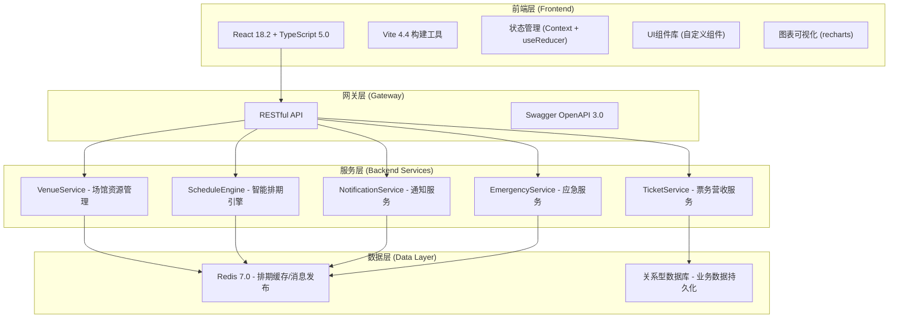
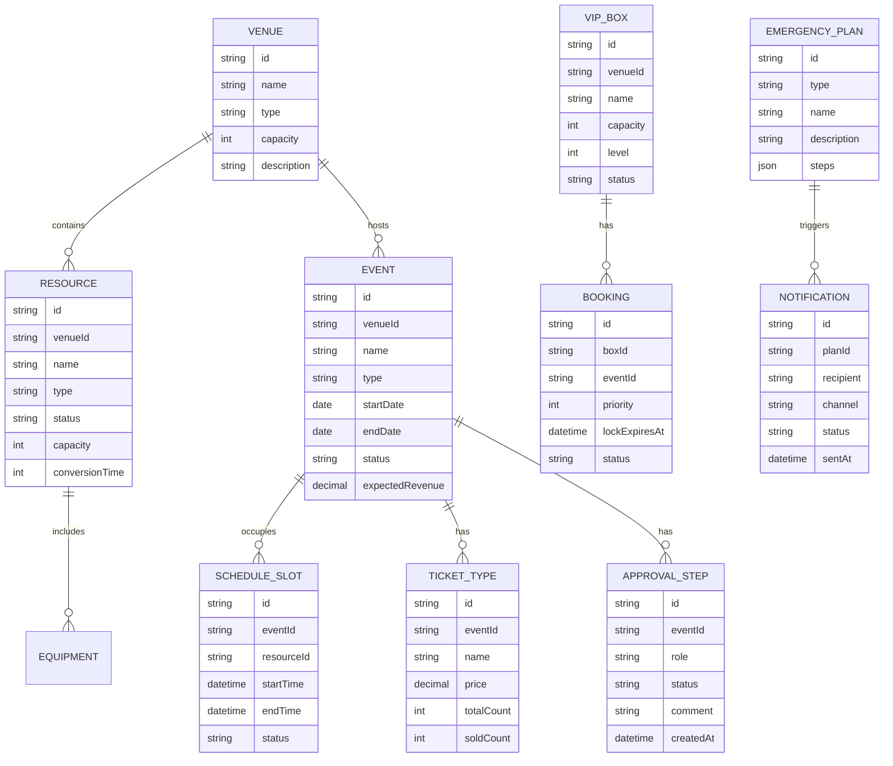

# 省级体育场馆运营管理系统 - 技术架构文档

## 1. 架构设计

系统采用前后端分离架构，前端使用 React + TypeScript + Vite 构建，后端使用 C# ASP.NET Core 8.0 提供 RESTful API，Redis 7.0 作为缓存和排期引擎存储。



## 2. 技术描述

### 2.1 前端技术栈

| 技术 | 版本 | 用途 |
|------|------|------|
| React | 18.2 | UI 框架 |
| TypeScript | 5.0 | 类型安全 |
| Vite | 4.4 | 构建工具 / 开发服务器 |
| React Router | 6.x | 前端路由 |
| Recharts | 2.x | 数据可视化图表 |
| date-fns | 3.x | 日期时间处理 |
| zustand | 4.x | 轻量状态管理 |
| tailwindcss | 3.x | CSS 工具类 |

### 2.2 后端技术栈（描述性）

| 技术 | 版本 | 用途 |
|------|------|------|
| ASP.NET Core | 8.0 | Web 框架 |
| Entity Framework Core | 8.x | ORM |
| Redis | 7.0 | 缓存 / 消息队列 / 排期存储 |
| Swashbuckle | 6.x | Swagger 文档生成 |

### 2.3 数据策略

- **前端 Mock**：使用 Mock 数据模拟后端 API，模拟 Redis 排期逻辑、冲突检测算法、通知推送等
- **本地存储**：使用 localStorage 持久化用户偏好设置
- **模拟实时更新**：使用 setInterval 模拟数据实时刷新

## 3. 路由定义

| 路由路径 | 页面名称 | 描述 |
|---------|---------|------|
| / | 档期看板 | 默认定向到档期看板页 |
| /schedule | 档期看板 | 月视图甘特图、多场馆联排、冲突检测 |
| /resources | 资源拓扑图 | 场馆资源可视化、拖拽调度 |
| /events | 赛事管理 | 赛事列表、申报向导、审批流程 |
| /events/new | 赛事申报 | 新建赛事申报表单 |
| /dashboard | 运营仪表盘 | 营收统计、票房数据、预警提醒 |
| /emergency | 应急管理 | 预案列表、一键触发、处置记录 |
| /equipment | 设备管理 | 模式切换、设备状态校验 |
| /vip-boxes | VIP包厢 | 包厢预订、优先级管理 |

## 4. 目录结构

```
src/
├── assets/              # 静态资源
│   ├── icons/           # 图标资源
│   └── images/          # 图片资源
├── components/          # 通用组件
│   ├── layout/          # 布局组件
│   │   ├── Sidebar.tsx       # 左侧导航栏
│   │   ├── TopBar.tsx        # 顶部工具栏
│   │   ├── ResourcePanel.tsx # 右侧资源面板
│   │   └── MainLayout.tsx    # 主布局容器
│   ├── ui/              # 基础UI组件
│   │   ├── Button.tsx
│   │   ├── Card.tsx
│   │   ├── Modal.tsx
│   │   ├── Tabs.tsx
│   │   └── Badge.tsx
│   └── charts/          # 图表组件
├── pages/               # 页面组件
│   ├── ScheduleBoard.tsx    # 档期看板
│   ├── ResourceMap.tsx      # 资源拓扑图
│   ├── EventList.tsx        # 赛事列表
│   ├── EventWizard.tsx      # 赛事申报向导
│   ├── Dashboard.tsx        # 运营仪表盘
│   ├── Emergency.tsx        # 应急管理
│   ├── Equipment.tsx        # 设备管理
│   └── VipBoxes.tsx         # VIP包厢管理
├── store/               # 状态管理
│   ├── useScheduleStore.ts
│   ├── useVenueStore.ts
│   └── useAuthStore.ts
├── services/            # API 服务层
│   ├── scheduleService.ts
│   ├── venueService.ts
│   ├── eventService.ts
│   ├── ticketService.ts
│   └── emergencyService.ts
├── types/               # TypeScript 类型定义
│   ├── index.ts
│   ├── schedule.ts
│   ├── venue.ts
│   ├── event.ts
│   └── emergency.ts
├── utils/               # 工具函数
│   ├── dateUtils.ts
│   ├── conflictDetection.ts
│   └── formatters.ts
├── mock/                # Mock 数据
│   ├── venues.ts
│   ├── events.ts
│   ├── schedule.ts
│   └── tickets.ts
├── hooks/               # 自定义 Hooks
│   ├── useRealtime.ts
│   ├── useConflictDetection.ts
│   └── useResponsive.ts
├── App.tsx              # 根组件
├── main.tsx             # 入口文件
└── index.css            # 全局样式
```

## 5. 核心数据模型

### 5.1 实体关系图



### 5.2 核心类型定义

```typescript
// 场馆类型
interface Venue {
  id: string;
  name: string;
  type: 'stadium' | 'arena' | 'aquatic_center';
  capacity: number;
  description: string;
  resources: Resource[];
}

// 资源类型
interface Resource {
  id: string;
  venueId: string;
  name: string;
  type: ResourceType;
  status: 'available' | 'occupied' | 'maintenance';
  capacity: number;
  conversionTime: number; // 转换耗时（分钟）
  currentEventId?: string;
}

// 赛事类型
interface Event {
  id: string;
  venueId: string;
  name: string;
  type: EventType;
  startDate: Date;
  endDate: Date;
  status: EventStatus;
  organizer: string;
  expectedRevenue: number;
  requiredResources: string[];
  approvalSteps: ApprovalStep[];
}

// 排期时段
interface ScheduleSlot {
  id: string;
  eventId: string;
  resourceId: string;
  startTime: Date;
  endTime: Date;
  status: 'pending' | 'confirmed' | 'locked';
  lockExpiresAt?: Date;
}

// 审批步骤
interface ApprovalStep {
  id: string;
  eventId: string;
  role: 'dispatcher' | 'manager' | 'finance';
  status: 'pending' | 'approved' | 'rejected';
  approver?: string;
  comment?: string;
  createdAt: Date;
  updatedAt?: Date;
}

// 冲突检测结果
interface ConflictResult {
  hasConflict: boolean;
  conflicts: ConflictDetail[];
  suggestions: ScheduleSuggestion[];
}

interface ConflictDetail {
  type: 'schedule' | 'resource' | 'equipment';
  description: string;
  conflictingEventId: string;
  conflictingEventName: string;
}

interface ScheduleSuggestion {
  alternativeDate: Date;
  alternativeResources: string[];
  reason: string;
}

// 应急预案
interface EmergencyPlan {
  id: string;
  type: 'weather' | 'equipment' | 'security';
  name: string;
  description: string;
  steps: EmergencyStep[];
  notificationList: string[];
}

interface EmergencyStep {
  id: string;
  order: number;
  description: string;
  responsibleRole: string;
  expectedDuration: number; // 分钟
}
```

## 6. 状态管理设计

使用 zustand 进行状态管理，按领域划分 store：

- **useScheduleStore**：档期数据、冲突检测结果、排期状态
- **useVenueStore**：场馆信息、资源列表、设备状态
- **useEventStore**：赛事列表、申报表单数据、审批进度
- **useDashboardStore**：营收数据、票房统计、预警信息
- **useEmergencyStore**：应急预案、处置记录、通知状态

## 7. 性能优化策略

- **虚拟列表**：档期看板甘特图使用虚拟滚动，优化大量赛事渲染
- **React.memo**：对频繁渲染的子组件进行记忆化
- **防抖节流**：搜索、冲突检测等高频操作使用防抖
- **缓存策略**：API 数据缓存，减少重复请求
- **代码分割**：路由级代码分割，首屏加载优化
- **按需加载**：图表库、3D 组件按需引入
