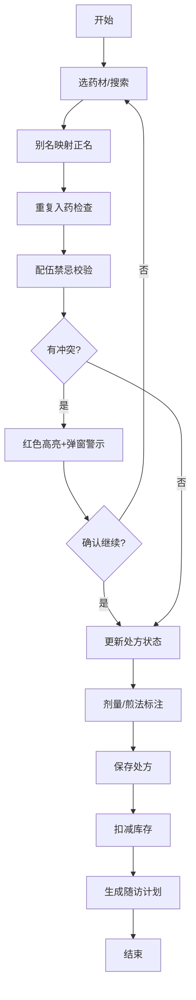

## 1. 产品概述

中药材连锁药房处方调配与智能管理系统，面向3家连锁门店的药师与管理者，解决人工配伍禁忌漏检、别名混淆、库存断药、随访率低等核心痛点。通过数字化手段提升处方调配准确率、库存周转效率与顾客满意度，打造标准化中药房作业流程。

## 2. 核心功能

### 2.1 用户角色

| 角色 | 使用场景 | 核心权限 |
|------|----------|----------|
| 药师 | 日常处方调配 | 处方编辑、配伍校验、库存查询、随访登记 |
| 店长 | 门店运营管理 | 出入库操作、库存调拨、模板维护、统计查看 |
| 坐堂中医 | 开方与随访 | 处方模板保存、患者随访记录查看 |

### 2.2 功能模块

1. **处方编辑器**：拼音/别名搜索、拖拽排序、克钱两换算、特殊煎法标注
2. **配伍禁忌校验**：十八反十九畏、妊娠分级、大毒剂量上限实时检测
3. **别名消重**：别名自动映射正名，重复入药实时拦截
4. **库存管理**：出入库记录、安全库存预警、近效期提醒、门店调拨
5. **用药随访**：7日随访计划、用药反应记录、不良反应回溯
6. **处方模板**：常见病症模板库、一键加载微调、自定义另存
7. **统计看板**：处方趋势、高频排行、禁忌频次、库存周转率

### 2.3 页面详情

| 页面名称 | 模块名称 | 功能描述 |
|----------|----------|----------|
| 首页(仪表盘) | 数据概览卡片 | 今日处方量、待随访数、库存预警数、近7日趋势图 |
| 首页(仪表盘) | 快捷入口 | 新建处方、库存入库、随访登记、模板管理 |
| 处方编辑 | 左侧药材分类树 | 按解表/清热/补益等功能分组，支持展开折叠 |
| 处方编辑 | 中间处方表格 | 可编辑表格，拖拽排序、剂量步进器、煎法下拉 |
| 处方编辑 | 右侧校验面板 | 实时禁忌警示、冲突项红色高亮、弹窗确认 |
| 处方编辑 | 顶部搜索栏 | 拼音首字母、别名模糊搜索、快速添加 |
| 库存管理 | 库存列表 | 药材库存、安全库存标红、近效期橙色标记 |
| 库存管理 | 出入库记录 | 操作流水、日期筛选、门店筛选 |
| 库存管理 | 调拨建议 | 跨门店库存对比、一键生成调拨单 |
| 用药随访 | 随访列表 | 7日随访计划、完成状态、逾期提醒 |
| 用药随访 | 随访登记 | 用药反应记录、不良反应标记、处方回溯链接 |
| 模板管理 | 模板列表 | 按病症分类、一键加载、编辑微调 |
| 统计分析 | 多维度图表 | 月度趋势、高频排行、禁忌触发、周转率 |

## 3. 核心流程

药师登录系统后，从左侧分类树或搜索栏选取药材加入处方，系统实时校验十八反十九畏、妊娠禁忌与剂量超限，冲突项红色高亮并弹窗警示。确认无误后保存处方，系统自动扣减库存并生成7日随访计划。店长可随时查看库存预警并安排调拨，统计看板提供多维度运营数据。

## 4. 用户界面设计

### 4.1 设计风格

- **主色调**：中草药绿 `#2D6A4F`（象征本草、自然），辅以赭石红 `#9B2335`（警示禁忌）与宣纸米白 `#F5F0E6`（背景）
- **辅助色**：安全库存警示橙 `#E67E22`、禁用红 `#C0392B`、成功绿 `#27AE60`、信息蓝 `#2980B9`
- **按钮风格**：圆角 6px，主按钮深绿渐变，悬停轻微上浮阴影
- **字体**：标题用思源宋体（传统感），正文用思源黑体（可读性），剂量数字用等宽字体
- **布局风格**：三栏卡片式布局（25% / 50% / 25%），圆角卡片配轻微阴影，顶部导航栏深绿底白字
- **图标风格**：Bootstrap Icons 线性图标，传统中药元素点缀（药罐、脉枕、戥秤等）

### 4.2 页面设计概览

| 页面名称 | 模块名称 | UI元素 |
|----------|----------|--------|
| 仪表盘 | 数据概览 | 4张渐变卡片、迷你折线图、胶囊状徽章 |
| 仪表盘 | 快捷入口 | 6宫格图标按钮，悬停放大动画 |
| 处方编辑 | 分类树 | 折叠手风琴，活跃项左侧深绿竖条标记 |
| 处方编辑 | 处方表格 | 行拖拽提升阴影、冲突行红底闪烁、步进器输入框 |
| 处方编辑 | 校验面板 | danger徽章列表、展开详情、确认按钮组 |
| 库存管理 | 列表 | 斑马纹表格、预警行背景染色、进度条库存占比 |
| 随访 | 时间轴 | 7日纵向时间轴、已完成打勾、逾期红点脉冲 |
| 统计 | 图表区 | Canvas条形图/折线图、淡入动画、图例交互高亮 |

### 4.3 响应式设计

- **桌面端（≥992px）**：三栏布局，左侧分类树固定宽度280px，右侧校验面板280px，中间自适应
- **平板端（768-991px）**：左侧树折叠为顶部级联下拉，右侧面板收为可展开抽屉
- **移动端（<768px）**：单栏流式布局，分类树→级联选择器，校验面板→底部抽屉，表格转卡片列表
- **通用**：所有按钮触控区域≥44px，拖拽改用长按+移动模式，表格支持横向滚动

### 4.4 动画与交互

- 路由切换：`opacity 0.3s ease-in-out` 淡入，`transform: translateY(8px)` 轻微上滑
- 药材拖拽：行 `box-shadow` 从 0 → 0 8px 20px rgba(0,0,0,0.15)，Z-index提升
- 禁忌触发：冲突行 `background-color` 从白→浅红闪烁3次，徽章弹入动画
- 数据加载：骨架屏 pulse 动画，内容就绪后 fadeIn
- 按钮点击：`transform: scale(0.97)` 微缩回弹
