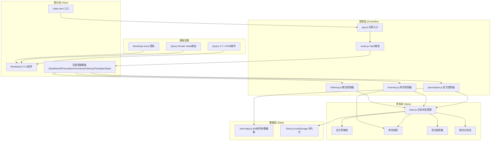

## 1. 架构设计



## 2. 技术描述

- **前端框架**：jQuery 3.7.x + Bootstrap 5.3.x（纯原生SPA架构，无构建工具）
- **路由方案**：jQuery Router（hash模式，监听 hashchange 事件）
- **状态管理**：store.js 自定义发布订阅模式 + Store.js 库封装 localStorage
- **持久化**：Store.js（localStorage wrapper，自动 JSON 序列化，容量监控 < 5MB）
- **数据模拟**：herb-data.js 内置 600+ 味药材完整数据集
- **图表渲染**：原生 Canvas 2D API（无第三方图表库，保证加载速度）
- **拖拽排序**：HTML5 Drag & Drop API（处方表格行排序）
- **性能优化**：
  - 药材搜索：Trie 前缀树索引拼音首字母，搜索 O(L) 复杂度
  - 配伍校验：预计算邻接表表示的十八反十九畏图，单次校验 O(N²) ≤ 50ms（N≤30味/方）
  - 渲染：虚拟滚动处理 600 味药材列表（仅渲染可视区域 ±20 行）
  - 持久化：防抖 debounce 300ms 批量写入 localStorage

## 3. 路由定义

| Route (Hash) | 页面名称 | 核心功能 |
|--------------|----------|----------|
| #/dashboard | 仪表盘首页 | 数据概览、快捷入口、近7日趋势 |
| #/prescription | 处方编辑器 | 选药、校验、剂量、煎法、保存 |
| #/prescription/new | 新建处方 | 空白处方模板初始化 |
| #/prescription/edit/:id | 编辑处方 | 加载草稿栈中指定处方 |
| #/inventory | 库存管理 | 库存列表、预警、出入库、调拨 |
| #/inventory/in | 入库登记 | 入库单录入、批量导入 |
| #/inventory/out | 出库登记 | 出库单录入、处方关联 |
| #/followup | 用药随访 | 随访计划列表、时间轴视图 |
| #/followup/new/:prescriptionId | 新建随访 | 关联处方生成7日计划 |
| #/templates | 处方模板 | 模板列表、分类筛选、加载 |
| #/templates/new | 新建模板 | 从处方另存为模板 |
| #/stats | 统计看板 | 多维度图表与报表 |

## 4. 核心数据结构与API

### 4.1 药材 Herb 对象

```typescript
interface Herb {
  id: string;                    // 药材唯一ID
  name: string;                  // 正名
  aliases: string[];             // 别名列表
  pinyin: string;                // 拼音（含首字母缩写）
  category: string;              // 分类（解表药/清热药/...）
  nature: string;                // 性味（寒/热/温/凉/平）
  flavors: string[];             // 归经（肝/心/脾/肺/肾...）
  toxicity: '无毒' | '小毒' | '中毒' | '大毒';
  maxDose: number;               // 单次最大剂量（克）
  minDose: number;               // 单次最小剂量（克）
  pregnancy: '禁用' | '慎用' | '安全';
  specialMethods: string[];      // 适用特殊煎法
  eighteenAnti: string[];        // 十八反冲突药材ID列表
  nineteenFear: string[];        // 十九畏冲突药材ID列表
}
```

### 4.2 处方 Prescription 对象

```typescript
interface Prescription {
  id: string;
  patientName: string;
  patientGender: '男' | '女';
  patientAge: number;
  isPregnant: boolean;
  diagnosis: string;
  items: PrescriptionItem[];
  totalDose: number;             // 剂数
  createdAt: number;
  updatedAt: number;
  status: '草稿' | '已调配' | '已发药';
  warnings: WarningItem[];
}

interface PrescriptionItem {
  herbId: string;
  herbName: string;
  dosage: number;                // 克数
  unit: '克' | '钱' | '两';
  decoction: string;             // 特殊煎法
  notes: string;
}

interface WarningItem {
  type: '十八反' | '十九畏' | '妊娠禁用' | '妊娠慎用' | '剂量超限' | '别名重复';
  severity: 'danger' | 'warning';
  herbs: string[];               // 涉及药材名
  message: string;
}
```

### 4.3 库存 Inventory 对象

```typescript
interface InventoryRecord {
  herbId: string;
  storeId: string;               // 门店ID
  quantity: number;              // 库存数量（克）
  safeStock: number;             // 安全库存阈值
  expiryDate: string;            // YYYY-MM-DD
  batchNo: string;
  lastUpdated: number;
}

interface StockLog {
  id: string;
  type: 'in' | 'out' | 'transfer';
  herbId: string;
  storeId: string;
  quantity: number;
  relatedPrescriptionId?: string;
  operator: string;
  timestamp: number;
}
```

### 4.4 随访 Followup 对象

```typescript
interface FollowupPlan {
  id: string;
  prescriptionId: string;
  patientName: string;
  days: FollowupDay[];
  createdAt: number;
}

interface FollowupDay {
  day: number;                   // 第1-7天
  scheduledDate: string;
  status: '待随访' | '已完成' | '已逾期';
  contactedAt?: number;
  reaction?: '良好' | '一般' | '不适' | '不良反应';
  notes?: string;
}
```

### 4.5 Store.js 公共 API

```typescript
// 状态管理
store.getState(key): any
store.setState(key, value): void
store.subscribe(key, callback): unsubscribeFn

// 持久化
store.saveToStorage(): void      // 防抖批量写入
store.loadFromStorage(): void    // 启动时加载
store.getStorageUsage(): number  // 检查localStorage用量

// 处方草稿栈
store.pushDraft(prescription): void
store.popDraft(): Prescription
store.peekDraft(): Prescription
store.getDraft(id): Prescription
store.removeDraft(id): void
store.clearDrafts(): void
```

## 5. 性能指标与验收标准

| 指标 | 目标值 | 测量方式 |
|------|--------|----------|
| 首屏加载（600味药材） | < 200ms | performance.now() 从 DOMContentLoaded 到首渲染 |
| 单次配伍校验响应 | < 50ms | console.time() 包裹 validatePrescription |
| 拼音首字母搜索 600 条 | < 10ms | 输入"jh"（金银花）渲染结果耗时 |
| localStorage 占用 | < 5MB | 执行 JSON.stringify(state).length × 2 估算 |
| 20张草稿并行 | 0丢状态 | 开关标签页20次后草稿数不变 |
| 拖拽排序帧率 | ≥ 55fps | Chrome DevTools Performance 面板 |
| 表单实时验证 | 无延迟 | 输入剂量超限后 UI 更新 < 100ms |
