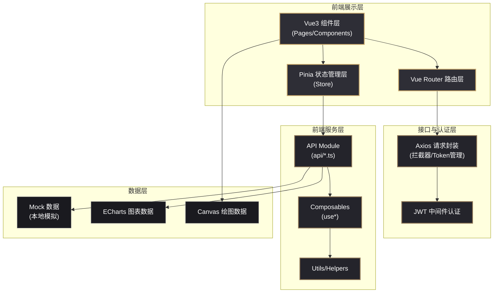
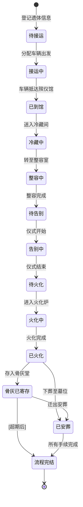

# 殡葬管理综合服务平台 - 技术架构文档

## 1. 架构设计



## 2. 技术栈说明

| 层级 | 技术选型 | 版本 | 用途 |
|------|----------|------|------|
| 核心框架 | Vue | 3.4.x | 响应式UI框架，Composition API |
| 语言 | TypeScript | 5.3.x | 类型安全 |
| 构建工具 | Vite | 5.x | 快速开发构建 |
| 状态管理 | Pinia | 2.1.x | 集中式状态管理 |
| 路由 | Vue Router | 4.2.x | SPA路由 |
| UI组件库 | Element Plus | 2.5.x | 表格/表单/弹窗/日历组件 |
| 图表库 | ECharts | 5.4.x | 统计报表可视化 |
| HTTP请求 | Axios | 1.6.x | API请求封装 |
| 日期处理 | dayjs | 1.11.x | 日期格式化和计算 |
| 图标 | @element-plus/icons-vue | 2.3.x | 图标库 |
| CSS框架 | Tailwind CSS | 3.4.x | 原子化CSS |
| 代码规范 | ESLint + Prettier | latest | 代码质量 |

## 3. 目录结构

```
/
├── src/
│   ├── api/                    # API请求模块
│   │   ├── remains.ts          # 遗体档案相关接口
│   │   ├── hall.ts             # 告别厅预约接口
│   │   ├── vehicle.ts          # 车辆调度接口
│   │   ├── cemetery.ts         # 墓园管理接口
│   │   ├── memorial.ts         # 祭扫预约接口
│   │   ├── billing.ts          # 费用结算接口
│   │   ├── statistics.ts       # 统计报表接口
│   │   └── auth.ts             # 登录认证接口
│   ├── assets/                 # 静态资源
│   │   ├── styles/             # 全局样式
│   │   │   ├── index.scss      # 样式入口
│   │   │   ├── theme.scss      # 主题变量(深色肃穆)
│   │   │   └── reset.scss      # 重置样式
│   │   └── images/             # 图片资源
│   ├── components/             # 公共组件
│   │   ├── layout/             # 布局组件
│   │   │   ├── SideBar.vue     # 左侧导航栏
│   │   │   ├── TopBar.vue      # 顶部面包屑栏
│   │   │   └── MainLayout.vue  # 主布局容器
│   │   ├── remains/            # 遗体相关组件
│   │   │   ├── RemainsCard.vue # 遗体档案卡片
│   │   │   ├── StatusTimeline.vue # 状态时间线
│   │   │   └── QrCodeModal.vue # 扫码查询弹窗
│   │   ├── hall/               # 告别厅相关组件
│   │   │   ├── WeekCalendar.vue # 周视图日历
│   │   │   └── BookingBlock.vue # 预约块
│   │   ├── cemetery/           # 墓园相关组件
│   │   │   ├── PlotCanvas.vue  # 墓位Canvas绘图
│   │   │   └── PlotInfo.vue    # 墓位详情侧边栏
│   │   ├── billing/            # 费用相关组件
│   │   │   └── FeeList.vue     # 费用清单
│   │   └── common/             # 通用组件
│   │       ├── StatCard.vue    # 统计卡片
│   │       ├── SearchBar.vue   # 搜索筛选栏
│   │       └── StatusTag.vue   # 状态标签
│   ├── composables/            # 组合式函数
│   │   ├── useRemains.ts       # 遗体业务逻辑
│   │   ├── useHallBooking.ts   # 预约逻辑
│   │   ├── useVehicle.ts       # 车辆调度逻辑
│   │   ├── usePlotSelection.ts # 墓位选择逻辑
│   │   └── useAuth.ts          # 认证逻辑
│   ├── mock/                   # Mock数据
│   │   ├── remains.ts          # 遗体档案模拟数据
│   │   ├── halls.ts            # 告别厅数据
│   │   ├── vehicles.ts         # 车辆数据
│   │   ├── cemetery.ts         # 墓园数据
│   │   ├── memorial.ts         # 祭扫预约数据
│   │   └── statistics.ts       # 统计数据
│   ├── pages/                  # 页面组件
│   │   ├── Login.vue           # 登录页
│   │   ├── Dashboard.vue       # 工作台首页
│   │   ├── remains/
│   │   │   ├── List.vue        # 遗体档案列表
│   │   │   ├── Detail.vue      # 遗体档案详情
│   │   │   └── Register.vue    # 遗体登记
│   │   ├── hall/
│   │   │   └── Booking.vue     # 告别厅预约
│   │   ├── vehicle/
│   │   │   └── Dispatch.vue    # 车辆调度
│   │   ├── cemetery/
│   │   │   ├── Map.vue         # 墓园园区
│   │   │   └── Memorial.vue    # 祭扫预约
│   │   ├── billing/
│   │   │   └── Settlement.vue  # 费用结算
│   │   ├── statistics/
│   │   │   └── Report.vue      # 统计报表
│   │   └── settings/
│   │       └── Index.vue       # 系统设置
│   ├── router/                 # 路由配置
│   │   └── index.ts
│   ├── stores/                 # Pinia状态
│   │   ├── auth.ts             # 用户认证
│   │   ├── remains.ts          # 遗体状态
│   │   ├── hall.ts             # 预约状态
│   │   └── app.ts              # 全局应用状态
│   ├── types/                  # TypeScript类型定义
│   │   ├── remains.ts          # 遗体相关类型
│   │   ├── hall.ts             # 告别厅类型
│   │   ├── vehicle.ts          # 车辆类型
│   │   ├── cemetery.ts         # 墓园类型
│   │   ├── memorial.ts         # 祭扫类型
│   │   ├── billing.ts          # 费用类型
│   │   └── common.ts           # 通用类型
│   ├── utils/                  # 工具函数
│   │   ├── request.ts          # Axios封装
│   │   ├── date.ts             # 日期工具
│   │   ├── status.ts           # 状态映射
│   │   └── storage.ts          # 本地存储
│   ├── App.vue
│   └── main.ts
├── public/
├── index.html
├── vite.config.ts
├── tsconfig.json
├── tailwind.config.js
├── postcss.config.js
├── .eslintrc.cjs
├── .prettierrc
└── package.json
```

## 4. 路由定义

| 路由路径 | 页面名称 | 权限要求 | 说明 |
|----------|----------|----------|------|
| /login | 登录页 | 公开 | 身份认证入口 |
| /dashboard | 工作台 | 已登录 | 数据概览与待办 |
| /remains/list | 遗体档案列表 | 殡仪服务员+ | 档案卡片展示 |
| /remains/detail/:id | 遗体档案详情 | 殡仪服务员+ | 详情与状态流转 |
| /remains/register | 遗体登记 | 殡仪服务员 | 新建档案 |
| /hall/booking | 告别厅预约 | 礼仪师+ | 周视图日历预约 |
| /vehicle/dispatch | 车辆调度 | 殡仪服务员+ | 车辆地图调度 |
| /cemetery/map | 墓园园区 | 墓园管理员 | Canvas墓位管理 |
| /cemetery/memorial | 祭扫预约 | 墓园管理员+家属 | 时段预约 |
| /billing/settlement | 费用结算 | 殡仪服务员 | 费用清单与支付 |
| /statistics/report | 统计报表 | 管理员 | 数据分析与导出 |
| /settings | 系统设置 | 超级管理员 | 用户权限配置 |

## 5. 核心类型定义

```typescript
// 遗体状态枚举
enum RemainsStatus {
  PENDING_PICKUP = 'pending_pickup',  // 待接运
  PICKING_UP = 'picking_up',          // 接运中
  ARRIVED = 'arrived',                // 已到馆
  REFRIGERATING = 'refrigerating',    // 冷藏中
  COSMETIC = 'cosmetic',              // 整容中
  READY_FOR_FAREWELL = 'ready_farewell', // 待告别
  IN_FAREWELL = 'in_farewell',        // 告别中
  READY_FOR_CREMATION = 'ready_cremation', // 待火化
  CREMATING = 'cremating',            // 火化中
  CREMATED = 'cremated',              // 已火化
  ASH_STORED = 'ash_stored',          // 骨灰已寄存
  BURIED = 'buried',                  // 已安葬
  COMPLETED = 'completed'             // 流程完结
}

// 遗体档案
interface Remains {
  id: string
  code: string                        // 遗体唯一编码(条码)
  name: string                        // 逝者姓名
  gender: 'male' | 'female'
  age: number
  idNumber: string                    // 身份证号
  causeOfDeath: string                // 死亡原因
  deathTime: string                   // 死亡时间
  pickupAddress: string               // 接运地址
  arriveTime?: string                 // 到馆时间
  currentStatus: RemainsStatus
  family: {                           // 家属信息
    name: string
    relation: string
    phone: string
  }
  services: ServiceItem[]             // 关联服务项目
  statusHistory: StatusRecord[]       // 状态历史
  createTime: string
  operatorId: string
}

// 状态记录
interface StatusRecord {
  status: RemainsStatus
  time: string
  operatorId: string
  operatorName: string
  remark?: string
}

// 告别厅
interface FarewellHall {
  id: string
  name: string
  funeralHomeId: string               // 所属殡仪馆
  capacity: number                    // 容纳人数
  facilities: string[]                // 配套设施
  basePrice: number                   // 基础费用/小时
  status: 'available' | 'maintenance'
}

// 预约记录
interface Booking {
  id: string
  hallId: string
  remainsId: string
  remainsName: string
  date: string                        // YYYY-MM-DD
  startTime: string                   // HH:mm
  endTime: string
  duration: number                    // 分钟
  services: ServiceItem[]
  totalFee: number
  status: 'pending' | 'confirmed' | 'completed' | 'cancelled'
  createTime: string
}

// 车辆
interface Vehicle {
  id: string
  plateNumber: string
  type: 'hearse' | 'family_car'
  status: 'idle' | 'on_mission' | 'maintenance'
  currentLocation: { lat: number; lng: number }
  driverId: string
  driverName: string
  driverPhone: string
}

// 接运任务
interface PickupMission {
  id: string
  remainsId: string
  remainsName: string
  pickupAddress: string
  destination: string
  appointmentTime: string
  vehicleId?: string
  status: 'pending' | 'assigned' | 'picking' | 'arrived' | 'completed' | 'urgent'
  distanceKm?: number
  createTime: string
}

// 墓位
interface CemeteryPlot {
  id: string
  areaId: string                     // 所属园区区域
  row: number
  col: number
  type: 'standard' | 'double' | 'premium' | 'family'
  price: number
  status: 'for_sale' | 'sold' | 'reserved' | 'occupied'
  remainsId?: string
  remainsName?: string
  burialDate?: string
  x: number                          // Canvas绘制坐标
  y: number
  width: number
  height: number
}

// 祭扫预约
interface MemorialBooking {
  id: string
  familyName: string
  phone: string
  date: string
  timeSlot: string                    // 如 08:00-10:00
  peopleCount: number
  hasVehicle: boolean
  plateNumber?: string
  parkingLotId?: string
  parkingSpot?: string
  passCode: string                    // 电子通行证码
  status: 'booked' | 'checked_in' | 'completed' | 'cancelled'
  createTime: string
}

// 费用项目
interface ServiceItem {
  id: string
  name: string
  category: 'transport' | 'refrigeration' | 'cosmetic' | 'farewell' | 'cremation' | 'urn' | 'burial' | 'other'
  price: number
  quantity: number
  discountRate: number                // 折扣率 0-1
  subsidyType?: 'government' | 'special' // 减免类型
  subsidyAmount?: number
  finalPrice: number
  description?: string
}

// 结算单
interface Bill {
  id: string
  remainsId: string
  remainsName: string
  items: ServiceItem[]
  subtotal: number
  subsidyTotal: number
  discountTotal: number
  totalAmount: number
  paidAmount: number
  paymentMethod: 'cash' | 'wechat' | 'alipay' | 'bank' | 'mixed'
  invoiceType: 'none' | 'paper' | 'electronic'
  invoiceUrl?: string
  status: 'unpaid' | 'partial' | 'paid' | 'refunded'
  createTime: string
  paidTime?: string
  operatorId: string
}
```

## 6. 状态机设计



## 7. 性能优化策略

| 优化方向 | 具体措施 | 目标指标 |
|----------|----------|----------|
| 查询优化 | 列表分页+虚拟滚动，遗体编码建索引，Redis缓存热点数据 | 查询响应<500ms |
| 预约冲突 | 前端预校验+后端唯一约束，内存缓存当日排期 | 冲突检测<200ms |
| 并发支持 | 预约接口令牌桶限流，数据库乐观锁，Redis分布式锁 | 100 QPS |
| 车辆定位 | WebSocket推送，前端节流处理，3秒内可见 | 位置延迟<3秒 |
| 图表渲染 | ECharts懒加载，大数据采样降精度，按需渲染 | 首屏<2s |
| Canvas绘制 | 离屏Canvas缓存，视口裁剪渲染，防抖缩放平移 | 60fps流畅 |
| 静态资源 | Vite代码分割，CDN加速，Gzip压缩，Tree Shaking | 95%接口<1s |
| 缓存策略 | 菜单/字典localStorage，列表页keep-alive，接口数据过期缓存 | 减少请求量60% |
