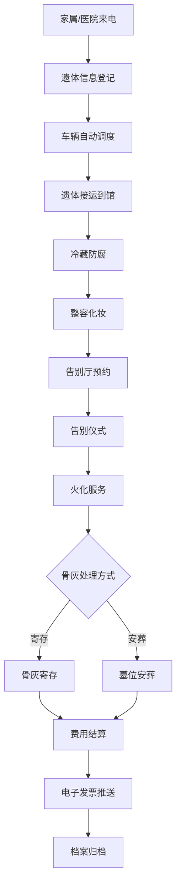

# 殡葬管理综合服务平台 - 产品需求文档(PRD)

## 1. 产品概述

殡葬管理综合服务平台是为某市民政局殡葬管理处打造的一体化业务管理系统，下辖3家殡仪馆和2处经营性公墓，年处理遗体约12000具。系统旨在解决当前业务流程依赖纸质表格和电话协调导致的效率低下、信息不透明、资源调度混乱等问题，实现遗体处理全流程数字化管理。

- 核心目标：实现业务流程数字化、资源调度智能化、服务透明化、管理数据化
- 目标用户：殡仪服务员、防腐整容师、火化工、礼仪师、墓园管理员五类角色工作人员及逝者家属
- 市场价值：提升殡葬服务效率与质量，减少群众投诉，树立民政部门公开透明的服务形象

## 2. 核心功能

### 2.1 用户角色

| 角色 | 注册方式 | 核心权限 |
|------|----------|----------|
| 殡仪服务员 | 系统管理员创建 | 遗体接运登记、状态更新、告别厅预约、费用结算 |
| 防腐整容师 | 系统管理员创建 | 冷藏防腐状态管理、整容化妆操作记录 |
| 火化工 | 系统管理员创建 | 火化任务接收、火化进度更新、骨灰交接 |
| 礼仪师 | 系统管理员创建 | 告别仪式安排、流程控制、服务确认 |
| 墓园管理员 | 系统管理员创建 | 墓位管理、安葬登记、祭扫预约、销售管理 |
| 系统管理员 | 超级账户 | 用户管理、角色权限、系统配置、数据备份 |
| 逝者家属 | 手机号注册 | 进度查询、祭扫预约、费用清单、电子发票 |

### 2.2 功能模块

1. **遗体全流程追踪**：接运登记 → 冷藏防腐 → 整容化妆 → 告别仪式 → 火化服务 → 骨灰寄存/安葬的完整状态机管理
2. **告别厅智能预约**：排期日历展示、时间冲突检测、跨馆资源调配、费用自动计算
3. **车辆调度优化**：接运地址自动分配、实时位置追踪、紧急任务优先、调度记录回溯
4. **墓位可视化管理**：园区地图展示、颜色状态区分、在线选位、价格查询、档案关联
5. **祭扫预约分流**：高峰期限流、时段预约、电子通行证、车位联动
6. **费用透明结算**：明码标价、政策减免匹配、多渠道支付、电子发票开具
7. **统计分析报表**：业务量统计、收入趋势、异常预警、监管报表导出

### 2.3 页面详情

| 页面名称 | 模块名称 | 功能描述 |
|----------|----------|----------|
| 登录页 | 身份认证 | 账号密码登录、JWT Token管理、角色选择、家属端入口 |
| 工作台首页 | 数据概览 | 今日业务统计、待办任务、实时车辆位置、预警提示 |
| 遗体档案列表 | 业务办理 | 卡片式档案展示、多条件筛选、状态标签、快捷操作入口 |
| 遗体档案详情 | 业务办理 | 基本信息、状态时间线、操作日志、关联服务、费用明细 |
| 遗体登记 | 业务办理 | 接运信息录入、逝者信息、家属信息、服务项目选择 |
| 告别厅预约 | 资源调度 | 周视图日历、拖拽调整、冲突提示、预约确认单生成 |
| 车辆调度 | 资源调度 | 车辆地图、任务队列、分配操作、紧急插队、轨迹回放 |
| 墓园管理 | 墓园管理 | Canvas园区地图、墓位网格、颜色状态、选位操作、详情弹窗 |
| 祭扫预约 | 墓园管理 | 时段选择、限流提示、电子通行证、车位分配、扫码验证 |
| 费用结算 | 业务办理 | 费用清单、减免政策匹配、支付方式、电子发票、推送通知 |
| 统计报表 | 统计报表 | 业务量趋势图、收入分析、区域对比、异常数据、导出Excel |
| 系统设置 | 系统管理 | 用户管理、角色权限、服务项目配置、价格标准维护 |

## 3. 核心流程

### 3.1 遗体处理主流程

家属或医院联系殡仪馆 → 殡仪服务员登记遗体信息并生成唯一编码 → 系统自动分配最近接运车辆 → 遗体运抵后更新为"已到馆"状态 → 防腐整容师录入冷藏/整容操作 → 礼仪师预约告别厅并安排仪式 → 告别仪式完成后流转至火化环节 → 火化工完成火化并更新骨灰状态 → 家属选择骨灰寄存或墓位安葬 → 费用结算并生成电子发票 → 档案归档

### 3.2 祭扫预约流程

## 4. 用户界面设计

### 4.1 设计风格

- **主色调**：深灰色系 `#1A1A1F`(最深)、`#24242B`(主背景)、`#2E2E36`(卡片)
- **辅助色**：暗金色 `#C9A86C`(强调/选中)、`#8B7355`(次要强调)
- **文字颜色**：白色 `#FFFFFF`(主文字)、`#B0B0B8`(次要文字)、`#6B6B74`(辅助文字)
- **状态色**：成功绿 `#52C41A`、警告橙 `#FA8C16`、错误红 `#FF4D4F`、信息蓝 `#1890FF`
- **按钮风格**：扁平圆角(4px)，默认深灰背景+暗金边，悬停时暗金渐变填充
- **字体**：中文使用"思源黑体/Source Han Sans"，英文使用"SF Pro Display"，标题使用"思源宋体"点缀庄严肃穆感
- **布局风格**：左侧固定导航栏(240px) + 顶部面包屑栏 + 内容区卡片式布局
- **图标风格**：线性细边图标，配合暗金色强调，使用Element Plus图标库自定义主题

### 4.2 页面设计概览

| 页面名称 | 模块名称 | UI元素 |
|----------|----------|--------|
| 登录页 | 身份认证 | 深色渐变背景+金色装饰线条、居中登录卡片、粒子动画背景、双入口切换(工作人员/家属) |
| 工作台 | 数据概览 | 顶部4个核心指标卡片(深色+金色数字)、中部左侧待办列表、中部右侧车辆地图、底部今日业务时间线 |
| 遗体档案 | 列表页 | 顶部搜索筛选栏、卡片网格布局(每行3-4个)、卡片头部状态标签、卡身关键信息、底部操作按钮组 |
| 遗体详情 | 详情页 | 左侧时间线状态流转(竖排)、右侧基本信息Tab、关联服务Tab、费用明细Tab、操作日志Tab |
| 告别厅预约 | 周视图 | 顶部馆切换+日期导航、主体日历网格(时间轴×厅)、预约块可拖拽、悬浮预览、冲突红色边框提示 |
| 车辆调度 | 地图页 | 左侧任务列表(待分配/进行中/已完成)、右侧地图(车辆标记+接运地标记)、底部调度操作面板 |
| 墓园管理 | 园区图 | 顶部区域切换+缩放控制、主体Canvas绘制墓位网格(颜色区分状态)、悬浮显示墓位详情、右侧选位信息栏 |
| 统计报表 | 图表页 | 顶部时间范围+维度筛选、主体ECharts图表(折线/柱状/饼图)、底部数据表格、右上角导出按钮 |
| 家属端(浅色) | 主页 | 浅灰蓝背景、进度查询大搜索框、我的预约卡片、服务指南、简洁操作流程 |

### 4.3 响应式设计

- **PC端(≥1440px)**：完整功能，左侧导航240px展开，内容区4列栅格
- **平板端(768px-1439px)**：左侧导航80px折叠为图标栏，内容区2-3列栅格自适应
- **移动端(<768px)**：仅提供查询预约功能，底部Tab导航(首页/查询/预约/我的)，隐藏复杂管理功能

### 4.4 动效与交互

- 页面切换：左侧滑入过渡(300ms ease-out)
- 卡片悬停：轻微上浮(translateY -2px) + 金色边框光晕
- 状态变更：时间线节点脉冲动画
- 预约拖拽：半透明预览 + 吸附对齐
- Canvas墓位：鼠标滚轮缩放、拖拽平移、点击选中高亮
- 加载状态：骨架屏 + 渐隐过渡
