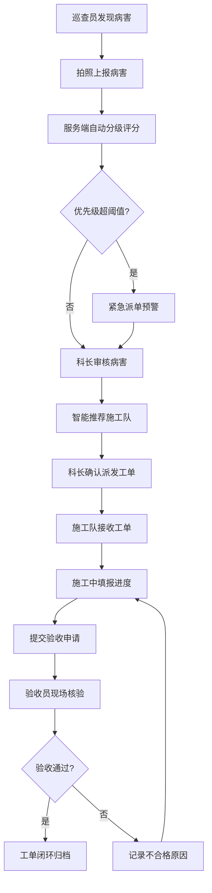

## 1. 产品概述

省级公路养护巡查与病害闭环管理平台，服务于6800余公里国省干线的日常巡查与病害处置工作。平台解决纸质记录延迟、派单混乱、进度不可视等痛点，实现病害从发现到验收的全流程数字化闭环管理。

- 核心目标：病害发现到派单延迟从48小时降至实时，巡查覆盖率提升至95%以上，消除重复派单与漏派
- 目标用户：巡查员、养护科长、施工队长、验收员、系统管理员
- 产品价值：提升公路养护效率，降低管理成本，保障道路通行安全

## 2. 核心特性

### 2.1 用户角色

| 角色 | 登录方式 | 核心权限 |
|------|----------|----------|
| 巡查员 | 账号密码登录 | 实时上报巡查轨迹、拍照上报病害、签收工单 |
| 养护科长 | 账号密码登录 | 审核病害等级、指派施工队、下达巡查任务、查看统计报表 |
| 施工队长 | 账号密码登录 | 接收工单、填报修复进度、提交验收申请 |
| 验收员 | 账号密码登录 | 现场核验病害修复、签署电子验收意见、退回不合格工单 |
| 管理员 | 账号密码登录 | 人员管理、路段配置、统计报表导出、系统配置 |

### 2.2 功能模块

1. **巡查管理页**：全屏地图渲染实时轨迹、病害标记与热力图，可拉伸面板展示病害列表与上报表单
2. **工单管理页**：看板式布局按状态分列展示工单卡片，支持拖拽变更状态，实时倒计时
3. **统计看板页**：多维度筛选栏、折线图/柱状图/热力图、异常指标红色预警
4. **系统管理页**：人员管理、路段配置、权限设置、数据导出

### 2.3 页面详情

| 页面名称 | 模块名称 | 功能描述 |
|----------|----------|----------|
| 巡查管理页 | 地图区域 | 高德地图渲染、实时轨迹显示、病害点标记、巡查覆盖热力图 |
| 巡查管理页 | 病害上报表单 | 病害类型选择、严重程度评级、照片上传、位置定位、备注填写 |
| 巡查管理页 | 病害列表面板 | 可拉伸面板、病害列表筛选、状态标签、快速查看详情 |
| 工单管理页 | 看板列 | 待派发/已指派/修复中/待验收/已闭环五列展示 |
| 工单管理页 | 工单卡片 | 桩号、病害类型、优先级标签、剩余时限倒计时、施工队信息 |
| 工单管理页 | 拖拽交互 | 卡片拖拽变更状态、弹跳微动画、状态流转校验 |
| 工单管理页 | 智能派单弹窗 | 施工队负载排序、距离匹配、专业匹配度评分推荐 |
| 统计看板页 | 筛选栏 | 时间范围、路段范围、病害类型多维度筛选 |
| 统计看板页 | 图表区 | 病害趋势折线图、修复率柱状图、巡查覆盖热力图 |
| 统计看板页 | 指标预警 | 关键指标卡片、异常红色闪烁预警 |
| 系统管理页 | 人员管理 | 账号增删改查、角色分配、密码重置 |
| 系统管理页 | 路段配置 | 路段信息维护、等级设置、施工队关联 |
| 顶部导航栏 | 消息中心 | 未读消息角标、超时闪烁提示、实时通知列表 |
| 左侧导航栏 | 菜单导航 | 巡查/工单/统计/管理四个入口、图标+文字、选中高亮 |

## 3. 核心流程

### 3.1 病害闭环处置流程

巡查员在巡查过程中发现路面病害，通过移动端拍照并填写病害信息后提交上报。服务端接收后自动根据病害类型、严重程度和路段等级计算优先级评分，超阈值自动触发紧急派单通知。养护科长审核病害信息，系统基于施工队当前负载、距离病害点距离及专业匹配度智能推荐施工队，科长确认后创建正式工单。施工队长接收工单后开始修复作业，按工序节点实时更新修复进度。修复完成后提交验收申请，验收员现场核验并拍照对比，通过则工单闭环，不通过则退回施工队重新修复。

### 3.2 巡查轨迹上报流程

## 4. 用户界面设计

### 4.1 设计风格

- **主色调**：深青蓝 #1a5276 作为品牌主色，体现交通行业专业稳重的调性
- **辅助色**：警示红 #e74c3c（预警与紧急状态）、成功绿 #27ae60（已完成状态）、警示橙 #f39c12（处理中状态）、信息蓝 #3498db（提示信息）
- **中性色**：炭灰 #2c3e50（正文）、中灰 #7f8c8d（辅助文字）、浅灰 #ecf0f1（背景）、纯白 #ffffff（卡片背景）
- **按钮样式**：圆角4px、主色填充、悬浮时阴影加深+轻微上浮
- **字体**：标题使用系统粗体，正文使用 -apple-system/BlinkMacSystemFont 字体族，数字使用等宽字体
- **布局风格**：卡片式布局、左侧固定导航栏、顶部信息栏、主内容区自适应
- **图标风格**：使用 lucide-react 线性图标，统一24px尺寸

### 4.2 页面设计概览

| 页面名称 | 模块名称 | UI元素 |
|----------|----------|--------|
| 巡查管理页 | 地图区域 | 全屏高德地图、轨迹折线动画、病害标记点脉冲动画、热力图层 |
| 巡查管理页 | 可拉伸面板 | 顶部拖拽条、阴影分隔、展开收起过渡动画 |
| 工单管理页 | 看板列 | 列标题带状态色条、卡片间距16px、空状态提示 |
| 工单管理页 | 工单卡片 | 圆角8px、悬浮阴影0→8px过渡、状态标签圆角4px、倒计时数字等宽字体 |
| 工单管理页 | 拖拽状态 | 拖拽中卡片半透明+放大、目标列高亮边框、放下时弹跳微动画 |
| 统计看板页 | 指标卡片 | 大数字+小标签、异常数值红色闪烁动画、环比箭头图标 |
| 统计看板页 | 图表区 | 图表卡片带浅灰边框、图表配色与主题一致、悬停数据提示 |
| 全部页面 | 左侧导航 | 固定宽220px、选中项左侧3px主色条、图标文字间距8px |
| 全部页面 | 顶部栏 | 高56px、消息角标红点脉冲动画、超时警告橙底闪烁 |

### 4.3 响应式设计

- **桌面端优先**：最小适配宽度1280px，标准宽度1920px
- **平板横屏**：768px-1279px，左侧导航折叠为图标模式（宽64px），看板卡片调整为两列
- **移动端**：本次不做移动端适配，巡查员端通过独立移动App对接API

### 4.4 动效设计

- 页面加载：侧边栏和顶部栏先出现，主内容区0.3s延迟淡入
- 卡片悬浮：0.2s ease 过渡阴影和轻微 translateY(-2px)
- 工单状态变更：卡片 bounceIn 弹跳动画（0.4s）
- 消息角标：未读时2s周期脉冲缩放动画
- 超时预警：背景色橙白交替闪烁（1s周期）
- 面板拖拽：实时跟随鼠标，边界弹性回弹
